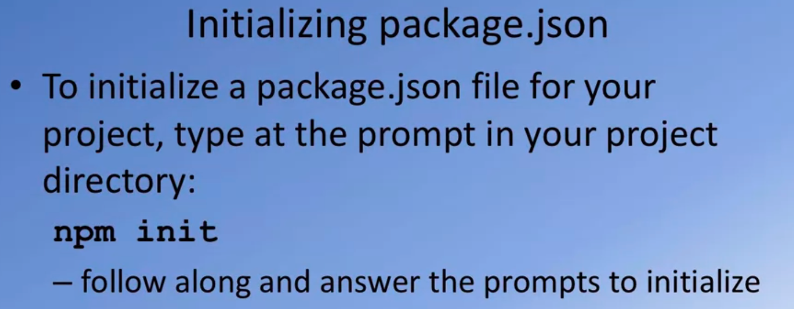
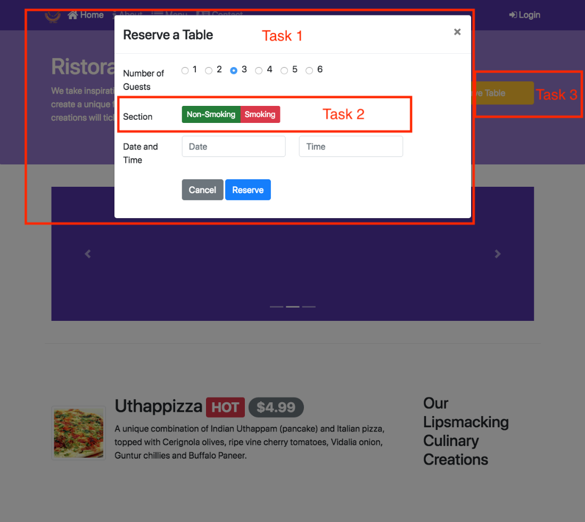

<!--------------------------
[link](URL){:target="_blank"}
[Hello, world!](http://example.com/){target="_blank"}
[Go to this page](http://somelink.com/?target=_blank)
> :memo: **Memo or Note:**
$ npm i bootstrap@5.2.1
--------------------------->

<h2 align="center">Coursera - Front-End Web UI Frameworks and Tools: Bootstrap 4</h2>
<br/>
<!------------------------------------------------------------------------------------------------>
<!----------------------------- readme.md of coursera-web.bauska.net ----------------------------->
<!------------------------------------------------------------------------------------------------>
<!---------------------------------------- Coursera logo ----------------------------------------->
<!------------------------------------------------------------------------------------------------>
<p align="center" width="100%">

</p>
<!------------------------------------------------------------------------------------------------>
<!---------------- 01. hong kong university of science and technology logo (01) ------------------>
<!------------------------------------------------------------------------------------------------>
<p align="center" width="100%">

</p>
<!-----------
{width="5.0in" height="2.202991032370954in"}
------------>

<!------------------------------------------------------------------------------------------------>
<!-------------------- 02. front end and back end tools and technology (01) ---------------------->
<!------------------------------------------------------------------------------------------------>
<p align="center" width="100%">

</p>
<!----------
{width="5.0in"
height="2.0638298337707788in"}
----------->

<h6 align="center" width="100%">(coursera.org)</h6>

<h3>Course Overview</h3>
<p>
Welcome to Front End Web UI Frameworks and Tools: Bootstrap 4.

I\'m glad you decided to join this course to learn about the most
popular front end Web UI Framework: Bootstrap.

We\'ll look at various aspects of <b>Bootstrap</b>. Through several
examples, you will learn by doing exercises as part of this course.

Let\'s look at some details next. Before you begin this course, please
make sure that you have sufficient background to be able to succeed in
this course.

You should have a good knowledge of HTML, CSS, and JavaScript before you
start the course.

From my perspective, web design and development consists of two aspects:
one is the design of the website and the web page, the second one is the
actual building and deployment of the web page itself.

From the design perspective, what I mean is the design of the user
interface and the user experience, the visual design, the prototyping,
the elements of colors, graphics and animation that might be of
interest.

In this Specialization, we are not looking at this aspect of web
development.

Instead, we are looking at that second aspect, which is the
<b>development, building, and deployment of websites and web pages</b>,
using technologies like the front end web UI frameworks like Bootstrap,
maybe JavaScript framework like Angular or a Library like React and
hybrid mobile frameworks to design mobile applications and also
server-side development using Node, Express, MongoDB, the main stack in
more detail.

If you are looking at the Specialization, thinking about the design
aspect of website, then you may wish to rethink again.

This Specialization concentrates on the development building and
deployment of website and web pages, a purely technical knowledge on
using the HTML, CSS, and JavaScript-based skills for actual website
development.

You\'re also probably wondering about what is meant by full stack web
development.

We\'ll look at more details of full stack web development in the next
lesson.

In particular, if you\'re looking at how this course is positioned in
the general context of full stack web development, in this course, we
are dealing with front end web UI development.

In particular, the <b>UI Framework Bootstrap 4</b>.

-   We\'ll be looking at the remaining aspects of full stack web
    development in the rest of this specialization.

-   This course looks at Bootstrap in great detail. We will also look at
    responsive web design and how Bootstrap supports responsive web
    design through the Bootstrap Grid system.

-   We\'ll look at the CSS and JavaScript-based components in Bootstrap
    and how you can make use of them in building your website and your
    web pages.

-   Along the way, we\'ll learn about that web development using the
    command line.

-   We\'ll learn a lot of web tools that are based on the command line
    and the Node.js ecosystem.

-   We\'ll briefly review <b>Git</b>, add <b>Node.js</b> and look at Noje.js
    based tools including task runners like <b>Grunt</b> and <b>Gulp</b>.

This course, itself, is structured into four modules.

Each module roughly corresponding to one week of work.

1.  In the <b><i>first</i></b> module, we\'ll get the big picture view of full
    stack web development, then you\'ll get a quick introduction to
    <b><i>Git</i></b> and <b><i>Node.js</i>.</b>

    a.  Then we\'ll introduce you to the <b><i>Bootstrap</i></b> and then review
        the <b><i>Bootstrap Grid</i></b> system.

    b.  That will lead you up to the first assignment in this course.

2.  The <b><i>second</i></b> module deals with <b>Bootstrap CSS</b> components.

    a.  We\'ll look at the design of the Bootstrap navigation bar and
        how we can make use of it to support navigation.

    b.  We\'ll look at user input through buttons and forms then we\'ll
        look at how we can display content using tables and cards.

    c.  Then we\'ll look at how we can include images and media into our
        Web page using images, thumbnails, and media objects.

    d.  And then, finally, we look at how we alert users using tags,
        alerts and progress bars.

    e.  This should lead you up to your second assignment.

3.  The <b><i>third</i></b> module deals with <b>Bootstrap JavaScript</b>
    components.

    a.  We\'ll look at the big picture view of how Bootstrap JavaScript
        components work, we\'ll review tabs, pills and tabbed
        navigation, then we\'ll look at how collapse and accordion can
        be used to show and hide content.

    b.  And then we\'ll look at the use of tooltips, popovers and modals
        to reveal content to be displayed in your page.

    c.  And then we\'ll look at the carousel component, which allows you
        to display sliding information on your web page.

    d.  This will lead you up to the third assignment in this course.

4.  The <b><i>fourth (and last)</i></b> module deals with <b>Bootstrap</b> and the
    <b>JQuery</b> and various <b>dev tools</b>.

	a.  We\'ll, in particular, look at how Bootstrap and JQuery interact and
		how you can write JQuery and JavaScript code in order to control
		your Bootstrap JavaScript component.

	b.  We look at the various methods that are supported by the Bootstrap
		> JavaScript components, which can be leveraged to write JavaScript
		> code to control the behavior of these components.

	c.  Then we\'ll review CSS pre-processing language is like <b>LESS</b> and
		<b>Sass</b>.

	d.  Then, <b>finally</b>, we\'ll look at how we can build and deploy our
		website using <b>NPM scripts</b> or <b>task runners</b> like <b>Grunt</b>
		and <b>Gulp</b>.

This should take you all the way to the final assignment in this
course. I hope you will have a lot of fun doing the various parts of
this course and also enjoy the exercises that you\'ll encounter at
each stage that enable you to better understand various aspects of the
Bootstrap web UI framework.
</p>
<h2>Welcome to Front-End Web UI Frameworks and Tools: Bootstrap 4: Additional Resources</h2>

<h2>Bootstrap Resources</h2>

<h3 align="left">
    <a href="http://bootstrap.com/">Bootstrap Site (http)</a>
	<br/>
    <a href="https://bootstrap.com/">Bootstrap Site (https)</a>
</h3>

<h2>Coursera Resources</h2>

<h3 align="left">
   <a href="https://learner.coursera.help/hc/en-us">Coursera Learner Help</a>
   <br/>
   <a href="https://www.onlinelearning.net/coursera/">Switching to a Different Session</a>
   <br/>
   <a href="https://www.coursera.org">Explore Coursera</a>
</h3>

<!-----------
   https://learner.coursera.help/hc/en-us/articles/208279776">
------------>

<!--- https://www.coursera.support/s/global-search/switch%20session?language=en_US --->

<h2>Full Stack Web Development: The Big Picture: Objectives and Outcomes (week 1)</h2>

This lesson gives you a big picture view of the Full Stack Web
Development. The lecture gives you an overview of full stack web
development. 

<h3>At the end of this lesson, you will be able to:</h3>

-   Understand what is meant by full stack in the context of web
    development

-   Distinguish between front-end, back-end and full stack web
    development

-   Understand the position of this course in the context of this
    specialization.

<h2>What is Full-Stack Web Development?</h2>
<!------------------------------------------------------------------------------------------------>
<!---------------------------- 02. front end and back end (05) ----------------------------------->
<!------------------------------------------------------------------------------------------------>
<p align="center" width="100%">

</p>
<!---------
{width="5.0in" height="2.0571587926509185in"}
---------->

Let me clarify to you a few terms so that we started a common
understanding of full stack web development as applied in this special
session.

We often hear people talking about the front end and back end.

The front end is where we are delivering the content to the user,
typically, in a browser where they use accesses the information, and
this is where we use technologies like HTML, CSS and JavaScript to
render the content for to the user.

This information delivery is supported behind the scenes by a back end
support which is typically implemented these days using technologies
like PHP, Java, ASP.NET, Ruby, Python or NodeJS.

We often hear people talking about the three tier architecture for Web
Development.

<!------------------------------------------------------------------------------------------------>
<!-------------------- 03. three-tier architecture - presentation layer (05) --------------------->
<!------------------------------------------------------------------------------------------------>
<p align="center" width="100%">

</p>
<!---------
{width="5.0in"
height="2.0571587926509185in"}
----------->

In this approach, the entire web application is organized into three
different layers.

The <b>presentation layer</b>, which is concerned with delivering to the
user.

This is usually the UI-related concerns that are dealt with at the
presentation layer.

<!------------------------------------------------------------------------------------------------>
<!---------------- 04. three-tier architecture - business logic layer (06) ----------------------->
<!------------------------------------------------------------------------------------------------>
<p align="center" width="100%">

</p>
<!-----------
{width="5.0in"
height="2.0571587926509185in"}
------------>

The <b>business logic layer</b>, on the other hand, is concerned more about
the data, the data validation, the dynamic content processing, and
generating the content to be delivered to the user.

This is backed up behind the scenes with the <b>data persistence layer or
the data access layer</b>.

<!------------------------------------------------------------------------------------------------>
<!----------------------- 05. three-tier architecture - data access (06) ------------------------->
<!------------------------------------------------------------------------------------------------>
<p align="center" width="100%">

</p>
<!---------
{width="5.0in"
height="2.0571576990376204in"}
---------->

This is concerned with how we store and interact with the data,
typically, in the form of a database and access this data through an
API.

Exploring this further, let us see what is implemented typically in the
traditional web development in each of these three layers.

<!------------------------------------------------------------------------------------------------>
<!------------------------- 06. data layer: database and api (07) -------------------------------->
<!------------------------------------------------------------------------------------------------>
<p align="center" width="100%">

</p>
<!----------
{width="5.0in"
height="2.4770297462817146in"}
----------->

The Business Logic Layer is usually implemented these days using
technologies like Ruby, Python, PHP, JAVA, C++ or ASP.NET.

<!------------------------------------------------------------------------------------------------>
<!------------------- 07. business logic layer: ruby, python, java, c++ & php (07) --------------->
<!------------------------------------------------------------------------------------------------>
<p align="center" width="100%">

</p>
<!--------
{width="5.0in"
height="2.4770297462817146in"}
---------->

This Business Logic Layer is interacting behind the scenes with the
persistent data typically stored in a relational database and accessed
by the Business Logic Layer.

The Business Logic Layer is also concerned with the rendering of
information to the front side, typically, in the form of server-side
rendering these days.

<!------------------------------------------------------------------------------------------------>
<!-------------------- 08. traditional web development: html, css & js (08) ---------------------->
<!------------------------------------------------------------------------------------------------>
<p align="center" width="100%">

</p>
<!----------
{width="5.0in"
height="2.4770297462817146in"}
----------->

The HTML, CSS and JavaScript is generated on the server-side and then
sent over to the client side in the form of a web page.

In this approach, we need specialists in each of these three layers.

Front end specialists, typically, would be well-versed in HTML, CSS, and
JavaScript.

The business logic specialist would be well-versed in one of the
technologies that is used for implementing the business logic and then
you need a data specialist who will be well-versed in the relational
database management system.

<!------------------------------------------------------------------------------------------------>
<!-------------------------- 09. full stack javascript development (08) -------------------------->
<!------------------------------------------------------------------------------------------------>
<p align="center" width="100%">

</p>
<!----------
{width="5.0in"
height="2.4770297462817146in"}
----------->

There is an increasing trend towards using a single language to
implement the entire stack, this being JavaScript so you could have the
front end implemented, for example, as a single page application using
frameworks like Angular or React.

You have the server-side or the Business Logic Layer being implemented
using technologies like NodeJS, which is also dependent on and
JavaScript and then you have the data storage, itself, being implemented
using technologies like MongoDB, which stores data in the form of JSON
documents.

And the information exchange between the server side and the client side
is usually done using JSON as the format and the server side supports a
REST API endpoint.

We will cover these technologies as part of this specialization.

<!------------------------------------------------------------------------------------------------>
<!------------- 10. full stack web dev: bootstrap 4 and angular or reactfull (09) ---------------->
<!------------------------------------------------------------------------------------------------>
<p align="center" width="100%">

</p>
<!----
{width="5.0in"
height="2.4770297462817146in"}
----->

As you go through the specialization, you will see that on the
presentation layer side, we will cover Bootstrap four and Angular or
Reactfull for implementing front end applications while on the Business
Logic Layer we will be using NodeJS and NodeJS modules and express for
implementing the Business Logic Layer.

We will also consider back end as a service and then the data support
implemented using MongoDB.

### Full Stack Web Development: Additional Resources

### PDFs of Presentations

> <a href="https://github.com/bbauska/Coursera-web/blob/main/pdf-files/00-Course-Overview.pdf">00-Course-Overview.pdf (9 slides)</a>
> <a href="https://github.com/bbauska/Coursera-web/blob/main/pdf-files/00-FSWD-BigPicture.pdf">00-FSWD-BigPicture.pdf (6 slides)</a>

### Useful Links

-   [What is a Full Stack developer?](http://www.laurencegellert.com/2012/08/what-is-a-full-stack-developer/)

-   [Wait, Wait... What is a Full Stack Web Developer After
    All?](http://edward-designer.com/web/full-stack-web-developer/)

-   [The Myth of the Full Stack
    Developer](http://andyshora.com/full-stack-developers.html)

-   [Multi-tier
    Architecture](https://en.wikipedia.org/wiki/Multitier_architecture)

-   [What is the 3-Tier
    Architecture?](http://www.tonymarston.net/php-mysql/3-tier-architecture.html)

### Setting up Your Development Environment: Git and Node: Objectives and Outcomes

At the end of this lesson you should have set up Git and Node.js on your
computer. At the end of this lesson, you will be able to:

-   Set up a Git repository and perform basic Git operations

-   Set up and use online Git repositories

-   Use Node-based modules to perform basic operations.

### Setting up your Development Environment

### Software Requirements

1.  <b>Text editor of your choice</b>: Any text editor that you are already
    familiar with can be used for editing the project files. I will be
    using <a href="https://code.visualstudio.com/">Visual Studio Code</a> as the
    editor of choice in this specialization. You may also consider other
    editors such as <a href="http://brackets.io/">Brackets</a>, 
	<a href="http://www.sublimetext.com/">Sublime Text</a>, or <a href="https://atom.io/">Atom</a>.

2.  <b>Browser of your choice</b>: You may use your preferred browser. I
    will be using Chrome as the browser in all the exercises. All the
    exercises and assignments in this course have been tested using
    Chrome v. 46. Please note that not all browsers may support all the
    HTML5 features to the same extent. You might encounter problems when
    using other browsers. I strongly urge you to use the latest Chrome
    browser for the exercises and assignments in this course so that any
    problems are minimized.

3.  <b>Command line shell</b>: Familiarity with the command-line shell will
    be essential for the exercises. In Windows a cmd window or power
    shell with admin privileges would be needed. On a Mac or in Linux, a
    terminal window can be used. Please get familiar with the "sudo"
    command in OS X and Linux.

4.  <b>Files required for the exercises</b>: We will provide additional
    starter files for the exercises wherever needed. Links to download
    the files will be provided inline in the <b>exercise instructions</b>
    that follow each exercise video. Please download the files provided
    there, if any, before beginning the exercise. The links are also
    available through the <b>Additional Resources</b> of the specific
    lesson.

Note: Please remember to retain the folders and all the files that you
create in the exercises. Further exercises will build upon the files
that you create in the preceding exercises. DO NOT DELETE the files at
the end of the exercises, unless otherwise instructed. You may wish to
set up your exercise folder as a Git repository and commit the files to
the repository at the end of each exercise.

<!------------------------------------------------------------------------------------------------>
<!------------------------------ 10a. online git repository (11) --------------------------------->
<!------------------------------------------------------------------------------------------------>
<p align="center" width="100%">

</p>
<!---------
{width="5.0in"
height="1.5908125546806648in"}
---------->

### Exercise (Video): Setting up Git

Git is a very popular version control system for software.

We need Git for working with our node ecosystem that we\'re going to use
throughout this specialization.

It is important for you to get Git on to your computer.

Let\'s go through a few quick steps to set up Git on your computer and
then some quick commands to enable us to make use of Git in this
specialization.

I will not go into too much details about version control and how Git
works, and so on.

That is beyond the scope of this course. Instead, we\'ll just get some
basic understanding of Git.

Git is, as I said, a version control system.

This is a software tool that enables us for the management of changes to
source code and maintaining your version history.

As your source code evolves, you will be able to check in the code at
different points of times so that you can always have a way of rolling
back to a previous version, in case your updates to the code doesn\'t
work correctly.

There are various version control systems that are in use in the real
world, including CVS, SVN, and Git being a very popular mechanism for
version control these days. Where did Git originate?

Git was designed by Linus Torvalds, the person behind the Linux
Operating System.

Git was designed as a version control system and distributed version
control system for use in Linux kernel development and it has seen much
wider deployment in the real world, these days.

That node ecosystem is very much tied into Git and that is the reason
why we need Git for this specialization.

<!------------------------------------------------------------------------------------------------>
<!---------------------------------------- 11. git (12) ------------------------------------------>
<!------------------------------------------------------------------------------------------------>
<p align="center" width="100%">

</p>
<!---------
{width="5.0in"
height="2.0571576990376204in"}
----------->

Let\'s now move on to a Few hands on exercises, where you will first set
up Git.

Then you will learn a few basic Git commands.

And then also understand how you can set up an online repository in
places like Git Hub or Bit Bucket for synchronizing your source code
from your computer to the online repository.

This is obviously not a comprehensive tutorial on the Git but we\'ll
learn just enough, that of the commands that are necessary for use in
this specialization.

Let\'s now run through a few quick steps to set up Git on your computer.

<!------------------------------------------------------------------------------------------------>
<!------------------------------------ 12. git-scm.com (13) -------------------------------------->
<!------------------------------------------------------------------------------------------------>
<p align="center" width="100%">

</p>
<!----------
{width="5.0in"
height="2.7622867454068243in"}
---------->

One easy way of setting up Git on a computer is to go to this site
called git-scm.com.

And then download the Git installation files from there.

When you visit this website, git.scm.com, you will see on the right-hand
side, a button for you to download to Git.

If you want to you can go directly to the Downloads page here on the
site, and then you will find the downloads for various platforms and you
can download the one for your specific platform for installation.

This is the easiest way of getting Git onto your computer.

There are other ways of setting up Git, depending on your platform.

For example, if you install GitHub Desktop on your computer, it\'ll
automatically set up Git for you.

If you are using a Mac and you set up x code and especially the x code
command line tools, that will also set up Git for you.

On this site, gitscm.com, if you go to the documentation page you will
notice that there is a book here called Pro Git.

<!------------------------------------------------------------------------------------------------>
<!----------------------- 13. getting started: about version control (14) ------------------------>
<!------------------------------------------------------------------------------------------------>
<p align="center" width="100%">

</p>
<!----------
{width="5.0in"
height="2.7622867454068243in"}
---------->

You can just go on to the Getting Started link.

You will see a specific chapter here on Installing git.

Go to this Installing Git site and there you have more details about how
to install Git on your specific platform.

Download the installer and run through the set up to get Git on to your
computer.

<!------------------------------------------------------------------------------------------------>
<!-------------------------- 14. command or powershell: more git (15) ---------------------------->
<!------------------------------------------------------------------------------------------------>
<p align="center" width="100%">

</p>
<!----------
{width="5.0in"
height="3.427884951881015in"}
---------->

Once you install Git on a computer Start up a command window or
PowerShell if you\'re using a Window machine or start up a terminal
window if you\'re using a Mac or Linux machine and then at the prompt
type in <b>git \--version</b> to check what version of git is installed on
your computer.

On my machine I have this current version of git installed and that is
good enough for me to work with.

Once we verify that Git is installed, we will configure a couple of
global identity parameters, the username and email address.

Whenever Git does any comments as you will learn later, it will make use
of this information.

To do that, at the prompt type <b>git config \--global user.name</b>
"Username", and then you can type in your user name.

```
git config --global user.Email brianbauska@gmail.com
```

The other parameter that I\'m going to configure is my email.

And to insure that this information has been configured, we can type

```
git config --list.
```

And it will list out a bunch of configurations that we have. Done.

Some of these are automatically set up for you.

But if you want to, you can set them up as you require.

Here I have my core editor value set to vi, which is what I use to do
command line editing of files.

With this, we have completed the setup git for use on our computer.

Once you get git on your computer it is time to go and learn git bit by
bit.

### Exercise (Instructions): Setting up Git

### Objectives and Outcomes

In this exercise you will learn to install Git on your computer. Git is
required for using all the remaining Node.js and Node based tools that
we encounter in the rest of the course. At the end of this exercise, you
would be able to:

-   Install Git on your computer

-   Ensure that Git can be used from the command-line or command-prompt
    on your computer

-   Set up some of the basic global configuration for Git

### Downloading and Installing Git

-   To install Git on your computer, go to
    <a href="https://git-scm.com/downloads">here</a> to download the Git installer for
    your specific computing platform.

-   Then, follow the installation steps as you install Git using the
    installer.

-   You can find more details about installing Git at
    <a href="https://git-scm.com/book/en/v2/Getting-Started-Installing-Git">Git-scm.com</a>.
    This document lists several ways of installing Git on various
    platforms.

-   Installing some of the GUI tools like GitHub Desktop will also
    install Git on your computer.

-   On a Mac, setting up XCode command-line tools also will set up Git
    on your computer.

-   You can choose any of the methods that is most convenient for you.

### Some Global Configuration for Git

-   Open a cmd window or terminal on your computer.

-   Check to make sure that Git is installed and available on the
    command line, by typing the following at the command prompt:

```
git --version
```

-   To configure your user name to be used by Git, type the following at
    the prompt:

```
git config --global user.name "Your Name"
```

-   To configure your email to be used by Git, type the following at the
    prompt:

```
git config --global user.email <your email address\>
```

-   You can check your default Git global configuration, you can type
    the following at the prompt:

```
git config --list
```

### Conclusions

At the end of this exercise you should have Git available on the
command-line of your computer.

### Exercise (Video): Basic Git Commands

Let us now explore some basic Git commands that are very useful for us
in this specialization.

There is lot more to Git than what we cover in this exercise.

To get started go to your convenient location on your computer and then
create a folder named git-test.

Then, open this folder in your favorite editor.

Here, I have the GIT-TEST folder that we just created open in my Visual
Studio Code.

Let me add a file to this folder named index.html, now you can see that
I have added in some HTML code into this index.html file.

Let\'s save the changes.

Now let\'s switch to our command line, at the command line go to the
git-test folder, and let\'s initialize this folder to be a git
repository.

To do that at the command line type git init.

Now, this folder has been initialized to be a git repository.

This is our first git command that we have learnt, <b> \> git init</b>.

This initializes the current folder as a git repository and when it
initializes the folder, it will mark that folder as a master.

This is the master branch for my kit.

Now let\'s not worry about branches and so on, we will not deal with
that in this course.

We will only be working with the master branch, in this particular
specialization.

This would be marked as a master.

Now this is the initial point of our repository.

The next command that we\'re going to look at is <b> \> git status</b>.

If you type git status in the command line, it\'ll tell you the current
status of the folder.

Let\'s do that at the command line and see what it shows.

At the command line, type git status and read the information that is
tapped out on the command window.

You see that it says on branch master, so that is the master branch that
we add on.

And it says, untracked files, and then shows index.html in red.

On your specific computer, it may be using different colors or represent
this differently or this is what it shows on my Mac.

Now, this index.html file that we have just created in this folder is
now not been added to our git repository.

Let\'s go ahead and add that file to the git repository.

To do that, we say, <b>\> git add,</b> and you can simply say dot, which
means that all the files in the current directory will be added to what
is called as the staging area of my git repository.

Now, if I again type <b>\> git status</b>, you will see that the file
index.html is marked in green.

And it says, changes to be committed there and then shows the file name
and then so that means that this file is now ready to be committed to my
git repository.

The next command that we saw was <b>\> git add</b>.

By using git add you can add file or folders to that staging area.

Once you add it to the staging area, then you can commit that snapshot
of our folder status to our git repository.

That means that when you do the <b>\> git commit</b>, what this command
will do is commit the current state of our folders into our git
repositories.

All the files as they exist at the moment, once they have been staged
using the git add, then they will be committed to our git repository
when we execute the git command folder.

At this point when we execute the git command, then our initial state
will now be changed to the first commit to the git repository.

Let\'s go ahead and do that.

Back at the command prompt, let\'s type <b>\> git commit</b>.

And then we can even add a message to our commit.

I\'m going to say <b>\> git commit -m "first commit"</b> because this is
our commit to our git repository.

When I do that, it says, okay, 1 file has been added to the git
repository and some other information will be typed out on to the
command window.

Let\'s now check again, git status and now you see that it says nothing
to commit, working directory is clean.

What it means is that the current state of my working directory or
working folder has been committed to the git repository, so a snapshot
has been committed to my git repository.

Now, I can type the next command called <b>\> git log \--oneline</b>, and
see that it shows a number there, an eight digit number there, and then
also it shows the message that we put into our commit saying first
commit.

That is the log of all the commits that have been put into my git
repository.

Going back to our next git command, we saw that <b>\> git log
\--oneline</b> will show us a brief log of all the commits.

If you simply type <b>git log</b> display a lot more detailed information
about all the commits.

But this is sufficient enough for obtaining information that we require.

Let\'s now come back to our editor here, in Visual Studio Code, so I\'m
going to add more changes to my index.html file.

I have changed my index.html file.

Now, let me add another folder under the git test folder, so I will
create a subfolder here named templates, and inside these templates
folder, I\'m going to create another file name, test.html.

<!------------------------------------------------------------------------------------------------>
<!--------------------------------- 15. basic git commands (20) ---------------------------------->
<!------------------------------------------------------------------------------------------------>
<p align="center" width="100%">

</p>
<!----------
{width="5.0in"
height="3.3701924759405073in"}
---------->

This is just to show you how git can commit entire folder hierarchy into
its repository.

With test.html now there, I\'m just going to copy everything from my
index.html into my test.html, and save the changes.

Going back to the command line, let\'s now check out the status of our
git repository and this folder.

Type in <b>\> git status</b>, shows that the index status html file that we
have already handed earlier to the repository has now been modified, so
there is a newer version of the index.html file.

Also, it shows that there are some untracked files in this folder called
templates.

Let\'s add all these changes to the staging the area, so again, type
<b>\> git add.</b>

And then all these files will be added to the staging area.

Again, checking out the status.

You now see that changes that have been added to the staging area.

All these files have been added to the staging area.

Let\'s do one more commit, so I would say <b>\> git commit -m</b>, second
commit and then let\'s check out the log. If you check out the log,
you\'ll now see that there are two commits in my git repository, the
first and the second commit.

And note that each one of them is given a different number there.

If you want to see their full details of the log, you can type simply,
git log and then you\'ll receive more details in there.

Then what you would be interested in.

Notice that the oneline commit only gives the first few characters of my
commit number there.

That is sufficient enough for us to operate with.

Let me now go back again to my Visual Studio, and then add one more.

One more line to my index.html file.

Now my index.html file has been modified.

And let\'s save the changes.

Going back to the command line, doing git status shows that index.html
file has been modified.

Let\'s add this to the staging area, and then do a third commit.

Let\'s say, \> git add., git status, now you see that the index.html the
modified version has been added.

Now we can say <b>\> git commit</b>. "third commit" and do <b>\> git log
\--oneline,</b> and you see there are three commits in our repository.

Now our repository contains snapshots of three different points, at the
end of the first commit, at the end of the second commit, and at the end
of the third commit.

Now, we also can roll back changes, we can revert the repository to a
previous version.

We can pull out a file from an older commit, and then replace the
existing directory from the old commit.

Let\'s see how we can operate with these things by learning a couple of
more commands.

At this stage, our index.html file is in the current state. So you can
notice that it has an h1 and two ps.

Let\'s now look at the next git command.

The next git command that we are going to learn about is <b>\> git
checkout.</b>

This checkout command allows us to check out a file from a previous
commit in our git repository.

If we don\'t like the current file that we have in our folder and we
want to go back to your previous version of the file, we can always
check out the file from a previous commit or from the current commit and
then continue to work with that file.

Let\'s make use of this and see some further changes to our git
repository.

Going back to our command line, we remember that, between the second and
the third commit, I made changes to my index.html file.

Suppose I want to revert back to the index.html file from my second
commit.

Then, I can simply say, <b>git checkout 900cfcf</b>.

That is commit identify the number that identifies the particular
commit, and then I can say index.html, and what you would notice is
that, that older file will now be checked out into my current working
directory.

Going to my Visual Studio Code, you\'ll now notice that my index.html
file has reverted to the previous working so, the change that I made
before the third commit it is now gone.

My index.html file has been restored to its state at the end of the
second commit.

Now, at the command line, if I try git status, you\'ll notice that this
index.html file which was reverted to what it was at the end of the
second commit, it has now already been staged.

Using this git checkout, we\'ll pull out an older version of the file,
and then replace what is in the current directory, and then it\'ll also
check it into the staging area.

Now if I do that and then I realize that this is what I want, I can
simply do another commit at this point. And then that file can be
committed as the fourth commit.

But suppose I don\'t like this, I want to double to back to the
index.html file at the end of the third commit then all I can do is say
git reset, HEAD and index.html.

At this point, what happens is that the index.html, the modified version
that I had checked out is still there but this file has been unstaged
from the staging area.

If you go back and look at the index.html in your editor, it will still
show the state at the end of the second commit.

Because we had pulled out the file using checkout for that.

Now, if you want to revert it back to what it was at the end of the
third commit, then we do one more checkout from the third commit going
to our command window, type git status and you would notice that the
index.html is marked as modified.

But it also shows this particular statement here. It says git checkout
\-- and the file name, to discard the changes in the working
directories.

That\'s one way you can discard the changes that you have made to a
particular file corresponding to the previous comment.

Let me just restore that index.html back to what it was at the end of
the third commit.

To do that, I could simply say <b>git checkout \-- index.html</b> and then,
if I do git status, it shows that my directory is clean.

And basically my directory has been restored to the state at the end of
the third commit.

Going to the file in my Virtual Studio Code, I see that their file has
been restored back to what it was at the end of the third cap.

This is one way you can, if you have made changes to your file after the
commit and you want to just discard those changes, you can simply check
out the file from the last commit, and then all your changes that
you\'ve done after the last commit will be discarded on the spot.

These are some basic commands that are very useful for you as you go
through the courses in this specialization because you may want to
commit at the end of each exercise.

And as you proceed forward, you would still have a guided vision of the
state of your folder at the end of the previous exercise.

That way, if you\'re carrying out a new exercise and you\'ve discovered
that you\'ve made mistakes and you want to revert back to the previous
commit, you always have a way of doing that using the commands that we
have just let.

With this basic understanding of this few git commands, you\'ll be able
to proceed forward with understanding and using git in the courses of
this specialization.

<!------------------------------------------------------------------------------------------------>
<!-------------------------------------- 16. git reset (24) -------------------------------------->
<!------------------------------------------------------------------------------------------------>
<p align="center" width="100%">

</p>
<!----------
{width="5.0in"
height="2.2222222222222223in"}
---------->

Now, we have reviewed the git reset for a specific file or git reset in
general.

If you simply type git reset, it\'ll restore you back to the last
commit.

It will reset the staging area to the last commit, without disturbing
the changes that you have done to your working directory.

Once you reset, then you can check out the previous version of the file
that you have committed in the previous commit.

This week, you can restore your folder back to the where you were at the
starting point of the previous commit.

Sometimes when you are going through an exercise and you realize you
missed a cue.

Always have a way of reverting back to a previous version.

With these commands, I think you\'re all set to go ahead to use git in
the courses of this specialization.

At the end of this exercise, did you Git it?

### Exercise (Instructions): Basic Git Commands

### Objectives and Outcomes

In this exercise you will get familiar with some basic Git commands. At
the end of this exercise you will be able to:

-   Set up a folder as a Git repository

-   Perform basic Git operations on your Git repository

### Basic Git Commands

-   At a convenient location on your computer, create a folder named
    <b>git-test</b>.

-   Open this git-test folder in your favorite editor.

-   Add a file named <i>index.html</i> to this folder, and add the following
    HTML code to this file:

```
<!DOCTYPE html>
<html>
    <head></head>
    <body>
        <h1>This is a Header</h1>
    </body>
</html>
```

### Initializing the folder as a Git repository

-   Go to the git-test folder in your cmd window/terminal and type the
    following at the prompt to initialize the folder as a Git
    repository:

```
git init
```

### Checking your Git repository status

-   Type the following at the prompt to check your Git repository\'s
    status:

```
git status
```

### Adding files to the staging area

-   To add files to the staging area of your Git repository, type:

```
git add .
```

### Commiting to the Git repository

-   ### To commit the current staging area to your Git repository, type:

```
git commit -m "first commit"
```

### Checking the log of Git commits

-   ### To check the log of the commits to your Git repository, type:

```
git log --oneline
```

-   ### Now, modify the index.html file as follows:

```
<!DOCTYPE html>
<html>
    <head></head>
    <body>
        <h1>This is a Header</h1>
        <p>This is a paragraph</p>
    </body>
</html>
```

-   Add a sub-folder named <b>templates</b> to your <b>git-test</b> folder,
    and then add a file named <i>test.html</i> to the templates folder. Then
    set the contents of this file to be the same as the <i>index.html</i>
    file above.

-   Then check the status and add all the files to the staging area.

-   Then do the second commit to your repository

-   Now, modify the <i>index.html</i> file as follows:

```
<!DOCTYPE html>
<html>
    <head></head>
    <body>
        <h1>This is a Header</h1>
        <p>This is a paragraph</p>
        <p>This is a second paragraph</p>
    </body>
</html>
```

-   Now add the modified index.html file to the staging area and then do
    a third commit.

### Checking out a file from an earlier commit

-   To check out the index.html from the second commit, find the number
    of the second commit using the git log, and then type the following
    at the prompt:

```
git checkout <second commit's number> index.html
```

### Resetting the Git repository

-   To discard the effect of the previous operation and restore
    index.html to its state at the end of the third commit, type:

```
git reset HEAD index.html
```

-   Then type the following at the prompt:

```
git checkout -- index.html
```

-   You can also use <i>git reset</i> to reset the staging area to the last
    commit without disturbing the working directory.

### Conclusions

At the end of this exercise you should have learnt some basic Git
commands. Experiment with these commands until you fully understand how
to use Git.

### Exercise (Video): Online Git Repositories

Online Git repositories enable you to store a copy of your Git
repository online.

And It can easily be shared among multiple computers and multiple users.

Let's learn about two of the online Git repository service providers,
GitHub and Bitbucket, in a little bit more detail.

We'll look at how we can set up our local Git repository to be mirrored
in an online Git repository.

There are several online Git repository service providers.

Two of the most popular ones are GitHub and Bitbucket.

I will go through in more detail about how you can set up your Git
repository that you prepared in the previous exercise to be made out on
an online Git repository on Bitbucket.

To set up in online Git repository, go to one of these online service
providers and then sign up for an account.

Here, I have signed up into my Bitbucket account, and I have my homepage
open here.

And so I\'m going to create a new repository online on my Bitbucket
repository.

I just click on the Create repository, and then this would come up with
some details.

Now, this varies with the repository service provider.

Here, I will specify the name of the repository as git-test, and I\'m
going to mark this as a private repository.

For this course and all the remaining courses in this specialization, I
would strongly advise you to keep your repositories as private
repositories, because you don\'t want somebody else to be copying the
code that you might save in your online Git repository.

Please, make sure that you only use private repositories in this
specialization.

I will sign up as a get private repository, and then simply click on
create repository.

And then it\'ll do some setup, and then be ready for me, okay?

Now, what I need to do is to copy this particular URL format repository.

You will see a URL for the repository in the home page of the
repository.

Just copy that URL for the repository, because we would need that in
order to synchronize our local Git repository with this repository.

I\'m going to copy that.

And since I have already created my local Git repository, I\'m going to
go in there and set that up to be mirrored in this online Git
repository.

For that, we need to use a couple of Git commands that enable us to do
this.

Going to the command prompt in my Git repository folder I will type, git
remote add origin.

And then paste the URL for my Bitbucket repository that I\'ve just
created, and hit the return.

Now, my local Git repository\'s remote origin is set to the Bitbucket
repository.

Now, I want to be able to push the entire contents of my local Git
repository to my online Git repository.

Reviewing the commands for setting up the online Git repository, the
first one that we just did, git remote add origin and the repository
URL.

And so this will add the online repository as the remote repository for
my local Git repository.

Once I do that, then I need to push my contents to my online repository.

For that, I do git push -u origin master. And this command would push
the local Git repository to the online repository.

Let\'s type that at the command prompt. So once I type this at the
command prompt and hit the return, it\'s going to set up my Git
repository. Sometimes it may ask you to type in your credentials
including your password on your Bitbucket account. So you may have to do
that. I had already done that previously, so that\'s why it didn\'t ask
me again for the password. But once I had typed that in, then the
contents of my local depository will be pushed to the server\'s site.

Now, the data on my local Git repository is now matched on the server.

Let\'s go to Bitbucket to see the status of my online Git repository
now.

Going to my Bitbucket and then reviewing the online Git repository, you
would see that there has been a branch, the master branch, that has been
pushed to my online Git repository.

I can then examine the source by looking at the source here.

And then you can see that I have the index.html file, which is exactly
the same as what I have in my local Git repository.

And examine the radius comments also, so I can look at the state in the
second comment and at the first comment.

You can now see that all this information has been uploaded to the
online repository, including the history of all the comments.

Then going back there, you can see more details about all the comments
that have been sent to the server side.

I can examine each of those comments in a bit more detail.

And I\'m going back to the source, I can look at more details of the
source like that.

That has now setup my local Git repository to be mirrored in Bitbucket.

The procedure is pretty much similar even on GitHub.

Let me set up an online GitHub repository.

Now, obviously, you have to remember that your local repository can only
be matched to one online repository.

I will only go through setting up the repository on GitHub, and you will
notice the same kind of commands would be required if you want to set up
your local repository to be mirrored on a repository on GitHub.

On GitHub, if you login to your account, you would see something like
this in your homepage.

You can go to the right-hand side where there\'s a plus side and then
click on that to create a new repository, or just click on this button
here to say new repository.

And then when it comes up I can simply say git test, and then, again, as
a reminder, please, make that a private repository.

Most of these providers allow you to now store private repositories
online, so why make them public unless you really want to share it with
other people?

I would strongly urge you to keep your repositories private for the
moment, unless you are working with a Tee.

I should remind you that at this moment, GitHub supports private
repositories only for those subscribers who pay for their GitHub
account.

It is not available for subscribers who are using their free account.

Simply click on private, and then Create repository, and then that will
create a repository.

And then you would see that GitHub also gives me a bunch of commands
here on how to set up the repository.

For creating a new repository on the command line, the commands that we
actually had done earlier, or to push an existing repository, the same
two kinds of commands that have to be issued.

That basically sets up your GitHub repository to mirror your local
repository.

Since I have already linked my repository to Bitbucket, I\'m not going
to use my GitHub repository for the purpose.

As you noticed, the procedure is pretty much similar on either one of
them. Give and take a few differences in the way the information is
rendered on the screen in the user interface and a little bit of
changes.

More or less, they are similar in debate the way you\'re going to make
use of them in terms of mirroring your local Git repository to the
online repository here.

With this, suppose somebody gives you a Git repository, can you make a
copy of that on to your local one?

This is where we use another Git command called git clone.

Now here, you see that I have this git test repository.

What I\'m going to do is I\'m going to go to the suppository, and then
copy this URL.

And then I\'ll show you how I can create a copy of the Git repository or
clone this online repository into my local computer.

Let\'s pretend that I am on a different computer, and then we\'ll go to
our command line, and then create another repository with that same
name.

Going to my command line, I\'m just going to move up and you\'ll see
that I have my git-test folder there.

I\'m going to create another temporary folder here just to show you that
I can clone an online Git repository service in my temporary folder.

You see that it is empty.

To review the command, it says git clone and the repository\'s URL.

Let\'s apply this command and clone the online Git repository.

Pretending that we are on another computer, so I\'m going to say git
clone.

And then, Paste the URL of my Bitbucket repository here.

<!------------------------------------------------------------------------------------------------>
<!------------------------------------- 17. git-test (31) ---------------------------------------->
<!------------------------------------------------------------------------------------------------>
<p align="center" width="100%">

</p>
<!----------
{width="5.0in"
height="1.1527777777777777in"}
---------->

Then you would see that that repository will now get cloned into a local
folder of the same name, git-test.

Now, if I do a listing of the directory, you can see the be git-test
folder has been created.

Let\'s go to the git-test folder, and then you will see that this is an
exact copy of the folder structure that we had created earlier.

This is how you can clone an online Git repository.

All you need to do is obtain the URL of that Git repository, and then
simply use git clone to get a copy of that onto your local computer.

With this, we complete this exercise on using online Git repositories.

So did you finally Git it?

### Exercise (Instructions): Online Git Repositories

### Objectives and Outcomes

In this exercise you will learn about how to set up and use an online
Git repository and synchronize your local Git repository with your
online repository. At the end of this exercise, you will be able to:

-   Set up the online repository as a remote repository for your local
    Git repository

-   Push your commits to the online repository

-   Clone an online Git repository to your computer

### Setting up an Online Git repository

-   Sign up for an account either at (<a href="https://bitbucket.org](https://bitbucket.org/" target="_blank">Bitbucket</a>
     or <a href="https://github.com/">GitHub</a>).

-   Then set up an online Git repository named <ins><b>git-test</b></ins>. Note the
    URL of your online Git repository. Note that private repositories on
    GitHub requires a paid account, and is not available for free
    accounts.

### Set the local Git repository to set its remote origin

-   At the prompt, type the following to set up your local repository to
    link to your online Git repository:

```
git remote add origin <repository URL>
```

### Pushing your commits to the online repository

-   At the prompt, type the following to push the commits to the online
    repository:

```
git push -u origin master
```

### Cloning an online repository

-   To clone an online repository to your computer, type the following
    at the prompt:

<!------------------------------------------------------------------------------------------------>
<!------------------------------------- 18. git-test (31) ---------------------------------------->
<!------------------------------------------------------------------------------------------------>
<p align="center" width="100%">

</p>
<!----------
{width="5.0in"
height="1.2676279527559056in"}
---------->

```
	git clone <repository URL>
```

### Conclusions

In this exercise you have learnt to set up an online Git repository,
synchronize your local repository with the remote repository, and clone
an online repository.

### Node.js and NPM

JavaScript which was designed as a scripting language for the browser
has seen deployment far beyond the browser.

Node.js has played a significant role in this shift of JavaScript from
the browser to the desktop.

<!------------------------------------------------------------------------------------------------>
<!--------------------------------- 19. what is node.js? (33) ------------------------------------>
<!------------------------------------------------------------------------------------------------>
<p align="center" width="100%">

</p>
<!----------
{width="5.0in"
height="1.9198720472440944in"}
---------->

Let\'s now learn a little bit about what Node.js is and what role does
NPM, the Node Package Manager, play in the context of Node.js. Node.js,
as I mentioned earlier, allows us to bring the power of JavaScript to
the desktop.

Node js is based on the JavaScript runtime engine that has been built
for the Chrome browser.

The Chrome V8 JavaScript Engine has been ported from the browser to run
on the desktop and support the execution of JavaScript programs on the
desktop.

Node.js is built around an event-driven, non-blocking I/O model which
makes it very efficient to run JavaScript programs on the desktop,
asynchronous JavaScript on the desktop. Now this is where Node finds its
true polish.

Right now we will examine Node.js in the context its use as a JavaScript
runtime.

We will look at the server side application of Node.js in detail in the
last course of this specialization.

<!------------------------------------------------------------------------------------------------>
<!--------------------------------- 20. node architecture (33) ----------------------------------->
<!------------------------------------------------------------------------------------------------>
<p align="center" width="100%">

</p>
<!----------
{width="5.0in"
height="2.0769225721784776in"}
---------->

This is the typical architecture of Node.js.

So in this, the Chrome V8 engine is the bottom layer together with
libuv, forms the layer that interacts with the underlying computer
system to support the execution of JavaScript programs.

On top of it we have Node Bindings which is also implemented in C++.

At the top layer you have the Node.js and Standard Library, which are
all implemented in JavaScript and this is what enables us to write
JavaScript programs and run them on the desktop.

Naturally the ability to run JavaScript programs on the desktop energize
the web development community to explore using JavaScript to develop a
significant number of web development tools.

Tools such as Bower, Grunt, Gulp, Yeoman, and many others.

We will explore some of these in the later part of this course and in
subsequent courses.

The last course in the specialization as I mentioned, looks at the use
of Node.js on the server side.

How we can develop web server, business logic, all implemented in
JavaScript on the server side.

<!------------------------------------------------------------------------------------------------>
<!-------------------------------- 21. node package manager (33) --------------------------------->
<!------------------------------------------------------------------------------------------------>
<p align="center" width="100%">

</p>
<!----------
{width="5.0in"
height="2.0769225721784776in"}
---------->

Together with Node you often hear people talking about the Node package
manager or NPM. When you install Node on your computer NPM automatically
gets installed. The Node package manager is the manager for the Node
ecosystem.

It manages all the Node modules and packages that have been made
publicly available by many different users.

A typical Node package consist of JavaScript files together with a file
called package.json which is the manifest file for this Node module.

We will look at how we can use the package.json file in more detail in
the subsequent exercises.

### Exercise (Video): Setting up Node.js and NPM

In your browser, head over to nodejs.org and as you browse down, you\'ll
see the download buttons for Node.js for your specific platform.

In this case, it shows the download buttons for MacOS.

Click on the current version of Node.js.

Click on that to download the installer package for your platform.

<!------------------------------------------------------------------------------------------------>
<!---------------------------------- 22. install node.js (35) ------------------------------------>
<!------------------------------------------------------------------------------------------------>
<p align="center" width="100%">

</p>
<!----------
{width="5.0in"
height="3.6212609361329835in"}
---------->

Once you get hold of the installer package, double click on it to start
installing Node.js.

Depending on your operating system, you will see a window like this on
your computer and just follow along the instructions to install Node.js
on your machine.

You may need administrative privileges to install Node.js on your
machine.

Make sure that you are logged in into an administrator account and
install Node.js to be accessible by all users that are logged in on the
computer.

And once the installation is complete, let\'s go ahead and verify that
Node.js has been installed correctly.

Open up a terminal window or a command window and add the prompt, type
<b>node-v</b> to check the version of node installed.

Similarly, check <b>npm-v</b> to check the version of NPM installed. I am
starting with these versions of node and NPM, and the subsequent
exercises will be based on these.

Even if you install the later version, I\'m pretty sure that it would be
backward compatible.

All the steps should work pretty much the same.

With this, we complete the installation of Node.js.

Let\'s go ahead and make use of Node.js in the next exercise.

### Exercise (Instructions): Setting up Node.js and NPM

<b>Note: Make sure you have installed Git on your machine before you
install Node.js. Please complete the previous Git installation exercise
before proceeding with this exercise.</b>

### Objectives and Outcomes

In this exercise, you will learn to set up the Node.js environment, a
popular Javascript based server framework, and node package manager
(NPM) on your machine.

To learn more about NodeJS, you can visit
[https://nodejs.org](https://nodejs.org/).

For this course, you just need to install Node.js on your machine and
make use of it for running some front-end tools.

You will learn more about the server-side support using Node.js in a
subsequent course.

At the end of this exercise, you will be able to:

-   Complete the setup of Node.js and NPM on your machine

-   Verify that the installation was successful and your machine is
    ready for using Node.js and NPM.

### Installing Node

-   To install Node on your machine, go to
    [https://nodejs.org](https://nodejs.org/) and click on the Download
    button. Depending on your computer\'s platform (Windows, MacOS or
    Linux), the appropriate installation package is downloaded.

-   As an example, on a Mac, you will see the following web page. Click
    on the Download button. Follow along the instructions to install
    Node on your machine. (Note: Now Node gives you the option of
    installing a mature and dependable LTS version and a more newer
    stable version. You should to install the LTS version. I will use
    this version in the course.)

<b>Note: On Windows machines, you may need to configure your PATH
environmental variable in case you forgot to turn on the add to PATH
during the installation steps.</b>

### Verifying the Node Installation

-   Open a terminal window on your machine. If you are using a Windows
    machine, open a cmd window or PowerShell window with <b>admin</b>
    privileges.

-   To ensure that your NodeJS setup is working correctly, type the
    following at the command prompt to check for the version of <b>Node</b>
    and <b>NPM</b>

-   <b>node -v</b>
<br/>
-   <b>npm -v</b>
<!------------------------------------------------------------------------------------------------>
<!---------------------------------- 23. install node.js (38) ------------------------------------>
<!------------------------------------------------------------------------------------------------>
<p align="center" width="100%">

</p>
<!---------------
> 
---------------->
<!----------
{width="5.0in"
height="6.3736264216972875in"}
---------->

### Conclusions

At the end of this exercise, your machine is now ready with the Node
installed for further development. We will examine web development tools
next.

### Exercise (Video): Basics of Node.js and NPM

Now that you have Node.js on your computer, you\'re obviously wanting to
immediately start using it.

In this exercise, we will start using Node.

We will set up a packaged, or adjacent, file for our Git test folder
that we have been working with so far.

Then, we will setup a node module called as lite server that will serve
up the contents of our get test folder.

And then we can browse this index.html file and other files in a
browser.

And we will also see how the lite server will enable us to automatically
see updates to our browser window as we make changes to our index.html
file, or any other files in our get test folder.

The lite server is something that we\'re going to extensively use in
this and future courses, to be able to see the changes in real time in a
browser window as you edit the files of your project.
<!------------------------------------------------------------------------------------------------>
<!-------------------------------- 24. install package.json (39) --------------------------------->
<!------------------------------------------------------------------------------------------------>
<p align="center" width="100%">

</p>
<!----------
{width="5.0in"
height="2.0929483814523184in"}
---------->

As I mentioned, we want to set up the package.json file.

What exactly is this package.json file that we\'re going to setup?

Here, I have some information from the npmjs.org site which specifies
what exactly is the role of the package.json file.

<!------------------------------------------------------------------------------------------------>
<!----------------------------- 25. initializing package.json (39) ------------------------------->
<!------------------------------------------------------------------------------------------------>
<p align="center" width="100%">

</p>
<!----------
{width="5.0in"
height="1.9540594925634296in"}
---------->

The package.json file serves as the documentation on what all other
packages that your project is dependent upon.

For example, when you set up the lite server of your project, that will
be recorded in the package.json file.

That, subsequently, you can also make use of that package in the future.

Also, it allows you to specify which specific version of a package that
your project is dependent on.

Even if the package that you depend on changes in the future, you may
insist that you want the user to install only a specific version of the
package for use within your node application.

And also, it makes your builds reproducible, which means that when you
share your code with others, then they can also do installation of all
the node modules, as we will see later in this exercise, on their own
computer.

Obviously your next question will be, how do we create this package.json
file?

If you are starting a new project where you want to initialize the
package.json file, then simply type npm init at the prompt in the
project folder.

And then that will take you through a set of steps which will enable you
to configure your package.json file.

Let\'s proceed with that for our Git test project.

Here I am in the git-test folder in my terminal window.

Make sure that you also open a terminal window or a command window and
then go to the git-test folder.

And at the prompt, type npm init.

Then follow along the questions that are asked.

For the name of the project, we\'ll just leave it as the default,
git-test.

For version, we\'ll just leave it as 1.0.0.

We can edit that later. For description, this is a test directory to
learn Git and Node.

It doesn\'t matter, type some description there.

And then the entry point, I would just say index.html.

Usually if it is a node package, the entry point will be index.js.

Now this folder that we have setup is an index.html based folder, so
that\'s why I just typed in index.html.

Test command, nothing. Git repository, if we had already setup the git
repository in the previous exercise, it\'ll automatically prompt that
for you, if not, this would be empty and give you an option to type in
the git repository URL, in case you\'re using an online git repository.

Some keywords for your project, which I\'m going to leave blank.

Author, type your name.

Let\'s be narcissistic.

And the license.

And then, it\'ll show you the configuration of the package.json file in
JSON format.

If your family have a JSON, does it look very, very familiar to you.

If this looks all good, let\'s just say OK and then that results in the
creation of the package.json file.

Now if you list the folder contents, you would see the package.json file
in the folder contents.

Open that Git test folder in your favorite editor, and then take a look
at the contents of package.json file in your editor.

As the next step, we will learn how we can install a node module using
NPM, the Node Package Manager.

We\'re going to install this node module called as light server.

The light server will serve up the contents of this git-test folder in a
server that it starts up so that you can view the contents in a browser.

Given that we have an index.html file, if we serve up this folder, then
it\'ll be a website.

And you can view the index.html in a browser.

Let\'s set up the light server and then we will see how we can make use
of the light server to serve up the contents of this folder.

This is very, very useful because if you\'re working on a web
development project, you want to see where live version of your web
development project.

That, as you make changes to your project, you can see the changes
immediately reflected in the browser.

This is a very good node package that is very useful for this purpose.

Let\'s set up this light server.

To do that, add the prompt. Type in NPM install.

Notice, if you want NPM to install a node package, this is how you\'re
going to invoke it and then you\'d say lite-server.

And then, we also want to save the fact that our project is using the
lite server. So we will save this information in the package.json file.

To do that, you\'re going to type in \-- save-dev. Now the save-dev
option specifies that this lite server is used for development
dependency for our project.

If you are installing a node module on which your project is directly
dependent on, then you would install it by simply saying \--save option.

Let\'s go ahead and install it.

And you wait patiently for the installation to take place. It\'ll take
all of a few minutes for that to complete its installation.

Once that is installed, then you would immediately notice when you look
at the contents of your folder, you will immediately notice that there
is a folder there created named node_modules.

Now, if you go into the node_module, you will see a whole bunch of other
subfolders in there, which contain node modules, which are necessary for
the likes of our node module and so on.

Let\'s take a quick tour of the node modules folder to see what the
contents of these are.

Going to my git-test folder, if you\'re going to the node modules
folder, you would see, as I said, a whole bunch of subfolders there.

Normally you don\'t need to be venturing into the node modules folder.
They just exist there because they are needed for the \[INAUDIBLE\].

As you browse through, you should notice a folder named lite-server
here.

When you go into the lite-server folder, note in particular the presence
of the index.js file and then your package.json file and several other
things.

This contents of the folder comprises the lite-server node module.

But this lite-server node module is dependent on other node modules to
provide it with some additional functionality.

That\'s the reason when you install the light server node module, it\'ll
in turn install many other node modules, on which the light server
itself is dependent on.

That\'s the reason why you see that explosion of this folders inside the
node modules.

Don\'t be too concerned about it, the sum total of folders will not be
more than a few tens of megabytes.

It is not going to fill up your directory with junk.

This is all essential for node to be able to help you.

In case you\'re curious about the lite-server and how it works and so
on, you can always go down to this GitHub site where the lite-server is
hosted.

And then look up the documentation for lite-server.

I will introduce you to whatever you need to know about lite-server as
we go through this course and the remaining courses.

You don\'t need to worry too much about it, but just in case you\'re
curious, you can always go to the site to find out more details about
lite-server.

The link is provided in your exercise instructions and additional
resources are part of this lesson.

Once you have completed that, then head over to the. Editor where you
have the folder, git-test folder, opened and then view the contents o
the package.json file.

You would see that the package.json file contains exactly the
information that you configured with your NPM.

You would see the name version and repository author and in particular,
note this information here.

It says devDependencies, so then it specifies the lite-sever, and also
notice it says hat 2.2.2.

Which means that this particular project depends upon lite-server that
is a at least version 2.2.2 or higher.

This is very useful for us.

Now why do we need this information here?

Later on, when you go to the other exercises, you will notice that when
you store this on an online repository, you don\'t want to be storing
everything in your node modules folder.

You will only be storing information of all the files that we have
created.

The node modules folder can always be recreated by typing NPM install at
our command prompt.

And then based upon the dev dependencies and dependencies that are
listed in the packager file, all the node modules that your project
depends on will automatically be installed.

We will see that later on how to use NPM install in this course.

Now that we are at package.json file let\'s make a couple of edits so
that we will be able to make use of the lite-server to serve up that
content.

Right here, in this option called scripts, let\'s add in one more here.

We will say "start".

Start is a command that NPM supports which enables you to specify a
bunch of things that will be started.

Later on we will see how we make use of this.

Here I\'m going to say "npm run lite". And after that test, I\'m going
to add in one more entry called "lite", which I will configure as
"lite-server", okay?

With these changes, let\'s save the package.json file. And then, now our
project is configured, so that now if you start the lite- server, the
contents of your folder will be nowserved up in your favorite browser.
Heading back to our command prompt, add the prompt.

If I type, npm start, now you see why I put that entry card start into
my package.JSON file.

If I say npm start, whatever the start is configured as in the
package.JSON file, we specify that npm run light, and the lite was
specified as lite server.

Essentially, we are saying Start the lite-server.

Once I type npm start, it will start the lite-server, and it will serve
up the contents of this folder. Now how do you access the contents of
this folder?

If you want to accesses this locally, you will access it by specifying
the you are as localhost:3000.

These are the default settings for the lite-server.

Furthermore, this should automatically open the browser window of your
default browser, and show the contents of index or HTML in the browser
window.

Here you can see that I have opened my editor and my browser window
directed at localhost:3000 simultaneously side by side, so that we can
see how the browser window will immediately reflect any changes that we
make to our Git test folder.

Let me go to index.html. And then for the sake of space, I\'m going to
turn that over.

And then, so here, you can see that this is the contents of this.

And then, now, let me add in one more paragraph.

And save the changes, and then you will immediately notice that the
change that I made to my index.html file is reflected into my browser.

This provides a very nice way of being able to observe in real time the
changes that you make to your code being reflected into your browser.

When you are working on a project, it\'ll be very appropriate for you to
be able to see the changes immediately.

When you make a change and then save the file, the modified code is
immediately loaded into your browser.

You can immediately see the change being reflected in your browser
window.

This is a very useful tool while you are doing development of your
project.

That is the reason why I introduced you to that lite-server, and set it
up so that we can make use of it, as we develop the website in this
course.

If you recall, we had already set up our git-test folder to be a Git
repository.

Checking again, We will see that we already have three commits in our
Git repository.

And this Git repository is already mirrored to our online Git repository
which we have set up in the previous exercise either at Bitbucket or
GitHub.

My git-test folder is synced to my Bitbuc/ket repository in this
particular exercise.

What I\'m going to do now is to show you how you can exclude some
folders from your project folder, and then make sure that they are not
synchronized to your online repository.

Now as I said, the node_modules folder can always be recreated by typing
npm install at the prompt.

That\'s why when you upload the contents of your folder to an online Git
repository, or when you do a commit of the folder to your Git
repository, you don\'t want the node_modules folder or all the
subfolders under it to be included in the commit.

How do we exclude some folders or some files from our folder from being
checked in into our Git repository?

To do that, we will set up a file named .gitignore.

That\'s the name of the file, .gitignore.

To create this .gitignore file, we will go to our editor.

In the editor, in the git-test folder, I\'m going to create a new file
and I will name it .gitignore.

Note that the name begins with a dot and then, the rest of the name is
g-i-t-i-g-n-o-r-e.

This is very important that you set up the file with exactly that name,
.gitignore.

Let\'s create this file called .gitignore, and the first line of that
file, we will type as node_modules.

What this means is that the node_modules folder is going to be excluded
from our git commit.

Once I create that .gitignore file and then add node_modules into the
.gitignore file, let\'s save the changes.

And then we will now do a commit of the current state of our project
into our Git repository.

I hope you remember your git commands.

Let\'s do a git status, and then when you do that, you will immediately
notice that you have the index.html file marked as modified, and then
the two new files, .gitignore and package.json.

We do a git add ., and then do a git status.

And then you see that all this new files have been checked in into your
commit.

Let\'s do a git commit.

<b>git commit -m "fourth commit"</b>.

And the files are committed.

Let\'s push the new commit to our online repository. So, to do that git
push -u origin master and wait for it to be pushed to our server.

Now, if you go to your online Git repository, you will see that the
package.json file and .gitignore would have been checked in into your
Git repository.

Going to my Bitbucket repository from the Git test, you will see that
when I look at the source, you will see that the package.json file has
been added.

The .gitignore has been added and the new index.html file has been
checked in.

That completes this exercise.

In this exercise, we have learned how to set up a package.json file
using npm init.

We have learned how to install an npm module.

And we have learned how to use the lite-server npm module to serve up
the contents of our project folder so that it can be viewed in a
browser.

This is a nice way of serving up your web contents, your web application
or your website, so that you can see changes in real time being
reflected to your browser window.

And then we also saw how we can setup the .gitignore so that some
folders can be excluded from being checked into our Git repository.

This completes this exercise.

With this, I\'m sure you have gotten a good handle on the use of both
Git, and then also node and node modules.

Don\'t worry, we will be using node extensively, in various ways, as you
go through the courses of this specialization.

This is just a start.

### Exercise (Instructions): Basics of Node.js and NPM

### Objectives and Outcomes

In this exercise you will learn the basics of Node and NPM. At the end
of this exercise, you will be able to:

-   Set up package.json file in the project folder for configuring your
    Node and NPM for this project

-   Install a NPM module and make use of it within your project

### Initializing package.json

-   At the command prompt in your <b>git-test</b> folder, type

<b>npm init</b>

-   Follow along the prompts and answer the questions as follows: accept
    the default values for most of the entries, except set the entry
    point to index.html

-   This should create a <i>package.json</i> file in your <b>git-test</b>
    folder.

<b>Installing an NPM Module</b>

-   Install an NPM module, lite-server, that allows you to run a Node.js
    based development web server and serve up your project files. To do
    this, type the following at the prompt:

<b>npm install lite-server \--save-dev</b>

-   You can check out more documentation on lite-server
    [here](https://github.com/johnpapa/lite-server).

-   Next, open package.json in your editor and modify it as shown below.
    Note the addition of two lines, line 7 and line 9.

```
{
  "name": "git-test",
  "version": "1.0.0",
  "description": "This is the Git and Node basic learning project",
  "main": "index.html",
  "scripts": {
    "start": "npm run lite",
    "test": "echo "Error: no test specified" && exit 1",
    "lite": "lite-server"
  },
  "repository": {
    "type": "git",
    "url": "git+[https://jogesh_k\_muppala@bitbucket.org/jogesh_k\_muppala/git-test.git]{.underline}"
  },
  "author": "",
  "license": "ISC",
  "homepage": "[https://bitbucket.org/jogesh_k\_muppala/git-test#readme]{.underline}",
  "devDependencies": {
    "lite-server": "\^2.2.2"
  }
}
```

-   Next, start the development server by typing the following at the
    prompt:

<b>npm start</b>

-   This should open your <i>index.html</i> page in your default browser.

-   If you now open the <i>index.html</i> page in an editor and make changes
    and save, the browser should immediately refresh to reflect the
    changes.

### Setting up .gitignore

-   Next, create a file in your project directory named <i>.gitignore</i>
    (<b>Note</b>: the name starts with a period)Then, add the following to
    the .gitignore file

<b>node_modules</b>

-   Then do a git commit and push the changes to the online repository.
    You will note that the node_modules folder will not be added to the
    commit, and will not be uploaded to the repository.

### Conclusions

In this exercise you learnt to set up package.json, install a npm
package and start a development server.

### Setting up your Development Environment: Git and Node: Additional Resources

### PDFs of Presentations

> <a href="https://github.com/bbauska/Coursera-web/blob/main/pdf-files/01-Git.pdf">01-Git.pdf (4 slides)</a>
> <a href="https://github.com/bbauska/Coursera-web/blob/main/pdf-files/01-Git-Exercises.pdf">01-Git-Exercises.pdf (12 slides)</a>
> <a href="https://github.com/bbauska/Coursera-web/blob/main/pdf-files/02-NodeJS-NPM.pdf">02-NodeJS-NPM.pdf (5 slides)</a>
> <a href="https://github.com/bbauska/Coursera-web/blob/main/pdf-files/02-Exercises-Node-NPM.pdf">02-Exercises-Node-NPM.pdf (4 slides)</a>

### Additional Resources (Git)

-   Git site [git site scm](http://git-scm.com/).

-   [Installing
    Git](https://git-scm.com/book/en/v2/Getting-Started-Installing-Git)
    chapter from Pro Git

-   [Git reference manual](https://git-scm.com/docs)

-   Quick reference guides: [GitHub Cheat
    Sheet](https://services.github.com/on-demand/downloads/github-git-cheat-sheet.pdf)
    (PDF) \| [Visual Git Cheat
    Sheet](http://ndpsoftware.com/git-cheatsheet.html) (SVG \| PNG)

-   [Atlassian comprehensive Git
    tutorial](https://www.atlassian.com/git/tutorials/)

### Additional Resources (Node.js and NPM)

-   [Nodejs.org](https://nodejs.org/)

-   [Npmjs.com](https://www.npmjs.com/)

-   [Node API Documentation](https://nodejs.org/api/)

-   [NPM Documentation](https://docs.npmjs.com/)

-   [lite-server](https://github.com/johnpapa/lite-server)

### Introduction to Bootstrap: Objectives and Outcomes

In this lesson, you will be given a quick overview of front-end UI
frameworks, and an introduction to Bootstrap.

The exercises will introduce you to getting started with Bootstrap for
your web project.

<h4>At the end of this lesson, you will be able to:</h4>

-   Identify the purpose of using front-end UI frameworks in web design
    and development.

-   Set up a project with Bootstrap support.

-   Configure a web project to use Bootstrap.

-   Become familiar with the basic features of Bootstrap.

<b>Note</b>: For those of you who are already familiar with Bootstrap 3, 
<a href="http://getbootstrap.com/docs/4.0/migration/"><ins>here</ins></a> is an
overview from the Bootstrap 4 documentation on the major changes in
Bootstrap 4 compared to Bootstrap 3.

While you will find Bootstrap 4 to have a lot of overlap in its classes
with Bootstrap 3, several breaking changes have been introduced,
including removing some components and introducing new components.

This course covers Bootstrap 4 with the assumption that you are not
familiar with Bootstrap.

### Front-end Web UI Frameworks

Front-end Web UI Frameworks are becoming their go-to approach for
designing and implementing their recent websites.

<!------------------------------------------------------------------------------------------------>
<!----------------------- 26. front-end web ui frameworks: overview (50) ------------------------->
<!------------------------------------------------------------------------------------------------>
<p align="center" width="100%">

</p>
<!----------
{width="5.0in"
height="1.474359142607174in"}
---------->

Let\'s ask ourselves what exactly are front-end Web UI Frameworks, and
learn a little more details about them.

<!------------------------------------------------------------------------------------------------>
<!------------------------- 27. what are front-end ui frameworks? (51) --------------------------->
<!------------------------------------------------------------------------------------------------>
<p align="center" width="100%">

</p>
<!----------
{width="5.0in"
height="1.961003937007874in"}
---------->

Next, so obviously in this lesson we\'re going to ask ourselves, what
are front-end frameworks?

What do they contain? What are some of the popular front-end UI
frameworks?

And why do we need to make use of front-end UI frameworks when we design
our websites?

What are front-end web UI frameworks?

Let\'s take a step backwards, and imagine that you only know HTML, CSS,
and JavaScript.

If you were asked to design a new website, you would obviously go about
constructing and implementing the entire website, using the technical
skills that you have based on your knowledge of HTML, CSS, and
JavaScript.

You would often realize that there are many repeated components that you
would use on your website.

And you would end up designing your own set of CSS classes. You will be
designing JavaScript based component.

And then once you get a group of these together, every time you need to
design a new website you would be making use of these predefined sets of
CSS classes and JavaScript based components to quickly implement a new
website.

Why not take this to its logical conclusion?

How about, if we design an entire framework that consists of ready to
use HTML, CSS, and JavaScript placed web UI components.

Here, a front-end web UI framework may define a bunch of CSS classes
that will enable us to include components like Buttons, Tables,
Navigation bars, Dropdowns, Alerts, Modals, Tabs, Accordions and many
more.

And quickly enable us to design and implement a website.

This is what a front-end web UI framework accomplishes.

It is a collection of all these components.

Not only that, it gives you a method of defining consistent typography
that you can use for your entire website design.

And enables you to quickly scaffold out a website or the pitch.

<!------------------------------------------------------------------------------------------------>
<!-------------------------- 28. popular front-end ui frameworks (52) ---------------------------->
<!------------------------------------------------------------------------------------------------>
<p align="center" width="100%">

</p>
<!----------
{width="5.0in"
height="2.155983158355206in"}
---------->

If you search for front-end web frameworks, you would find a plethora of
them out there in the Internet.

Now several people have done their own service of all these different
web UI frameworks, and have published their top ten lists of front-end
UI frameworks.

This is one such that you may or may not agree with this ranking, but
Bootstrap happens to be the most popular among all the front-end web UI
frameworks.

Bootstrap consistently ranks as the number one in many of the lists of
front end web UI frameworks.

The remaining among this list may vary, but you would often find
Semantic-UI, Foundation by Zerp, Materialize, Material UI, and some of
these others appearing in many of those top-end lists.

<!------------------------------------------------------------------------------------------------>
<!-------------------------- 29. why front-end web ui frameworks? (53) --------------------------->
<!------------------------------------------------------------------------------------------------>
<p align="center" width="100%">

</p>
<!----------
{width="5.0in"
height="2.155983158355206in"}
---------->

The next obvious question is, why would you want to use front-end web UI
frameworks?

First and foremost, they provide you with a consistent way of designing
websites.

And, most of these front-end frameworks support what is called as
responsive web design.

We will examine more about responsive web design in the next lesson, but
quickly summarizing it, you don\'t realize that your website may be
accessed from various kinds of devices of different screen savers
ranging from small mobile phones all the way to up to a full-fledged
desktop.

You want to be able to design your website to automatically adapt itself
to cater to the size constraints of each of these different devices,
from which your website is being accessed.

Responsive web design is concerned about this aspect.

The second issue that most of these Franken frameworks try to address is
cross browser compatibility.

If you have played around with browsers as much as I have done, I\'m
pretty sure you\'ve come to realize that no two browsers render the same
website exactly the same way.

When you design a website to render consistently across many different
browsers, you are going to be facing an uphill battle.

Now these front-end frameworks have managed to address most of these
idiosyncrasies of the different browsers in such a way that you can
deliver consistent rendering of your website on different browsers.

That\'s the second reason why you may want to resort to using a
Front-End Web UI framework.

And the third aspect of course is that when you need to design a
website, you\'re always going to be under terrible time pressure.

Increasing your productivity so that you don\'t waste your energy and
time on wasteful configuration issues of those individual components of
your website.

Instead, let that be taken care of by a consistently designed front-end
web UI framework.

That saves you a lot of time in terms of implementing your website.

They have sacked. And finally, of course, most of these front-end UI
frameworks that are all there have their own community.

They are users that use these frameworks for implementing websites.

This community of users will provide you with a very efficient way of
being able to solve issues that you may encounter when you\'re applying
anyone of this frameworks for your website design.

Given these different advantages, why would you not want to resort to
using a front-end web UI framework?

With this understanding of front-end web UI frameworks, let\'s now
proceed forward to learn more about Bootstrap, the most popular front
end web UI framework.

### Introduction to Bootstrap

Let me do a quick introduction to Bootstrap before we go on to learn how
to make use of Bootstrap in designing our website.

<!------------------------------------------------------------------------------------------------>
<!--------------------------------- 30. bootstrap overview (54) ---------------------------------->
<!------------------------------------------------------------------------------------------------>
<p align="center" width="100%">

</p>
<!----------
{width="5.0in"
height="1.5753204286964129in"}
---------->

If you go to the Bootstrap webpage, you will see that Bootstrap claims
to be the most popular HTML, CSS, and JavaScript based framework that is
in use today and specially designed for developing responsive mobile
first websites.

Indeed, Bootstrap stands up to its claim as the most popular framework.

<!------------------------------------------------------------------------------------------------>
<!------------------------------- 31. more bootstrap overview (55) ------------------------------->
<!------------------------------------------------------------------------------------------------>
<p align="center" width="100%">

</p>
<!----------
{width="5.0in"
height="1.9086537620297463in"}
---------->

It supports a number of CSS classes that enable you to design radius,
web components very effectively.

It supports consistent typography to be used on your webpage for
rendering content. It supports many different kinds of that components
like buttons, tables, navigation bars, modals, images, carousels, and
many other, as well as many JavaScript enabled competence.

This enables you to design responsive websites with the mobile first
approach.

We will talk more about this in the next lesson.

<!------------------------------------------------------------------------------------------------>
<!---------------------------------- 32. bootstrap history (55) ---------------------------------->
<!------------------------------------------------------------------------------------------------>
<p align="center" width="100%">

</p>
<!----------
{width="5.0in"
height="1.9994663167104112in"}
---------->

Bootstrap originated around 2011.

It was created by these two people from Twitter.

Hence, you might often hear people talking about Bootstrap as Twitter
Bootstrap.

Mark Otto and Jacob Thornton from Twitter designed Bootstrap for their
own internal use and then ended up releasing it for the rest of the web
development community to use for consistent website design.

The current production version of Bootstrap is 4.0.

If you had taken my earlier specialization on Coursera, I have dealt
with Bootstrap 3.3.7 in the earlier Bootstrap course.

Now, it\'s time to move on to our first exercise where we will get our
hands dirty with Bootstrap.

### Exercise (Video): Getting Started with Bootstrap

Strap on your boots, and let\'s get started with Bootstrap.

I\'m sure your fingers are itching to get your hands around Bootstrap.

<!------------------------------------------------------------------------------------------------>
<!--------------------------- 33. setting up the project folder (56) ----------------------------->
<!------------------------------------------------------------------------------------------------>
<p align="center" width="100%">

</p>
<!-------------------
{width="5.0in"
height="1.9722222222222223in"}
------------------->

First step, go to the exercise instructions that follow this exercise in
your Bootstrap course page on Coursera.

<!------------------------------------------------------------------------------------------------>
<!--------------------------------- 34. bootstrap exercise (57) ---------------------------------->
<!------------------------------------------------------------------------------------------------>
<p align="center" width="100%">

</p>
<!-------------------
{width="5.0in"
height="1.9722222222222223in"}
------------------->

And then in the instructions, you will see a link to this file
Bootstrap4-starter.zip.

Download the zip file to your computer.

Also, the step-by-step instructions that are illustrated in this video
will be given in the exercise instructions that follow this video.

There, you will have access to any of the code snippets that you need
for this exercise.

This would be the case for all the exercises in the future, too.

Should you need to get hold of the code snippets, that is where you will
find them. Once you download the zip file, move that zip file to a
convenient location on your computer.

Here, I have moved it to a folder named Coursera on my computer, and
then I have the zip file with this long name there.

Just unzip the file.

Once you unzip the file, you will find a folder named Bootstrap4 created
in your computer.

Inside the Bootstrap4 folder, you will see another folder named
conFusion, there.

Go into the conFusion folder and you would see two files there,
index.html and package.json file.

Now, open a command window or a terminal and then move to this folder in
your command window or terminal.

At the command prompt, type npm install.

Note that I already have the package.json file in there.

The package.json file is configured so that the lite-server development
dependency would be installed if I type npm install.

Once you type npm install, you will see that the lite-server will be
installed in your node_modules folder each.

Once this is complete, open this folder in your favorite editor.

Once you have the folder open in your editor, create a .gitignore file
and then put node_modules into the gitignore file and save.

This is to ensure that when you do a git commit, the node_modules folder
will not be committed.

After that, it is time to go and fetch Bootstrap for use in our project.

Before we fetch Bootstrap, let\'s do a commit of the current state of
the file.

Do git init and initialize your git repository.

Then you can check git status, and you would see that these files need
to be committed, add all the files, git commit -m "Initial Setup".

This is the starting point of your folder at this moment.

With this, your starting point of your web project has been now
committed to git.

Now you can set up this git to synchronize with an online repository,
just like we talked about in the git exercises.

You can set up a repository either on Bitbucket or on Github and then
synchronize this project to that git repository.

Our next step is to go and fetch Bootstrap.

To do that, add the prompt type npm install bootstrap@4.0.0 and also
\--save, and let the Bootstrap be installed.

Once Bootstrap is installed, we realize that we also need to install its
peer, which is jQuery as well as Popper.js.

Let\'s go ahead and install both jQuery and Popper.js into this project
folder.

To do that, add the prompt type npm install jquery@3.3.1 and
Popper.js@1.12.9 \--save.

Now, whenever I install any of the npm packages, I am explicitly
specifying the version of the package that you should install.

The reason for this is that I want to make sure that as you go through
this exercise, all the steps will work correctly.

I am specifying the exact version of the npm modules to be installed.

Here, we are installing the jQuery version 3.3.1 and Popper.js version
1.12.9.

Subsequently, also, I will specify the exact versions of the modules to
be installed. So let\'s go ahead and install these.

And once they are installed, we can go to the next step.

Going back to our project folder, you would see that if you go into
node_modules, you will see a folder in there named Bootstrap.

And inside the folder named Bootstrap, you\'ll find a folder named dist.

Inside dist folder, you\'ll find two sub-folders named CSS and js.

If you go into the CSS folder, you\'ll find a whole bunch of precompiled
CSS files here.

The one that is of interest to us at the start is Bootstrap min.css.

That\'s the file that we are going to include into our index.html file
in order to make use of Bootstrap in our project.

Similarly, going to the js folder, you would see that there is a
Bootstrap min.js file.

We\'re going to include that also into our index.htm.

That\'ll be the next step that you will see me doing.

Before we go to the next step, let\'s start up our lite-server so that
we can see the changes that we make to the index.html immediately
reflected into our web page in real time.

Let\'s start up lite-servers.

Type the prompt type npm start, and then that should start up your
lite-server.

You can now see, on the screen, my editor on the left and the current
version of the index.html page on the right.

As you can see, I have already configured the index.html page with some
content.

This web page looks like the typical web page of a computer science
professor.

Let\'s now open the index.html page in our editor.

And then in the head part of the index.html page, right before the
title, I\'m going to paste in a little bit of code.

This code snippet is given to you in the instructions.

You can simply copy and paste this code snippet, and I\'ll walk you
through what this code snippet is trying to do.

You will notice that I have three meta tags here.

The first one says charset="utf-8".

This is the unicode that is going to be used. The second line which says
meta name="viewport",

I\'m going to come back and explain this particular line to you in the
next lesson when we will look at responsive web design.

Now, let me draw your attention to this particular line which says link
rel="stylesheet", and then href. Note that I am specifying href as
"node_modules/bootstrap/dist/css/bootstrap.min.css".

What I am specifying is that the bootstrap.min.css file, which contains
the CSS classes corresponding to Bootstrap that we have downloaded using
NPM to our node_modules folder, I\'m going to include that into the head
of my index.html page.

You need to include the CSS classes provided by Bootstrap.

You also need to include the JavaScript classes provided by Bootstrap,
which we\'re going to do at the bottom of this page.

Going to the bottom of this page, note, just before the closing body
tag, I\'m going to paste in the code to include all the scripts there.

To do that, I just paste in the three lines for the script to include
the jQuery, Popper.js, and also the Bootstrap min.js.

And note the order in which I have included this. So the Bootstrap is at
the bottom.

Then, since Bootstrap is dependent upon both jQuery and Popper in that
order, so I will first input jQuery. And then after that, we input
Popper, and then finally, Bootstrap min.js at the bottom of the
index.html file.

Now, this is included at the bottom of the page.

Because when you are loading the page from a web server, you want the
CSS classes to be loaded immediately so that as the page starts
rendering, when the JavaScript is fetched, the JavaScript needs to
execute in order to make changes to your page with the JavaScript code,
and that will take a little bit of time.

You don\'t want the user to be waiting for the entire page to be loaded
before they see something in their browser window.

That\'s why we normally load the JavaScript classes towards the end of
our html page just before the body tech.

After making these changes, let\'s save the file.

Now, the reason why I am showing the index.html file in my editor and
also the browser right next to it is, the moment you save the changes
that you have made to the index.html file, note how the browser
rendering of that file immediately updates and see Bootstrap already in
action on the page.

Right now, you\'ll see that your page is using Times New Roman to render
all the content.

The moment I save the web page, you notice that the fonts being used on
your web page have changed.

Now, your web page is set up to make use of the Bootstrap classes, and
it is using Bootstraps default typography to render all the content.

Bootstrap by default uses Helvetica Neue for the font.

You can change the default font for bootstrap and so on, but that will
be beyond the scope of our discussion right now.

Once you set up your index.html page and save it, you will immediately
see Bootstrap coming into action in our web page.

This is how I\'m going to keep illustrating, as we add various
bootstraps, CSS classes, and components to our web page, how the
rendering of it in our browser will keep changing.

Now, obviously, the rendering of the page in our browser is still
terrible.

It\'s better than the typical computer science professors web page, but
definitely not readable.

We need to now bring into action the various CSS classes and the
JavaScript components that our Bootstrap web UI framework provides in
order to design our web page.

We will do that step by step as we go through this exercise.

This may be a convenient time for you to do a git commit of the changes
that you have made so that at the end of this exercise, your state of
your project folder will be saved to your git repository.

Going to my conFusion folder in another tab of my terminal window, if I
type git status, I now see that my index.html file and the package of
JSON file have been modified.

I\'m going to do a commit.

Now, my status of the folder at the end of this exercise has been
committed to my git repository.

You can synchronize that with your online repository so that the state
of your project will be saved at this point.

With this, we complete our first Bootstrap exercise. You have now seen
how we can configure Bootstrap to be used in our web project.

As we proceed to the next few exercises, we\'re going to employee the
Bootstrap classes to design our web pages.

### Exercise (Instructions): Getting Started with Bootstrap

### Exercise Resources

<b>Bootstrap4-starter.zip</b>

<b>Objectives and Outcomes</b>

This exercise introduces the first set of steps to set up your web page
to make use of Bootstrap classes and components. At the end of this
exercise, you will be able to:

-   Download Bootstrap using NPM and include it in your project

-   Understand how to set up a web project to use Bootstrap

-   Include the Bootstrap CSS and JS classes into a web page

### <b>Note: Please remember to retain the folder and all the files that you create in this exercise. Further exercises will build upon the files that you create in this exercise. DO NOT DELETE the files at the end of the exercise.</b>

### Setting up the Project Folder

-   Go to a convenient folder location on your computer and download the
    <b><i>Bootstrap4-starter.zip</i></b> file using the link provided at the top
    of this page.

-   Unzip the file to see a folder named <b><i>Bootstrap4</i></b> and a
    sub-folder under it named <b><i>conFusion</i></b> created. Move to the
    <i>conFusion</i> folder.

-   Open a cmd window/terminal and move to the conFusion folder.

-   At the prompt type

### npm install

-   This will install the lite-server node module to your project.

-   Next, initialize a Git repository in the project folder, and then
    set up a .gitignore file with the contents as shown below:

### node_modules

-   Now do a commit of your project folder to the Git repository with
    the message "Initial Setup". You will be doing a commit of your
    project at the end of each exercise so that you retain the completed
    files of each exercise.

-   Set up an online Git repository and synchronize your project folder
    with the online repository.

### Downloading Bootstrap

-   You will use npm to fetch the Bootstrap files for use within your
    project. Thereafter you need to install JQuery and Popper.js as
    shown below since Bootstrap 4 depends on these two. At the prompt,
    type the following to fetch Bootstrap files to your project folder:

npm install bootstrap@4.0.0 \--save

npm install jquery@3.3.1 popper.js@1.12.9 \--save

-   This will fetch the Bootstrap files and store is in your
    node_modules folder in a bootstrap folder. The bootstrap-\>dist
    folder contains the precompiled Bootstrap CSS and JS files for use
    within your project.

-   Open your project folder in your editor, and then open the
    index.html file in the <i>conFusion</i> folder. This is your starting web
    page for the project. We have already created the web page with some
    content to get you started. We will use Bootstrap to style this web
    page, and learn Bootstrap features, classes and components along the
    way.

-   Start your lite-server by typing <b>npm start</b> at the prompt. The
    <i>index.html</i> file should now be loaded into your default browser.

### Getting your Web page Bootstrap ready

-   Open the <i>index.html</i> file in your favourite text editor. If you are
    using Visual Studio Code, Brackets, Sublime Text or similar editors,
    you can open the project folder in the editor and then view
    index.html.

-   Insert the following code in the <i><head\></i> of <i>index.html</i> file
    before the title.

```
<!-- Required meta tags always come first -->
<meta charset="utf-8">
<meta name="viewport" content="width=device-width, initial-scale=1, shrink-to-fit=no">
<meta http-equiv="x-ua-compatible" content="ie=edge">
<!-- Bootstrap CSS -->
<link rel="stylesheet" href="node_modules/bootstrap/dist/css/bootstrap.min.css">
```

-   This will include Bootstrap CSS into your web page. Note the subtle
    change in the fonts of the content of the web page. This is the
    Bootstrap typography effect coming into play. The default Bootstrap
    typography sets the font to Helvetica Neue and selects the
    appropriate font size based on the choice of the heading style and
    paragraph style for the content.

-   At the bottom of the page, just before the end of the body tag, add
    the following code to include the JQuery library, popper.js library
    and Bootstrap\'s Javascript plugins. Bootstrap by default uses the
    JQuery Javascript library for its Javascript plugins. Hence the need
    to include JQuery library in the web page.

```
<!-- jQuery first, then Popper.js, then Bootstrap JS. -->
<script src="node_modules/jquery/dist/jquery.slim.min.js"></script>
<script src="node_modules/popper.js/dist/umd/popper.min.js"></script>
<script src="node_modules/bootstrap/dist/js/bootstrap.min.js"></script>
```

-   Now, do a Git commit with the message "Intro. to Bootstrap". You
    may push the commit to your online repository.

### Conclusion

We have now understood how to set up a web project to use Bootstrap. In
the next lecture, we will explore further on responsive design and
Bootstrap\'s grid system.

### Introduction to Bootstrap: Additional Resources

### PDFs of the Presentations

> <a href="https://github.com/bbauska/Coursera-web/blob/main/pdf-files/03-Web-UI-Frameworks.pdf">03-Web-UI-Frameworks.pdf (5 slides)</a>
> <a href-"https://github.com/bbauska/Coursera-web/blob/main/pdf-files/04-Intro-Bootstrap.pdf">04-Intro-Bootstrap.pdf (5 slides)</a>

### Exercise Resources

-   (required for the exercise)

> Bootstrap4-starter.zip

### Bootstrap Official Resources

-   [Bootstrap 4 Home Page](http://getbootstrap.com/)

-   [Bootstrap
    typography](http://getbootstrap.com/docs/4.0/content/typography/)

-   [Migrating from Bootstrap 3 to Bootstrap
    4](http://getbootstrap.com/docs/4.0/migration/)

### Front-end Web UI Frameworks

-   [Top 10 Front-End Frameworks of
    2018](https://www.keycdn.com/blog/front-end-frameworks/)

-   [The 5 Most Popular Front-end Frameworks
    Compared](https://www.sitepoint.com/most-popular-frontend-frameworks-compared/)

### Responsive Design and Bootstrap Grid System: Objectives and Outcomes

In this lesson, you will be given an overview of responsive web design
and an introduction to the Bootstrap grid system. The exercises will
concentrate on enhancing your web project using the Bootstrap grid in
order to make it responsive.

At the end of this lesson, you will be able to:

-   Understand the reasons for using responsive web design in a web
    project

-   Use the Bootstrap grid system to design responsive websites

-   Add your own custom CSS classes to a Bootstrap based web project

### Responsive Design

These days in web development world, we often hear people mentioning the
terms responsive design and mobile first approach.

Let\'s try and understand what is meant by these terms, and how they
affect the way you design your websites and your web applications.

Your obvious question is going to be why consider responsive design?

To help us understand this, let\'s consider how people access websites
these days?

<!------------------------------------------------------------------------------------------------>
<!-------------------------------- 35. why responsive design (65) -------------------------------->
<!------------------------------------------------------------------------------------------------>
<p align="center" width="100%">

</p>
<!-------------------
{width="5.0in"
height="1.1180555555555556in"}
------------------->

Traditionally, when websites were first designed, you could pretty much
assume that people will be browsing your websites from a computer.

These days your websites could be visited from a smartphone, a tablet or
a computer with different screen sizes and screen resolutions.

How do we render our websites consistently on devices of different
screen sizes?

<!------------------------------------------------------------------------------------------------>
<!-------------------------------- 36. why responsive design #2 (66) --------------------------------->
<!------------------------------------------------------------------------------------------------>
<p align="center" width="100%">

</p>
<!-------------------
{width="5.0in"
height="1.561431539807524in"}
------------------->

The one size fits all approach that traditional website designers have
taken no longer fixed bill.

We need a better approach, an approach that will automatically adapt
your website to the size of the screen on which it is being viewed.

This is where we have to take an approach to adapt to the user\'s view
port.

<!------------------------------------------------------------------------------------------------>
<!------------------------------ 37. why responsive design #3 (66) ------------------------------->
<!------------------------------------------------------------------------------------------------>
<p align="center" width="100%">

</p>
<!-------------------
{width="5.0in"
height="2.223290682414698in"}
------------------->

This has to be built into your website design and development so that it
will automatically adapt to the viewport of the user\'s device.

To help you better appreciate the need for addressing devices of
different screen sizes.

I am taking the help of the developer options that might Safari browser
provides that enables me to view the website with screens of different
sizes.

That hopefully will convince of you of why we made responsive web
design.

Here you see that Coursera website being rendered on a 1920 by 1080
screen sites.

This would be a typical large desktop or a high resolution laptop
screen.

Then let\'s consider the same website being viewed using a smaller
screen such.

You see automatically your screen layout is slightly adjusting to the
size of the viewport of your device, same thing at 800 by 600.

Let\'s go down in screen sizes, this is an iPad close view of the same
site.

This is an iPad Air 2 size, this is an iPad Mini 4 size, note the
transition from an iPad Mini 4 size to an iPhone 6S Plus in portrait
mode.

You\'ll now notice that the Navigation Bot has now collapsed into a
button here, which when you click will reveal the options from your
Navigation Bash.

And let\'s look at the same thing in our iPhone 6S in landscape mode,
note how the screen adopts itself.

Similarly for an iPhone 6S in landscape mode and go down to an iPhone
SE, and you see how the website has change the way it is being rendered.

Hopefully, this example has illustrated to you how and why we need
responsive web design.

<!------------------------------------------------------------------------------------------------>
<!--------------------------------- 39. mobile first design (67) --------------------------------->
<!------------------------------------------------------------------------------------------------>
<p align="center" width="100%">

</p>
<!-------------------
{width="5.0in"
height="2.735042650918635in"}
------------------->

The second related concept that you will hear is mobile first.

The mobile first approach instead looks at designing a website for a
mobile device first.

Consider how you would satisfy the screen constraints of your mobile
device. And then as your screen size expands, you would automatically
start an app to your website to the larger and larger screen sizes.

Perhaps, you\'re willing more and more of the content.

To take advantage of the increasing screen real estate.

The same website when seeing on a mobile device might have only parts of
the information being revealed to the user.

But then when rendered on a full fledge desktop it might show a lot more
detail version of the website.

Now this has to be automatically adapted based upon the information that
you get from the device from which your website is being viewed.

How do we get this information?

Fortunately, doing responsive web design is supported by many of the
modern front end web UI frameworks including Bootstrap.

When we look at Bootstrap\'s definition on it\'s webpage it says,
responsive mobile first approach.

Yeah, how do we go by doing responsive web design?

There are several concepts that are built in to your frame time web UI
frameworks that come to the aid when you need to do responsive web
design.

<!------------------------------------------------------------------------------------------------>
<!--------------------------- 40. foundation for responsive design (68) -------------------------->
<!------------------------------------------------------------------------------------------------>
<p align="center" width="100%">

</p>
<!-------------------
{width="5.0in"
height="1.208867016622922in"}
------------------->

First and foremost is what is called is a Grid system?

We\'re going to look at the Bootstrap\'s Grid system in more detail in
the next lecture.

That we\'ll understand exactly how we can leverage that to be able to do
responsive web design.

<!------------------------------------------------------------------------------------------------>
<!------------------------- 41. foundation for responsive design #2 (69) ------------------------->
<!------------------------------------------------------------------------------------------------>
<p align="center" width="100%">

</p>
<!-------------------
{width="5.0in"
height="1.7852559055118111in"}
------------------->

The second aspect is fluid images, so that your images that you include
in your website will automatically adapt itself to the screen size.

<!------------------------------------------------------------------------------------------------>
<!------------------------- 42. foundation for responsive design #3 (69) ------------------------->
<!------------------------------------------------------------------------------------------------>
<p align="center" width="100%">

</p>
<!-------------------
{width="5.0in"
height="2.178418635170604in"}
------------------->

And the third part is what is called a CSS media queries from your CSS
code.

You can query the size of the media and then appropriately adjust your
CSS classes to fit the size of the device\'s screen.

Now how do media queries work?

Let\'s look at that next.

Media queries are supported in CSS like this.

<!------------------------------------------------------------------------------------------------>
<!--------------------------------- 43. media queries (70) --------------------------------->
<!------------------------------------------------------------------------------------------------>
<p align="center" width="100%">

</p>
<!-------------------
{width="5.0in"
height="2.077457349081365in"}
------------------->

The technology allows you to do a media query to specify the minimum
width of the screen under which this particular set of CSS classes will
be active.

This would be specified in your CSS file as \@media, and then within
bracket, you specify for example, min-width.

There are a lot more options to the media queries than what I\'m showing
here.

This is just one example of how you would build a media query in your
CSS code.

<!------------------------------------------------------------------------------------------------>
<!-------------------- 44. how to build a media query in your CSS code (70) ---------------------->
<!------------------------------------------------------------------------------------------------>
<p align="center" width="100%">

</p>
<!-------------------
{width="5.0in"
height="2.839744094488189in"}
------------------->

Taking a look at Bootstrap\'s CSS code itself, let\'s go in and see how
media queries are being used by Bootstrap.

Here you see an example of a media query where it says, \@media and
min-width 576 pixels.

And then it specifies that those particular CSS class call container,
which we will learn more about in the next lecture, and also in the
exercise that follows.

We will see that the container\'s width is set based upon the width of
the screen.

Similarly, for a higher width screen, the container width is
automatically adjusted.

This is what enables your web UI framework to support responsive web
design.

Doing media queries, your web UI framework is able to establish what
kind of device you\'re rendering your website on.

And correspondingly adjust the CSS classes to fit that particular
devices screen size.
<!------------------------------------------------------------------------------------------------>
<!--------------------------------- 45. how do we do this? (71) ---------------------------------->
<!------------------------------------------------------------------------------------------------>
<p align="center" width="100%">

</p>
<!-------------------
{width="5.0in"
height="1.1180555555555556in"}
------------------->

Then obviously, the next question that is going to come in your mind is
how do we do this in practice?

Fortunately, if you start with a well-designed front end web UI
framework like Bootstrap, things become very straightforward.

We will learn more about this in the next lecture and the exercise that
follows.

### Bootstrap Grid System

In the previous lecture, we learnt about responsive design.

We also briefly mentioned that the Bootstrap grid system is designed for
supporting responsive websites.

How does Bootstraps grid support this?

And what exactly does Bootstrap grid involve, that enables us to design
responsive websites?

Let\'s talk a bit more detail about the Bootstrap grid system, and how
it supports responsiveness next.

We saw the use of the viewport meta tag in the previous lesson, when we
did the initial exercise on setting up Bootstrap in our index.html page.

I briefly referred to this particular line in the code then.

Let\'s try to understand why we use this in our index.html page.

<!------------------------------------------------------------------------------------------------>
<!-------------------------------------- 46. viewport (72) --------------------------------------->
<!------------------------------------------------------------------------------------------------>
<p align="center" width="100%">

</p>
<!-------------------
{width="5.0in"
height="2.086538713910761in"}
------------------->

What we are specifying here is that, when our web page is being rendered
by the browser in a particular device, then, their rendering in the
browser will take into account the size of the screen and automatically
adapt the rendering of the page to the devices screen width.

That way, when we have responsive classes,

CSS classes built into our UI framework, then that will ensure that our
web page is correctly rendered for that particular screen size.

This is where the Bootstrap grid system comes to our rescue and enables
us to design responsive websites.

<!------------------------------------------------------------------------------------------------>
<!----------------------------------- 47. bootstrap grid (72) ------------------------------------>
<!------------------------------------------------------------------------------------------------>
<p align="center" width="100%">

</p>
<!-------------------
{width="5.0in"
height="1.959935476815398in"}
------------------->

Again, emphasizing this point, Bootstrap grid is designed to be
responsive.

You have already seen what this means in the previous lecture, and
mobile first, which we have already discussed in the previous lecture
and then fluid, automatically adapting to the screen width.

<!------------------------------------------------------------------------------------------------>
<!------------------------------------- 48. css flexbox (73) ------------------------------------->
<!------------------------------------------------------------------------------------------------>
<p align="center" width="100%">

</p>
<!-------------------
{width="5.0in"
height="1.959935476815398in"}
------------------->

The Bootstrap grid takes advantage of the CSS flexbox layout.

The CSS flexbox layout which is being supported by the more recent
versions of the various browsers, enables a lot more simpler and
flexible layout options in CSS.

Now, the actual discussion of how CSS flexbox layout works is beyond the
scope of this course, we will restrict ourselves to how CSS flexbox is
being leveraged by Bootstrap for its grid system.

Earlier Bootstrap had its own grid system which was predating the CSS
flexbox layout, but the latest version of Bootstrap has made the CSS
flexbox layout as the standard for the Bootstrap grid.

<!------------------------------------------------------------------------------------------------>
<!----------------------------- 49. why flexbox for bootstrap? (73) ------------------------------>
<!------------------------------------------------------------------------------------------------>
<p align="center" width="100%">

</p>
<!-------------------
{width="5.0in"
height="2.2729702537182854in"}
------------------->

This flexbox layout can easily handle dynamic content and can adapt the
containers to the dynamic content, and also can easily adapt to unknown
size of the actual content enclosed inside the containers.

The flexbox layout also supports direction-agnostic layout.

What the flexbox layout brings to the Bootstrap grids is the ability to
do easy vertical alignment of the content within a parent element.

We'll see the use of this in the exercise that follows.

Also, it allows easy reordering of the content across different devices
and screen resolutions with the help of media queries.

Again we\'ll see a little bit of that in the exercise on how Bootstrap
leverages that to support interesting ways of laying out content.

Also, that content itself, the content containers can also be designed
to be equal height columns so that the content container with the
largest height determines the height of all the remaining containers
that are laid out in the same row.

Let\'s now talk a little more details about the Bootstrap grid and how
it actually works.

<!------------------------------------------------------------------------------------------------>
<!----------------------------------- 50. bootstrap grid (74) ------------------------------------>
<!------------------------------------------------------------------------------------------------>
<p align="center" width="100%">

</p>
<!-------------------
{width="5.0in"
height="1.0096150481189852in"}
------------------->

The way the Bootstrap grid works, is by applying a container class to
the outermost layer.

We might use a div for defining the element for which we apply the
container class in general.

The container is the outermost unit within which the actual content is
laid out.

Bootstrap supports both the container class which is a fixed width
layout, which means that the content itself is restricted to a fixed
width on the screen.

This container class enables this fixed width to automatically adapt
itself to the size of the screen by using media queries so that is where
the responsive design comes into our rescue.

Later on, we will see how this container will adjust to different screen
sizes. Now, we also have the flexibility of using in other classical
container fluid which enables the container to automatically adapt to
the size of the screen.

But the fixed width container, fixes the size of the actual layout
width.

<!------------------------------------------------------------------------------------------------>
<!---------------------------------- 51. bootstrap grid #2 (75) ---------------------------------->
<!------------------------------------------------------------------------------------------------>
<p align="center" width="100%">

</p>
<!-------------------
{width="5.0in"
height="1.9439107611548556in"}
------------------->

Inside the container, the content will be laid out in the form of rows,
so typically what we would do is inside and out of div to which we apply
the container class, we'll include an inner div to which we will apply
the row class.

The content itself will be vertically divided into multiple rows.

<!------------------------------------------------------------------------------------------------>
<!---------------------------------- 52. bootstrap grid #3 (75) ---------------------------------->
<!------------------------------------------------------------------------------------------------>
<p align="center" width="100%">

</p>
<!-------------------
{width="5.0in"
height="1.9439107611548556in"}
------------------->

And once this is divided into rows, within each row, you can then layout
the content using columns.

Each row in Bootstrap, will be divided into 12 equal sized columns.

Now, you can design your content to occupy any number of these 12
columns.

And the fact that the content itself adapts to the screen width and the
row itself being enclosed inside the container will automatically adapt
to the screen width, and also the columns, the 12 columns will be
determined.

Their widths will be determined by the row by itself.

Which means that for a different screen sizes, whatever content you
layout all of those 12 columns will automatically adjust itself to the
width that is allowed for the content.

This is how the responsiveness is built into the Bootstrap grid way of
laying out the content.

How exactly do we layout the content?

We\'ll talk about that in the next few slides.

<!------------------------------------------------------------------------------------------------>
<!------------------------------- 53. how to layout the grid (76) -------------------------------->
<!------------------------------------------------------------------------------------------------>
<p align="center" width="100%">

</p>
<!-------------------
{width="5.0in"
height="2.171474190726159in"}
------------------->

The Bootstrap grid itself, makes available to us five classes to specify
different screen sizes by default.

There is a default class which targets all screen sizes, starting from
extra small to extra-large.

The entire range of screen widths in Bootstrap terms, is divided into
extra small, small, medium, large, and extra-large screen sizes.

Then look at how these different classes of screen sizes are determined
in detail in one of the later slides.

Within your code, you will identify the layout specification by
specifying sm for the small screen size, md for medium, lg for large,
and xl for extra large screen sizes.

When you do the layout, as we saw in the previous slide, every row in a
Bootstrap grid system is divided into 12 columns.

Now, we will layout content using what is called as the column classes.

For the column classes, we can specify how the layout is done for
different screen widths.

Look at the details of this in the subsequent slides later.

But let me quickly draw your attention to how we specify the column
sizes.

They might specify the column sizes as col, which is one of the classes
they will say col-sm for small and col-md for medium and large and
extra-large and so on.

Now, these column classes are used to specify exactly how many columns
in a row will each piece of content occupy.

How does this work?

We\'ll see that in the next slide.

<!------------------------------------------------------------------------------------------------>
<!--------------------------------- 54. auto-layout columns (77) --------------------------------->
<!------------------------------------------------------------------------------------------------>
<p align="center" width="100%">

</p>
<!-------------------
{width="5.0in"
height="2.678418635170604in"}
------------------->

Going back to our Bootstrap Grid, suppose we have a piece of content and
we want to lay out the peace of content.

<!------------------------------------------------------------------------------------------------>
<!----------------------------------- 55. bootstrap grid (78) ------------------------------------>
<!------------------------------------------------------------------------------------------------>
<p align="center" width="100%">

</p>
<!-------------------
{width="5.0in"
height="1.9439107611548556in"}
------------------->

We can specify that that content is enclosed inside another div, to
which we apply column class, like for example, col-sm-5.

In that case, what we are specifying is that for small to extra-large
screen sizes, this piece of content will occupy five columns out of
those 12 columns.

Now, you are going to immediately ask me, what about the extra smocking?

If it is not explicitly specified for the extra smarted lockette by the
entire breadth of the 12 columns, they can explicitly specify from which
range to which range the column layout will occupy how many of the
columns.

In this particular case, when I specify I only call them sm-5, what I
mean is that this particular content that is enclosed inside those div,
will occupy five columns for all screen sizes, from small all the way to
extra-large.

Now, we now see that out of the 12 columns, we have already occupied
five columns.

There are still seven more columns left.

<!------------------------------------------------------------------------------------------------>
<!---------------------------------- 56. bootstrap grid #2 (78) ---------------------------------->
<!------------------------------------------------------------------------------------------------>
<p align="center" width="100%">

</p>
<!-------------------
{width="5.0in"
height="1.9439107611548556in"}
------------------->

I could take another piece of content and then position it to the right
of this, by defending another div and then applying column sm-7.

In this case, you see that 5 plus 7 is equal to 12.

These two pieces of content that are enclosed in the two divs, will now
be positioned side by side, and the sum total of them is occupying the
entire 12 column width.

This is how we can specify and the work with the 12 columns in defining
the layout of the current tier.

<!------------------------------------------------------------------------------------------------>
<!--------------------------------- 57. auto-layout columns (79) --------------------------------->
<!------------------------------------------------------------------------------------------------>
<p align="center" width="100%">

</p>
<!-------------------
{width="5.0in"
height="1.9439107611548556in"}
------------------->

With the use of the CSS flex box layout, Bootstrap also supports what is
called the Auto-layout Columns.

In this case, I can simply specify column sm without specifying how many
columns it is supposed to occupy.

In case I specify three Doobs width column sm in my heml 5, then the
bootstrap grid will automatically position these contents inside those
divs, side by side, so, that each one of them gets one third of the
total width.

<!------------------------------------------------------------------------------------------------>
<!------------------------------- 58. auto-layout columns #2 (79) -------------------------------->
<!------------------------------------------------------------------------------------------------>
<p align="center" width="100%">

</p>
<!-------------------
{width="5.0in"
height="1.9439107611548556in"}
------------------->

Since we have 12 columns here, each of these three will get four columns
each.

And this is automatically taken care of by the bootstraps layout
mechanism.

<!------------------------------------------------------------------------------------------------>
<!------------------------------- 59. auto-layout columns #3 (80) -------------------------------->
<!------------------------------------------------------------------------------------------------>
<p align="center" width="100%">

</p>
<!-------------------
{width="5.0in"
height="1.9439107611548556in"}
------------------->

Now, we can explicitly specify the number of columns a particular piece
of content occupy.

<!------------------------------------------------------------------------------------------------>
<!------------------------------- 60. auto-layout columns #4 (80) -------------------------------->
<!------------------------------------------------------------------------------------------------>
<p align="center" width="100%">

</p>
<!-------------------
{width="5.0in"
height="1.9439107611548556in"}
------------------->

For example, suppose I specify three column classes, but the middle one
I specify column sm 6.

Then what happens is, when bootstrap does the layout, the middle one
will occupy six columns, and then the left and the right pieces of
content will occupy whatever is left off.

Out of the 12 columns that we have, if 6 columns that occupied by the
middle piece of content, then we have left with us 6 more columns and
that will be equally divided between the contents and the two sides of
this middle column.

Each of them will get free columns of space each.

That is how the layout is automatically done with Bootstrap.

In the exercise, we will see various combinations of use of these kind
of specifications of how many columns each piece of content will occupy
in color layout.

<!------------------------------------------------------------------------------------------------>
<!------------------------------- 61. bootstrap grid details (81) -------------------------------->
<!------------------------------------------------------------------------------------------------>
<p align="center" width="100%">

</p>
<!-------------------
{width="5.0in"
height="2.834935476815398in"}
------------------->

This table summarizes the way Bootstrap treats the different screen
grids and correspondingly how you identify these screen grids.

As I specified earlier, Bootstrap divides the entire screen width range
into 5 classes.

The extra small screens are those whose grids are below 776 pixels.

Small screens are those that are between 576 and below 768 pixels.

Medium screens from 768 to 992, large from 992 to 1200 and anything
about 1200 pixels width is treated to be an extra-large screen.

This is how the default Bootstrap Grid is configured.

Now, once you get comfortable with Bootstrap, you can also configure
these divisions yourself.

But for this course, we\'re going to stay with the default configuration
that bootstrap supports.

Now, the grid behavior in this case, is that whatever is laid out for
extra small, will be horizontal at all times, for the higher bits
they\'ll be collapsed to start width, but horizontal about the break
points.

We\'ll see how this works in a short while with some examples.

Now, we saw the use of the container in the previous slide.

For extra small screens, the container width is automatically determined
by the screen width.

But for small, medium, large and extra-large, the container width is as
specified.

If you use the div with a class container, then for small screens it is
540 pixels.

You\'ll notice that if you have a screen width between 576 to 768, your
content will be laid out in 540 pixels, will be centered in the screen
width.

The leftover space will be left as margins on either side of this
content.

Similarly, for medium it is 720 pixels and so on.

Now, then you specify how many columns each content occupies.

Then the column class prefixes that you will use is.col for extra
small,.col-sm for small, all the way to extra-large.

If you specify something with.col-md, then that applies for medium to
extra-large screens.

Whenever you specify any col- and some numbers, then that applies to
that particular screen size and everything about that screen size.

Now, in all screen size cases, the number of columns is defined to be 12
columns.

The grid in case of bootstrap is designed to be 12 columns and that is
configurable, but the default value is 12 columns.

The reason for choosing 12 is that 12 is a good multiple of two, three,
four and so on.

It gives you a lot of flexibility in terms of how many columns you
choose to lay out your content.

Between each column, so if you lay out two pieces of content side by
side with their divs, between these two pieces of content they\'ll be a
small gutter that will be left.

Empty white space that\'ll be left off width the gutter width, which is
just 30 pixels by default.

15 pixels is from one piece of content and 15 pixels from other piece of
content.

Sum total together 30 pixels of white space will be left between the two
pieces of content.

Think about how a newspaper column layout is done and you begin to see
the correspondence between the newspaper column layout is done and how
the bootstrap\'s grid does the layout of the content on that pitch.

Bootstrap\'s grid allows you to do nest level content, so you can
enclose content inside content and then do nested content layout.

Also, it supports offsets.

We will see the use of offsets also in some examples later.

<!------------------------------------------------------------------------------------------------>
<!-------------------------------- 62. using column classes (83) --------------------------------->
<!------------------------------------------------------------------------------------------------>
<p align="center" width="100%">

</p>
<!-------------------
{width="5.0in"
height="2.0544870953630796in"}
------------------->

Let\'s look at our first example of how you would apply bootstraps
column classes, and how they would actually be rendered on different
screen sizes.

Here is an example of a situation where I applied to the two divs,
column hyphen 12 and then column hyphen sm hyphen five for the red piece
of content and for the other one I applied column hyphen 12 and column
sm seven.

The way this content will be laid out is for extra small screens, the
two pieces of content will be stacked one on top of the other.

The red one will be stacked on top of the sea green colored one.

But for small to extra-large screens, the two pieces of content will be
laid out side by side.

The reason for this is because we said column sm five and column sm
seven for the two.

For small to extra-large they\'re laid out side by side so that the red
content will occupy the leftmost five columns and the sea green content
will occupy the right seven columns of your row, all the way from small
to extra-large screen sizes.

This is how we would specify content layout for different screen sizes.

<!------------------------------------------------------------------------------------------------>
<!--------------------------------- 63. reordering content (84) --------------------------------->
<!------------------------------------------------------------------------------------------------>
<p align="center" width="100%">

</p>
<!-------------------
{width="5.0in"
height="2.0544870953630796in"}
------------------->

Bootstrap also provides additional classes called as the Order Hyphen
Classes which allow you to reorder the content on the screen.

For example, if you apply an order sm first, an order some last class to
the divs, as is shown in the example here, in this case, the div for
which you apply order sm last will be pushed to the right side of the
screen and order sm first div will be pushed to the left side of the
screen.

Applying these order classes allows you to reorder the content on the
script.

Not only this, the order sm also allows you to specify same order sm one
to order sm 12 to specify the order in which the content needs to be
rendered on the screen.

Using a larger number, you could shift the content to the right side of
the row and a smaller number will shift the content to the left side of
the row.

We will see an example of this also in the exercise.

<!------------------------------------------------------------------------------------------------>
<!--------------------------------- 64. vertical alignment (84) --------------------------------->
<!------------------------------------------------------------------------------------------------>
<p align="center" width="100%">

</p>
<!-------------------
{width="5.0in"
height="2.0544870953630796in"}
------------------->

The next interesting support that Bootstrap Grid brings with the use of
the Flexbox layout is vertical alignment of content.

The earlier Bootstrap versions, like Bootstrap 3 and earlier, did not
have the ability to do vertical alignment of content.

With the use of the Flexbox for designing the Bootstrap Grid in
Bootstrap four, we get the flexibility that CSS Flexbox brings in terms
of doing vertical alignment.

If you wanted the content to be vertically-centered, then to the row,
you would apply the class called "align items center".
<!------------------------------------------------------------------------------------------------>
<!------------------------------- 65. vertical alignment #2 (85) --------------------------------->
<!------------------------------------------------------------------------------------------------>
<p align="center" width="100%">

</p>
<!-------------------
{width="5.0in"
height="2.0544870953630796in"}
------------------->

In this case, whatever content is laid out, will be laid out
vertically-aligned within that particular row.

The content which occupies the largest height will be the one to which
the remaining ones will be aligned when it is laid out in that row or if
you pre-specify the height of the row, then all the content will be
centered vertically within that particular row there.
<!------------------------------------------------------------------------------------------------>
<!-------------------------------- 66. horizontal alignment (86) --------------------------------->
<!------------------------------------------------------------------------------------------------>
<p align="center" width="100%">

</p>
<!-------------------
{width="5.0in"
height="2.0544870953630796in"}
------------------->

Not only that, Bootstrap\'s Grid also supports horizontal alignment of
content.

Let\'s look at an example.
<!------------------------------------------------------------------------------------------------>
<!------------------------------ 67. horizontal alignment #2 (86) -------------------------------->
<!------------------------------------------------------------------------------------------------>
<p align="center" width="100%">

</p>
<!-------------------
{width="5.0in"
height="2.0544870953630796in"}
------------------->

If you specify your content like this.

Say, you have three columns and the first one you specify div class
column three, then the middle one you\'ll say div class column auto.
I\'m going to come back to that column auto in a short while.

And the right one says div class column 3. So in this case, what we are
specifying is that the left and the rightmost pieces of content will
occupy three columns each.

<!------------------------------------------------------------------------------------------------>
<!------------------------------ 68. horizontal alignment #3 (87) -------------------------------->
<!------------------------------------------------------------------------------------------------>
<p align="center" width="100%">

</p>
<!--------------
{width="5.0in"
height="2.0544870953630796in"}
--------------->

The middle one, when I say, "column auto", it means that the number of
columns that this particular div occupies will be automatically
determined by the content that is enclosed inside there.

Based upon the content, the number of columns occupied by the div will
automatically adjust itself.

In this particular case, in this layout, that particular content is
being accommodated within four columns.

Now you have four columns being used by the center div, three columns by
the left and three columns by the right.

Sum total, you have 10 columns.

You have two columns that are left empty.

Now, if you specify for the row, you specify justify content center,
then, the entire content in this particular row will be centered with
respect to the row horizontal.

You can also have the content left-justified, right-justified and a
couple of other options.

Details are in the bootstraps documentation.

<!------------------------------------------------------------------------------------------------>
<!----------------------------------- 69. column offsets (88) ------------------------------------>
<!------------------------------------------------------------------------------------------------>
<p align="center" width="100%">

</p>
<!--------------
{width="5.0in"
height="2.0544870953630796in"}
--------------->

Bootstrap also allows you to do column offsets.

How does this work?

Let\'s look at an example.

<!------------------------------------------------------------------------------------------------>
<!--------------------------------- 70. column offsets #2 (88) ----------------------------------->
<!------------------------------------------------------------------------------------------------>
<p align="center" width="100%">

</p>
<!--------------
{width="5.0in"
height="2.0544870953630796in"}
-------------->

In this column offset, we can specify a piece of content, add to that if
we apply the class as offset hyphen sm hyphen one.

What we are specifying is for small to extra-large screens, this piece
of content should be right-shifted by one column.

When this content is laid out, as you can see, the leftmost one column
is left blank and the content is shifted right by one column.
<!------------------------------------------------------------------------------------------------>
<!--------------------------------- 71. column offsets #3 (89) ----------------------------------->
<!------------------------------------------------------------------------------------------------>
<p align="center" width="100%">

</p>
<!--------------
{width="5.0in"
height="2.0544870953630796in"}
---------------->
And you can lay out the remaining content on the right side.

sum total, you can see that the two divs will occupy 11 columns but one
column offset to the right.

That is how we can control the layout of the content using a column
offset.

As you can see, using the column size specifications, the vertical and
horizontal alignment, the offset, the push and the pull, and flex first
and flex last, we are able to get a lot of control on how we lay out
contents for different screen widths and different screen sizes.
<!------------------------------------------------------------------------------------------------>
<!---------------------------------- 72. nesting offsets (89) ------------------------------------>
<!------------------------------------------------------------------------------------------------>
<p align="center" width="100%">

</p>
<!--------------
{width="5.0in"
height="2.0544870953630796in"}
-------------->

Bootstrap goes even further by allowing you to nest content inside divs.

For example, if you specify two divs, as you see with column sm five and
column sm seven, the two contents will be laid out as seen here.

Now, inside the right div, I can again go in and divide that div\'s
width into a row and then that row will automatically give me another 12
columns for that part of the screen and then I can then do the layout
using nesting of the divs and do the layout for different parts of that
column.

Nesting like this, brings you even more flexibility in the way you lay
out content in your pitch.
<!------------------------------------------------------------------------------------------------>
<!---------------- 73. exercise: responsive design & bootstrap grid system (90) ------------------>
<!------------------------------------------------------------------------------------------------>
<p align="center" width="100%">

</p>
<!---------------
{width="5.0in"
height="1.8327996500437445in"}
---------------->

With all the discussion about the Bootstrap Grid System and how the
Bootstrap Grid supports various ways of laying out content, we\'re going
to now, move on to our next set of exercises.

We\'re going to apply the Bootstrap grid to our index.html page in order
to do the layout of the content inside or index.html page.

We will also use some custom CSS classes.

### Exercise (Video): Responsive Design and Bootstrap Grid System Part 1

In the previous lectures, we have learnt about responsive design and the
bootstrap grid system.

We have seen how the bootstrap grid allows us to design responsive
websites. It\'s time for us to move onto the next exercise.

We\'ll begin to work with the index html page that we created in our
previous exercise and apply the bootstrap grid classes to make it
responsive.

Taking a quick look at our web page in the browser we see that it is
still terrible although the fonts have improved a little bit, and we are
now using the bootstraps default fonts.

Let\'s now try and apply the bootstrap grid classes to index.html to
improve its layout.

Going to the index.html page, let me quickly draw your attention to this
particular line in the index.html page that we included already in the
previous exercise. I had referred to this line, then we were talking
about the bootstrap grid system.

Here, we see that we\'ve specified the meta tags with a view port and
the content, width as device width, and initial scale one and shrink to
fit no.

This meta tag allows us to make our web page responsive by looking at
the view port character.

Moving ahead to the next step.

We\'re going to roll down to the body of this index.html page, and then
look up the first div that comes right below the header tag there, to
this div you\'re going to apply the class container.

We have already learnt about the container class in the previous
lecture.

Once we apply the container class, then taking a look at our web page we
see that part of the content right there has already adapted itself.

Look at the difference between the content up here and the one below
here.

Now this content down below here, is in the footer of our index.html
page and this content is in the header.

But that content on the middle is the actual content of our web page,
that is inside the div to which we apply the container.

Applying the container class you can immediately see that the width of
the page within which our content is laid out has now shrunk and then
you have some extra space left on either side, so with this container
width being a fixed size container, our content will be fixed to this
particular width on the screen leaving enough margin on either side as
white space.

Let\'s apply the same container class to both the header and the footer
also, and then see how the content changes.

Going back to our web page, what I\'m going to do now is for the inner
content here, the inner div inside the container, I\'m going to apply
the class as the row class here, to this first one, and I\'m going to
simply copy this.

I\'m going to apply the same to the second div here which is lined up
for the div, and also scroll down and then to the third div here, I\'m
also applying the row class here.

Now, the content inside this outermost container class, is now divided
into three rows, so whatever is inside here will be one row, whatever is
inside here, will be the second row and the one in here will be the
third row.

We\'ll later on apply the column classes to this.

Let us now move to the header in our index.html\'s body. And to the
header, I\'m going to apply a class called as jumbotron.

The jumbotron component allows you to set apart the content inside the
jumbotron from the rest of the page.

We will see the result in a short while when we at the resulting web
page.

Now, to the div inside this header, I\'m going to apply the class as
container, so that whatever is inside the content will be now
constrained by the container width there.

Similarly, moving down to the footer here, in the footer also, the first
div inside the footer, I\'m going to apply the class as container.

And the div inside there, I\'m going to apply the class as row there, to
the div inside there.

This div will take us all the way to this particular div here. And then
the next div also that is right below that, I will apply the class as
row.

Now my footer contains two rows here, we\'ll style the content using
column, classes in a short while.

Going to the header also, I will apply the row class to the second div
inside the container div here. So this div which matches I\'ve got this,
will be one single row in the header.

Let\'s take a look at our resulting web page.

Going to our web page, you can now see that the header content is now
set apart from the rest inside this grey box on top here.

But the content itself is now lined up with the content down below here.

Now, this is the result of using the container.

Moving to the footer, you can now see that the footer content is also
now lined up inside the container.

But the page still looks not that great, we\'ll now apply the column
classes to the inner divs now.

Going back to the index.html page, we\'ll now start applying the column
classes.

Going to the header, to the second inner div inside the jumbotron here,
let me apply a class as column 12, column sm-6.

Here the content in this first div will occupy the entire row for extra
small screen sizes, and then will occupy half the row so that\'s why
column sm-6 for small to extra-large screen sizes.

Now, similarly for the second div here, although it doesn\'t contain any
content there, I\'m going to define the column classes here as column 12
and then column sm.

Notice that here by specifying column 12, I\'m explicitly stating that
for extra small screen sizes whatever content is inside this div will be
stacked below the content about here.

And then for small to extra-large screen sizes, this content will occupy
the leftover amount of columns in the row for small to extra-large
screen sizes.

Here in this case since six columns are occupied by this content, this
will get the remaining six columns there.

Moving down to the content rows here, for the content here, so for this
first content, which is a label here, I\'m going to apply the classes as
column 12, column sm-4, column md-3.

Stating that for extra small screen sizes, this will occupy the entire
row, for small, it will occupy full columns, and then for medium to
extra-large, it will occupy three columns in the row.

Now, so the remaining part will be occupied by the content down below
here, so to that, I will apply the classes as col, indicating that this
will be stacked below the content here in the extra small screen sizes,
and then I\'ll say column sm, so which means that this will occupy the
remaining eight columns here, because four columns is taken up by this
one, and then we\'ll say column md, which means that this will occupy
the remaining nine columns because three columns are taken up for medium
to extra-large screen sizes by the content above here.

Now that I have defined for the first content row, I\'m going to take
the same column class application here, and then apply that to the
second row here, and also the third content row here.

Similarly, I\'m going to copy this one and then apply the same to the
content divs down below here.

Now we have configured both the header and the content columns there.

Let\'s now move down to the footer. In the footer, you\'ll notice that
this div contains three inner divs here, so for each of these three
inner divs here, I\'m going to apply the corresponding column classes.

For the first one, which contains links to the various pages that will
form part of this website, I\'m going to apply a column class, as column
four, column sm-2 here.

Meaning that for extra small screen sizes, this will occupy four columns
and for small to extra-large, it will occupy just two columns here.

Then for the second one, the second div in there I will apply the
classes as column seven.

Notice that I have four here and then seven here, so that total occupies
11 columns.

I have left one column empty. I\'ll come back later to apply an offset
to take care of the extra column.

This is column seven, and then col-sm-5 to the second one.

This is two plus five, seven.

I still have five columns left over, which I can use for the third div
here.

Now for extra small screen sizes, these two contents will be positioned
side by side, and then this div which contains links to a social media
site will be in a separate row stacked below.

But for small to extra-large screen sizes, the first one will occupy two
columns, the second will occupy five and the remaining will be taken up
by social media links here.

For the third one, I\'m going to apply the class as col-12 col-sm-4
here.

So col-12 col-sm-4, meaning that this will occupy a separate set of 12
columns stacked below the previous content for extra small screen sizes,
but for small to extra-large it will occupy four columns.

Here we are four plus five, nine plus two 11.

One column is still leftover for small to extra-large.

That\'s how I\'m going to apply that column closest to this.

Now, we still have the one below here where we contain the copyrights to
this.

I\'m going to apply the class as column auto, meaning that this content
will occupy just enough columns as is required by the content there.

Later on you will see that I will position this content in the center of
the screen thereby using yet another bootstrap CSS class. We\'ll come to
that in the next exercise.

With this we have applied various column classes to the header, the
content, and the footer.

This is a good time for us to save the changes and then go and take a
look at the updated indexed or HTML page.

Taking a look at our index.html page, you\'ll notice how in the header
which is the Jumbotron, the content is now occupying just half of the
screen there.

The other half of the screen of this particular row is now left empty.

Coming down to the content rows, you see that the label on the left side
occupying three or four columns depending upon which screen size were
using, and the remaining being occupied by the rest of the content.

Here we have one row, the second row, and the third row.

And then the footer here you can see that the links are on the left
side, the others in the middle, and then the social media links on the
right side.

This is for a medium sized screen.

Now if you want to look at the same view for an extra small or small
screen sizes, if you\'re using Chrome, then Chrome has the developer
tools that you can turn on by clicking on the view developer tools, and
when the developer tools come up, you will notice, let me reduce the
size here.

You will notice this small to windows there.

Clicking on that will turn on the responsive view for these sites there.

You can see that in here the view of this same web page on a pixel to
site, which is 411 by 731 in portrait mode, so which is corresponding to
an extra small screen size, so you can see how the content is laid out.

You can see the Jumbotron content there and then the remaining part of
the content down below here.

And then down to the footer.

In the footer you can see how the links and ad does have laid out side
by side. Now reducing the screen size so that we can see how that footer
is laid out here.

The remaining part, you have the links on the left side, you have the
address on the right side, and then the social media links down below in
a separate row here, and then the copyright at the bottom there.

This is the interesting view that we see for extra small screen sizes.

Getting back to our code here, I\'m going to now apply the order and
offset classes to this content in order to display the content in a
slightly different manner.

Going to the content row here, for the two divs here which contain the
content, I\'m going to apply the classes as order-sm-last for the first
row here.

And then for that one down below here I will apply order sm first to the
row down here.

Which means that when this content is displayed, this content will be
pulled to the left side of the screen and then this column will be
pushed to the right side of the screen.

This will be ordered to the right side and this will be ordered to the
left side.

As I explained about the order clauses in the previous lecture.

Similarly from the second row, I\'m going to leave it as such but from
the third row I\'m going to apply the same set of order classes.

I\'m going to go to the third row here, and then apply the order-sm-last
to this one, and then I will apply the order-sm-first to this one.

And so this one again will be reordered such that this content will
appear to the left side and this content will appear to the right side.

This is just a way of positioning the content in a bit more interesting
way.

Now moving down into the footer here, now I\'m going to apply an offset
class here.

Notice that I have mentioned that these two columns will occupy four
plus seven, 11. So one column is leftover.

I\'m going to apply an offset-1 class to this one.

Which means that this content on this div will be pushed right by one
column here.

Similarly since I said offset one, this will be applied to extra small
all the way up to the extra-large screen sizes.

And so that is the use of the offset class. So now that we have made the
changes, let\'s save the changes and then go and take a look at our web
page in the browser.

Going back to that browser, you now see how the header is as before, but
in the first content row, you see that this content has been pushed to
the left side and the label to the right side.

The second row is different has being maintained just as before.

But for the third you\'ll see that this has been pushed to the right and
this has been pushed to the left.

That is the use of the order-sm-last and order-sm-first class is there.

Now going to the footer, you now see that the content in the first div
here has been pushed right by one column,.

You can see that there is one column of whitespace here, and this isn\'t
pushed right and the remaining ones have been formatted accordingly.

With this we complete the changes to our index.html page or additional
page for this particular exercise.

With this we complete this particular exercise. In this exercise we
looked at the use of the container, row, and column classes in order to
design our web page a little bit nicer.

In the second part of the exercise which will follow this, we\'re going
to add more to try and improve the way these web pages are rendered.

It is still not to my satisfaction.

Obviously, there is still room for improvement.

This may be a good time for you to do a git comment with the message
Bootstrap Grid Part One.

### Exercise (Instructions): Responsive Design and Bootstrap Grid System Part 1

### Objectives and Outcomes

This exercise introduces you to responsive design and Bootstrap support
for mobile first responsive design through the use of the grid system.
At the end of this exercise, you will be able to:

-   Create responsive websites using the Bootstrap grid system

-   Reordering content using push, pull and offset classes

Note: In this exercise we will continue to update the <i>index.html</i> file
in the <i>conFusion</i> folder that we created and edited in the previous
lecture.

### Bootstrap Grid System and Responsive Design

Bootstrap is designed to be mobile first, meaning that the classes are
designed such that we can begin by targeting mobile device screens first
and then work upwards to larger screen sizes.
The starting point for this is first through media queries.
We have already added the support for media queries in the last lesson, where we added this line to the head:

```
<meta name="viewport" content="width=device-width, initial-scale=1, shrink-to-fit=no">
```

The <i>viewport</i> meta tag ensures that the screen width is set to the
device width and the content is rendered with this width in mind.

This brings us to the second issue, designing the websites to be
responsive to the size of the viewport.

This is where the Bootstrap grid system comes to our aid.

Bootstrap makes available four sizes, xs for extra small, sm for small,
md for medium and lg for large screen sizes.

We have already seen the basics of responsive design.

In this exercise, we will employ the Bootstrap grid classes to design
the websites.

We would like our website to have the content stacked on extra small
devices, but become horizontal within each row for smaller devices and
beyond.

Towards this goal, we will make use of the classes <i>.col-\, .col-sm-\,
col-md-</i>, and <i>.col-lg-</i> for defining the layouts for the various
device sizes.

We can specify how many columns each piece of content will occupy within
a row, all adding up to 12 or a multiple thereof.

### Using a Container class

-   We use the container class to keep content within a fixed width on
    the screen, determined by the size of the screen. The alternative is
    to use the container-fluid class to make the content automatically
    to span the full width of the screen. We will discuss further about
    this when we discuss the Bootstrap grid system in the next lecture.
    Add the container class to the first div right after the </header\>
    in the file as follows.

```
<div class="container"> ...
```

### Dividing the content into rows

-   Let us now add the class <i>row</i> to the first-level inner <i>div</i>
    elements inside the container. This organizes the page into rows of
    content. In the next exercise, we will see how we can add other
    classes to the rows.

```
<div class="row"> ...
```

### Creating a Jumbotron

-   Let us add the class jumbotron to the header class as shown below.
    This turns the header element into a Bootstrap component named
    Jumbotron. A jumbotron is used to showcase key content on a website.
    In this case we are using it to highlight the name of the
    restaurant.

```
<header class="jumbotron"> ...
```

-   In the header add a <b>container</b> class to the first inner div and a
    row class to the second inner div.

### Creating a footer

-   Finally, in the footer add a <b>container</b> class to the first inner
    div and a row class to the second inner div.

### Applying column classes within each row

-   In the header row, we will display the restaurant name and the
    description to occupy 6 columns, while we will leave six columns for
    displaying the restaurant logo in the future. Let us go into the
    jumbotron and define the classes for the inner divs as follows:

```
<div class="col-12 col-sm-6"> ... </div>
<div class="col-12 col-sm"> ... </div>
```

-   For the remaining three div rows that contain the content, let us
    define the classes for the inner divs as follows:

```
<div class="col-12 col-sm-4 col-md-3"> ... </div>
<div class="col col-sm col-md"> ... </div>
```

-   For the footer, let us define the classes for the inner divs as
    follows:

```
<div class="col-4 col-sm-2"> ... </div>
<div class="col-7 col-sm-5"> ... </div>
<div class="col-12 col-sm-4"> ... </div>
<div class="col-auto"> ... </div>
```

Now you can see how the web page has been turned into a mobile-first
responsive design layout.

### Using Order and Offset with column layout classes

-   In the content rows, we would like to have the title and description
    to alternate so that it gives an interesting look to the web page.
    For extra small screens, the default stacked layout works best. This
    can be accomplished by using the .order-sm-last and .order-sm-first
    for the first and the third rows as follows:

```
<div class="col-12 col-sm-4 order-sm-last col-md-3"> ... </div>
<div class="col col-sm order-sm-first col-md"> ... </div>
```

-   For the div containing the <ul\> with the site links, update the
    class as follows:

```
<div class="col-4 offset-1 col-sm-2">
```

-   After saving all the changes, you can do a Git commit with the
    message "Bootstrap Grid Part 1" and push your changes to the
    online repository.

### Conclusion

In this exercise, we reviewed responsive design and the Bootstrap grid
system.

### Exercise (Video): Responsive Design and Bootstrap Grid System Part 2

We\'ll continue with the bootstrap grid exercise that we started out in
the previous exercise.

We\'re going to do a few more things to our index.html page in order to
improve its layout.

We\'re going to use some custom CSS classes and add some color to our
index.html page using custom CSS classes.

The next thing that I\'m going to do is go down to the footer and for
this UL here, you\'ll notice that this list when you look at our web
page is displayed in the web page using this bulleted list here.

I\'m not too happy with this bulleted list, I want to remove these
bullet points and then simply show them as only the links there.

To do that, I\'m going to use another list style called as list-
unstyled and apply that to that UL tag there.

Going back to our web page, to this UL tag in the footer, I\'m going to
apply the class as list-unstyled, and this would remove those bullets in
front of these links there.

Now, let me add a few custom CSS classes to the index.html page.

To do that, we will now create a folder here and name it as the CSS
folder here. Inside the CSS folder, I\'m going to create a new file and
name the file as styles.css.

Now, inside the styles.css file, I can now add some CSS classes in order
to style our page.

Let me add some CSS classes here.

I would add my first class as row header.

As the name implies, this class I am applying to the header.

And then, I would apply the margin as zero pixel auto and then padding
as zero pixel auto.

This is for the row header.

I\'m going to have zero margin and zero padding for the row header.

And then for the row contents, so I\'m going to add one more CSS class
called row-content.

And then for this, I will add margin zero pixel auto, and then padding
have it at 50 pixel, zero pixel, 50 and zero pixel.

Then I\'m going to add a border at the bottom of my row here.

And then, the border I will give it one pixel and then call it a ridge.

And I will set the minimum height to be 400 pixel for the content here.

That way, my web page will look like more nicer on the screen.

Now this again, you have to try and see until you are satisfied with the
way the page is laid out.

Now also, I\'m going to include one more class called as the footer
which as you might have already guessed, I\'m going to apply to the
footer and I will apply a background color to the footer as D1C4E9.

If you ask me how I selected the color, I just looked up the color and
then I was happy with that color.

You can choose any color you want to apply, but this color seems to be
good for me.

I added that color.

And for the padding, for the footer, I would add 20 pixel and zero
pixels.

Now, once I have added this styles to my CSS file, let me apply the CSS
file to the index.html page.

I\'m going to index.html page.

Obviously, I need to use that CSS file inside my index.html page.

Right after the bootstrap CSS file, I\'m going to do a link and style
sheet, and this is style.css file there.

That is where my CSS file is stored.

I\'m going to include that into my index.html page. Now, I am going to
go into the body and apply the classes that I have just created.

Going to the header, I will apply the row header class to the div in the
header.

Then, for the content, I would apply the row content classes to the rows
there.

To the three rows in the content, I apply the row content class and then
going down to the footer, to the footer tag, I will apply the class
footer here, and then save the changes.

Let\'s go and have a look at that page now.

Going to your web page, we\'re already beginning to see some interesting
changes to the web page.

You can now see that the content in the web page has been laid out a bit
more cleaner.

That is the border bottom that we added to the row content, so you can
see that there is enough separation between the rows although the
contents of the rows are still positioned towards the top in the rows,
so you have these three rows and then look at the footer, the footer now
has acquired the background color that I applied, and notice how the
links are styled with the list-unstyled on the left side here.

We are not done yet, we got to do a few more changes to the index.html
page, and then come back and have a look at the final result of this
exercise.

Going back to your Editor, I\'m going to add a few more CSS classes into
my style structure, it is a file, so I\'m going to go in there and then
add a class called Jumbotron.

You\'ll see that we have already applied the Jumbotron to our header
there.

Now, if I add more properties to this Jumbotron class here, this will be
applied to the Jumbotron, in addition to the standard default Jumbotron
that bootstrap already includes.

I\'m going to add in a few more things, I\'m going to add in a padding
of 70 and 30 pixel on its surroundings, and then a margin of zero pixel
all around, and I will set the background of this to 9575CD.

This is somewhat of a darker purple color which seems to go very well on
the Jumbotron.

Again, by trial and error, I selected that color, and also the text
color as floral white.

For the Jumbotron, we are going to apply those classes, and also, I\'m
going to apply one more class to the address class.

We have an address in the footer, so I\'m going to change the font size
of that to 80 percent, a slightly smaller font than the normal font, and
the margin, I will give it a zero pixel, and the color, I\'m going to
use zero F, zero F, zero F, and then save the changes.

So couple more CSS classes added, switching back to index.html.

What I\'m going to do now, is to go to the content rows and then I\'m
going to try and position this content in the middle, vertically in that
row.

This is where I\'m going to take the help of the vertical alignment that
bootstrap grid supports through the Flexbox support.

To do that, I would say align-items-center, so this is the other class
that I need to add, align-items-center.

And I\'m going to add that to the remaining two rows also,
align-items-center to the second and the third row, and that should do a
vertical justification of the content of the rows.

We\'ll see the result in a minute. Going down to the footer. In the
footer, you see that we have used the column auto for this copyright
content there.

Now, I\'m going to position this right in the middle horizontally using
that justify-content-center class, so there is a justify content and a
few other classes there. I\'m going to use to justify-content-center
class for that.

That will essentially position that column in the center of the row
there.

That applied to that, and then, one little change that I\'m going to do,
is to this inner div there, I\'m going to apply a class as text-center
to that, so that these links are centered on the screen.

With these changes, let\'s go and take a look at the web page, at end of
this exercise.

Going to our web page, our web page is already starting to look even
better now, so you can now see that the Jumbotron is now styled with a
new background color, which is a little dark purple there, and the
lettering is now in floral white color, little bit indented there, then
you can now see that the content in the content rows are now vertically
centered, for the three content rows.

This is the use of the align-items-center that we applied to the rows
there.

Then going to the footer, you can now see that this copyright is now
justified to the center of the screen.

Look at how the links here have been centered.

I realized that I want to also position this vertically centering to
this particular row, so let\'s go and apply one more class to move this
to the center of this particular row vertically.

To do that, going back to index. html, in the footer for that particular
column which contains those, I will apply the class as
align-self-center.

This should be applied to the div which uses the column class.

With this, that particular content will be aligned to the center of the
row.

The remaining content will still remain at the top.

Let\'s take a final look at the footer.

Going to the footer in our web page, you can now see how this has been
positioned vertically in the center.

These two pieces of content are still aligned to the top of the row,
that is fine because that looks okay on in there, but this one I have
dragged it down vertically to the center of this particular row.

With this, we complete this exercise.

In this exercise, we saw the use of custom CSS classes, and also used
some of the classes for justifying the content horizontally and
vertically in our rows.

This is a good time for you to do a good comment with the message,
Bootstrap grid, part two.

### Exercise (Instructions): Responsive Design and Bootstrap Grid System Part 2

### Objectives and Outcomes

This exercise continues the examination of responsive design and
Bootstrap support for mobile first responsive design through the use of
the grid system. We also learn how to customize some of the Bootstrap
classes through defining our own modifications in a separate CSS file.
At the end of this exercise, you will be able to:

-   Customize the CSS classes through your own additions in a separate
    CSS file

-   Centering the content both vertically and horizontally within a row

### List styles

-   You can use several list styles to display lists in different
    formats. In this exercise, we will use the unordered list style
    <i>list-unstyled</i> to display the links at the bottom of the page
    without the bullets. To do this, go to the links in the footer and
    update the ul as follows

```
<ul class="list-unstyled"> ... </ul>
```

### Using Custom CSS classes

We can define our own custom CSS classes in a separate CSS file, and
also customize some of the built-in CSS classes. We will now attempt to
do this in this part of the exercise.

-   Create a folder named <b><i>css</i></b>. Then create a file named
    <i>styles.css</i> in the <b><i>css</i></b> folder. Open this file to edit the
    contents. Add the following CSS code to the file:

```
.row-header{
    margin:0px auto;
    padding:0px;
}
.row-content {
    margin:0px auto;
    padding: 50px 0px 50px 0px;
    border-bottom: 1px ridge;
    min-height:400px;
}
.footer{
    background-color: #D1C4E9;
    margin:0px auto;
    padding: 20px 0px 20px 0px;
}
```

-   Include the styles.css file into the head of the index.html file
    as follows:

```
<link href="[css/styles.css]{.underline}" rel="stylesheet">
```

-   Then add these classes to the corresponding rows in the <i>index.html</i>
    file as follows. See the difference in the <i>index.html</i> file in the
    browser. The first one is for the row in the <header\>, the next
    three for the rows in the content, and the last one directly to the
    <footer\> tag.

```
<div class="row row-header"> ... </div>
<div class="row row-content"> ... </div>
<div class="row row-content"> ... </div>
<div class="row row-content"> ... </div>

<footer class="footer"> ... </footer>
```

-   Our next set of customization is to the jumbotron and the address.
    Add the following to <i>styles.css</i> file:

```
.jumbotron {
    padding:70px 30px 70px 30px;
    margin:0px auto;
    background: #9575CD ;
    color:floralwhite;
}
address{
    font-size:80%;
    margin:0px;
    color:#0f0f0f;
}
```

### Vertically Centering the Content

-   In the content section, update all the rows as follows:

```
<div class="row row-content align-items-center">
```

-   In the footer, update the third column div that contains the social
    media links as follows:

```
<div class="col-12 col-sm-4 align-self-center">
```

### Horizontally Centering the Content

-   Update the copyright paragraph as follows:

```
<div class="row justify-content-center">
<div class="col-auto">
```

-   Update the inner div containing the social media links as follows:

```
<div class="text-center">
```

-   After saving all the changes, you can do a Git commit with the
    message "Bootstrap Grid Part 2" and push your changes to the
    online repository.

### Conclusion

In this exercise, we continued our review of responsive design and the
Bootstrap grid system. We also learnt how to customize using our own CSS
classes.

### Responsive Design and Bootstrap Grid System: Additional Resources

### PDFs of Presentations

> <a href="https://github.com/bbauska/Coursera-web/blob/main/pdf-files/05-ResponsiveDesign-Bootstrap-Grid-part-1.pdf">05-Responsive-Design-Bootstrap-Grid-part-1.pdf (6 slides)</a>
> <a href="https://github.com/bbauska/Coursera-web/blob/main/pdf-files/05-ResponsiveDesign-Bootstrap-Grid-part-2.pdf">05-Responsive-Design-Bootstrap-Grid-part-2.pdf (17 slides)</a>
> <a href="https://github.com/bbauska/Coursera-web/blob/main/pdf-files/05-Bootstrap-Grid.pdf">05-Bootstrap-Grid.pdf (17 slides)</a>

### Bootstrap Official Documentation

-   [Bootstrap Grid
    System](http://getbootstrap.com/docs/4.0/layout/grid/)

### Responsive Design and Bootstrap Grid Resources

-   [CSS Flexible Box Layout Module Level
    1](https://www.w3.org/TR/css-flexbox/) (W3C Documentation)

-   [A Complete Guide to
    Flexbox](https://css-tricks.com/snippets/css/a-guide-to-flexbox/)

-   [A Visual Guide to CSS3 Flexbox
    Properties](https://scotch.io/tutorials/a-visual-guide-to-css3-flexbox-properties)

-   [The Bootstrap 4 Grid: What\'s
    New?](http://tutorialzine.com/2016/11/boostrap-4-regular-vs-flex-grid/)

-   [How the Bootstrap Grid Really
    Works](http://blog.codeply.com/2016/04/06/how-the-bootstrap-grid-really-works/)

-   [The Subtle Magic Behind Why the Bootstrap 3 Grid
    Works](http://www.helloerik.com/the-subtle-magic-behind-why-the-bootstrap-3-grid-works)
    (a detailed explanation of why the Bootstrap grid system works the
    way it does, a delight to read!)

-   [What The Heck Is Responsive Web
    Design?](http://johnpolacek.github.io/scrolldeck.js/decks/responsive/)
    (a short presentation that introduces responsive web design)

-   [Beginner's Guide to Responsive Web
    Design](http://blog.teamtreehouse.com/beginners-guide-to-responsive-web-design)
    (simple introduction to responsive web design)

-   [The 2014 Guide to Responsive Web
    Design](http://blog.teamtreehouse.com/modern-field-guide-responsive-web-design)
    (an updated guide to responsive design)

### Assignment 1 Requirements (Video)

It is time for your first assignment in this course.

In the first assignment, we\'re going to provide you with unstyled
aboutus.html page.

The zip file containing that aboutus.html page is available to you in
the assignment instructions.

You need to download the page and then move that page to your con Fusion
folder.

Thereafter, you will apply Bootstrap classes and the Bootstrap Flexbox
grid to style the page, then you move the page to the Con Fusion folder,
then you can view the page in your browser by typing
localhost:3000/aboutus.html and your light server build server up the
aboutus.html page, so this is the only way you can get to view the page.

<!------------------------------------------------------------------------------------------------>
<!----------------------------------- 74. aboutus.html (108) ------------------------------------->
<!------------------------------------------------------------------------------------------------>
<p align="center" width="100%">

</p>
<!--------------
{width="5.0in" height="2.6875in"}
--------------->

To begin with, the page will look like this, a completely Unstyle page
which just contains content.

Now your job is to go through three tasks in order to format this page.

Let\'s look at the three tasks in more detail.

<!------------------------------------------------------------------------------------------------>
<!------------------------------------ 75. first task (108) -------------------------------------->
<!------------------------------------------------------------------------------------------------>
<p align="center" width="100%">

</p>
<!-----------------
{width="5.0in" height="2.6875in"}
------------------>

Your first task is to apply the Bootstraps CSS and the Javascript
classes to the aboutus.html page so that this page will be instantly
transformed into this page, where as soon as you add the Bootstraps CSS
and JavaScript classes, the header and footer will automatically get
formatted correctly, because I have simply copied the header in the
footer from the index.html page into this page

<!------------------------------------------------------------------------------------------------>
<!----------------------------------- 76. second task (109) -------------------------------------->
<!------------------------------------------------------------------------------------------------>
<p align="center" width="100%">

</p>
<!------------------
{width="5.0in" height="2.6875in"}
------------------->

and I left all the Bootstrap formatting as such, but the actual content
of the page is still left unstyled.

Now, as the second task, you\'re going to apply the Bootstraps Flexbox
grid including the Container, the rows and the column classes to this
content or the page so that you can style it properly.

<!------------------------------------------------------------------------------------------------>
<!------------------------------------ 77. third task (110) -------------------------------------->
<!------------------------------------------------------------------------------------------------>
<p align="center" width="100%">

</p>
<!---------------------
{width="5.0in" height="2.6875in"}
---------------------->

Now, when apply the classes, you\'re going to apply the row and column
classes to the aboutus to just leave it as such.

Then you\'re going to apply the row and column classes to this content
so that this content occupies only half the screen, and then you\'re
going to apply the row and column classes to this content so that have
occupies the entire screen width.

Choose the row and column classes correctly to apply to this.

You can use the custom CSS classes that we have already implemented for
the index.html by adding the style.css file, also to style the content
in this page.

When you complete the second task, your page will end up being styled
like this.
<!------------------------------------------------------------------------------------------------>
<!-------------------------------------- 78. aboutus (111) --------------------------------------->
<!------------------------------------------------------------------------------------------------>
<p align="center" width="100%">

</p>

You can see that the aboutus page exists in its own.

Then Our History part, notice that on a small to large screen size, the
Our History will occupy only half the screen width.
<!------------------------------------------------------------------------------------------------>
<!----------------------------------- 79. our history (111) -------------------------------------->
<!------------------------------------------------------------------------------------------------>
<p align="center" width="100%">

</p>

<!-----------
{width="5.0in" height="2.6875in"}
----------->

Then the Corporate Leadership part occupies the entire screen width in
this case.
<!------------------------------------------------------------------------------------------------>
<!------------------------------ 81. ristorante con fusion (112) --------------------------------->
<!------------------------------------------------------------------------------------------------>
<p align="center" width="100%">

</p>

<!-----------
{width="5.0in" height="2.6875in"}
----------->

This is the second task that you need to complete in your assignment.
<!------------------------------------------------------------------------------------------------>
<!-------------------------------------- 82. task 3 (112) ---------------------------------------->
<!------------------------------------------------------------------------------------------------>
<p align="center" width="100%">

</p>
<!-----------
{width="5.0in" height="2.6875in"}
----------->

For the third task as you can see, this content layout looks fine for
larger screen sizes, but when you go to the extra small screen size
especially like this,
<!------------------------------------------------------------------------------------------------>
<!------------------------------- 83. corporate leadership (113) --------------------------------->
<!------------------------------------------------------------------------------------------------>
<p align="center" width="100%">

</p>
<!-----------
{width="5.0in" height="2.6875in"}
----------->

you notice that the content is too much in this section.

What we would like to do is to use another Bootstrap class provided for
us called, DM and DSM block.

There is a link to the responsive classes in the assignment resources,
so you can check out the documentation for the Dnut? and DSM block.

You need to apply those so that this description will be hidden in the
extra small screen sizes.

When you apply the classes to this corporate leadership part, the same
content will now be laid out without the description, so it will be
hidden in the extra small screens size.
<!------------------------------------------------------------------------------------------------>
<!------------------------------ 84. corporate leadership #2 (114) ------------------------------->
<!------------------------------------------------------------------------------------------------>
<p align="center" width="100%">

</p>
<!-----------
{width="5.0in" height="2.6875in"}
----------->

But when you go to the small to large screen size, the content will
become visible.

You can notice that for the extra small screen size, the content is
hidden, but for the small screen size, that description content will be
shown clearly.

This is your third task in your assignment.

While you are at it, you can also apply the same classes to the
descriptions in our index.html page so that the detailed descriptions
for the content items will also be hidden in the index.html page when it
is viewed on extra small screen sizes.

This completes your first assignment.

Also, when you submit your assignment, please take a full page screen
shot of your layout both in small to extra-large screen size and also on
the extra small screen size, and then include that as part of your
submission.

To take a full page screenshot in Chrome, you can use a Chrome extension
that is available to us, the link to the Chrome extension is provided in
the assignment resources that follow the assignment description.

After you complete your assignment, in case you\'re saving your changes
to a Git Repository, please don\'t forget to commit the changes to your
Git Repository with the Message Assignment One.

<b>Assignment 1 Resources</b>

### Assignment 1 Starter Files

<b>aboutus.html</b>

### Assignment 1 Screenshots
<!------------------------------------------------------------------------------------------------>
<!------------------------------- 85/86. assignment 1 (116/117) ---------------------------------->
<!------------------------------------------------------------------------------------------------>
<p align="center" width="100%">

</p>
<!------------
{width="2.0in"
height="7.825243875765529in"}
------------->
<p align="center" width="100%">

</p>
<!-----------
{width="4.0in"
height="4.4736843832021in"}
----------->

### Bootstrap Resources

-   [Bootstrap grid](http://getbootstrap.com/docs/4.0/layout/grid/)

-   [Bootstrap display
    utilities](http://getbootstrap.com/docs/4.0/utilities/display/)
    (documentation here about the d-none and d-sm-block classes)

### Chrome extension

-   [Full Page Screen
    Capture](https://chrome.google.com/webstore/detail/full-page-screen-capture/fdpohaocaechififmbbbbbknoalclacl).

### Ideation: Objectives and Outcomes (week 2)

The first step in your journey towards the implementation of the
Capstone project begins with an idea.

In this module you will develop the idea for your project, the set of
expected features, survey the market to look at similar ideas to enable
you to differentiate your project from others, while at the same time
drawing inspiration from them.

You are required to submit a formal ideation report following the
structure given in the template.

This will enable your peers to provide you feedback and suggestions for
your project.

Before you get started on a project, the first step is to develop the
idea for the project.

In this module you will explore how you develop your idea and come up
with possible set of features for your project.

At the end of this step you should be able to:

-   Clearly express the central idea of your project, and identify the
    problem being addressed

-   Delineate a set of features that you expect your website and app
    should support

-   Identify other projects that might have similar features and would
    act as exemplars for your project

### Ideation Report Template

### Project Title

### 1. Introduction

-   A brief introduction to your website idea. State the goals of the
    project.

-   The values / benefits (tangible and intangible) this application can
    bring to a company/organization/end-user.

### 2. Expected List of Features

-   A brief list of features that you expect your website to support.

-   Brief justifications for including these features.

### 3. Market Survey

-   Do a survey of the Web to find about five web sites that might have
    similar ideas as yours.

-   Briefly compare the features of these applications with your
    application idea.

### 4. References

-   Give references to any material / websites / books etc. relevant to
    your application idea

-   Give the links to the websites relevant to your idea, that you
    listed in the section above.

### Ideation: Additional Resources

### General Resources

-   [Ideation (creative
    process)](https://en.wikipedia.org/wiki/Ideation_(creative_process))

### Volunteer your Services

-   [VolunteerMatch.org](http://www.volunteermatch.org/)

-   [Free Code Camp](https://www.freecodecamp.com/)

### Navigation and Navigation Bar: Objectives and Outcomes (week 2)

In this lesson, you will be given an overview of navigation design and
the importance of providing appropriate navigation support within your
website.

You will learn about support for navigation design elements available in
Bootstrap, including the Navbar and Breadcrumbs.

Other navigation aids will be covered in subsequent modules.

In addition, the use of icon fonts in web page design will be covered.

The exercises will concentrate on adding a responsive navigation bar to
the website.

At the end of this lesson, you will be able to:

-   Understand the need for navigation support in a web project

-   Use the Bootstrap navigation features including the Navbar and
    breadcrumbs in providing navigation support in websites

-   Use icon fonts for decorating your website with meaningful graphical
    elements

### Navigation and Navigation Bar

Let\'s now talk about navigation.

What is navigation, why is navigation important for your website?

And how do you we provide navigation information on your website?

These are the question that we will try to answer In this particular
lecture.
<!------------------------------------------------------------------------------------------------>
<!------------------------------ 87. why website navigation? (120) ------------------------------->
<!------------------------------------------------------------------------------------------------>
<p align="center" width="100%">

</p>
<!-----------
{width="5.0in"
height="2.7804483814523184in"}
----------->

The first obvious question that comes to your mind is, why do we need to
have website navigation?

As you realize, most websites are no longer single pages.

Of course, there do exist those single page websites like your
professor\'s webpage In your computer science department.

But most websites usually contain more than one page.

As we have seen with our confusion website that we are building, we
already have added a second page called aboutus.html page.

Now the way we navigated to the aboutus.html page was to explicitly type
that into the address bar of our browser.

But that is a very inconvenient way of navigating to your website.

It would make a lot more sense to provide an intuitive means for the
users to navigate to your website.

This intuitive means could be provided by many different approaches, the
navigation bar being one of the most common methods of indicating this
information.

We\'ll look at several common ways of providing navigation patterns on
typical websites.

In this context, you often hear people talking about information
architecture.

The information architecture begins with the structure of the system,
with respect to the way the information is organized, labelled.

And navigation is provided through the content or through this
information.

Now information architecture, by itself, is a whole big field.

It is beyond the scope of this course to cover information architect.

But, in case you are interested in organizing and providing information
to users through, for example, websites, then I have provided you with
some links in the additional resources that you can go and read for
further knowledge.

But in any case, when you\'re designing a website, it is important to
understand the need to design the information navigation structures
within your website.

And this organization of information within your website also dictates
what kind of navigational aids you provide on your website, and based on
how that information is organized.

Typically, a website would be organized in some kind of a tree
structured or a hierarchical fashion.

And that automatically dictates to you how you would design navigational
support within your website.

The use of a navigation bar, breadcrumbs, and other means of navigation
are very, very essential for enabling users to be able to see various
parts of your website.

When you visit most websites you will often look for the navigation bar.

This is some kind of a bar that is typically attached at the top of the
website, or sometimes at the bottom of the website, or sometimes on the
side, that provides you with sufficient pointers towards the kind of
information that you can access on this site.

Your navigation bar will typically contain links to various pages that
form part of your website.

A typical navigation bar, how do you go about designing this?

When you design a typical navigation bar, you should obviously keep in
mind some dos and don\'ts about how you design navigation bars.

First is that you use user-friendly and simple terms within your
navigation bar to indicate the various links that the users can follow
within your website to reach information..

You should provide a standardized navigation, so that wherever the user
is within your website hierarchy, they\'ll always know how to go back to
the homepage, how to go to the next, previous, or up and down the
hierarchy of some sort.

So indicating the location of the user within the hierarchy of your
website is very, very useful to provide a user-friendly way of
navigating your websites.

Also, there are some standard conventions that people follow when these
navigation bars are designed.

Typically, when you have the logo of your website or your company
included in your navigation bar, a click on these logos or a home button
should take you back to the topmost level of the hierarchy or the home
page of your website, typically the index.html page.

Some of the don\'ts that you should keep in mind is that you should not
have too many choices in your navigation bar.

How many is too many?

If you find that navigating using your navigation bars is too
cumbersome, then that means that there are too many options on your
navigation bar.

Provide a reasonable set of choices within your navigation bar so that
you can indicate the directions that the user can follow in navigating
through your website.

And when you use these navigation elements in your navigation bar, don't
use generic labels, use meaningful labels.

For example, if you put a label named product in your navigation bar,
people will be confused about what you mean by product.

Or say, if you put a service in your navigation bar, they may be
confused. What kind of service are you providing?

It will be more meaningful to give a more descriptive term In your
headers in your navigation bar.

Yet another means of providing navigation for users is to provide what
is called as breadcrumbs.

These are typically provided somewhere in that page, typical towards the
top edge of the webpage, closer to the heading of that webpage.

The breadcrumbs sort of indicate some kind of a navigational hierarchy
within which you\'re currently In your website.

So this provides a secondary navigation option for your website.

So this could be placed somewhere below the primary navigation.

It may indicate the hierarchy of pages through which you have gone.

And the current location may be highlighted specifically in the
breadcrumb there.

So various ways that people can use breadcrumbs include providing a path
based navigation.

Say, for example, if you have a user going through a set of steps in
order to complete a task on your website, say for example, reserving an
airline ticket.

Then you could use a breadcrumb approach for indicating to them what
step the user is currently on in the sequence of steps.

Similarly, if you are providing your location based navigation for
hierarchical approach within your website.

What level of hierarchy you are in and what is the upper part towards
the root of your hierarchy, so that could be indicated by your
breadcrumbs.

Your breadcrumb could also be attribute based, meaning that you provide
a set of choices indicated in your breadcrumb for the user at the
current point of time.

A typical front-end UI framework provides many other ways of providing
navigation on your webpages.

These include tabs, pills, pagination, dropdowns, accordions, tags, and
SchrollSpy, and Affix.

We\'ll look at some of these in a bit more detail as we go through the
various lessons in the modules that follow this particular lesson.

### Exercise (Video): Navbar and Breadcrumbs

We just completed a discussion on the importance of providing navigation
in your website.

We also looked at several different ways that we can provide navigation
in a website. It\'s now time for us to look at bootstrap and look into
components that bootstrap provides that enable us to add navigation to
our websites.

Two important components from bootstrap is the Navbar and Breadcrumbs.
We\'re going to examine both of these in this exercise.

Let\'s get started by adding a navigation bar to the top of our web
page.

We can do that using the Navbar component that is part of bootstrap.

How do we get started? We go to the body of our HTML page.

Here, I have index.HTML open.

And at the top, I\'m going to add in an element using that nav HTML tag.

Now the nav HTML tag is intended for providing navigation.

Let\'s take the advantage of this tag and build our navigation bar using
the nav tag.

Now, at the top, I\'m going to add in this tag, put the nav and
construct the navigation bar around this nav tag.

Once we add this nav tag into index.HTML, then we can go ahead and then
apply the bootstraps classes to this nav tag.

I apply the class navbar.

The navbar class in bootstrap allows me to create a navigation bar.

There are many different ways of customizing the navigation bar, which
we have a look at as additional classes that will add to this nav tag.

Along with the navbar, we also add in the next class which is
navbar-dark.

Now I want my navigation bar to be dark in color, with a darker
background.

Because that goes very well with the website that I have just designed.
We can have navbar-light, which is a lighter color navigation bar. So,
you can choose to use either one of them in your web page.

The next class that I\'m going to use is navbar-expand-sm class.

Now, and also, I will specify the screen size below which the
toggle-able behavior comes into existence.

Now, when I say navbar-expand-sm, that means that for small and extra
small screens, this navbars will become a toggle-able navbar.

Meaning that, it will be collapsed in those screen sizes.

You will pretty soon learn how this works, when we look at how we can
add the collapse plugin to the navbar to enable that kind of behavior.

So along with a navbar toggle-able sm, I\'m going to apply a background
color to the navbar initially, which would be bg-primary.

Now bg-primary is that primary color that is defined in your bootstrap.

By default, this is a version of blue color that is used by bootstraps.

So I\'m going to start with that as my primary color.

Later on, I will customize my navbar\'s color using some CSS classes.

In addition, I am also going to apply another class called the fixed-top
to that navigation bar.

What fixed-top does, is it fixes the navigation bar to the top of the
browser window where this web page is being rendered.

Even when you scroll your wet page, the navigation bar was until remain
at the top of the page.

You can simply use fixed bottom to fix the navigation bar to the bottom
of your browser window or you can say, static top.

And also, you can just not use this class.

If you don\'t use that, then your navigation bar will also scroll when
your web page is scrolled upwards.

In my website, I choose to keep the navigation bar fixed at the top of
the page.

There are many other options that are available which you can find in
the bootstraps documentation.

This is one example of the use of the navigation bar.

Now in addition, inside the navigation bar, I\'m going to enclose
whatever content is going to be used in the navigation bar inside a
container.

This is where I will use a div element here and apply the container
class to this div element.

Whatever is enclosed inside there, will be restricted to the same width
as the rest of my Web page.

As you recall, I used the container class to define the breadth of the
content in my web page, so I\'m going to apply the same to my navigation
bar also, so that my navigation bar information will be displayed within
the same width as the rest of my web page.

You can choose not to use the container class in the navigation bar, In
which case, the contents of the navigation bar will spread over the
entire width of your screen.

Inside the navigation bar, I\'m going to adding a class to an a tag
here.

This class which I call as navbar-brand, allows me to display some
information as a branding information in my navigation bar.

If you have a company for example, you can display the name of your
company or the logo of your company using the navbar-brand so that will
be prominently displayed in your navigation bar.

Obviously, when you visit many websites, you will see that the name of
the company is somewhere visible in the navigation bar of that website.

Let me add in that navbar-brand. This can also be hyperlinked to the
home page of your website.

I\'m going to leave that there. In the remaining pages on my website, I
will just add the href to bring me back to the index.HTML page, which is
the homepage.

And inside here I\'m going to add in the name of my restaurant.

Let\'s save the changes and go and have a quick look at the current
state of my navigation bar.

Going to the web page in the browser, you can now see where navigation
bar is visible on my web page in the browser.

The navigation bar is now at the top of the page and you can see that as
I scroll my page, the navigation bar still remains at the top because I
used to fixed-top class.

You can also see the navbar-brand allowing me to display the name of the
restaurant there. Later on I\'m going to replace that with the logo for
this restaurant.

You do notice that the navigation bar is partly covered in the
Jumbotron.

You\'re going to fix that a little bit later using some CSS
customization.

The next thing that I\'m going to do is to adding a few links to my
navigation bar, so that these links will lead me to the other pages in
my website.

How do we do that? Going back to index.HTML, I\'m going to add in a ul
here, within which I\'m going to declare all the various links that are
going to be displayed in my navigation box.

This ul to which I\'m going to apply the class as navbar-nav.

This is the class that will help me to define the set of links that will
be included in my navigation bar.

And these links will be displayed horizontally inside my navigation bar.

The mr auto-class that I have also applied to the ul, is used to specify
the right margin. So this is a utility class that is available in
bootstrap that allows me to specify the right margin.

If I say, mr-auto, what it means is that on the right side, the right
margin should be set as much as possible.

Which means that the content will be pushed as left as possible within
the navigation bar. Inside this unordered list, I can use list elements
to include the various links that are going to be part of my navigation
bar.

In there, I\'m going to add in a few links there and I will start on by
specifying the first one there with the link.

To every list item in your navigation bar, you\'re going to apply the
class as nav item. This allows these list items to be displayed
horizontally as links in my navigation bar.

And then inside here, I can then use the a tag to add in the actual link
that will be part of my navigation bar.

Inside there I use the a tag with the class nav-link and this also
allows me to use the href. Attribute to define the link there. And the
first one that I\'m going to include is Home.

This would include an item called Home in this navigation bar.

Let me just copy that and then paste that. And then we will edit some of
these because I want to add four different ones to my navigation bar.

The first one is Home. The second one would be About.

The third one would be Menu which I\'m going to build as part of the
next course. And the last one will be Contact.

A typical company website would have links like this in its navigation
bar.

With adding these two, now what I can do is that we can explicitly
identify one of these links as the active link, meaning that when you
are on that particular page, that particular link can be highlighted.

To do that, we will apply here the class called active to one of these
list items.

In this case, since this is the index.html page, I\'m applying the
active class to the home link there.

This pretty much completes my navigation bar in the index.HTML page.

One little thing that I would like to fix here is that the About link, I
want to link it to the aboutus.HTML page that we have already included
into our website, because that is where I want it to lead.

Let\'s go and take a quick look at our navigation bar of this part.

Coming back to our navigation bar, you can immediately see the result of
including those items into the unordered list there.

You see the Home, About, Menu, and Contact there, and each of them is a
link but this is a navigation item here.

And note how the Home is highlighted here because of the use of the
active class.

If I click on the About, it should take me to the About pitch.

Lo and behold, there we are.

But I do realize that I don\'t have a way of going back, so which means
that I also need to hand this navigation bar to the aboutus.HTML page.

We will get there in a short while.

For now, I\'m going to quickly navigate using the back button of my
browser back to my index.HTML page.

One thing that I also wanted to demonstrate to you was how this
navigation bar will collapse for small and extra small screen sizes.

Let\'s turn on the view using the Responsive View, and then let me go to
the Galaxy S5.

And I noticed that when I use the Galaxy S5 like this, you can see that
this is being displayed earlier than it is already covering the screen.

That is not the behavior that I want. I want to be able to hide this
when I am viewing this on a small and extra small screen.

And then perhaps I add a button here which I can use to toggle on and
off the display of these links.

You have seen such things in mobile websites. How do we do this in
bootstrap?

Let\'s go to that step next.

Going back to our navigation bar here.

Let me add in a button there, which will act as the toggle button for
showing and hiding my links from my navigation bar when it is displayed
on extra smart and small screens.

To add there, let me add in a button and apply some classes to this
button. We\'re going to discuss more about buttons in bootstrap in the
next lesson.

But to add a button in bootstrap, you would apply the class for this
particular button as navbar-toggler.

This is a navbar-toggler.

As the name implies, you are already beginning to understand what this
button is going to do in this case.

And then I would add the type as button to indicate that this is acting
as a button.

And then data-toggle as collapse.

Now, this data-toggle attribute that you\'ll see here is actually a
JavaScript component usage in bootstrap.

We\'re going to look at this data hyphens bar kind of attributes more in
the next module, where we will look at bootstraps JavaScript components.

The nav bar requires one of those JavaScript components to be able to
toggle on and off my links in my navigation bar.

That\'s the reason why I quickly introduced this concept here, but
we\'ll come back to examine this bootstraps JavaScript components more
in the next module.

Data-toggle collapse and then the data-target as #Navbar. Now, I\'m
going to introduce another div with the ID as navbar.

When I specify a date or target #Navbar, that refers to the ID of that
other element which is going to be the target of this particular button
here.

That\'s the part that I add in to the bottom.

Also, I want the button to display something here.

And typically, when you see these kind of buttons in mobile websites, it
would contain free lines there, so which is typically called as the
Navbar-toggle icon.

I\'m going to include a special icon that is included in bootstrap,
called navbar-toggler icon.

If I apply this class to span tag, then that will introduce a
navbar-toggler icon to my button here.

That introduces a button.

We\'re going to look at what this looks like in a short while.

Now, when I click this button, I want to be able to show and hide these
links.

To enable me to do that, what I\'m going to do is to surround this ul
with a div here.

I\'m going to come in and introduce a div around this ul.

And to this div, I will apply the class as collapse, and then
navbar-collapse, and then I give it an ID as Navbar.

Now, you\'re beginning to see the correlation between these classes and
the ID and what I declared in the data toggle and the data target.

Here the data target I specify as #Navbar and so the ID given to this
div is navbar.

And I specify the data-toggle as collapse.

Collapse is one of the bootstraps JavaScript components, which we will
look at in more detail in the next module.

Enclosing this inside the div for small and extra small screens, this
would be hidden by default, but when I click on the button, the contents
of this div will be revealed on the screen.

Let me also add a mr-auto to the a class navarbar-brand there so that I
automatically introduce a sufficient right margin to this navbar- brand.

Now, let\'s go and take a look at this in our browser. Going to the
browser, you can now see how my navbar is collapsed on small and extra
small screen sizes. And notice this button on the left side.

When I click on the button, the links in my navigation bar are displayed
and hidden.

This is the behavior that I want for responsive implementation of my
navigation bar. If I switch to a normal, larger screen, the navigation
bar is completely displayed including the links.

But when I view the same thing on a smaller screen like this, then the
navigation bar links are hidden behind this button and then will be
toggled on and off by clicking on that button.

So that is the responsive behavior that you can build into your
navigation bar on your website.

Now that we have completed the navigation bar on my index.HTML page, I
want to be able to introduce the same navigation bar to the aboutus.HTML
page.

Before we get there, let\'s go to the footer here. And then you notice
that in the footer, we have these links.

I want to be able to update this link also to point to aboutus.HTML so
that even by clicking the link in my footer, I would still go to the
about page.

Now, going back up here, what I\'m going to do is simply copy this code
of this navigation bar from here.

And then, go to aboutus.HTML page and then paste that into my
aboutus.HTML page.

Not just that, I need to do some adjustment to this, because this is now
in aboutus.HTML page.

Obviously, there are a few things that I need to update.

First and foremost, this navbar-brand which should lead me back to my
Home page should now be updated as index.HTML here.

And then, the list item here now the second one the Home page again, I
want to update that to index.HTML there and then the second link to the
about, because this is the aboutus.HTML page, I\'m going to put it back
to that hash there and then I will remove the active class from the
first item and then apply the active class to the second item, because
this is the About Page and so that should be the one that is
highlighted.

Again, going to the footer of the About Page.

In the footer, I will do the same updates to the links here so the Home
Page should lead me back to index.HTML and then let me save the changes.

Now my About Page is also updated correctly.

Going to the browser, you can now see that I am on my Home Page and then
when I click on the about page,

I will go to the About Page. Note how that same navigation bar is
displayed in About Page, so you have about being highlighted because I
applied the active class to that and then I can go back to my Home Page
either by clicking on the narvar-brand or the Home. So let\'s click on
the narvar-brand and we are back in our main or Home Page or index.HTML.

Now the navigation is correctly set up both in the Home Page and in the
About Page.

Couple of additional things that I\'m going to do is to apply if you see
it\'s class that I can change my navbar\'s color and also I would like
to add a breadcrumb to this About Page and so that the breadcrumb will
also give me another way of navigating back to my Home Page and also
will indicate the hierarchy in my website where I am at the moment.

Let\'s do those two steps next.

Going back to that editor in styles.css.

I\'m going to add in a couple of more classes here.

You notice that my navbar was hiding part of the jumbotron.

In order to avoid that, what I\'m going to do is to my body, I\'m going
to give a padding of 50 pixel on the top so that those 50 pixels will be
left for the navigation bar to cover.

Whenever you are using a fixed top navigation bar it\'s a good idea to
give this padding to the body of your webpage so that the navigation
doesn\'t cover the topmost element in the body of your webpage.

The remaining ones I\'m going to leave as zero pixels and also the
z-index for my body as zero.

From your knowledge of CSS you understand what the z-index does and the
next one I\'m going to do is I\'m going to overload navbar-dark class by
adding in one more color for the navbar class and the color that I\'m
going to choose is 512DA8.

This is a dark purple color which looks very good in my website.

Indeed, If you have interest where I found this colors you can visit
www.android.com and then look up their documentation for material design
and there, they have suggestions for how colors can be used in your
Android application but the same thing applies even to a website, so
that is where I went and selected these colors to be used in my website.

Applying this, now when I do this, I have to go back to my index.HTML
page and then from the navbar I should remove this bg-primary.

Otherwise, the color that I suggested in the CSS will not be applied to
this.

Similarly, go to the aboutus.HTML page and then scroll to the navbar and
then remove the bg-primary from that also.

Now, while I am in aboutus.HTML page, let me introduce a breadcrumb into
my container, the first row of my container there.

This is where the About Us title was there, so there I\'m going to go in
and introduce an ol. I\'m just using the ol tag as a way of introducing
the breadcrumb.

You can use even a div for this and it\'ll still work just fine.

It just so happens that the example on bootstraps documentation used an
ol so, I\'m sticking with that even a simple div will also work fine
here.

I say ol class col-12 breadcrumb.

The breadcrumb classes applied and not the col-12 meaning that stretched
the entire screen.

And inside there, I\'m going to go in and add two list items.

Now you see why the use of ol is useful here, because I can use the list
items to describe the breadcrumb item.

Breadcrumb item here, so I include one breadcrumb item and then inside
there I will use the A tag to define a link back to my Home Page.

I say, "A" and then to this A, I give the href as index.HTML and then
include that into my first breadcrumb and then after this, the next one
that I\'m going to include is another list item and the second list item
I will apply the class as breadcrumb item and active.

Note the use of the active class here and then inside there I will say
"about us" I don\'t need a link here because I\'m already on the page
so that doesn\'t need to be included for this list item.

Let\'s save the changes, so you can see how the breadcrumb has been
introduced into this particular About Us page here.

Let\'s go and take a look at the resulting webpage.

Going to my webpage, you can now see that the color of the navbar has
now changed to the dark purple which are introduced through the CSS and
this looks nice on the screen here.

Dark Purple, followed by a lighter purple and then at the bottom even
more lighter purple for my footer.

Well, I am no designer, but this is the best that I could come up with
in terms of adding close to websites.

As you know from history men are colorblind.

We have very poor taste in colors. If you\'re married your wife will
definitely remind you about it.

Let\'s go to the About Page and see what it looks like.

This is the About Page and in the About Page you can see the navbar with
the correct color there and note the breadcrumb included in the About Us
down here.

You can see the Home which leads you back to the index page and then
About Us as you saw we applied active link, active class to this one.

That\'s how the About Us is display and the Home Page.

This is the default breadcrumb style used in bootstrap and if I click on
the Home Page I will go back to my Home Page.

With this we complete this exercise on navbar and breadcrumbs.

This is a good time for you to do a git commit with the message "navbar
and breadcrumbs."

### Exercise (Instructions): Navbar and Breadcrumbs

### Objectives and Outcomes

In this exercise, we will examine the navigation support that we can
build into a web page using the Navbar in Bootstrap. At the end of this
exercise, you will be able to:

-   Create a navigation structure for your website using the Navbar

-   Add breadcrumbs to the website

-   Include additional CSS classes into your project

### Create a basic navigation bar

-   We will now add a simple navigation bar to the web page so that it
    provides links to the other pages on the website. Start by adding
    the following code to the body just above the header jumbotron.

```
    <nav class="navbar navbar-dark navbar-expand-sm bg-primary fixed-top"\>
        <div class="container"\>
           <a class="navbar-brand" href="#"\>Ristorante Con Fusion</a\>
                <ul class="navbar-nav mr-auto"\>
                    <li class="nav-item active"\><a class="nav-link" href="#"\>Home</a\></li\>
                    <li class="nav-item"\><a class="nav-link" href="[./aboutus.html]{.underline}"\>About</a\></li\>
                    <li class="nav-item"\><a class="nav-link" href="#"\>Menu</a\></li\>
                    <li class="nav-item"\><a class="nav-link" href="#"\>Contact</a\></li\>
                </ul\>            
        </div\>
    </nav\>
```

In the above code, we can see the use of the nav element to specify the
navigation information for the website. This nav element is styled by
the <i>navbar</i> that declares it as a navigation bar, and the <i>navbar-dark</i>
class to specify that the page should use the dark navigation bar. You
will now notice the addition of a link with the name of the restaurant.
This is the brand name for the website. You can replace this with the
logo for the website. This is created by the <i><a class="navbar-brand"\></i> tag. In addition the inner <i>ul</i> is used to
specify the items to be put in the navigation bar. This <i>ul</i> is styled
with <i>navbar-nav</i> class to specify that the items should be displayed
inline inside the navigation bar. We also use the container class inside
the navigation bar.

### Creating a responsive navigation bar

-   We would like the navigation bar elements to collapse for shorter
    screens, to be replaced by a toggle button so that the items can be
    toggled on or off when required on small and extra small screens.
    This can be achieved by adding the following code to the navigation
    bar, just below the container div

```
<button class="navbar-toggler" type="button" data-toggle="collapse" data-target="#Navbar"\>
<span class="navbar-toggler-icon"\></span\>
</button\>
```

This creates a button with three horizontal lines. For medium to extra
large screens, this button is hidden. For small and extra small screens,
this button becomes visible. This button will act as the toggle for the
navbar items.

-   To hide the items from the navigation bar for the small screens, we
    need to enclose the <i>ul</i> within another div as follows:

```
<div class="collapse navbar-collapse" id="Navbar"\>
<ul class="navbar-nav mr-auto"\> \... </ul\>
</div\>
```

By doing this, we are specifying that this div with <i>collapse</i> and
<i>navbar-collapse</i> classes and with the id N<i>avbar</i> will be collapsed on
small and xs screens, but can be toggled on or off when the toggle
button is clicked. Note the use of <i>data-toggle="collapse"
data-target="#Navbar"</i> within the button above. This specifies that
the menu items are collapsed on small and xs screens when the toggle
button is visible. They can be displayed or hidden by clicking the
toggle button.

-   Copy and paste the entire navbar code also into <i>aboutus.html</i> to
    add the navigation also to that page. Make sure to change the <li\>
    corresponding to "About" to <i>active</i>, and remove the <i>active</i>
    class from the Home link. Also, update the home link to take you
    back to <i>index.html</i>. Update the navbar-brand tag also to take you
    back to <i>index.html</i>.

### Modifications to the CSS styles

-   We would like to have the navigation bar displayed in darker purple
    color, instead of the current color. In addition, when we use the
    fixed navigation bar, we should give the body of the page an upper
    margin of 50px, so that the top 50px of the page does not get hidden
    under the navigation bar. We accomplish these by adding these CSS
    customisations to the <i>styles.css</i> file

```
body{
    padding:50px 0px 0px 0px;
    z-index:0;
}
.navbar-dark {
     background-color: #512DA8;
}
```

-   Remember to delete the <i>bg-primary</i> class from the <nav\> element
    in both <i>index.html</i> and <i>aboutus.html.</i>

-   We are already beginning to see the page format close to the final
    format for this module.

### Adding Breadcrumbs

-   To add breadcrumbs to our pages, we take the help of the breadcrumb
    and breadcrumb-item classes to add the following to the row
    containing the About Us title in <i>aboutus.html</i>.

```
   <ol class="col-12 breadcrumb"\>
      <li class="breadcrumb-item"\><a href="[./index.html]{.underline}"\>Home</a\></li\>
      <li class="breadcrumb-item active"\>About Us</li\>
   </ol\>
```

-   Save all the changes and commit to your Git repository with a
    message "Navbar and Breadcrumbs".

### Conclusions

In this exercise you learnt about adding a navigation bar and
breadcrumbs to your website.

### Icon Fonts

Let us now talk about icon fonts.

What are they?

How are they useful?

And how do we make use of them in designing our website?

Icon fonts provide a very flexible way of including tiny images into our
web pages that can be styled just like text.

That is the reason icon fonts prove very, very useful in designing
websites.

Using icon fonts, you can take a web page like this and quickly turn it
into a web page like this.

Note the use of icons together with the text in the nav bar, and then
when you scroll down to the footer, you can see more icons being used in
the footer.

And also your social media links are now replaced by social media
buttons here.

These are the changes that icon fonts will enable you to do to your
website.

As I briefly mentioned earlier, icon fonts are a set of symbols or
glyphs that can be used in your website design.

These can be used just like regular fonts, just like regular text fonts
that you use in your website.

Their advantage is that you can style them and then expand and contract
them and use all typical stylings that you use on your text, for your
icons also.

They are seen as a popular lightweight replacement for simple graphics
that you can use in your web pages, simply graphics or images that you
can use in your web pages.

And they are very, very useful in designing your web pages.

There are many icon font packs that are available in the market.

One of the most popular ones is Font Awesome, which I\'m going to talk
about next.

Font Awesome, as I say, is a very popular icon font.

It is available free for use in designing your page design.

It has been extensively used by many different websites.

We\'ll learn how to download Font Awesome and then use it in web page in
the exercise that follows this lecture.

Using Font Awesome in your webpage is as simple as using some classes
that are applied to an i, or a span tag in your web page HTML code.

Once you include the CSS and the font files that are available through
Font Awesome, then it is very straightforward to make use of Font
Awesome in your pages.

Another common feature that you would see on web pages is the use of
social site buttons there like Facebook, Twitter, Google+, and YouTube
and many others.

Now fortunately for us, there is this other CSS file called
bootstrap-social that you can download and make use of, including
various social media site buttons into your web page.

We will see the use of bootstrap-social in the exercise that follows.

Once you download the bootstrap-social css file, you include that in
your web page.

And then together with the Font Awesome icons, you can combine that with
bootstrap social classes to include various social media buttons on your
web pages.

Without further ado, let\'s move to the next exercise where we\'re going
to use both Font Awesome and bootstrap-social, a modified version of
bootstrap-social.css file that I provide on the exercise instructions
that you should download and include in your confusion project and make
use of it in the exercise.

### Exercise (Video): Icon Fonts

Let\'s now move on to our next exercise, where we will learn more about
Icon fonts.

We will download Font Awesome, and then include it in our website
design.

And also we will download bootstrap social and design some social
patents to be included in the pitch.

To get started, go to the confusion folder in your terminal window, and
we will use npm to go and fetch Font Awesome for us.

At the prompt, type npm install font-awesome minus minus save.

This will fetch Font Awesome into our nobody folder.

And at the same time, it\'ll add Font Awesome to our package.json file
as a dependency.

Once Font Awesome is fetched, then we can go ahead to make use of it in
our website.

The next step is to fetch the bootstrap social and install it into our
project.

To do that, at the prompt type npm install bootstrap-social@5.1.1 minus
minus save.

And this will fetch bootstrap social and install it into our project.

Now, we need to use this font five, it\'s the Font Awesome, and the
bootstrap social in our website.

Going to index.html right at the top, just before the style.css file,
I\'m going to import both Font Awesome and bootstrap social.

Right there, let\'s type in link rel stylesheet href
node_modules/font-awesome/css/font-awesome.main.css let\'s import that
into our index.html file similarly, given import the bootstrap social.

So node_modules/bootstrap-social/bootsrap-social.css.

These two we will include into our index.html.

Similarly, I need to include both these into my aboutus.html.

Let me copy that and move over to aboutus.html and then paste that into
the aboutus.html also.

Now, getting back to index.html we are not going to make use of the Font
Awesome icons, and also the bootstrap social icons in our index.html
page.

Going to that navigation bar in the index.html page, right in this link
for their homepage, I\'m going to go in and add that Font Awesome code.

I'll say span class fa fa-home.

The fa says that I\'m applying the Font Awesome class, fa home is the
specific icon for the home icon.

Thus so that is what I wanted to use on my homepage.

And then close the span tag- and then after the space, the home button.

That will include the home icon in there. I\'m going to copy this and
then for the about, I\'m going to use the same thing but instead of
fa-home, so notice give a space between the closing span tag and about
and instead of fa-home I would say fa-info.

Now these, I have figured out that these are the icons that I want to
use.

You can check out the Font Awesome documentation to find out which
particular icons and how you include them. For menu I will use a list
icon there.

I call that icon as fa-list. Now, also I\'m going to use larger sized
icons.

I will also include fa-lg into the icon classes fa-lg.

Now for contact I am going to use fa-home, and then if this is
fa-address-card fa-lg and save the changes.

You should repeat the same, addition of the same icons even in
aboutus.html page, and then we\'ll take a look at our web page after we
complete the changes.

After modifying also aboutus.html and index.html including the icons, I
have saved the changes and then here I am at my web page and note how
these icons got included into my navigation bar.

You can see that there is a home icon in front of home, there is an info
icon in front of about, a list icon in front of menu and an address card
icon in front of contact.

This is a nice way of adding some visual elements into your web page.

Now, this is wonderful. Now what I want to do is now work on updating
the footage. Now, I want to replace the telephone fax and email with
icons and also turn all these into social media buttons here.

To do that, we\'re going to make use of Font Awesome for this, and then
we\'re going to make use of bootstrap social for this.

Going to the footer of the index.html page, I\'m going to replace the
telephone with Font Awesome icon.

I would say, "i" as I mentioned, you can either use span or I for
specifying the Font Awesome icons.

Font Awesome website uses I but I\'m showing you two possible ways of
doing these things.

I say fa fa-tel, I\'m sorry fa-phone and close the <i\> tag here.

And for fax, I\'m going to simply copy this, and then for fax if it is
fa-fax, and for email it is fa-envelope and save changes.

Now apply the same to the aboutus.html page.

Going to my web page, you immediately notice that the telephone, fax,
and email, are now replaced with the corresponding icons.

Now the last step is to use bootstrap social to replace all these links
with the social media buttons.

To get that done, we\'ll go to the footer and then replace each of these
with their corresponding icons there.

I would say, i class Font Awesome fa-google-plus and close the <i\> tag
there. And then I\'m simply going to copy this and then apply the same
to the remaining ones.

I will say, Facebook, LinkedIn, Twitter, YouTube, and finally for mail
I\'m going to use an envelope icon there.

In addition, to turn this into bootstrap social patents to the A tags,
we should apply the classes as button button-social icon, and then
button-google doing the same to the remaining ones.

For the second one it would be Facebook, then LinkedIn, Twitter, Google
and then for the last one, since we don\'t have a corresponding
bootstrap social icon button for the mail, we won\'t have anything
except button social icons.

Now with this, let\'s go and take a quick look at our footer.

Going to your footer, you can now see all the buttons have been turned
into their corresponding social buttons there.

Let\'s do the same change to the footer in aboutus.html.

I\'m just copying that code there and then going to aboutus.html, and
then simply replacing that in the footer of aboutus.html.

With that let\'s take one final look at our web page.

Going to our web page, you can see that now all the social media links
there have been turned into social media buttons there.

Going to the about page, you\'ll see the same thing in the about page
also.

Now that you\'ve completed this exercise, this may be a good time to do
a good commit with the message, icon fonts.

### Exercise (Instructions): Icon Fonts

### Objectives and Outcomes

In this exercise, we will learn the use of icons in web page design
using Font Awesome icons, and bootstrap-social icons. At the end of this
exercise, you will be able to:

-   Use icons within your website to represent various entities making
    use of the glyphicons, font-awesome icons and bootstrap-social icons

Note: Some people have pointed out that if they have AdBlocker
installed, then the font icons are not showing up in their browser.

### Using Icon Fonts and Other CSS classes

-   One of the most popular icon font toolkit is Font Awesome. Go to its
    website <http://fontawesome.io/> to check out more details about
    this icon font. You can get Font Awesome using npm by typing the
    following at the prompt:

```
npm install font-awesome@4.7.0 --save
```

-   Another module that we install is Bootstrap Social that enables the
    addition of Social buttons to our site. You can find more
    information about it at <https://lipis.github.io/bootstrap-social/>.
    To install it using npm, type the following at the prompt:

```
npm install bootstrap-social@5.1.1 --save
```

-   We now need to include the CSS files for font awesome and
    bootstrap-social in the index.html file. Add the following code to
    the head of the file after the links for importing Bootstrap CSS
    classes. Do the same change to aboutus.html file:

```
<link rel="stylesheet" href="[node_modules/font-awesome/css/font-awesome.min.css]{.underline}">
<link rel="stylesheet" href="[node_modules/bootstrap-social/bootstrap-social.css]{.underline}">
```

-   Let us now use some font icons in our web page and decorate it.
    Update the navbar's ul list items as follows in index.html:

```
  <li class="nav-item"><a class="nav-link" href="#"><span class="fa fa-address-card fa-lg"></span> Contact</a></li>
  <li class="nav-item active"><a class="nav-link" href="#"><span class="fa fa-home fa-lg"></span> Home</a></li>
  <li class="nav-item"><a class="nav-link" href="[./aboutus.html]{.underline}"><span class="fa fa-info fa-lg"></span> About</a></li>
  <li class="nav-item"><a class="nav-link" href="#"><span class="fa fa-list fa-lg"></span> Menu</a></li>
```

-   Similarly update the navbar\'s ul list items as follows in
    aboutus.html:

```
  <li class="nav-item"><a class="nav-link" href="[./index.html]{.underline}"><span class="fa fa-home fa-lg"></span> Home</a></li>
  <li class="nav-item active"><a class="nav-link" href="#"><span class="fa fa-info fa-lg"></span> About</a></li>
  <li class="nav-item"><a class="nav-link" href="#"><span class="fa fa-list fa-lg"></span> Menu</a></li>
  <li class="nav-item"><a class="nav-link" href="#"><span class="fa fa-address-card fa-lg"></span> Contact</a></li>
```

-   Next, in both index.html and aboutus.html, go down to the address in
    the footer of the page and replace the "Tel.", "Fax" and
    "Email" with the corresponding font awesome based icons as
    follows:

```
  <i class="fa fa-phone fa-lg"></i>: +852 1234 5678<br>
  <i class="fa fa-fax fa-lg"></i>: +852 8765 4321<br>
  <i class="fa fa-envelope fa-lg"></i>: 
  <a href="[mailto:confusion@food.net]{.underline}">confusion@food.net</a>
```

-   Finally, let us use the bootstrap-social CSS classes to create the
    social buttons in the footer in both index.html and aboutus.html, by
    replacing the social sites\' links with the following code:

```
<div class="text-center">
<a class="btn btn-social-icon btn-google" href="[http://google.com/+]{.underline}"><i class="fa fa-google-plus"></i></a>
<a class="btn btn-social-icon btn-facebook"
href="[http://www.facebook.com/profile.php?id=]{.underline}"><i class="fa fa-facebook"></i></a>
<a class="btn btn-social-icon btn-linkedin" 
href="[http://www.linkedin.com/in/]{.underline}"><i class="fa fa-linkedin"></i></a>
<a class="btn btn-social-icon btn-twitter"
href="[http://twitter.com/]{.underline}"><i class="fa fa-twitter"></i></a>
<a class="btn btn-social-icon btn-google" 
href="[http://youtube.com/]{.underline}"><i class="fa fa-youtube"></i></a>
<a class="btn btn-social-icon" 
href="[mailto:]{.underline}"><i class="fa fa-envelope-o"></i></a>
</div>
```

-   Save all the changes and commit to your Git repository with the
    message "Icon Fonts".

### Conclusions

We learnt about using icon fonts in a web project.

### Navigation and Navigation Bar: Additional Resources

### PDFs of Presentations

> <a href="https://github.com/bbauska/Coursera-web/blob/main/pdf-files/06-Navigation.pdf">06-Navigation.pdf (8 slides)</a>
> <a href-"https://github.com/bbauska/Coursera-web/blob/main/pdf-files/06-Icon-Fonts.pdf">06-Icon-Fonts.pdf (6 slides)</a>

### Official Bootstrap Resources

-   [Navbar](http://getbootstrap.com/docs/4.0/components/navbar/)

-   [Breadcrumbs](http://getbootstrap.com/docs/4.0/components/breadcrumb/)

### General

-   [Accessible Rich Internet Applications
    (ARIA)](https://developer.mozilla.org/en-US/docs/Web/Accessibility/ARIA)
    (Accessibility support and screen reader support)

### Information Architecture

-   [Information Architecture 101: Techniques and Best
    Practices](http://sixrevisions.com/usabilityaccessibility/information-architecture-101-techniques-and-best-practices/)
    (Quick introduction to Information architecture with respect to
    website design)

-   [Web Site Information Architecture
    models](http://webdesignfromscratch.com/website-architecture/ia-models/)
    (Another good resource on information architecture)

-   [What is information
    architecture?](http://www.steptwo.com.au/papers/kmc_whatisinfoarch/)
    (Good definition and explanation about the topic)

-   [Information Architecture
    Tutorial](http://www.webmonkey.com/2010/02/Information_Architecture_Tutorial/)
    (Comprehensive look from a website design perspective)

### Navigation Bar Design

-   [Designing A Winning Navigation Menu: Ideas and
    Inspirations](http://www.hongkiat.com/blog/navigation-design-ideas-inspiration/)
    (Good suggestions on how to design navigation for a website)

-   [Are You Making These Common Website Navigation
    Mistakes?](https://blog.kissmetrics.com/common-website-navigation-mistakes/)
    (Worth reading at least to learn what not to do)

-   [3 Reasons We Should Stop Using Navigation
    Bars](http://www.webdesignerdepot.com/2014/01/3-reasons-we-should-stop-using-navigation-bars/)
    (A provocative view on navigation bars)

### Breadcrumbs

-   [Breadcrumb Navigation Examined: Best Practices &
    Examples](http://www.hongkiat.com/blog/breadcrumb-navigation-examined-best-practices-examples/)
    (Great suggestions on using breadcrumbs for navigation)

-   [Breadcrumb Navigation: A Guide On Types, Benefits And Best
    Practices](http://blog.woorank.com/2014/11/breadcrumb-navigation-guide/)
    (Another great resource on types and usage of breadcrumbs)

### Icon Fonts

-   [Why And How To Use Icon
    Fonts](http://vanseodesign.com/web-design/icon-fonts/) (a good
    overview of icon fonts)

-   [Icon Fonts are Awesome](https://css-tricks.com/examples/IconFont/)
    (another good introduction to icon fonts)

-   [Font Awesome](http://fontawesome.io/) (one of the most popular icon
    fonts)

-   [Get started with FontAwesome](http://fontawesome.io/get-started/)
    (good official help)

-   [Bootstrap-Social](http://lipis.github.io/bootstrap-social/)

-   [The Final Nail in the Icon Fonts
    Coffin?](http://www.sitepoint.com/final-nail-icon-fonts-coffin/) (a
    controversial opinion piece on icon fonts)

-   [Using SVGs](http://gomakethings.com/using-svgs/) (alternative to
    icon fonts)

### User Input: Buttons and Forms: Objectives and Outcomes

In this lesson we review the support for user input through the use of
buttons and forms in a web page. We review Bootstrap button classes and
Forms classes. At the end of this lesson you will be able to:

-   Create and style buttons on a web page using Bootstrap button
    classes

-   Create and style forms on a web page using Bootstrap form classes

### User Input

Gone are the days when websites were purely used for delivering
information to the users.

These days on most websites, users will be able to interact with the
website to supply information, for example by clicking buttons or by
filling in forms and by typing something into search boxes, and so on.

How do we support these kinds of interactions with the users?

That is what we\'re going to deal with in this particular lecture and
the exercise that follows.

As an example, if you visit the Coursera website, you will see that you
have buttons at the top here that you could click to reach different
places.

You could have a search box, into which you can type in information, to
search for, say for example, full stack web development and, so on.

What we notice is that user interaction needs to be supported on
websites using many different approaches including buttons, forms, text
boxes, check boxes, and many others.

Early interactions with websites were provided mainly through
hyperlinks.

You could click on a hyperlink and go on to other places and so on, but
this is obviously, hyperlink is just one of the many methods of
interacting with your website.

You could have buttons included on the website which when clicked, will
result in some action being taken on the website.

You could have forms that you fill out to supply information to the
website.

When you look at how you would include such user Interaction features
into your website, you will see that you could use something like the a
tags that are useful for providing hyperlinks, then you have the button
tags that enable you to include buttons in your website.

Now what we\'re going to look at is how do we format with a tags on the
button tags using bootstrap classes so that you can style them to fake
the general theme of bootstrap.

HTML already includes the form elements and the input elements in there.

Now, we can look at how bootstrap enhances these elements by providing
styling features for forms, and various elements that go into the forms.

Buttons obviously provide a simple way of interacting with your website.

When you have a button on your website, you might hover on the button,
you might click on the button and expect something to happen in the
process.

The button behavior depends upon where it is positioned in bootstrap.

If the button is inside a form, for example, typically the button
clicking will result in the form being submitted to a server, or the
form information being canceled.

A button outside a form could have other ways of providing interaction.

Similarly, the \< a > tag that we have traditionally associated with
hyperlinks could also be hijacked to be styled and presented in the form
of a button.

Here we will see how bootstrap provides classes that can be used to
format the \<a> tag into a button to be presented on your website.

We\'ll also look at various form elements, like the input elements,
select, the button and also the text AD elements, and how we make use of
them within our forms to design and construct a form that can be
included in our website.

The exercise that follows this particular lecture will introduce you to
bootstrap support for styling buttons, and also look at how various form
elements can be enhanced using bootstrap classes to present classic
Bootstrap forms.

### Exercise (Video): Buttons

In this exercise, we\'re going to look at Bootstrap\'s support for
buttons and forms.

We\'re going to include a few buttons and button group in our webpage.

And we also look at designing forms and styling the forms using
Bootstrap classes.

To get you started, go to the instructions page and download the
contactus.html.zip file that we have provided there.

Right click on that, and then save this link into your conFusion folder.

As, contactus.html.zip file.

Once the zip file is downloaded, unzip the file to get contactus.html
page.

Then you can delete the zip file.

Once you\'ve unzipped the file and get contactus.html page, you would
notice that when you load this page in your browser using
localhost:3000/contactus.html, then you would see that this page is
already pre-formatted with some content.

You can notice that you already have the navigation bar there.

We have the jumbotron already formatted for us. And you would notice
that I have the breadcrumbs and the contact us heading here formatted.

Then you will see some additional information, the address here.

You will notice that the footer is already formatted.

But you will notice two things here, you\'ll notice that there is a line
here that says button groups go here and then one more line here that
says form goes here.

We\'re going to replace these two with a button group and a form.

And along the way, learn Bootstrap\'s support for buttons and forms.

Before we proceed forward, now that we have three pages in our website,
it is a good idea for us to link them up together, both in the
navigation bar and in the links in the footer.

Let\'s modify those two so that we can navigate between these three
pages easily.

Going to the contactus.html page, you will notice that in the navigation
bar, I already have the links to index.html set up correctly.

And you would notice that at the bottom here you have the contact link
here.

But the link corresponding to the about has not been configured
properly.

Go to this link here and then update that to aboutus.html.

The contact us link can be left alone as such.

And then save the changes.

Now similarly, go to the footer of this page.

And you will notice that in the footer we have these three links here.

And this may be a good point to replace the links with the links to the
corresponding pages.

I\'ll say, index.html, aboutus.html, and, contactus.html. And save the
changes.

Similarly, go to index.html, and then in index.html also, the contact us
link has not been set up.

Let\'s update that to contactus.html.

Then similarly, update the links in the footer.

Also go to aboutus.html and then fix up the links even there.

In the aboutus.html also, in the header I\'m going to fix up the link.

And also in the footer of aboutus.html.

When you go to your website, you\'ll be able to navigate back to your
home page, to your 'about' page.

And from the about page, you can even go back to the contacts page.

All the links between the three pages in the corresponding headers, and
also the footers, here should be setup.

If you click on any one of these will take you to the appropriate page.

Now is the time to start working on the buttons that we\'re going to
include in our contactus.html page.

What I will do is I will replace this line with the code for the button
and the button group and then after that, we\'ll come back to explain
how this whole thing works.

Opening contactus.html in our editor, we\'ll locate the place where this
statement, button group goes here, exists.

And then I\'m going to replace that with the code corresponding to that
button group first.

And then I\'ll come back to explain how this code works.

Let\'s save the changes, and then take a look at what this button group
looks like in our browser.

Going to your browser, you can now see that in our webpage the button
group has been created.

You can see that there are three buttons here, Call, Skype and Email
buttons.

Now, all these three are joined together into one single bar or button
bar or what is in Bootstrap terms called a button group.

Let\'s look at how we go about constructing something like this in
Bootstrap code.

Here I have both the browser window and my code open side by side.

Let\'s have a look at how we create this button code.

Taking a look at the code, you notice that the buttons are included
inside a div here.

To the div, we apply the class, btn-group.

If you have a group of buttons that you want to join together and
present as a group of buttons, as a bar of buttons, then you would use a
div with the button group class and the role as group here to that div.

Now inside that, you will notice that I am using the ,a, tag to define
the three buttons.

Let\'s look at how we define the three button.

Let\'s look at how we define the Call button.

This particular line defines the Call button.

I say ,a, role is equal to button.

This ,a, tag here, I am using it as a button here.

That\'s why I specify the role as a button.

This is important.

And then look at the classes that I am applying to this.

The first one is btn class.

The btn class is the Bootstrap\'s button class.

It will display that as a classic Bootstrap button.

The second part say is btn-primary.

This is what defines the color of the button here.

In this case this button color is blue.

This is the primary color in Bootstrap. btn-primary.

And then after that, look at the use of the href here.

Since this is an A tag, I can use an href attribute in that A tag.

The href attribute points to the telephone number.

And then following that you notice that I am using a font icon here for
the phone.

That\'s why I have i class fa fa-phone and then after the word call.

This is what enables to construct this blue button, that is included in
this button bar here.

Similarly, the next one, you notice that this also says role button.

And then as you go through, you see that btn-info.

Btn-info gives it a color of a light blue in color.

By default btn-info refers to a light-blue colored button here.

And then, you can see that I have the Skype defined here.

And then the third one which, is a green button there with email.

Notice that I specify letters a role = button class = btn btn-success.

When you say btn-success, that will be a green button here.

You have some colors that are already defined in Bootstrap.

Primary refers to blue in for the first, light blue success refers to
the green color, then you have warning which would be a pale yellow
color, and then danger, which is a red color.

o, these are default colors that were set up in Bootstrap.

And then the href setup, with the mailto here, and then following that,
you have the.

Font as icon here and then the email there.

This three e tags, which are currently acting as buttons, are enclosed
in side those div, which acts as the btn-group.

That\'s how we display a group of buttons in Bootstrap.

If you just want single button, all that you need to do is include only
one of these lines there.

You could also use the button tag. If you use the button tag, then you
don\'t need to specify the role, instead you just say type button.

Because a button could also act as a submit button there.

Later on, in forms we will look at the use of the button tag, to create
a button to be included in our form.

Continuing with the exercise, our next step would be to start,
developing the form that we\'re going to include in the contactus.html
page.

We\'ll do it step by step, so that in each step we learn a little bit of
how you include some elements into their form.

As a beginning, when you go to the contactus.html page, right there,
you\'ll see this statement called, form goes here.

Now, what I\'m going to do is to change this from col-sm to col-md, so
that for extra small to small screen sizes, my form will be laid out
occupying the entire breadth of the screen, because it uses col-xs-12.

But from medium size screen onwards, it\'ll occupy only 9 out the 12
columns.

Let\'s start constructing the form.

What I\'m going to do is, I\'m going to replace this, with my first
chunk of code.

We\'re going to include two fields into our form, for the first name and
last name of the user.

Let me add in the code, then we\'ll look at the result.

And then, we\'ll come back and examine the code.

Adding in the code at that point, as always this code snippets is in the
instructions.

Let me save the changes.

And then we\'ll go back and look at what this form looks like in the
browser.

Taking a look at the form, you\'ll see that they have now two themes in
the form here.

The first one, has a label on the left side saying First Name and the
then you have the input box here.

And then the Last Name, and then an input box here.

Now you notice also that this form is laid out, so that this part
occupies the semi part of the screen, and the remaining part being
occupied by the remaining part of the screen.

You\'re beginning to wonder, how do we go about doing this?

Does Bootstrap grid help us to decide on these sizes.

That would be a very good question for you to ask yourself.

Let\'s see the code and understand how it looks like.

Before we do that, let\'s take a look at the same forms layout, in the
extra small screen size.

Switching to the extra small screen size.

We\'ll go to Galaxy S5.

You notice, how the form is laid out in the extra small screen size.

You\'ll see that the label is on top, and then the box itself, input box
itself is the bottom, similarly for the last name.

You notice that Bootstrap. by the way, it provides those form classes.

Automatically, makes your form responsive, so that when it is laid out
on different screen sizes, the form will be appropriately laid out, so
that it won\'t get all squashed up on small screen sizes.

But for larger screen sizes, because you have larger real estate, you
are able to stretch the form, to make use of the extra space that you
have.

Taking a look at that source code, and the form side by side, obviously
the first thing that you notice, is that your form begins with the form
tag here.

So, form and then the closing form, tag here. Inside there, you are
describing the various parts of your form.

Let\'s take a look at how the first name is constructed, the last name
obviously as it looks like should be using a similar approach.

In default, what you notice is that, there is a div here. Div element
here, with the closing div here.

This div element has a class called form-group.

And then followed by a row class.

The form-group class essentially, says whatever is inside this div will
be treated as a group of elements.

And then they will be laid out accordingly.

And the second part, you see the use of row here.

You\'d see that the Bootstrap group\'s row comes into play here.

This particular form group, can be laid out using the row and the column
classes that you have from the Bootstrap grid.

Now, if you apply the row to this div, whatever is inside there, you can
use the column classes, to exactly decide how much of space each of them
is going to occupy on the screen.

That makes it clearer, so those form group encloses. This unit.

We\'re going to see this repeat over and over again when we are
designing the various elements of the form.

Then, below that, you see this label tag here.

For the label tag, there are certain attributes that have been assigned
to it.

You see that the label tag uses a for firstname.

This label is for something with the id firstname.

Which is the input box that follows right below that.

We\'re going to look at that in a short while.

And then look at the classes that are applied to the label class, col-md-2.

Meaning that for medium to extra-large screens, this particular element is going to occupy 2 columns of the space.

And then note the other one. It says, col-form-label. 
The col-form-label essentially specifies that this label should be positioned to be aligned with the other element that forms part of this form group.

In this case, the input box. 
And so this also means that the label be lined up in the middle, horizontally with the input box. 
So that is the reason why we use the col-form-label class. 
If you don\'t apply this, then your label will be aligned to the top of your input box. 
Which your form will not look that great on medium to extra-large screen sizes.
Now, on the left side, of course, because this browser window is squashed, so it is showing the view in a small or extra small screen size here. So that\'s why you see the label stacking up on top of the input box here. So this is the label that specify. 

If you have a label that you want to assign to an element, that is how you\'re going to assign the label.
Down below here, you see a div class col-md-10. 
This occupies the remaining 10 of the 12 columns. 
Two columns that are occupied by the label. 
And the remaining ten columns occupied by this, but is enclosed inside the div.
And inside this div, you see that there is an input tag element there with the type text. 
Which means that this input box accepts text input. 
And the class, look at the class here. It says form-control. 
This is important to apply to the input box here. So form-control, and id firstname. 
And the name which is firstname. 
Then placeholder First Name. 
The placeholder is what appears inside the box as a placeholder for the input box. 
All these attributes are assigned. 
More importantly, note the use of the form-control class being applied to input type. 
This is how you structure these two elements in your form. 
For small screen sizes and below, it stacks the two things. 
But for medium to extra large, you saw that it is positioning them horizontally side by side. 
The same thing applies to the lastname code also. 
It\'ll be very similar to how the firstname is structured. 
I would like you to spend a little bit of time taking a look at this code also. 
So that you see, based upon your understanding of this, how this is also formatted. 

The next kind of formal event that we will add in is an input group element. 
Let me add in the code. 
We\'ll look at what the form turns out to be.

And then we\'ll go back and examine the code.
Right here, after the second div, after the lastname field, I\'m going to include the code for
the next element here.
Then let\'s save the changes.
Then, immediately, you would see a couple of more things added into your form.
You see a telephone number field added here.
This, from the look of it, you see that this is very similar to that.
I\'m not going to explain the code for this. 
This should be very straightforward for you to understand. 
And then this email field also should be very straightforward for you to understand. 
Because this looks very similar to the lastname.
Except that for this, the input field, the type will be set to email.
That the built in form checking capabilities of your browser automatically kicks in. 
So that when you type in something that doesn\'t look like an email, then it\'ll
complain appropriately. 
Let\'s examine this particular part of the form here. 
Note that in this case, we are adding in left parenthesis and the right parenthesis to this particular input box.
How do you add in things into your box like this?
Taking a look at the code here in your editor, you see that you still have the form-group row which you already understand.
And down below here, you have input type form element id telnum, and so on, which also should be very clear to you.

I don\'t think I need to explain that part to you.
Notice how I am using the Bootstrap\'s grid column classes to each of these.
The label is given col-md-2. 
And then the telephone number one is given col-xs-7 col-sm-6 and col-md-7 here.
That way, the telephone number, this element is properly positioned. 
But, in particular, let\'s pay attention to this part.
This one here is inside of this div. So inside this div, notice the class given to it. 
The class says input-group. 
Essentially meaning that whatever is inside this div will be treated as a group of elements here.

That\'s why the class given is input-group. 
Now, for adding in something like this, you will use a class called as input-group-addon. 
And then notice that I am using a div to hold that item. 
I can use anything here, but a div comes in handy here. 
So I say div class input-group-addon. 
And then the closing div type inside, where, notice that I have the left parenthesis.
So this is what allows you to add in some extra appendage to your input box here. 
Similarly, the one below here is also an input-group-addon right parenthesis. 
So that is what adds the other right parenthesis here. 
Now, between these two, of course, you have the input type. 
The input with the type tel and class form-control, id, name, placeholder, everything in place here. 
This is nothing but the area code part.
If you use this input-group together with input-group-addons like this on either side.
Those things will be added in to your input element like this.
That provides you with a nice way of designing Your form with some added in.

For example, if you have a field that is accepting money as the input, you could simply add a dollar sign to the left hand side to indicate to
the user that that is a field that takes currency value at the moment.

Right now in this case, this field takes in an area code.

And if you see how the area codes are written in the United States and
Canada, you know that they are enclosed inside left and right
parenthesis.

That\'s what allows me to specify something like that in my form there.

My next set of elements that I\'m going to add to my form are a checkbox
and a select.

How do we add that?

If you are familiar with HTML forms, you understand how select works and
you understand how checkboxes work in HTML forms.

Now, Bootstrap gives you some additional classes that enable you to
format these elements appropriately.

Let me add in the quote.

Let\'s save the changes.

Take a look at what this results in the form here. And then have a look
at the code.

Here, you see that I have a checkbox and some message here.

And then this is a selector which allows me to select among a set of
choices here.

Now the form as it exists here is what you will see in small and extra
small screen sizes.

Let\'s take a look at it on a larger screen size.

The same form when laid out on medium to extra-large screen sizes will
look like this.

You can see how the contact telephone number is positioned here, and
email is positioned here.

Notice that these labels are lined up to a line in the middle with the
boxes here.

That is what the col form label class achieves first.

Now, let\'s concentrate on this that we just added in.

Here, we see that we have a checkbox added in. And then, a text field
here.

May we contact you?

For example, you would expect the user to either check it on and off.

What is the reason for a checkbox?

Similarly, you could have radio buttons.

Bootstrap supports radio buttons that are available in HTML forms.

And provide some classes for styling them properly.

And then this is of course the selector which allows you to select among
choices.

Going back and looking at the code.

Let\'s see how this are implemented.

Coming back to take a look at the code,

you see that this one is again a form group row div here which encloses
two things here.

One is a form-check col-md-6 offset-md-2.

This is what encloses a checkbox inside this div element.

And then down below here I have a div class, Col-md-3 offset-md-1.

Notice that here, this says form-check col-md-6 offset-md-2.

The reason why I\'m doing an offset-md-2 is I don\'t have a label.

I was typically using two columns for the labels.

Since this checkbox should align itself to the right side in the form.

That\'s why I used offset-md-2 here.

And then inside here it says label class="form-check-label".

And then it provides input tag here with type checkbox.

That\'s how you create a checkbox.

And then the class, the Bootstrap class that you\'re going to apply to
your checkbox is form-check-input.

And then the name and the initial value is empty.

And then, this one is the actual label that you see being applied to
that particular checkbox there.

Notice how these two are enclosed inside a label tag here.

This is how you create a checkbox together with its label and then
position that in your form here.

This here uses form-check-label.

And then in here, you have to have a checkbox, input type="checkbox",
and then label itself.

Here you see strong, May we contact you?

That\'s why it is displayed in bold letters right next to the checkbox
here.

Now below in the code, you have a div class col-md-3 offset-md-1.

This occupies three columns within one column offset.

The total of four columns here.

This one is col-md-6 plus 2, so that is eight columns.

8 plus 4, 12.

That takes care of your 12 columns for your grid there.

Now inside this, you see a select applied here.

Now this is the select option that HTML file forms support.

And look at the class applied to this.

It says class="form-control" to the select. And then you give the
options in the select here.

So \<option>Tel., Email and so on.

This is how you specify the options for your select field in your form
here.

This is the use of select and checkboxes in your form.

Similarly, if you check Bootstrap\'s documentation you will see the use
of radio buttons and other form elements.

Taking a look at our form, we now see that we have many of the things
that we need in our form already. You have a first name and last name.
So this form is something that we construct to enable users to submit
feedback to the restaurant.

Here we have first name, last name and contact telephone number and then
an email.

And then of course, an option to allow the user to see whether they can
be contacted or not.

That is implemented using a checkbox and a selector here. Now, the only
thing left over is a submit button for us.

We will add in a submit button to this form and then take a final look
at the form.

Before we add a submit button, maybe we want to provide a box for the
users to type in their feedback.

In this case, I\'m going to make use of a text area for providing that.

Let me paste in the code. And then we\'ll review the code here.

This code, as you see says, div class="form-group row" which you
already know what it means.

And then this is label which you already know how it is constructed. And
down below it, you see a textarea tag being used for the form.

It says, textarea class, with class="form-control", which you have
already seen before. And then id, name and then the number of rows for
the text area being specified here.

Let\'s save the changes and take a look at the form.

Taking a look at the form, you see that along with this, right below
here, you have a big text box into which feedback comments can be typed
by the user.

Your form has first name, last name, telephone number, email, and an
approval for contacting the user, then a feedback box.

The last thing would be the Submit button.

Finally, let\'s add in a Submit button to the form.

After a div, on the text area, I\'m going to paste in the code for the
Submit button here.

Pasting in the code for the Submit button again, looking at the code,
you see that this is a div class ="form-group row"\>, which you
already know from before.

And then this says, div class="offset-md-2 col-md-10"\>.

You understand what that is and then, inside this div, you see a button
being enclosed here. Now since we have seen the construction of a button
using the a tag, let\'s pay attention to how you construct a button
using the button HTML tag.

If you are using the button HTML tag, then you say button and then the
type is submit.

This is going to act as a Submit button for my form, so that\'s why I
said the type is submit.

You set the type to button, it will act as a normal button here.

And then to this I say, class button, button primary.

This is a blue colored button and then the button contains this text
inside the button to send the feedback text inside the button.

Let\'s save the changes.

This is would be the last modification to my form here.

Let\'s save the changes and then go and have a look at the button.

Returning to the browser, you now see that in your form right below, you
have the Send Feedback button.

When the user fills in the form, they\'ll click on the Send Feedback
button to submit the feedback to the company.

This completes the design of a form.

This is one such form that you can include.

There are many more classes that are available in Bootstrap for
supporting forms.

I would strongly urge you to consult the form documentation to see the
other kinds of classes that are available for constructing default.

If you have conceptually in your mind a form that you want to construct,
then you just look up all the different possible elements that you want
to include in the form, and then design the form accordingly.

More important thing that you\'ve noticed /in constructing the form
using Bootstrap, is all the Bootstrap classes that are available.

The form control, the form group, how you use the row and column
classes.

And all these different classes that are supported in Bootstrap to
design forms, the Bootstrap movie.

Last set, do the git commit, so, we will bring up the git page.

I\'m going to comment the changes that I have done to the about,
contactus and index.

And then say Bootstrap buttons and forms, and then that would have
committed to my git repository. With this, we complete this exercise.

Here we have learned how we include buttons and form elements into our
Bootstrap design pitch.

### Exercise (Instructions): Buttons

# Exercise: Buttons

### Objectives and Outcomes

In this exercise, we will examine user input for a website through the
use of Buttons support in Bootstrap. At the end of this exercise, you
will be able to:

-   Create, style and activate buttons in a web page using the button
    classes

-   Use a Button Group to group together related buttons.

### Exercise Resources

<b>contactus.html</b>ZIP File

Download file

### Set up for the Exercise

-   Download the <i>contactus.html.zip</i> file given above, unzip it and
    move the <i>contactus.html</i> to the <b><i>conFusion</i></b> folder. This file
    is already pre-formatted with some content.

-   Set up the links in the navigation bars for all the three pages,
    <i>index.html, aboutus.html</i> and <i>contactus.html</i> so that we can
    navigate from one to the other with ease.

-   Also set up the links in the footer correctly to point to the
    appropriate pages.

### Adding a Button Bar

-   We are now going to add content to <i>contactus.html</i> file to learn
    more about buttons and button bars. Go to the div where we specify
    "Button group goes here", and replace it with the following code
    to create a button bar containing three buttons:

```
<div class="btn-group" role="group">
    <a role="button" class="btn btn-primary" href="[tel:+85212345678]{.underline}"><i class="fa fa-phone"></i> Call</a>
    <a role="button" class="btn btn-info"><i class="fa fa-skype"></i> Skype</a>
    <a role="button" class="btn btn-success" href="[mailto:confusion@food.net]{.underline}"><i class="fa fa-envelope-o"></i> Email</a>
</div>
```

Note how we define the button bar using the <i>btn-group</i> class, and then
add the three buttons using the <i>\<a\></i> tag. In this case, the three
buttons are hyperlinks that cause an action and have an <i>href</i>
associated with them. So we decided to use the <i>\<a\></i> tag instead of
the <i>\<button\></i> tag. Note how the <i>\<a\></i> tags have been styled using
the <i>btn</i> class.

-   Remember to do a Git commit with the message "Buttons".

### Conclusions

-   We have learnt how to add buttons and button groups to a web page.

### Exercise (Video): Forms

Now that we have seen how to add buttons to our web page.

In this exercise, we\'re going to look at forms and how we can add forms
to our web page and also style these form elements using the Bootstrap
classes.

Going back to contactus.html page, scroll down until you see this
comment there called "Form goes here".

We\'re going to replace this with the form in this web page.

Let\'s delete that and then construct the form in that particular
location inside the div there.

To get started with the form, I\'m going to use the form HTML tag and
construct the form within this HTML tag.

Within this form tag, let\'s add in the radius elements of our form.

Inside this form, I\'m going to divide this form into several rows
there.

To divide your form into rows, you can simply use a div with the
class="form-group" and then apply the row class to it.

With this, we are going to add in two form groups here.

I\'m going to copy this and then paste it down below here.

You can see that I\'m going to add two rows to this form here.

To add an item into this form, we\'re going to this div and then I will
start out by using a label tag here.

And for the label tags, so I will have two rows; one allowing the user
to fill in their first name, and the second one for their last name.

This is where we are going to use that label to specify the class there.

In addition, Bootstrap allows us to use the Bootstrap grid to specify
how these forms are going to be laid out ad so I will apply the
col-md-2.

You can see that I have applied the md-2 column classes to this
particular item.

This item in the form will occupy two columns.

Inside this form element, we have divided each row into 12 columns.

Because we have already used the row for the div, so that\'ll provide us
with 12 columns inside the div there. In addition,

I have to apply the class col form label to this.

This is what allows me to specify a label here.

For this label, I will fill in the label as a first name and then close
the label tag.

This label tag allows me to give a label, which will occupy two left
columns in this particular row.

On the right side, I\'m going to use another div that the class applied
as col-md-10. Notice that the earlier label used the col-md-2 there.

For this div, I\'m going to apply the col-md-10 there.

And then inside this div, I\'m going to apply an input element, which is
of the type text.

If you are familiar with the forms from HTML, you\'ll see that we are
using the form elements from HTML to create that form here so the input
box here is of the type text.

This is where we are going to apply the Bootstrap classes to this and
the corresponding Bootstrap class for this is form control and then I
can specify an ID for this as first name.

Notice that this ID matches this label for div.

First name, and then name as first name and also I will specify a
placeholder for this so let me use the next line here, placeholder as,
I\'m sure from your knowledge of HTML, you understand how this
specification is done here.

With this, we have now created our first form element in our form.

Let\'s take a quick look at the web page. Going to our web page, you can
now see how adding in the form elements has created this input textbox
and the label on the left side.

Now, I\'m going to add in another row with the last name.

Going back to my contactus.html, let me simply copy this part and then
paste it into the second div here, and then go in and edit that.

From first name I change that to last name. Make sure that you complete
all the edits correctly.

Even one missing improper edit, will cause your form not to work
correctly so make sure that all the first name things here are replaced
by my last name.

The last name, md-10 text form control.

The ID here should be last name and the name also should be last name
and the placeholder again the last name so this should add in a second
row with the last name.

Going to your web page, you can see now the form slowly getting into
shape so you have the first name and last name.

Now, let's next add in an input elements.

We\'ll see how this works as we add in the code.

Moving now to the next part of the exercise, here we will add two more
fields into our form here for entering the telephone number and the
email ID.

Since the basic structure of the code is similar to the first name and
the last name that you have already added to the form, so I\'m just
going to copy the code from the first name and the last name and then
paste it in here and then modify the code accordingly.

I have pasted the code from the first name and the last name here.

Let\'s go ahead and now modify this to turn it into fields that enable
the user to enter the telephone number and the email ID.

For the telephone number, so here we already have the first name and the
last name above.

The third one, I\'m going to change this to label for "telnum".

This is from the telephone number and then the classes, I\'m going to
apply a col-12 class to this saying that this label will be in its own
draw when the form is shown on extra small to small screen sizes.

And then, for medium to higher screen size, this would be displayed in
two columns of that particular row here so that\'s the change that we
will make there.

And then also, the label itself, let me change that to contact telephone
number, contact Tel.

Now, the telephone number itself, we will let the user enter it as two
parts; one, which is the area code and the second one, which would be
the actual telephone number.

I\'m going to take this part of the code, which was the input field that
we had for the first name and then create another one down below here,
which I\'m going to use for the telephone number itself.

And now we will turn this first one into the field for entering the area
code.

You could also use it for example, for country code if that\'s what you
wish to put in the form.

For the area code itself, I\'m going to apply for the div, the
classes="col-5 col-md-3 here".

Notice that for the medium screen, we have two columns occupied by the
label, three columns occupied by the area code itself and the remaining
seven columns I will give it to the text field here.

Similarly, for the area code I say col five.

For extra small to small screens this will occupy five columns and then
for the remaining seven columns, we\'ll let the telephone number feed
itself occupied at.

Let me change the next one to col-7 and col-md-7 here.

Now, this field I will change this to tel, input type tel for telephone
number and the class is form control, the ID is area code and the name
is area code and then the placeholder, I will change this to area code.

And the next part, we will change this also type tel and ID is telnum,
the name is telnum and the placeholder, itself, would be tel number.

This will form the telephone number field, which will be entered as two
parts; the area code and the telephone number.

We are using, again, the column classes in order to structure how the
two parts of the input field are displayed in the form there.

Now the last one, of course, this would be for email ID so the label, I
turn that into email ID and then the label itself is email and input
type is email.

Now, we change the type to email, which is allowed in HTML so that later
on if we need to do form validation, then we know that this field should
contain only an email type of entry there, and the ID, itself, email ID
and the name email ID and the placeholder. Email.

That\'s it. Let\'s save the changes and go and take a look at the
updated form.

Going to the form in the browser, you now see two additional rows added
into our form.

The first name and the last name be added in the previous part of the
exercise.

Here, we have the contact telephone number, which is divided into the
area code and telephone number.

Note how we have used the column classes to position these two in the
form itself and then the email field here.

Let\'s take a look at the same thing on an extra small screen size.

When you go to an extra small screen size, you\'ll notice how the form
itself is laid out.

You\'ll see that the label is on the top and then the field itself at
the bottom.

So first name, last name.

Note how the contact telephone number entry fields are positioned using
the column classes, so the area code here, and the telephone number, and
then the email ID here.

Now, we\'ll continue with the exercise.

Continuing in the next step, we will add in a checkbox and then
thereafter we will add in a select two or four.

To add a checkbox, let\'s just copy this form group here so that we will
add it as another row here, and then add in the form group div here, and
then close off the div here.

And then inside this form group row, so this gives us one more row in
the form.

Inside this form group row, let me add in first the checkbox.

To do that, we\'ll add in a div with the class="col-md-6" so you\'ll
see that this is going to occupy six columns in the medium to
extra-large screen size, and then offset-md-2, so this will offset it to
the right by two columns and then display the checkbox in there.

Now, inside here, to add a checkbox, we\'ll say div with the
class="form-check" and inside this form-check class we\'ll add in an
input type="checkbox" and the class="form-check-input" and then let
me go to the next line and then say name="approve" and the
id="approve" and the value is an empty string there.

And to this checkbox, let\'s add a label.

To add a label, we\'ll go and add in label class="form-check-label"
and then this label is for this checkbox that we just added.

That\'s why we\'ll say for="approve" so notice that for the checkbox,
we had given the name and the ID as approve so that\'s why here, we\'ll
be save for the label for approve.

And then inside this label, we\'ll specify the content as \'May we
contact you?\'

And then save the changes and let\'s go and take a look at our form.

Going to the web page, you can now see that we have added in a checkbox
along with a label here and notice that this label is in bold because of
the use of the "strong" tag there, and we did offset-md-2. So that\'s
why we push this checkbox all the way here.

This doesn\'t have a label here but instead this is pushed right here,
so that\'s the reason for using offset-md-2 here, and this one occupies
md-6 so six columns here. We are not done with that yet.

I\'m going to add in the next part here, which is a select box there.

I will apply one more div here with the class="col-md-3 offset-md-1"
here.

And inside this div, I\'m going to define a select.

From your knowledge of HTML, you know what a select does for you.

Now, the select will apply the classes form control so this is Bootstrap
class that I\'m applying to the select here, and close off the select.

And inside here, I need to give the options for the select.

I\'m using a simple select here, and so the first one is an option for
telephone or email and close off the option.

This creates a select element in my form, which has two options;
telephone and email, so, let\'s save the changes.

Taking a look at our web page, you can now see how the telephone and
email select box is now created here so this allows me to select which
one to do and then you can also check the checkbox like this.

This finishes the next row. Let\'s add in one more row, which will allow
the user to actually type in their feedback.

I will use a text area for formatting that. For the next one, I\'m going
to use a text area.

What I\'m going to do is I\'m just going to go up and copy this email
part of it.

I\'m too lazy to keep typing in everything all the time.

I tend to do cut and paste wherever feasible, but for this one, the
label should be feedback and the column form label, and then the actual
text is, "Your feedback here." So that is the label.

And then, in here, the second one, I\'m going to format this one.
Instead of input type, I\'m going to change that to a text area, and
then I don\'t need the type there.

Text area, the class is still form control and the ID is feedback.

Name is feedback and the placeholder is not needed here and instead
change it to how many of rows I want to give from the feedback for the
text area?

I\'ll say 12 rows and then close off text.

Notice how I have included the textarea in my form.

Save the changes.

Take a look.

Going to my web page, now you see my form taking its complete shape
here.

You have the first name, last name, telephone, email there, and then the
feedback. The text area of 12 rows.

Now, you will need a button which the user should click to submit their
feedback.

Let's add in a submit button to this form.

Going back to the form again, create one more row here by using the div
here with the form group row here, and inside here I\'m going to add in
a button here.

I would say, div class="offset-md-2" because I want my button to be
positioned right below all those fields that I have here so the left two
columns are being used for the label.

The submit button doesn\'t need a label so I\'m just going to push it to
the right here and then I would say "col-md-10" so this would occupy
the remaining 10 columns there.

And then inside those div, I\'m going to add in a button there.

When you add in a button to your form, use the button tag here with a
type submit.

This is the submit button for your form there and class.

Remember button classes, button primary, so this would create a dark
blue button in your form and then close off the button there, and then
I\'m going to simply go in and inside the button, I\'ll give the name as
"Send Feedback" and then save the changes.

Now, our form is complete.

Let\'s take a look at the final version of our form.

Going to our web page, you can now see the form completed.

All these fields we have seen already, the button at the bottom with the
wording "Send Feedback" and the dark blue-colored button because of
the use of button "primary".

This completes the form that we wanted to create in our web page.

With this, we complete this exercise, where we have seen how we can
construct a form and include it into our web page.

You\'ll be working with forms in some of the later exercises including
your second assignment.

This is a good time for you to do a good comment with the message forms.

### Exercise (Instructions): Forms

# Exercise: Forms

### Objectives and Outcomes

In this exercise, we will examine user input for a website through the
use of Forms support in Bootstrap. At the end of this exercise, you will
be able to:

-   Design a form using various form elements and style the form using
    Bootstrap form classes

### Adding a Basic Form

-   We will add a simple form to the page at the location identified by
    "Form goes here". Add the following code to page to create a
    simple horizontal form with two fields:

```
                <form>
                    <div class="form-group row">
                        <label for="firstname" class="col-md-2 col-form-label">First Name</label>
                        <div class="col-md-10">
      <input type="text" class="form-
 control" id="firstname" name="firstname" placeholder="First Name">
                        </div>
                    </div>
                    <div class="form-group row">
                        <label for="lastname" class="col-md-2 col-form-label">Last Name</label>
                        <div class="col-md-10">
                        <input type="text" class="form-
 control" id="lastname" name="lastname" placeholder="Last Name">
                        </div>
                    </div>
                </form>
```

This creates a form with two elements in the form. Note that the class
<i>row</i> in the form enables us to use the Bootstrap grid system. Hence we
can style the contents using the column classes as appropriate.

-   Let us add fields to seek user\'s telephone number and email:

```
<div class="form-group row">
    <label for="telnum" class="col-12 col-md-2 col-form-label">Contact Tel.</label>
    <div class="col-5 col-md-3">
    <input type="tel" class="form-control" id="areacode" name="areacode" placeholder="Area code">
    </div>
    <div class="col-7 col-md-7">
    <input type="tel" class="form-control" id="telnum" name="telnum" placeholder="Tel. number">
    </div>
    </div>
    <div class="form-group row">
    <label for="emailid" class="col-md-2 col-form-label">Email</label>
    <div class="col-md-10">
    <input type="email" class="form-control" id="emailid" name="emailid" placeholder="Email">
    </div>
    </div>
```

### Adding a Checkbox and Select

-   We now see the addition of a checkbox and a select element to the
    form. Note the styling of these elements using Bootstrap classes:

```
         <div class="form-group row">
          <div class="col-md-6 offset-md-2">
               <div class="form-check">
               
<input type="checkbox" class="form-check-input" name="approve" id="approve" value="">
                  <label class="form-check-label" for="approve">
                  <strong>May we contact you?</strong>
                  </label>
               </div>
            </div>
            <div class="col-md-3 offset-md-1">
             <select class="form-control">
                <option>Tel.</option>
                  <option>Email</option>
                  </select>
               </div>
            </div>
```

### Adding a textarea

-   Next we add a textarea for the users to submit their feedback
    comments as follows:

```
<div class="form-group row">
<label for="feedback" class="col-md-2 col-form-label">Your Feedback</label>
      <div class="col-md-10">
         <textarea class="form-control" id="feedback" name="feedback" rows="12"></textarea>
      </div>
   </div>
```

### Adding the Submit Button

-   Finally, we add the submit button to the form as follows:

```
     <div class="form-group row">
        <div class="offset-md-2 col-md-10">
<button type="submit" class="btn btn-primary">Send Feedback</button>
        </div>
     </div>
```

Note the declaration of the type for the button to <i>submit</i>.

-   Remember to do a Git commit with the message "Forms"

### Conclusions

We have learnt how to add a form and style the form using Bootstrap form
classes.

### User Input: Additional Resources

### PDFs of Presentations

> <a href="https://github.com/bbauska/Coursera-web/blob/main/pdf-files/07-User-Input.pdf">07-User-Input.pdf (5 slides)</a>

### Exercise Resources

<b>contactus.html</b>

### Bootstrap Resources

-   [Bootstrap
    Buttons](http://getbootstrap.com/docs/4.0/components/buttons/)

-   [Bootstrap Button
    Groups](http://getbootstrap.com/docs/4.0/components/button-group/)

-   [Bootstrap
    Forms](http://getbootstrap.com/docs/4.0/components/forms/)

### Other Useful Resources

-   [The Difference Between Anchors, Inputs and
    Buttons](http://davidwalsh.name/html5-buttons) (Semantic differences
    in the usage)

-   [When To Use The Button
    Element](https://css-tricks.com/use-button-element/) (The
    multifaceted button element)

### Displaying Content: Tables and Cards: Objectives and Outcomes

In this lesson we will be reviewing the support for tables in Bootstrap.
In addition we will look at a versatile component called card that
enables the display of content in myriad ways. At the end of this lesson
you will be able to:

-   Present and style tabular data in a table form using Bootstrap
    support for tables

-   Display content using a card on a web page.

### Bootstrap Tables and Cards

Let\'s briefly discuss about bootstrap tables.

What does bootstrap bring to styling tables that we include in our web
pages?

We\'ll also look at another bootstrap component called as bootstrap
card, which is a very versatile component for displaying content.

There may be many occasions where you want to present tabular content on
your web page.

Tables were essentially designed for that purpose, but soon thereafter
web page designers hijacked tables into using for designing and laying
out content in the pages.

Because inherently, the original HTML did not have the ability to
properly lay out content in a web page. Of course, with the arrival of
grid-based layouts like the bootstrap grid, the tables have been turned
on tables. And increasingly, people are preferring not to use tables as
a main sort of building content layout in web pages.

Grid-based layouts are better designed for this purpose.

Here is an example of what we can do to a standard HTML table by using
several classes that bootstrap provides for styling tables.

Here, you can see that the set apart by displaying it in darker color
and then the rows themselves are highlighted by displaying alternate
rows with different backups.

The table used in bootstrap based that page is similar to how you use
tables in standard HTML pages.

But of course, you apply the class table which is supported in bootstrap
to a standard table tech.

In addition, bootstrap provides many different classes for styling
tables like, table striped for zebra striped tables as we saw in the
example earlier.

Similarly, we have table bordered for borders. Tables, table-hover,
table-sm for tables with cell padding cut in half.

And similarly, table-responsive can be applied to a div around tables,
so that the tables can be made responsive where it is shown on smaller
screen sizes.

The tables will then be able to scroll horizontally and vertically.

Also, you could apply backgrounds to individual row of tables or entire
tables themselves. Here are a couple of examples of how you could apply
a background color to a particular row or a particular cell in table.

Another versatile component that is available in bootstrap is a
bootstrap card.

Sometimes, you may want to highlight some content on your web page.

This is where bootstrap comes come to your aid.

In Bootstrap card is a versatile component that allows you to display
content in myriads of ways.

You would notice that it allows you to have headers for cards. You can
also include images in cards.

You can include images in the background of cards. You can even change
the background colors of cards. Many features are supported by cards.

Here are a couple of examples of cards that we will see in the exercises
later.

We will also see more versatile us of cards in later exercises and other
courses in this specialization.

Card is a very important company that can be effectively used for
displaying content. It\'s time to move on to the next exercise where we
will use tables and cards to display some content in our web page.

### Exercise (Video): Displaying Content: Tables and Cards

Our next exercise looks at ways of displaying content on our web page.

They look at how we can include tables into our web page and how we can
style those tables using Bootstrap\'s classes for styling tables,
including responsive design of tables. We\'ll also look at another
versatile component that is available in Bootstrap called as a card.

A card allows you to display content in millions of ways.

We\'ll look at two different ways of using a card to display content.

Later on, we will see the use of cards again and again for future
designs of certain parts of our website.

To get started, open the aboutus.html page.

We are going to insert a table and two cards into the aboutus.html page
to display some card.

First, let\'s slowly scroll down until after that card for leadership
information, and right there I\'m going to introduce another div within
which I\'m going to enclose the table here.

I will introduce a new row here, with the class as row row-content.

And inside this div, we will introduce a column that will host the table
here.

I will introduce a column, column 12, column sm-9 and close the div. And
inside div, let me give a heading here Facts and Figures and close the
h2.

Right after that, let me introduce another div, that the classes column
sm and column sm-3 and close off that div there.

Right now we\'re going to leave the second div empty.

I\'m going to fill in the table into the first div here and then we\'ll
take a quick look at the table after I add in the code for the table.

Here I have listed in the code for the table.

Let\'s take a quick look at the table and then we\'ll come back to
discuss this code here.

Going to our About page that we already have been working on from
earlier, after the Corporate Leadership section, you see a new row here
introducing the table.

Note how the table is styled, so we have the header with an h2 included
there, but let\'s concentrate specifically on this table.

You see that this table has been styled using some Bootstrap classes
that are used to enhance the table.

The header has been rendered with a dark background, and then the rules
are all designed in such a way that alternate rows are in different
color so that you can clearly distinguish the rows of this table.

This is what in Bootstrap terms is referred to as striped table.

This is one example of how you can style a table. Now interestingly, if
you look at the same table in a small device, you would notice that the
table is still visible except that this table now becomes scrollable.

Whatever can be displayed within the content will be shown and the rest
of the table can be scrolled horizontally in place.

This is the responsive component of Bootstrap\'s support for tables in
action.

Now let\'s go and take a look at the code itself.

Now obviously this table is fairly straightforward, it has a bunch of
rows and some columns.

You\'ll be expecting me to use the typical th, td and tr tags there.

Switching back to the code, you\'ll notice that I am enclosing this
table inside of div to which I have applied the class table responsive.

This is what makes this table responsive so that on smaller screens you
can horizontally scroll the table.

Now for the table itself, notice how I have applied two classes.

One is the table class, so this is overriding the default table
rendering on browsers by providing Bootstrap\'s own classes.

And the second one says table-striped.

This is what designs a table with alternate rows in different colors
here.

Then the head itself, so you can see that the headers described here
with the class thead-dark, so this renders the head dark.

And then you\'ll see the table draw itself described here with the th
tags here.

This is standard table definition.

The body of the table itself is standard html use of tr, and td, and th
elements that you are already familiar with in html5.

This is what the table is constructed with, and then you close the table
body.

We all that is unique about Bootstrap itself is the application of this
specific Bootstrap classes to the table element itself to style it
further, to fit into a Bootstrap design web page.

The next component that I\'m going to add into the aboutus.html page is
a card component in Bootstrap.

The card component allows us to display content by setting it apart from
the rest of that content.

Now here, scrolling to the first row here, there we have our history in
the second div use, notice that the first div is already occupying
col-sm-6, the second div is currently empty.

To this div, I will add in the class as col-sm.

Thereafter, going into this div I will introduce another div to the
class card here.

Inside those div, I\'m going to build up my card to display some content
here.

In this div, we will introduce a h3 that the class as card-header
bg-primary.

You\'ll see that this h3 will be displayed as a card header with that
background as primary and then text white which Bootstrap class will
define the text to be white in color.

And then inside this h3, I\'m going to introduce the title for this card
here which is \'Facts At a Glance.\'

That I can show some content inside this div here.

Now, to this card, next I\'m going to add in another inner div here with
the class as card-body, and inside this card-body will be the actual
content that have been displayed in this card.

Let\'s save the changes and then go and have a look quickly at our web
page.

Going to our web page, we can already see the card taking shape in our
web page, so you can see that the left half is occupied by the History
and the right half you\'ll see the card put into place.

Let\'s add some content into this card.

Going into this card block, now I\'m going to use a description list and
this description list in Bootstrap allows me to apply the row and column
classes to it and thereby format the content inside.

Inside this description list, I\'m going to add in the dt that the class
and col-6 here, so meaning that this is going to occupy six columns
inside this description list which itself is a row here.

Nesting as you see coming into picture here.

To this dt, I am going to add in so this description title here, and
then below that I will add in the dd with the class col-6 here and then
I can add in some context here.

And dd here.

Let\'s save the changes and take a quick look at our card.

Going to our card, you can now see how the description list allows me to
display information. Inside my card, you can see the left side and the
right side clearly displayed.

Here we are taking advantage of the description list and, adding in the
information there.

Let me finish up the remaining parts in here by adding in the code, and
then come back and take a look at the final version of this card.

Here, you can see that I have completed adding in the remaining parts of
my description list.

Let\'s go and take a quick look at our final version of that card.

Taking a look at the card, and how it is taking shape.

Here, you can now see how we can make use of a card to display some
content in our web page and set it apart from the rest of the content to
the Web page.

A card is a very versatile component that allows us to display content
like this.

Let\'s continue with this exercise, adding in another card to this web
page.

Let\'s now again go back to our aboutus.html page.

And right below the card that we have already added previously, I\'m
going to add in another div with the class "col-12" here.

And then, inside this div, I\'m going to construct another card here to
display some additional information.

Inside this div, I will construct a card with the class "card card-body
bg-light."

You\'ll see that I am applying both the card and the card-body to the
same div here.

Which means that this particular card is not going to have any card
header but instead just contains the card-body here.

And then, also, the bg-light means that the background will be in faded
color.

Somewhat of a grayish color added to the background.

This also seeks this card apart from the rest of the content here.

Now, inside this card, I\'m going to make use of a block code to display
some interesting little funny piece of information there.

I will use a blockquote.

This is also an HTML tag here.

And then to this, I will apply the blockquote class of Bootstrap.

Bootstrap styles this blockquote in its own way.

Let\'s close up that blockquote.

And inside this blockquote, I\'m going to include a quotation here.

I\'ll start with a p, and apply a class called mb-0.

The mb-0 is a utility class that Bootstrap provides.

What this means is margin-bottom zero.

For this particular, whatever it is included in this p tag, we\'ll have
a bottom margin of zero.

And this helps me to display the content correctly here.

Here I\'m going to add in the actual content there, and then close this
p.

This p contains the actual quotation.

Now, to this quotation, so you see that in your content, you can also
include quotations in your code there.

To this, I can also add a footer with the class.

Let me push the footer indentation.

This footer is also a class that blockquote supports.

Whatever you include in the blockquote, together with the footer, will
enable you to display the author of this quotation.

Here I am including the author, and then one more.

Using the cite, I can even cite the source of this quotation.

You can see that.

Again, this is just some quotation that I\'m using just for fun to show
you, also at the same time illustrating, how the blockquote works, and
also how we can create another kind of card in Bootstrap.

With this, we have added in the code for displaying the blockquote here.

Let me see if that changes, and then we\'ll go and take a look at how
this quotation is displayed in our web page.

Going to the browser, in our page, you can see that our history and the
facts at a glance are displayed side by side.

Down below that, I have this long piece of content here.

Let\'s have a look at the same page in an extra small screen.

In an extra small screen, you can see that the history and the facts are
stacked on top, and the quotation is right down below here in its own
card.

You can see two cards, one below other here, and then the table itself
displayed at the bottom.

The table itself is a scrollable table here.

With this, we complete this exercise.

In this exercise, we learned about how we can use tables and cards for
displaying content in our web page.

Now that we have completed this exercise, it\'s a good time to do a git
commit.

### Exercise (Instructions): Displaying Content: Tables and Cards

### Objectives and Outcomes

In this exercise, we will examine tables and Bootstrap classes for
styling tables. We will also examine Bootstrap cards and their use for
displaying content. At the end of this exercise, you will be able to:

-   Create, style and present tabular data in tables in a web page using
    the Bootstrap table classes

-   Display content in a web page using Bootstrap cards

### Set up for the Exercise

-   In this exercise we will be modifying the <i>aboutus.html</i> page to add
    a table, a card with some content and a card with a quotation.

-   Let us get started by opening <i>aboutus.html</i> page in a text editor.

### Bootstrap Tables

-   In this part, we will add a new row of content after the Corparate
    Leadership row in the page. We first start by adding a row and
    columns to the page as follows:

```
        <div class="row row-content">
            <div class="col-12 col-sm-9">
                <h2>Facts &amp; Figures</h2>
            </div>
             <div class="col-12 col-sm-3">
            </div>
       </div>
```

-   Inside the first column of this row, insert the table as follows:

```
                <div class="table-responsive">
                    <table class="table table-striped">
                        <thead class="thead-dark">
                            <tr>
                                <th>&nbsp;</th>
                                <th>2013</th>
                                <th>2014</th>
                                <th>2015</th>
                            </tr>
                        </thead>
                        <tbody>
                            <tr>
                                <th>Employees</th>
                                <td>15</td>
                                <td>30</td>
                                <td>40</td>
                            </tr>
                            <tr>
                                <th>Guests Served</th>
                                <td>15000</td>
                                <td>45000</td>
                                <td>100,000</td>
                            </tr>
                            <tr>
                                <th>Special Events</th>
                                <td>3</td>
                                <td>20</td>
                                <td>45</td>
                            </tr>
                            <tr>
                                <th>Annual Turnover</th>
                                <td>$251,325</td>
                                <td>$1,250,375</td>
                                <td>~$3,000,000</td>
                            </tr>
                        </tbody>
                    </table>
                </div>
```

Note the use of <i>table-responsive</i> class to create a responsive table,
and the <i>table-striped</i> and <i>thead-inverse</i> classes for styling the
table.

### Bootstrap Cards

-   Next we add a card to the second div in the first content row as
    follows, updating the div first by adding the classes col-12
    col-sm-6 to it and then adding the card:

```
            <div class="col-12 col-sm-6">
                <div class="card">
                    <h3 class="card-header bg-primary text-white">Facts At a Glance</h3>
                    <div class="card-body">
                        <dl class="row">
                            <dt class="col-6">Started</dt>
                            <dd class="col-6">3 Feb. 2013</dd>
                            <dt class="col-6">Major Stake Holder</dt>
                            <dd class="col-6">HK Fine Foods Inc.</dd>
                            <dt class="col-6">Last Year's Turnover</dt>
                            <dd class="col-6">$1,250,375</dd>
                            <dt class="col-6">Employees</dt>
                            <dd class="col-6">40</dd>
                        </dl>
                    </div>
                </div>
            </div>
```

-   Next, we add a Bootstrap card and include a quotation in the card
    using the blockquote typography style:

```
            <div class="col-12">
                <div class="card card-body bg-light">
                    <blockquote class="blockquote">
                        <p class="mb-0">You better cut the pizza in four pieces because
                            I'm not hungry enough to eat six.</p>
                        <footer class="blockquote-footer">Yogi Berra,
                            <cite title="Source Title">The Wit and Wisdom of Yogi Berra,
                            P. Pepe, Diversion Books, 2014</cite>
                        </footer>
                    </blockquote>
                </div>
            </div>
```

Note the use of the <i>\<blockquote\></i> tag to create a block quote in the
card. We can use a <i>\<footer\></i> inside the block quote to specify the
attribution of the quote to its origin.

-   Remember to commit the changes to your Git repository with the
    message "Tables and Cards"

### Conclusions

In this exercise, we constructed a table and styled it with the
Bootstrap table classes. Thereafter, we added two cards to the web page.
We also saw the use of the description list and the block quote in the
content.

### Displaying Content: Additional Resources

### PDFs of Presentations

> <a href="https://github.com/bbauska/Coursera-web/blob/main/pdf-files/08-Bootstrap-Tables.pdf">08-Boostrap-Tables.pdf (6 slides)</a>
> <a href="https://github.com/bbauska/Coursera-web/blob/main/pdf-files/08-Bootstrap-Cards.pdf">08-Bootstrap-Cards.pdf (4 slides)</a>

### Bootstrap Classes

-   [Bootstrap Tables](http://getbootstrap.com/docs/4.0/content/tables/)

-   [Bootstrap Card](http://getbootstrap.com/docs/4.0/components/card/)

-   [Bootstrap
    Blockquote](http://getbootstrap.com/docs/4.0/content/typography/#blockquotes)

### Images and Media: Objectives and Outcomes

In this lesson we will look at the use of images and media on websites.
In particular we will review the Bootstrap classes to support the
inclusion of images and media, supporting responsiveness of images and
media, and the use of these as thumbnails and part of other components,
in particular the media component. At the end of this lesson you will be
able to:

-   Use images and media and include them in your website

-   Support responsive images and media using responsive Bootstrap
    classes for images and media

-   Use thumbnails and media components using Bootstrap classes

### Images and Media

No self-respect webpage designers, would today design webpages without
including some form of images or media on their websites.

Computer science professors are an exception.

At this stage, you are probably expecting me to say this, but that\'s
not what I\'m going to say.

I\'m going to say that, "A picture is worth \$12 on iStockPhoto.com.

Bootstrap provides extensive support for including images and various
kinds of media in your websites and your web pages.

The image HTML tag is obviously going to be used for including images in
your webpages.

Bootstrap also provides a bunch of classes that you can apply to the
image tag in order to further enhance the way images are included in
your webpage.

You could use a image class called img-fluid which will make your images
responsive, meaning that the size of the image will automatically adjust
to different screen sizes.

You can also use an img-thumbnail which will put a white border around
your image.

You can also deal with the shapes and sizes of images like you see in
this picture here so you can have images for which you create rounded
corners, either all the four corners, or any chosen pair of corners.

You can apply the class around it to create an image with rounded
corners or you can see a rounded hyphen top bottom left or right to put
the rounded corners in any one of these four edges of your image.

You can also apply rounded circle to create circular images.

When you visit websites, you would see images being used in many of
these ways already.

You\'ll remember we saw the Card class in the previous lesson and the
exercise. Here, I illustrate the use of the Card class with an image
included.

In this case, we include an image with the class card image top and if
you include large enough size the image that image will be included at
the top and then enclosed inside a card like this.

If the image is too small, then it may be positioned to one corner in
your card.

Use a large enough image to be able to define a clean card like this.

Here you\'ll see the image being described with, the classes applied to
that including card image top and img-fluid to make the image responsive
automatically.

This is how you can use the images with the Card class to define cards
that you use on your webpages.

Another way of including images and related content in your webpages is
a media object.

A media object allows you to specify an image that you can position
either to the left or to the right of the description.

Also, you can include a media body which contains the description that
goes together with the image.

As you see in this example here, the media body itself encloses any HTML
formatted content here.

Here I am using an h2 and h4 together with a p class inside the media
body to define the actual content.

We will use the media object in the exercise that follows.

You can also do a responsive embed of content.

For example, if you have a video that you want to enclose in your
webpage, then you can use an iframe class to frame the video, and then
enclose it inside the div with the classes embedded responsive giving
sizes so you can 16by9, 4by3 or video, content to be displayed.

Responsive embed, you can use the embed or iframe or video or object
HTML tags and then enclose it inside a div.

Applying the embed-responsive and also together with the
embed-responsive, specifying the dimensions which you want to use for
4by3 or 16by9 dimensions.

This is how you can also enclose video content in your webpages.

Now, that we have seen the support for images and media, it is time to
go onto an exercise where we will look at how we can include images in
the webpage or the website that we have been working on.

We\'ll make some changes to the index.html page by including some images
and content using the media object.

### Exercise (Video): Images and Media

Time to move onto the next exercise.

In this exercise, we\'re going to deal with images, how do we include
images in our web pages, and how we can make use of the media object in
our web page.

As the first step, go to your exercise instructions and download
image.zip file, and then save it to your confusion folder.

And then unzip the file to obtain a folder named, img, and inside that
you will find a few images that we are going to make use of in this
exercise.

All the images are in png format in that folder.

We are now going to work to add some images to the page.

First, let\'s add in the logo for our restaurant.

Going to the index.html page, in the Jumbotron, you\'ll see the second
div here got the col-sm.

We you\'re going to fix that up by adding to this div, and align
self-center to this div.

Now, to this div, we\'re going to add in an image.

Let me use the image with the source, img.

We have already put the image folder containing the images into our
project.

From there, I will add the logo.png file as the image here.

In addition, I\'m going to add the class as image fluid, so that this
image will automatically be responsive and adapt to the screen size.

Let\'s save the changes. We\'re going to apply the same change to both
aboutus.html page, and also the contactus.html page in the Jumbotron.

Now, when you take a closer look at your web page, you\'ll find that in
the Jumbotron, right after this wordings, you will see the image for our
restaurant inserted in there.

Next, we\'ll go into the navbar, and then where we have this for the
navbar brand, I\'m going to replace these words for the restaurant with
the corresponding logo.

These words I\'m going to replace that with img, and source is logo.png.
In addition, I\'m going to specify a height attribute of 30, and a width
attribute of 41 to this logo.

This size is apt for the navbar brand there.

Let\'s save the changes.

I\'m going to go and make the same change in the aboutus.html page, and
also the contactus.html page.

Taking a look at the web page now, you\'ll see the restaurant\'s name
has now been replaced with the restaurant\'s logo in small size there.

You now see that when you navigate to the About page, you will see the
image being included there, and similarly on the Contact page, you will
see that the image has been updated going back to the main page.

Now, what we\'re going to do, is to use a media object in place of these
descriptions that we have here, and then use the media object to replace
these with the description and also an image to be included.

That gives a better view of our web page.

Let\'s go ahead and make that change.

To make use of the media object in our index.html page, we will go to
the first row of content here.

And then right there in the second div, I\'m going to introduce a new
dev with the class media, and enclose the content inside this div there,
closing off the div.

Now, inside this div, I\'m going to introduce an image to be used there.

Here I go in and say image class, and in order to use an image in a
media object, we need to apply some additional flex related classes
here, so I apply the d-flex, and then mr-3.

So, M meaning margin right with number 3.

That gives sufficient margin to the right of this image, so that the
description is slightly set apart from the image in the web page.

And then I will use image thumbnail for this image, and then also use
align-self-center for the image, and then type in the source of the
image, which is img, and you can look up the image name in the img
folder, and let me give it an alternative there, and close off the
image.

This will now include the image into my midi object.

In addition, I\'m going to create the media body for this image by
saying div class media body, and then enclosed this h2 and p that
contains the description inside this div there.

Let me indent the content there, and then close off that div here.

With that, my description is enclosed inside the media body.

In addition to this h2, I\'m going to introduce a class as mt-0.

With this, this class says margin top zero.

This title will be aligned to the top of this particular media object
here.

With these changes, let\'s save the changes and then go and take a quick
look at our web page.

Going to our web page, you will immediately notice the change in the web
page.

You can now see that there is an image position here, and then the
description that was earlier in that location has been properly
positioned here.

Contrast this with the remaining two rows, and you now begin to see how
the media object helps us to transform that into something more vibrant.

I\'m going to do the same thing to the third row here.

The second row will be left as an exercise for you in the assignment.

Going to that third drill, I\'m going to apply a similar change to this
third row to introduce the media object here.

Let me introduce the media object there, and then to this div, go into
the media object, and then introduce the image that I\'m going to use
here.

I use the class as d-flex mr-3.

If you are positioning the image to the right side, then you need to
give a margin as ml-3 for it. In addition, I\'m going to add in the
image thumbnail class to this, and then also say, align-self-center.

These are the classes that I\'m going to add to this image.

And then, let\'s specify the source of this image, img and alberto.png,
and then I\'ll specify the alternative.

And after this, this h2 and h4 and the p, I\'m going to close them
inside a media-body div here, closing off the media body div.

We now have completed the media object in the third row.

Let\'s save the changes, and then go and take a look at our web page
next.

Now, taking a look at our web page, you\'ll notice that we have the dish
description there.

Now, if you move to the third row, you now see how the third row has
also been redefined.

Note the use of the media left, meaning that the image is positioned to
the left side in this media object, and then media middle page positions
the image in the middle of the description.

You can also use media top and media bottom, to align the image to the
top and the bottom of this description.

With this, we complete this exercise. In this exercise, we looked at the
use of images and media object in our web page.

This is a good time, again, to do a good comment, with the message,
images and media.

### Exercise (Instructions): Images and Media

### Objectives and Outcomes

In this exercise, we will explore the Bootstrap classes to support image
and media on a website. In particular, we will look at how to include
images on a website, how to make use of images within a media objects.
At the end of this exercise you will be able to:

-   Use Bootstrap classes to include a responsive images in a website

-   Use a media object to include images and description on a website

### Exercise Resources

<b>Img.zip</b>

### Set up for the Exercise

-   Download the img.zip file that we provide above and unzip it in the
    <i>conFusion</i> folder. This should create a folder named <i>img</i> there.

-   We will now update the <i>index.html</i> file to include images and media
    objects on the web page.

### Adding the Restaurant Logo

-   We will now add the restaurant logo to the Jumbotron. In index.html
    go to the header row inside the jumbotron and replace the second
    \<div\> column with the following code:

```
     <div class="col-12 col-sm align-self-center">
          
     </div>
```

You will immediately notice the restaurant logo being displayed in the
jumbotron.

-   Next, we will add the logo to the navbar where we display the
    restaurant brand. Go to the navbar and replace the code there for
    the \<a\> tag with the "navbar-brand"            

```
<a class="navbar-brand mr-auto" href="#"></a>
Note the inclusion of the logo in the navbar.
```

-   Repeat the above two steps for the <i>aboutus.html</i> and the
    <i>contactus.html</i> page also to update their navbars and jumbotrons.

### Adding Media Objects

-   Next we will work with the content on the web page and use the media
    object classes to style the content in the content rows.

-   Go to the first content row, and replace the content in the second
    column containing the description of Uthappizza with the following
    code:

```
                <div class="media">
                    
                    <div class="media-body">
                        <h2 class="mt-0">Uthappizza</h2>
                        <p class="d-none d-sm-block">A unique combination of Indian Uthappam (pancake) and
                            Italian pizza, topped with Cerignola olives, ripe vine
                            cherry tomatoes, Vidalia onion, Guntur chillies and
                            Buffalo Paneer.</p>
                    </div>
                </div>
```

Note the use of the <i>media</i> class and the related Bootstrap classes to
style the content.

-   Next, we will go to the third row and replace the contents of the
    second column containing the description about Alberto with the
    following content:

```
                <div class="media">
                    
                    <div class="media-body">
                        <h2 class="mt-0">Alberto Somayya</h2>
                        <h4>Executive Chef</h4>
                        <p class="d-none d-sm-block">Award winning three-star Michelin chef with wide
                            International experience having worked closely with
                            whos-who in the culinary world, he specializes in
                            creating mouthwatering Indo-Italian fusion experiences.
                            </p>
                    </div>
                </div>
```

-   Finally, do a Git commit with a message "Images and Media".

<b>Conclusions</b>

In this exercise, we learnt about the Bootstrap classes to support
images and media in a web page. We saw how we can include responsive
images on a web page. In addition, we saw the use of images within a
media object to style and display content.

### Images and Media: Additional Resources

### PDFs of Presentations

> <a href="https://github.com/bbauska/Coursera-web/blob/main/pdf-files/08-Images-Media.pdf">08-Images-Media.pdf (8 slides)</a>

<b>Exercise Resources</b>

<a href="https://github.com/bbauska/Coursera-web/blob/main/img.zip">Img.zip</a>

(download this to conFusion, unzip it to create an "img" folder there)

### Bootstrap Resources

-   <ins><a href="http://getbootstrap.com/docs/4.0/content/images/">Bootstrap Image Classes</a></ins>

-   <a href="http://getbootstrap.com/docs/4.0/layout/media-object/">Bootstrap Media Object Classes</a>

### Alerting Users: Objectives and Outcomes

In this lesson we examine various ways of delivering alert information
to users. We examine labels, badges, alerts and progress bars. At the
end of this lesson, you will be able to:

-   Include labels and badges in your web page

-   Create, style and include alerts in your web page

-   Appreciate the use of progress bars and controlling the state of the
    progress bars.

### Alerting Users

You may have several reasons for drawing the attention of visitors to
certain parts of your website or maybe you want to alert the users about
some information or you may want to keep the users informed about the
progress of an operation that they initiate on your website.

Let\'s look at some different mechanisms that bootstrap provides for
these kind of operations. Bootstrap has many different components that
enable us to keep users informed.

We have badges which allow us to draw attention of users to recent
updates to our web page. We have alert, error, and warning messages that
can be delivered to users should they perform operations that are not
allowed.

And also, we may use progress bars to keep users informed about the
progress of whatever operations that they initiate on our website.

Let\'s look at this in a bit more detail next.

Badges are an easy way of adding small amount of information to your
website to attract the attention of visitors.

As an example, you can see that we have added a couple of badges to this
description of the dish here on our main page so you can see that we
have the red colored badge drawing attention of the users to the fact
that this is a hot item on the menu and perhaps even informing them
about the price of the menu.

These kind of small pieces of information can be added to your website
using a badge.

A badge for example, the red one here is created by using a span with
the classes badge and badge-danger.

You can use the various other colors that are built into the bootstrap
framework for creating badges of several different colors.

Similarly, you can use a badge-pill which creates a rounded rectangle as
you see here, and that can be done by applying the badge, badge-pill
class to it along with the badge class.

Alerts are another way of informing users about information.

For example, an alert can be created using the alert component which
simply can be created by applying the alert with alert-warning for
example, in this example that you see warning creating a yellow colored
alert.

You can apply again danger primary and other bootstrap colors there. And
then alert-dismissible class, allows you to include a class there which
the user can click to dismiss an alert.

To support that operation, you need to also include a button into your
alert as you can see inside this div, we included this button here.

And the contents of the alert can be formatted using standard HTML as
you can see here.

This enables us to create an alert on our web page.

To summarize, the Alert can be created by a appling the alert class
together with additional qualifying alert classes, which enable you to
create alerts in different colors.

We can also include links in our alerts.

We can also make the alert dismissible by using the alert dismissible
class and including a cross button inside our alert.

Similarly, progress bars are included in websites to keep users informed
about the progress of whatever we have initiated on the website.

For example, if you\'re uploading a file to a website, then you may want
to keep the user informed about how much of the file has completed
upload by showing a progress bar on the website.

Creating a progress bar in bootstrap is done by applying the progress
class to a div and inside that we can apply another inner div with the
class progress bar and also allow that to be further styled by using
things like progress bar striped and then you can apply the color for
the progress bar by specifying the color as BG hyphen and the color.

In this case the bg-danger being applied to this progress bar.

We can also make the progress part striped, we can also animate the
progress bar, and also specify how much of that progress bar needs to be
in form.

By changing this width value dynamically you can create a progress bar
that will keep updating itself on the web page.

To summarize, a progress bar can be created by applying a progress class
to the div and inside there an inner div to which you apply the progress
bar class will enable you to create progress bar.

You can even stack multiple progress bars together to create a stacked
progress bar and also apply different colors to the progress bar and
also can have different appearance for the progress bar using the
progress bar striped class and also progress bar animated class for
animating the stripes on our progress bar.

Now that we have looked at various ways of alerting users, let\'s do a
simple exercise next and use badges in our web page to draw the
attention of users.

### Exercise (Video): Alerting Users

In this short exercise, we\'re going to make use of badges to add badges
to our web page, so that we can highlight some information for our
visitors to our website.

Going to index.html page, right there in the very first content row,
right after the name of the dish there, I\'m going to add in a span with
the class badge badge-danger.

And then add in the badge information there.

This will add a red colored badge with the word HOT in the badge to our
web page.

In addition, I\'m going to add in one more badge, which is a badge pill
by adding in a badge with a club badge badge-pill, and then create a
gray colored badge by using badge-secondary, and include the price of
the dish into our web page.

Let\'s save the changes and go and take a quick look at our web page.

Going to our web page, you can see that by adding in the badges, we have
created the red colored badge with the word HOT and then the badge pill
with the price of the dish into our web page.

This is a nice way of adding in little piece of information to our web
page and highlight that piece of information.

This completes this exercise.

This is a good time to see if the changes to your good repository, with
the message alerting users.

### Exercise (Instructions): Alerting Users

### Objectives and Outcomes

In this short exercise we will examine the use of badges as a way of
alerting users. At the end of this exercise, you will be able to:

-   Add a badge to your web page using the Bootstrap badge class

### Adding Badges

-   We will continue to edit the <i>index.html</i> file. In this file, we
    will add a badge <i>HOT</i> next to the name of the dish Uthappizza in
    the first content row. To do this, add the following code inside the
    <i>\<h2\></i> containing the name of the dish:

```
<span class="badge badge-danger">HOT</span>
```

-   Next we will add a badge as a badge-pill right next to the earlier
    tag in the web page. Add the following code to the <i>\<h2\></i> tag:

```
<span class="badge badge-pill badge-secondary">$4.99</span>
```

-   Remember to commit the changes to the Git repository with message
    "Alerting Users".

### Conclusions

In this short exercise, we learnt how to add badges to our web page.

### Alerting Users: Additional Resources

### PDFs of Presentations

> <a href="https://github.com/bbauska/Coursera-web/blob/main/pdf-files/08-Alerting-Users.pdf">08-Alerting-Users.pdf (8 slides)</a>

Bootstrap Resources

-   [Bootstrap
    Badge](http://getbootstrap.com/docs/4.0/components/badge/)

-   [Bootstrap
    Alerts](http://getbootstrap.com/docs/4.0/components/alerts/)

-   [Bootstrap
    Progress](http://getbootstrap.com/docs/4.0/components/progress/)

### Assignment 2: Bootstrap CSS Components (week 2)

It\'s time to move on to the second assignment in this course.

This week we had covered buttons, forms, tables, cards, images, and
media and then finally we covered badge.

This assignment we\'ll look at trying to explore your understanding of
all these topics.

Your second assignment consists of three tasks. Let\'s go through each
one of them step by step. Your first task is to create a form in your
index strategy table pitch.

This is right after the descriptions that we have so use another row
with the row content there. Create a card in there with a title.

Reserve a table, and then inside that card, in the card block, include a
form.

The form will contain radio buttons.

You can check the documentation for forms to understand how to create
radio buttons.

They are fairly straightforward.

We have inline radio buttons all the way ranging from one to six and you
will allow the user to select any one of these radio buttons.

Clicking on one of them, will allow you to select the number of guests.

And the second piece of information is date, and the third piece of
information is time.

The date and time are going to be supported by two input fields here and
then we have a submit button here named "reserve" with the button
being in blue color.

Remember all these different details here and this is in a card. Now,
this card if it is on a small to extra-large screen size, it will be
centered in this row and it will occupy eight columns.

You have two columns left here and two columns left there.

These are some clues about how you\'re going to position this.

For extra small screen sizes, you occupy the entire screen width,
otherwise your form cannot be accommodated meaningfully there.

That\'s the first task in your second assignment.

If you recall, the left the second draw of our content unstyled, you\'re
going to use the media object now to style this content.

Note in particular that, for the media object your image is going to
appear on the right side, so use the right set of classes in order to
make your image appear to the right side of the content, unlike the
other ones where the image appears on the left side.

And it has to be centered vertically here.

Also, note that you need to include a badge here with the word "new."

And so we have seen this already in the exercise before so this should
not be very difficult to achieve.

Your second task, again, is to use the media object to style this
through.

The final task in the second assignment, is to create a button here.
This would be a block button.

Button block class which you\'re going to use.

Now, what you can do is you can reposition this content here to occupy
half the screen and then these two will like the remaining part of the
screen.

And use the words reserve table in there.

Not only that, when you click on this button, you\'ll be taken down to
the form at the bottom of the page, which allows you to do the
reservation.

This is where you need to use the HTML ways of specifying IDs in order
to achieve this action.

Going back again, this button should be positioned vertically in table
and should share the screen space half with your logo here.

The wordings here can occupy the remaining half of the scripts.

You can use the column classes to adjust these things.

### Assignment 2: Resources

### Assignment Screenshots
<!------------------------------------------------------------------------------------------------>
<!----------------------------------- 88. assignment 2 (195) ------------------------------------->
<!------------------------------------------------------------------------------------------------>
<p align="center" width="100%">

</p>

<!-----------
{width="5.0in"
height="8.86311789151356in"}
----------->

<!------------------------------------------------------------------------------------------------>
<!------------------------------ 89. assignment 2, continued (196) ------------------------------->
<!------------------------------------------------------------------------------------------------>
<p align="center" width="100%">

</p>

<!-----------
{width="3.100546806649169in"
height="20.775930664916885in"}
----------->

### Bootstrap Resources

-   [Navbar](http://getbootstrap.com/docs/4.0/components/navbar/)

-   [Breadcrumbs](http://getbootstrap.com/docs/4.0/components/breadcrumb/)

-   [Bootstrap
    Buttons](http://getbootstrap.com/docs/4.0/components/buttons/)

-   [Bootstrap Button
    Groups](http://getbootstrap.com/docs/4.0/components/button-group/)

-   [Bootstrap
    Forms](http://getbootstrap.com/docs/4.0/components/forms/)

-   [Bootstrap Tables](http://getbootstrap.com/docs/4.0/content/tables/)

-   [Bootstrap Card](http://getbootstrap.com/docs/4.0/components/card/)

-   [Bootstrap
    Blockquote](http://getbootstrap.com/docs/4.0/content/typography/#blockquotes)

-   [Bootstrap Image
    Classes](http://getbootstrap.com/docs/4.0/content/images/)

-   [Bootstrap Media Object
    Classes](http://getbootstrap.com/docs/4.0/layout/media-object/)

-   [Bootstrap Responsive
    Helpers](http://v4-alpha.getbootstrap.com/utilities/responsive-helpers/)

-   [Bootstrap
    Badges](http://getbootstrap.com/docs/4.0/components/badge/)

-   [Bootstrap
    Alerts](http://getbootstrap.com/docs/4.0/components/alerts/)

-   [Bootstrap
    Progress](http://getbootstrap.com/docs/4.0/components/progress/)

### UI Design and Prototyping: Objectives and Outcomes

Now that you are more clear about your project idea, it\'s time to
conceive how your project is going to look like for the end-users.

This is the time to design the user interface and the flow of your
application.

User interface design and prototyping helps you to conceptualize the
look and feel of your application.

This can be achieved in two ways: using wireframe diagrams, or using
prototyping tools.

We provide links to wireframing and prototyping tools in the additional
resources.

The focus in this lesson is to be able to visually represent various UI
elements to enable designing your application.

The aim is to deliver an reasonable representation of the end-user
experience with your application

At the end of this lesson, you should be able to:

-   Construct a wireframe diagram to visually represent the structure of
    your user interface

-   Construct a prototype to enable understanding the flow of your
    application

### UI Design and Prototyping Report Template

### Project Title

### 1. Introduction

-   Give a brief introduction to your project and the list of features.
    Summarize in a few sentences what you proposed in the ideation
    report.

### 2. User Interface Design and Prototype

-   Give some sample user interface layouts for your application. You
    can use either wireframe diagrams or prototyping tools to construct
    the mock representations of your UI design

-   Briefly explain the rationale behind designing your UI and how it is
    geared towards supporting the list of features for your application.

### 3. Navigation Structure

-   Give a brief overview of the navigation structure for your
    application.

-   Briefly indicate a typical flow of your application in terms of user
    experience. You can use any way of representing the flow. You can
    also construct a prototype using one of the prototyping tools to
    illustrate this.

### 4. References

-   Provide any references relevant to the report.

### UI Design and Prototyping: Additional Resources

### Wireframing, Mockups and UI Design

-   [Wireframe.cc](https://wireframe.cc/)

-   [Moqups.com](https://moqups.com/)

-   [Axure](http://www.axure.com/)

-   [proto.io](https://proto.io/)

-   [framerjs.com](http://framerjs.com/)

-   [The 20 best wireframe
    tools](http://www.creativebloq.com/wireframes/top-wireframing-tools-11121302)

-   [Web Design Inspirations](http://www.webdesign-inspiration.com/)

-   [Adobe Experience
    Design](http://www.adobe.com/products/experience-design.html)

-   [Free Bootstrap Wireframing Set for
    PowerPoint](https://onextrapixel.com/free-bootstrap-wireframing-set-for-powerpoint/)

### UI Templates

-   [Bootstrap Expo](http://expo.getbootstrap.com/)

-   [Ionic Showcase](http://showcase.ionicframework.com/)

### Information Architecture

-   [A visual vocabulary for describing information architecture and
    interaction design](http://www.jjg.net/ia/visvocab/)

-   [The Elements of User Experience](http://www.jjg.net/elements/)

-   [The Elements of User Experience: User-Centered Design for the Web
    and Beyond (2nd Edition) (Voices That
    Matter)](http://www.amazon.com/The-Elements-User-Experience-User-Centered/dp/0321683684/ref=pd_cp_14_1?ie=UTF8&refRID=0RXJWKFHY0TNF5QM2764)

### Bootstrap JavaScript Components: Objectives and Outcomes

In this module, we will be learning about Bootstrap\'s JavaScript
components.

These components have two parts, the CSS classes, and the JavaScript
support. In this module we will learn about using the JS components
without writing any JavaScript Code.

This is possible using the data-\* attributes that Bootstrap provides
for us to control the components.

At the end of this module, you will be able to:

-   Understand the various Bootstrap components that require JavaScript
    support in order to function

-   Use the data-\</i> attributes that Bootstrap\'s JS API provides for you
    to control the JS components without writing a single line of JS
    code

### Bootstrap JavaScript Components (week 3)

In the previous module, we examined the number of Bootstrap components
that are purely based around CSS.

By applying the CSS classes for these components, we were able to create
them on our webpage.

In this module, we are going to examine more of Bootstrap\'s
JavaScript-based components.

Summarizing, as we saw in the previous module, Bootstrap supports a
number of CSS classes that can be applied to your HTML markup in your
webpages to activate and make use of these CSS classes.

You could see how the CSS classes modified the generic HTML tags and
provided Bootstrap\'s own way of presenting the same information.

The components that are purely based upon CSS can easily be activated by
applying the bootstrap CSS classes to the various HTML tags that are
there in your webpages.

Bootstrap by itself can be used purely for its CSS classes.

One other aspect of Bootstraps CSS classes that we saw was that most of
these components started with a base class that you applied.

Like for example, when you look at button, you saw that the base class
was the BTN class.

Then you would apply something like a BTN primary which would add their
colors to the BTN, then you could define the size of the button by
saying BTN SM.

Then you could also define the button to be an entire block by using the
BTN block class.

All these subsequent classes and modifiers to the base BTN class.

This approach, you will see it over and over again in many of the
Bootstraps components.

You will have a base class then set of modifier classes that can be
applied to modify the behavior of the base component.

This facilitates easy design of your webpage.

Taking another example, we can look at the Nav class.

We use the Nav class in the Nav-bar that we included in our webpage in
the previous module.

The Nav class, we modify that by applying the Nav-bar Nav class to it.

That provided us with a certain way of presenting the navigation
information.

In this module, we will examine Nav-tabs and Nav-pills which are yet
another way of presenting navigation information for the webpage.

The tabs and the pills we are presenting navigation again, supported
with a JavaScript plugin, provides an enhanced way of providing
navigation within your content.

We\'ll examine that in this particular module.

I use this as an example to illustrate to you how started from a base
class, you can modify by applying the modifier classes to the base
class.

Of course, if you want to bring in the JavaScript part of your Bootstrap
components into action, then you should start applying the JavaScript
classes.

Bootstrap supports a number of components that are supported through
JavaScript plugins.

Now, when you use these plugins in your webpage, you can include
individual plugins that you are actually going to use in your website,
or the entire set of plugins.

Now, what we\'re going to do in the exercises is, include the entire set
of plugins because we just want explore all of them.

But if you are designing a website, you may include only a subset of
these plugins that you\'re actually employing in your website, thereby
reducing the amount of JavaScript code that needs be sent over to a user
that is viewing your webpage.

This is the way I look at Bootstraps approach to using JavaScript in its
own support for Bootstrap components that are enabled with JavaScript.

If you look at JavaScript on its own, it provides a lot of flexibility
and enables you to do lot of interesting things.

But that also entails writing JavaScript code to be used when you are
designing your website.

Now, I look at JavaScript as a big sumo wrestler with a lot of
capability, a lot of power, but untamed.

Now, JQuery as a library that is built on top of JavaScript, essentially
takes the sumo wrestler and then packages it in a better manner to make
this hundred lbs gorilla into a more manageable size, more easier to
approach and more easier to include and make use off in your website
design.

If you are using JQuery library directly, you can definitely leverage
many of the JQuery components and make use of them in your webpage.

Now, that is an approach that you can always take because JQuery is
already going to be included in your Bootstrap webpage, if you are going
to leverage the JavaScript-based components.

Bootstrap takes this one step further, and then looking at the picture
Bootstrap\'s approach is to take the sumo wrestler and then put him into
a box.

Essentially standing for packaging your JavaScript plugins into a
component that you can more easily use in your webpages.

The Bootstrap JavaScript-based components essentially take JQuery-based
support, but then package them in a way that you can employ them in your
webpage even without writing a single line of JavaScript code.

This is where the Bootstrap JavaScript component can be used without
writing a single line of code.

The way it is supported in Bootstrap is that, the JavaScript components
support a number of data hyphen star attributes that you can apply to
your HTML tags.

You will see me using things like data-toggle, data-spy, data-target,
and so on.

If you recall, when we designed the Nav-bar, you had actually seen a
couple of these attributes.

There we designed the button for the extra small screens.

Now, it is time for us to \[inaudible\] why we did it in the previous
module.

We will explore this approach in great detail in this module, looking at
several Bootstrap components that leverage JavaScript support.

Of course, you can leverage the full JavaScript API that is available
for all these components by actually writing JavaScript code.

We will defer this to the next module, where we will examine how you can
write simple JavaScript code based upon the JQuery syntax to add more
functionality to your JavaScript-based Bootstrap components.

### Bootstrap JavaScript Components: Additional Resources

### PDFs of Presentations

> <a href="https://github.com/bbauska/Coursera-web/blob/main/pdf-files/08-Bootstrap-JS.pdf">08-Bootstrap_JS.pdf (7 slides)</a>

<b>Bootstrap Resources</b>

-   [Bootstrap and
    JavaScript](http://getbootstrap.com/docs/4.0/getting-started/javascript/)

-   [Bootstrap JS Data
    Attributes](http://getbootstrap.com/docs/4.0/getting-started/javascript/#data-attributes)

-   [Bootstrap Programmatic
    API](http://getbootstrap.com/docs/4.0/getting-started/javascript/#programmatic-api)

### Tabs and Tabbed Navigation: Objectives and Outcomes

In this lesson, we examine tabs and tabbed navigation. Tabs require
Javascript support to be enabled for navigating the content. At the end
of this lesson you will be able to:

-   Design a tabbed navigation for your content

-   Use tab panes to organize the content and navigate the content using
    tabbed navigation

### Tabs, Pills and Tabbed Navigation

In the previous lesson I referred to the nav class that is used in
Bootstrap for creating navigation structures.

We explored the navbar nav already in the previous module.

In this lecture, we\'re going to explore nav tabs and nav pills in a bit
more detail.

And the exercise that follows this, we\'ll look at how we make use of
this to create a navigation structure for our web page.

Tabs and pills provide an interesting navigation structure for our web
page.

They will allow you to enclose content inside your web page that the
user can navigate among the content without reloading the web page to a
different web page.

If you have a certain amount of content to be presented in your web
page, but want to show only part of the content on your web page, but
still provide user with an ability to navigate to other parts of the
content, then tabs and pills can be very useful for this purpose.

What\'s better than to just go and take a look at the use of tabs and
pills in navigation?

Taking a look at an example of the use of tabs in navigation, you\'ll
see that in this particular case, you have the Corporate Leadership
information in our aboutus.html page, enclosed inside tabs with the tab
navigation built on top.

You can see that you have the four different corporate leaders
represented in their own tab here.

And the content currently revealed on the web page is only the details
about the first corporate leader.

If you want to switch to others, then you simply click on the
corresponding tab, and then reveal that content in your web page.

Notice that we are not navigating to a different web page, but we are
simply revealing the content using this tab navigation here.

Instead, in some cases you may find a pill-based navigation more useful
for your purpose.

A pill-based navigation works like this.

You still have the same navigation structure on top here, but the
currently displayed information will be highlighted as a pill here.

If you switch to another part of your navigation, notice how that
particular item is being highlighted in the web page, and the
corresponding information being displayed in the tab content down below.

This is a pill-based navigation.

This uses nav pills instead of nav tabs for the class being applied to
the nav class there.

Now that you have seen an example of the use of tabbed and pull
navigation in a web page, I\'m sure you\'re curious to know how it is
actually constructed.

That is what we\'re going to explore in the exercise next.

We will use tabbed navigation and then use tab content and tab panes to
organize the actual content that will be displayed in our web page.

### Exercise (Video): Tabs

In this exercise, we\'re going to explore Bootstrap\'s tab-based
navigation, Bootstrap\'s support for tabs, and how tabs can be used to
organize content on your web page.

And how you can navigate from one tab to another tab, and then reveal
content in each of those tabs in web page.

Now, you will see me using the nav class, and then further qualify it
using the nav tabs class.

The same approach can be also used with the nav pills that we looked at
in the previous lecture.

To get started with this exercise, we will go into aboutus.html page.

And then right there, where we have the corporate leadership content
there, after the h2, I\'m going to introduce the tabbed navigation.

This is where I\'m going to make use of the ul with the class nav
nav-tabs.

You have seen that earlier when we constructed the nav bar, we also used
the ul inside the nav bar to specify the navigation items there.

Similar approach here, except that here we\'re going to use the ul with
the nav and the nav tabs here.

Inside this ul, we will construct the navigation structure for this
tabbed navigation here.

In there, I will use the list item with the class nav-item, and
construct the navigation around this list item.

This introduces the first item into my nav tabs.

Right after that, inside there I will introduce an a with the class
nav-link active.

This one, as you see, if you recall from the way we use the ul with the
nav item and nav link.

In the nav bar, we are seeing a similar approach here.

So, nav-item active, and then href.

This would be a reference to tab pane later on, which would have the ID
of peter there, and role is tab for this one, and data-toggle tab.

You can see the Bootstrap\'s Javascript component coming into picture
here.

And then I will say Peter Pan, and then close off the a tag there.

This would complete our first tab in our tabbed navigation.

Let me complete the rest of the code, and then we\'ll come back and
review the rest of the code there.

Here you can see that I have completed this navigation structure here.

Similarly, I am defining the list items for the remaining free corporate
leaders here.

Now this, let me save the change. And then let\'s go and take a quick
look at the web page.

Switching to the web page, you now see how using the nav nav tabs we
have created this navigation structure right below the corporate
leadership here.

This navigation structure meaning that I should be able to navigate and
view each one of them in more detail by clicking on this.

That is how the tabbed navigation works here. Now, obviously, the
content of each one of them should appropriately show only that
person\'s details here.

This is where the use of tabbed content and the tab pane classes will
come into effect.

And we\'re going to enclose this content using that.

And then tie this to those navigation, tab navigation up here, so that
only one single corporate leader\'s information is displayed on the
screen at a time.

Once we complete setting up that tabbed navigation, then we\'ll move
down into the actual content here.

And then now, I\'m going to reorganize this content into four separate
tab panes, each of which will be shown when the corresponding tab pane
is selected in the tabbed navigation.

To get started, the first thing that we\'re going to do is to go in and
separate each of these four corporate leaders into the four parts there,
so that it\'s easy for me to see what I am doing.

At the h3, I\'m cutting them into four different parts, and then we\'ll
be able to work with these.

Now I have one, two, three, four.

This content now needs to be enclosed inside a div with the class
tab-content.

All this content that we have for the four different corporate leaders
should be enclosed inside a tab-content div there.

Now I have enclosed that inside the tab contact.

Now, for each one of them, I need to create another div with the classes
tab pane and some additional classes.

And then organize this contact.

Let\'s start with the first one.

For the first corporate leader, I\'m going introduce a new div with role
as tabpanel.

This serves as the tab panel that will be displayed when the first tab
navigation is selected. And the corresponding class that I need to apply
is tab-pane.

This is the tab pane, the actual content that is contained in there.

And then another class that I apply is fade.

The fade class allows this content to fade in.

This is an animation class that Bootstrap supports.

Also, I apply this class called show.

The show class essentially specifies that this particular content should
be shown when the page is first rendered.

It will apply the show class only to the first tab pane, the remaining
tab panes will not have the show class applied.

And the last class that I\'m going to apply is active because this is
the tab pane that is going to be displayed in the page when the page is
first rendered.

In addition, for the navigation to work, I need to give this a and ID,
and since I used hashtag Peter for the tab navigation content, so I\'m
going to apply the ID as Peter here.

When this is referred to in a link there with hashtag Peter, this is the
corresponding pane that I am referring to.

Now, what I\'m going to do is I\'m going to copy this div from there.

And then I\'m going to apply this div to the second corporate leader\'s
information, except that for this one I should only apply the tab pane
and fit.

The show and active should not be applied for the remaining three.

And the ID here should be Danny for the second one.

I\'m going to simply copy this code, and then paste that for the third
corporate leader here.

And then so the tab panel and the third one is Agumbe.

And the the last one, again, I paste that in, and then the ID should be
changed to Alberto, and close off this div here.

This div for the last one should be closed off at that point. And that
should take care of the four tab panels that I need.

Going in and indenting this content, so that I am satisfied, my
obsession is satisfied there.

Okay, that completes the organization of the tab content.

Now, let\'s save the change and go and take a quick look at what the web
page look likes now.

Going to our web page, you now see that our web page is only displaying
the content corresponding to their CEO.

If you switch to any one of the other ones, you will see that the
corresponding information is displayed.

And notice how this information fades in when you select that particular
user.

But, of course, if you are happy with this, then that\'s fine, we can
stop at this point.

But I would like to nicely define a real tab around this.

This is where I\'m going to apply a few CSS attributes, properties to
this particular tab here, so that it\'s nice, clean tab structure being
defined there.

Let\'s create a few CSS properties for this.

The last step, switching to styles.css.

After the navbar inverse, I\'m going to introduce the CSS classes for
the tab content, so I specify for the tab-content, border-left: 1px
solid DDD.

And I\'m going to apply the same for border-right and bottom.

I don\'t need to apply to the top because the top is governed by the tab
navigation already.

And then let me give a padding of 10 pixel all around, and then save the
changes.

Let\'s go and take a look at our web page after this.

Switching back to our page, now you see a nice, clean tab-like structure
being created.

When you navigate to each one of them, that corresponding information is
appropriately displayed in its own tab.

This completes this exercise where we looked at the use of tabbed
navigation for our web page.

And then we saw how we can create tab navigation and enclose other
content.

This is also a good time for you to do a Git Comment with the message
tabs.

### Exercise (Instructions): Tabs

### Objectives and Outcomes

In this exercise we will explore Bootstrap tabs and tabbed navigation.
In particular we will learn about the use of tabs for organizing the
content. At the end of this exercise you will be able to:

-   Design a web page to use tabbed navigation for organizing the
    content

-   Use tab panes and organize the content into the panes

-   Facilitate navigation among the tab panes using the tabbed
    navigation elements

### Adding Tab Navigation Elements

-   Open the <i>aboutus.html</i> page and move to the second content row
    containing the details of the corporate leadership of the
    restaurant.

-   Right after the Corporate Leadership heading, introduce the
    following code to set up the tabbed navigation:

```
<ul class="nav nav-tabs">
    <li class="nav-item">
        <a class="nav-link active" href="#peter"
        role="tab" data-toggle="tab">Peter Pan, CEO</a>
    </li>
    <li class="nav-item">
        <a class="nav-link" href="#danny" role="tab"
        data-toggle="tab">Danny Witherspoon, CFO</a>
    </li>
    <li class="nav-item">
        <a class="nav-link" href="#agumbe"role="tab"
        data-toggle="tab">Agumbe Tang, CTO</a>
    </li>
    <li class="nav-item">
        <a class="nav-link" href="#alberto" role="tab"
        data-toggle="tab">Alberto Somayya, Exec. Chef</a>
    </li>
</ul>
```

Note the use of the <i>\<ul\></i> tag with the <i>nav</i> and <i>nav-tabs</i> classes
to set up the tab navigation. Each list item within the list acts as the
tab element. Within each list item, note that we set up the <i>\<a\></i> tags
with the <i>href</i> pointing to the <i>id</i> of the tab pane of content to be
introduced later. Also note that the <i>\<a\></i> tag contains the
<i>data-toggle=tab</i> attribute. The first list element\'s <i>\<a\></i> tag
contains the class <i>active</i>. This tab will be the open tab when we view
the web page. We can switch to the other tabs using the tabbed
navigation that we just set up.

### Adding Tab Content

-   The details about the various corporate leaders should now be
    organized into various tab panes. To begin this, we will enclose the
    entire content into a div element with the class tab-content as
    specified below:

```
<div class="tab-content">
    ...
</div>
```

-   Then we take the name and description of the CEO of the company and
    enclose it within a tab-pane as follows

```
<div role="tabpanel" class="tab-pane fade show active" id="peter">
    <h3>Peter Pan <small>Chief Epicurious Officer</small></h3>
    <p> ... </p>
</div>
```

Note the use of the <i>tab-pane, fade, show,</i> and <i>active</i> classes and
with <i>peter</i> as the id. This is the same id used as the <i>href</i> in the
<i>\<a\></i> link in the navigation.

-   The remaining content is also similarly enclosed inside appropriate
    divs with the correct ids and the classes specified as above. Only
    the first tab pane will have the <i>show</i> and <i>active</i> classes
    specified to indicate that the content should be visible on the web
    page by default.

### Modifying the tab-content CSS

-   We now modify the CSS styles for the tab-content class in the
    <i>mystyles.css</i> file as follows:

```
.tab-content {
    border-left: 1px solid #ddd;
    border-right: 1px solid #ddd;
    border-bottom: 1px solid #ddd;
    padding: 10px;
}
```

This modification adds a 1px border to the tab content which joins with
the upper border introduced by the tab navigation element to give a
clean tab like appearance.

-   Finally do a Git commit with the message "Tabs".

### Conclusions

In this exercise we learnt the use of tabbed navigation, tab content and
tab panes and their use in organizing and navigating within the content
in a page.

### Tabs and Tabbed Navigation: Additional Resources

### PDFs of Presentations

> <a href="https://github.com/bbauska/Coursera-web/blob/main/pdf-files/08-Tabs-Pills-Navigation.pdf">08-Tabs-Pills-Navigation.pdf (3 slides)</a>

### Bootstrap Resources

-   [Bootstrap Navs](http://getbootstrap.com/docs/4.0/components/navs/)

-   [Bootstrap
    Tabs](http://getbootstrap.com/docs/4.0/components/navs/#tabs)

-   [Bootstrap
    Pills](http://getbootstrap.com/docs/4.0/components/navs/#pills)

-   [Bootstrap Tabs Javascript
    Behavior](http://getbootstrap.com/docs/4.0/components/navs/#javascript-behavior)

### Hide and Seek: Objectives and Outcomes

In this lesson we learn about the collapse javascript plugin that allows
us to hide and reveal content. In particular we explore its use in
creating an accordion. At the end of this lesson, you will be able to:

-   Use the collapse plugin to hide/reveal content

-   Construct the accordion using cards

### Collapse and Accordion

Let\'s now talk about a very useful plugin in Bootstrap called as the
Collapse.

We have seen its application in the navigation bar earlier.

We\'ll revisit that code and take a quick look at it in more detail.

A related component is called as the Accordion.

The Accordion makes use of the Collapse plugin for its functioning.

And we will see that in detail in the exercise that follows.

The Collapse plugin provides an easy way of revealing and hiding content
on your web page.

This revealing and hiding of the content is usually triggered by the
user clicking on a button or a link in your web page.

Now you will see many places where the Collapse kind of behavior is very
well leveraged to show content.

We\'ll revisit our navbar to look at the Collapse plugin in action, and
then we\'ll also see an Accordion example next.

Going back to our web page, you\'ll recall that when we created the
navbar in our web page for extra-small screens, the navbar was collapsed
and then it was revealed when we clicked on the button here.

Now this is an example of the use of the Collapse plugin here.

When we look at the code, we will see that we actually apply the
Collapse plugin to the div that contains this navigation bar.

Taking a look at the code for our navigation bar that we designed
earlier, you saw that in here, inside the container, we created this
button which is displayed for the extra-small screen sizes by using the
navbar-toggler class.

Look at the div that follows this button here.

For the div that follows this button, we used the collapse class.

This is the use of the Collapse plugin in our navbar.

What this creates is that this particular content, our navbar that is
enclosed inside this div, will be collapsed for the extra-small screen
sizes.

And then together with the Collapse plugin, this button that appears
there will trigger the showing and hiding of this navbar here.

That is why when you look at the button, you will see that right there,
we supply the data-toggle attribute with the collapse in here, and then
the data-target as #Navbar here.

And notice that the id for this div that we applied here is Navbar.

We are specifying essentially that this button is going to act as the
triggering mechanism for this Collapse plugin to work on this div here.

This is a use of the Collapse plugin in your web page.

Also, we\'ll look at the other component, which is the Accordion in
Bootstrap.

How does an Accordion behave?

This is an example of an Accordion that we\'re going to construct in the
exercise that follows.

Here, you\'ll see that I have replaced the tabbed navigation that we did
in the previous exercise by using an Accordion here.

The way the Accordion works is that one piece of content is revealed and
the remaining three are hidden.

This uses the Collapse plugin for this purpose.

When you click on any one of these other corporate leader\'s name, then
the details of that corporate leader gets revealed and the remaining
three gets hidden.

This is the Accordion behavior here.

If you are familiar with an accordion, the musical instrument, you know
how the bellows of the accordion work.

This is, in some sense, behaving like the bellows of the accordion.

That\'s the reason why this component is referred to as an Accordion in
Bootstrap.

One more example of the Collapse plugin in use is on your own course
website.

If you go to your course website, and then you go into the content of
your course website and start viewing the content here, you will notice
that on the left side, you have a navigation that comes into picture on
the left side.

This is the navigation there.

When you click on each one of them, you notice how the content in here
is hidden and revealed by clicking on each of these links there.

This is like the Collapse plugin that we saw in Bootstrap.

Although, of course, the Coursera page actually doesn\'t use Bootstrap.

We\'ll move to the next exercise where we will see how we construct the
Accordion for showing our corporate leadership information.

### Exercise (Video): Accordion

Accordions are one of those annoying instruments that some of you may
have seen already.

It has one of those bellows with a keypad down below here and then you
blow and then play the music with the keys there.

And not everybody enjoys it. I\'m pretty sure.

But no offense to accordion players.

Accordions in bootstrap are very interesting for sure.

We\'ll look at how we apply accordions to be able to reveal and hide
content in our web page in this exercise.

Going back to About Us at HTML page where we had the corporate
leadership information.

Now, I\'m going to replace the top navigation with an accordion based
navigation. I\'m going to remove this UL that defines the term
navigation completely.

And then we\'re going to design the accordion around the content that we
already have.

Let\'s delete this UL that contains the tab navigation so they will be
left with just this part which is enclosed inside the top panel and the
top content.

We\'re going to go and modify this. Going to this div here, I\'m going
to remove this class from there and then I apply the id as accordion.

We need this id later on to be able to create the accordion that div,
that contains this content is still in place there.

The top content is now changed to accordion.

Now, each of this content in here, we\'re going to convert that into a
card based structure there so that they can reveal the content in each
of those cards so you will see me using the card and the card body
classes there to enclose this content.

Now, going into the actual content here, I\'m going to start applying
the card class here with the div there.

We\'ll say, "div class card" and then close the div there and then
this content goes into the div there.

Now, in here, we are going to go in and create a div with the class
"card header." I\'m going to show you for one of them and then we are
going to repeat this process for the remaining three also.

We\'ll say, "card header roll tab" and then "id peterhead." I\'m
going to take this h3 from down below here, cut it out and then paste it
into the card panel.

This h3 that defines the name of the corporate leadership person is cut
from inside the tab panel and then moved in to the card header here.
This is going to act as my navigation aid.

Now, to this h3, I\'m going to apply a class called mb-0.

This is mb-0 here.

Now, this name itself, I\'m going to enclose this inside and an a, so I
will go to the next line and then say, "a data toggle" and the data
toggle will say, "collapse."

Now, you see that you\'re using the collapse plugin.

We have this closing h3 there.

I\'m going to shift it to the next line here and then I\'m going to
close the a tag right there.

With this the a tag now encloses the name of the CEO in here.

And then the h3 tag of course closes the h3 on top and then this is
inside the div which is the class card header.

This forms the header structure for my accordion div.

Going now to the tab panel below, I\'m going to change this class from
tab panel fade to collapse.

So this would be a collapse plugin which will be useful for our
accordion and also I will remove this active class for this and the id
will be left as peter for this.

And then you\'ll say, "data parent" and you would specify accordion.

You see why we gave the id of accordion to the div that encloses all
these content.

This is the way to specify that this is going to form part of the
accordion that you are constructing there.

That\'s why data parent accordion.

Now, the content inside this tab panel, I\'m going to enclose it inside
the div with the class card body and close off that div here, and then
indent this content in there.

Let\'s save the changes and then go and take a look at our web page on
this moment.

Going to our web page you now notice that in the corporate leadership,
the CEO\'s name is highlighted here in the card header here.

And then the content is down below here. Now, we will create the
remaining three down below and then enclose all of them in there.

I\'m going to repeat the same structure for the remaining ones.

I will have the card with the card header, and the card header will
enclose the name of the person like this.

You pretty much will follow the same structure for the remaining three
pieces of content.

Let\'s make the changes and then we\'ll come back and review the code.

Coming back to the code, you now see that for the remaining three, you
notice that I am still using the card here with the card header here and
h3 with the mb-0.

This is inside the card header class div there and then down below the
class only as collapse and then with the id and then the card body
enclosing the P there.

Same thing with the remaining two also.

With this change, these three remaining corporate leaders information
will be collapsed but Peter Pan\'s scarpered information will be
revealed when the first render the web page.

With this change, now, this code snippet is obviously available in the
instructions that follow here so no need to worry too much.

You can always refer to that to ensure that you have done it correctly.

Let\'s save the changes.

Switching back to our web page, you now see the accordion constructed
here.

You see that the first corporate leaders information is displayed here.

The remaining three are collapsed in this moment.

That\'s the reason for the use of the collapse plugin and also the
reason for shifting the name of the corporate leader into the card
title.

See you saw that it\'ll be displayed like this in there.

Now, clicking on any one of them you now notice that when you click on
that that content will be revealed but the remaining three are hidden.

This is the accordion behavior here.

With this, we complete this exercise.

This is a good time for you to do a git commit with the message
accordion..

### Exercise (Instructions): Accordion

### Objectives and Outcomes

In this exercise we explore the use of the collapse Javascript plugin
together with card component to create an accordion to show/hide content
in a web page. At the end of this exercise, you will be able to:

-   Design an accordion using the collapse plugin together with the card
    component.

### Converting Tabs to Accordion

-   First delete the \<ul\> class that was introduced for the tabbed
    navigation.

-   Then the turn the <i>tab-content</i> div into a <i>accordion</i> div. Use the
    code structure as shown below:

```
<div id="accordion">
    . . .
</div>
```

-   Then, convert the first tab-pane into a card such that the name
    appears as a card heading, and the \<p\> will be in the card body.
    Use the structure of the code as shown below:

```
<div class="card">
    <div class="card-header" role="tab" id="peterhead">
    <h3 class="mb-0">
       <a data-toggle="collapse" data-target="#peter">
          Peter Pan <small>Chief Epicurious Officer</small>
       </a>
    </h3>
    </div>
    <div class="collapse show" id="peter" data-parent="#accordion">
       <div class="card-body">
          <p class="d-none d-sm-block">. . .</p>
       </div>
    </div>
</div>
```

-   For the remaining three leaders, use the same structure as above,
    with the appropriate ids set up for the cards, as shown in the code
    structure below:

```
<div class="card">
<div class="card-header" role="tab" id="dannyhead">
   <h3 class="mb-0">
   <a class="collapsed" data-toggle="collapse" data-target="#danny">
      Dhanasekaran Witherspoon <small>Chief Food Officer</small>
   </a>
   </h3>
</div>
<div class="collapse" id="danny" data-parent="#accordion">
   <div class="card-body">
      <p class="d-none d-sm-block">. . .</em></p>
   </div>
</div>
</div>
<div class="card">
   <div class="card-header" role="tab" id="agumbehead">
   <h3 class="mb-0">
      <a class="collapsed" data-toggle="collapse" data-target="#agumbe">
         Agumbe Tang <small>Chief Taste Officer</small>
      </a>
   </h3>
   </div>
   <div class="collapse" id="agumbe" data-parent="#accordion">
      <d iv class="card-body">
      <p class="d-none d-sm-block">. . .</p>
   </div>
   </div>
   </div>
   <div class="card">
      <div class="card-header" role="tab" id="albertohead">
      <h3 class="mb-0">
         <a class="collapsed" data-toggle="collapse" data-target="#alberto">
         Alberto Somayya <small>Executive Chef</small>
         </a>
      </h3>
      </div>
      <div class="collapse" id="alberto" data-parent="#accordion">
      <div class="card-body">
      <p class="d-none d-sm-block">. . .</em></p>
</div>
```

-   After completing the update, check the behavior of the accordion on
    the web page.

-   Finally do a Git commit with the message "Accordion".

### Conclusions

In this exercise we constructed the accordion using the collapse plugin
together with the card component.

### Hide and Seek: Additional Resources

### PDFs of Presentations

> <a href="https://github.com/bbauska/Coursera-web/blob/main/pdf-files/09-Collapse.pdf">09-Collapse.pdf (3 slides)</a>

<b>Bootstrap Resources</b>

-   [Bootstrap
    Collapse](http://getbootstrap.com/docs/4.0/components/collapse/)

-   [Bootstrap Accordion
    Example](http://getbootstrap.com/docs/4.0/components/collapse/#accordion-example)

### Revealing Content: Objectives and Outcomes

In this lesson we look at several ways of presenting information to
users by overlaying the information on top of the page. In particular,
we look at tooltips, popovers and modals. At the end of this lesson, you
will be able to:

-   Set up a tooltip to be displayed when the user hovers over an area
    of the page

-   Enable popovers when the user clicks on a link or button

-   Reveal and hide modals when the user clicks on a link or button

### Tooltips, Popovers and Modals

Let us now try to understand several mechanisms to enable us to display
information to the users overlaying the content of your web page.

Here we\'ll look at three different constructs that are available in
Bootstrap called tooltips, popovers, and modals.

What are tooltips, popovers and modals and how are they useful?

We\'ll look at some basic ideas first, and then we\'ll go on to look at
some examples.

In the exercise that follows, we\'ll use tooltips and modals in our web
page, and we\'ll look at an example of popovers.

As I mentioned, tooltips, popovers, and modals are a way of revealing
content to the users, when the user interacts with certain elements on
your web page.

Say for example when the user\'s mouse clicks on a button, or hovers
over a button, or clicks on a link, or reaches a certain point on your
web page.

All these will trigger information to be displayed to the users.

In this case, the information is displayed as an overlay on top of your
web page.

The underlying content of the web page is still there, but this is laid
out on top of the underlying content.

In terms of flexibility, tooltips are the simplest to implement, but at
the same time have limited flexibility in how they can display
information.

Popovers are more flexible than tooltips, but they also have their own
limitations.

Modals give you the most extensive support for displaying content in a
wide variety of ways.

As an example, let\'s go to our webpage that we have been working on.

You see that when we hover our mouse pointer onto this button.

You see this message popping up on the screen here, with some additional
information.

This is an example of a tooltip.

This allows you to display smaller amounts of information to the users.

For example if you are trying to guide users through your website and
want them to know what happens when you click various locations any web
page, these maybe a good way of reminding them of what is expected.

You could easily design for example, walkthroughs of your website using
these tooltips to indicate to users.

If you want a bit more detailed information, then popovers would be more
useful.

The same example, implement and using a popover would look like this.

Now in this case, you will have to explicitly click on the button to
show the popover.

In that case, the popover is shown with some title information, and then
the actual content at the bottom in that popover.

Now, dismissing the popover will require you again to click on the
bottom there.

This is the behavior of a popover. In some circumstances, popovers are
more useful than tooltips.

Our third kind of data overlay is the modal.

A modal allows you to present more detailed information to the users
than a tooltip and popover.

The content of the modal is itself divided into a header, body, and the
footer.

And the modal itself can contain a lot more detailed information.

And you can use the entire Bootstrap grid, inside the modal body, to
organize the actual content.

We look at a couple of examples of the use of modals next.

Going to our web page, you will see that on the right hand side, here we
have a link here called Login.

When you click on that link, you will notice that this modal with their
login form is popped up on the screen. S

This is the typical behavior of a modal.

Here you can type in the information, and then click on the Sign In
button to sign in to your website.

Going to your Coursera page, here is a real life example of the use of a
modal.

For example, if you click on the Log In button here, you can see that o
Coursera, a form pops up on the screen.

This is another use of a modal in your web page.

Now that you have seen examples of tooltips, popovers, and modals,
let\'s go to the next exercise, where we\'ll create a tooltip on our
index.html page.

We\'ll also create a modal that allows the user to type in information
for logging in into our web page.

### Exercise (Video): Tooltips and Modals

In the lecture before, we saw several ways of revealing content to the
users.

This would be an overlay on top of your web page to show the information
to the users.

We\'ll look at two of those approaches, Tooltips and Modals in this
exercise.

First, we will add a Tooltip to this page.

Going to index.html and in the Jumbotron, we see this button in the
Jumbotron there.

To this button, I\'m going to add in a tooltip.

Going into this button, what I will do now is simply go into the next
line so that it\'s a bit more clear to write the code there and into
this button, I\'m going to introduce the tooltip here.

After the button warning, I would say, data-toggle-tooltip, so you can
see that the Javascript component coming into use here and then
data-html-true.

If we apply this data HTML attribute and sent it to true, that means
that the tooltip content can be styled using HTML and then they will say
the next line, I will give the attribute of title.

This is where the contents of the tooltip will be enclosed.

We will say "or call us at".

You can see that I am using HTML to format the contents of the tooltip
there.

With that, the tooltip is introduced into the button there and also the
last attribute I will give is data-placement which I will give as bottom
here.

Meaning that this tooltip will be shown to the bottom of this button
here.

After adding in this into the button, we\'ll now go and add some
JavaScript code to the bottom of this page in order to activate this
tooltip.

Going to the bottom of the page, let me introduce the script there by
adding in the tags for the script.

Inside of this, we will define the actual JavaScript code here.

We will say dollar documents.

This script is in using jQuery syntax here.

This specifies when the document is ready, when this particular HTML
document is ready for rendering and define invoke this particular
function here.

We supply the JavaScript function to be invoked at that point so we\'ll
specify our function and then we\'ll say in brackets data-toggle-tooltip
and tooltip.

That is the code that we are going to introduce into this page here.

This is in jQuery syntax and we will cover jQuery a little bit more in
the next module.

For the moment, this is specifying that wherever there is an attribute
of this kind for that particular HTML tag, turn on the tooltip.

But this change will save the changes and then go and have a look at how
the tooltip looks like on the web page.

Going to the web page, now when we hold our mouse pointer onto the
pattern here, you can see that the tooltip is being displayed at the
bottom here.

You can notice that the content of this tooltip is exactly what we gave
as the title attribute for that bottom there.

This is how we can add tooltips to our page.

Tooltips are a nice way of providing some additional information for the
user when the user navigates to different locations on the page.

Continuing with the exercise, in the next step, we are going to create a
modal in our web page.

This modal will host the login form and will be shown by using a link in
their navbar.

To get started, bootstrap advises that all modal related code be placed
at the top of your page.

I\'m going to go in and write below the navbar here, I\'m going to place
in the code for the modal there.

To create a modal, I will start off by saying div ID login modal.

We give an ID to this modal so that it can be triggered from the navbar
link and then class as "modal fade".

So you see that the class is modal and fade means that when the modal is
brought onto the screen, it\'ll fade onto the screen and the role is as
a dialog.

Which means that it is displayed on top of the page.

Let\'s close off the div of the part. So inside here, we are going to
create the modal.

In there, I\'m going to create the second div with the class as
modal-dialog and then inside here we will define the content of the
actual modal here and close off the div.

And so, this is to be the modal content will be structured here.

Inside this modal dialog we will create another div with the class modal
content and close off the div and a typical modal will contain a
modal-header.

That\'s where the next div is going to host.

And then a modal body which will contain much of the modal related
content.

All these sections of the modal are optional, but at least you should
have one such section in your modal otherwise it does not make any sense
to create the modal there.

With this, the structure of the modal is now ready.

We are going to go in and fill in the content into this modal.

Now, we need to define what goes into the modal. Now, in the header we
are going to put in a button, a cross-button in the modal which when
clicked will dismiss the modal.

That\'s the usual way modals are designed.

And the modal body will itself contain the form.

Now, a modal can contain anything that you want, so for example, if you
click on an image in an image gallery and you want to show the larger
size of the image, even there you can use a modal to display the
information.

Now in this exercise, we are going to use the modal to host a form that
is shown for the user.

Okay, now, in the modal header, we are going to introduce a button with
the type button and class close.

You see that this is a button that is used to close the modal and then
you will say, data-dismiss and then modal.

What this means is that this particular button when clicked will dismiss
the modal from the screen.

And this button, I\'m going to use the times, will display as a cross in
the modals here.

So I would say times here.

Before this button, we are going to introduce a header which we will
display in the modal\'s header so I will start out with an h4 with the
class modal title.

And then inside this h4, I will include the title of the modal, which is
login because this is going to show the login form.

Now that we have put in some details into this modal, let\'s add in the
link into our navbar which will trigger this modal and then we will have
a quick look at how the modal looks like on the screen.

Going to the navbar, right after the UL here, I\'m going to include in a
link which can be used to trigger the showing and hiding of the modal.

To do that, I will go in and use a span with the class navbar-text.

This is what allows me to include a link into the navbar and show it as
text.

Inside the span, I will use an A with the data-toggle, so you can see
the JavaScript data-toggle coming in and the data-toggle is for a modal
and then data-target.

You recall that we had given the ID as login modal to our- Modal that we
included.

I\'m going to use that as my data target with the hash in front of that.

And inside here, I will go in and use a font awesome icon for a login.

This is a font awesome \'\'fa- sign-in\'\' icon and say login and close
the e-tech.

With that, let\'s save the changes and take a look at the web page.

Going to our web page in the browser, you now see that on the right
edge, you see this login with this icon created there.

This is the link that is going to trigger the showing of the modal.

If I click on this link, then the modal will show on the screen.

Notice that when we created this modal we said, header which contained
the login and then also this button and then the body, currently empty,
we\'re going to introduce more code in there.

Now if you click on this button the modal will disappear.

Click on that again, the modal is shown.

Even if you click outside the modal, the modal will disappear.

So this is the behavior of the modal that we have come to expect.

Now, in the next step I\'m going to go in and introduce the form here.

I\'m not going to explain the details of the form because you have
already studied forms in one of the earlier lessons.

I\'m just going to simply go in and paste the form code and then we\'ll
have a look at the form in the modal here.

Coming back to the code, you can now see that in the modal body, I have
filled in a form.

And then I have two form groups here with an input with the type email
and input type password and then I have a checkbox here that I have.

This should be easy for you to decipher what this form is code structure
EEs, from your understanding of how Bootstrap forms are designed.

I have put in two buttons.

One is a submit button and another one is a cancel button.

The cancel button has the first one. The cancel button here has data
dismiss model.

Which means that when you click on the cancel button the model will be
dismissed.

And the other one is a submit button which is used to submit the form.

With these changes, let\'s save the changes and then go and have a look
at our Web page.

Going back to the web page, now you click on the login then you\'ll see
a form for a user to sign in.

You\'ll see that you have two boxes here.

Input boxes here for entering email and password, and then a checkbox
for say Remember me.

And then you have a sign in and a cancel.

If you click on the cancel the modal will go away.

Just like when you click on the cross there.

And then if you fill in this information and keep click on sign in, the
sign in process should be initiated.

At this moment we don\'t have a server for this to work, but I\'m just
showing you in Bootstrap how you would create a form like this.

I\'m sure you have seen things like these on many websites where when
you click on a login button something like this with the form pops up on
the screen and expects you to type in the information.

Now you\'ll see how you can leverage models to display information
overlaying your web page.

With this we complete this exercise.

In this exercise, we have seen the use of tooltips and we have seen the
use of models to display content.

This is a good time for you to do a git-commint with the message tool
tips and models.

### Exercise (Instructions): Tooltips and Modals

### Objectives and Outcomes

In this exercise we will examine how to add tooltips to a web page. In
addition we look at adding modals to a web page. At the end of this
exercise, you will be able to:

-   Add tooltips to a web page

-   Add modals that are revealed when the user clicks on a link or a
    button in the web page.

### Adding a Tooltip

-   Let us now switch to the <i>index.html</i> page. We will now add a
    tooltip to this page. The tooltip will be added to the "Reserve
    Table" button that is in the jumbotron. We will update the <i>\<a\></i>
    tag for the button as follows:

```
<a role="button" class="btn btn-block nav-link btn-warning"
   data-toggle="tooltip" data-html="true"  title="Or Call us at  <br><strong>+852 12345678</strong>"
   data-placement="bottom" href="[#reserveform]{.underline}">Reserve Table</a>
```

As you can see from the code, we add a <i>data-toggle</i>, <i>data-placement</i>
and a <i>title</i> attribute to the <a\> tag in order to introduce a
tooltip.

-   The tooltip needs to be activated by adding a small Javascript code
    to the bottom of the page as follows:

```
<script>
    $(document).ready(function(){
        $('[data-toggle="tooltip"]').tooltip();
    });
</script>
```

This script is added right after the line that imports the
bootstrap.min.js file.

### Adding a Modal

-   In the next step we introduce the modal to the web page. To set up
    the modal, add the following code right after the navbar at the top
    of the page.

```
<div id="loginModal" class="modal fade" role="dialog">
    <div class="modal-dialog modal-lg" role="content">
        <!\-- Modal content\-->
        <div class="modal-content">
            <div class="modal-header">
                <h4 class="modal-title">Login </h4>
                <button type="button" class="close" data-dismiss="modal">&times;</button>
            </div>
            <div class="modal-body">
                <form>
                    <div class="form-row">
                        <div class="form-group col-sm-4">
                                <label class="sr-only" for="exampleInputEmail3">Email address</label>
                                <input type="email" class="form-control form-control-sm mr-1" id="exampleInputEmail3" placeholder="Enter email">
                        </div>
                        <div class="form-group col-sm-4">
                            <label class="sr-only" for="exampleInputPassword3">Password</label>
                            <input type="password" class="form-control form-control-sm mr-1" id="exampleInputPassword3" placeholder="Password">
                        </div>
                        <div class="col-sm-auto">
                            <div class="form-check">
                                <input class="form-check-input" type="checkbox">
                                <label class="form-check-label"> Remember me
                                </label>
                            </div>
                        </div>
                    </div>
                    <div class="form-row">
                        <button type="button" class="btn btn-secondary btn-sm ml-auto" data-dismiss="modal">Cancel</button>
                        <button type="submit" class="btn btn-primary btn-sm ml-1">Sign in</button>
                    </div>
                </form>
            </div>
        </div>
    </div>
</div>
```

-   Next we introduce another link on the right side of the navbar in
    order to trigger the display of the modal. To do this, add the
    following code in the navbar after the \</ul\>:

```
<span class="navbar-text">
  <a data-toggle="modal" data-target="#loginModal">
  <span class="fa fa-sign-in"></span> Login</a>
</span>
```

We are introducing another link to the right of the navbar using the
<i>navbar-text</i>. This contains a link with an <i>\<a\></i> tag with the
<i>data-toggle="modal"</i> and <i>data-target="#loginModal"</i> attributes.

-   Save all the changes and do a Git commit with the message "Tooltip
    and Modal".

### Conclusions

In this exercise we explored tooltips and modals as two ways of
revealing content for the user upon clicking on a button or a link.

### Revealing Content: Additional Resources

### PDFs of Presentations

> <a href="https://github.com/bbauska/Coursera-web/blob/main/pdf-files/09-Tooltips-Popovers-Modals.pdf">09-Tooltips-Popovers-Modals.pdf (4 slides)</a>

### Bootstrap Resources

-   [Bootstrap
    Tooltips](http://getbootstrap.com/docs/4.0/components/tooltips/)

-   [Bootstrap
    Popovers](http://getbootstrap.com/docs/4.0/components/popovers/)

-   [Bootstrap
    Modals](http://getbootstrap.com/docs/4.0/components/modal/)

### Carousel: Objectives and Outcomes

In this lesson we will examine the use of the Carousel component in our
web page. We will examine the configuration of the various aspects of
the carousel. At the end of this lesson you will be able to:

-   Use a carousel component in your web page

-   Configure various aspects of the carousel

-   Add controls to the carousel to manually control it

### Carousel

Let\'s take a look at yet another interesting component in bootstrap,
called as the bootstrap carousel.

The carousel allows you to display multiple items on your web page and
provides an animated display of these items.

As I mentioned, a carousel is an interesting component that allows you
to include a slideshow on your web page, and can also provide manual
controls for the slides.

As the slides slide from left to right on your web page, you can control
and choose which particular item to view, and also you can manually
scroll the items left and right.

Carousel finds a lot of applications in many websites that you might
have visited.

Let\'s take a look at an example of a carousel.

Go into your web page, you see a carousel included on this web page.

You see that this carousel provides interesting transitions from one
slide to another, and also provides manual controls that enable you to
select which item to view.

For example, you can manually scroll right and left in the carousel.

You can also select an item from the carousel using these indicators
that are provided at the bottom of the carousel.

I\'m sure you have seen many websites using this kind of component.

Now that I have gotten you interested in the carousel, I\'m sure you\'re
curious about how you create one for your web page.

That is what we\'re going to examine in this next exercise, where we
will add a carousel to our web page, the index.html page and then create
the manual controls for it.

### Exercise (Video): Carousel

We just learnt about the carousel component in the previous lecture.

In this exercise, we\'re going to add in a carousel to our index.html
page and in the process learn how the carousel component works.

Going to index.html page, we\'ll add in a new row into the content div,
as the first row in the div.

I\'ll go in and say, give div class row row-content and inside this div,
we\'re going to create the carousel component.

And in what\'s div I will add in the inner column div, which will
contain the carousel component here.

To add in the carousel, here I will add in the div with the ID my
carousel and a class carousel and slide and the data ride class.

You can see the JavaScript component coming into action here, and then
close off the div and start building out the carousel inside this div
here.

Into this carousel, we\'ll add in the content of the carousel next.

I\'ll go in and then add another div with the class carousel-inner and
the role as list box.

This is the way we build up the carousel and then close that div there.

And inside this div again we\'ll introduce divs that will host the items
of the carousel by applying the carousel item class.

And the first one in the carousel item\...

The first one in the carousel class, I will apply the active class.

This is the first div which starts out containing the starting slide
there and the remaining ones, I\'m going to add in.

Let me add in two more carousel-item divs here and apply only the first
one with the active class.

Now I\'m going to introduce in the content into this carousel items.

To construct a carousel item, I will go in there and then include an
image with the class d-block.

This is used for, this is a flex class that allows our image to be
properly positioned and then add in the image fluid class and then the
source as img.

What I will do is to move in that content from the three content rows
below and then add it into the carousel here.

I add in an image here and then to the carousel, I can also add in a div
with the class carousel caption. In here we can include some text that
will be over relayed as a caption onto the image.

I\'ll say carousel caption d-none, d-md-block.

And then inside here, I will include the content from the content rows
here.

I will go in and copy the content from the content rows here and then
paste that into the carousel caption block here.

And I\'ll remove the class that we applied to the H2 from this content.

Now, we\'ll repeat the same thing for the remaining two by copying the
content from the content rows below in here.

Let me complete that and then we\'ll come back and take a look at how
the

carousel looks like.

Here you can see that I have completed the remaining carousel items here
by copying the content from the content rows below.

Let\'s add in a few CSS classes so that the carousel is nicely
structured.

Going to styles.css file at the bottom here, I\'m going to add in a
couple of more classes here.

For the carousel class, I would add the background as 512DA8, which we
have used before the dark colored class.

And then for the carousel-item class, I\'m going to add in a height as
300 pixel.

And for the image that is included inside the carousel item, I\'m going
to apply a few transformations here.

I would say, position absolute.

I want to position it to the left.

This top and left zero will position this image to the top left edge of
the carousel box there and with a minimum height set to 300 pixel to
match the carousel-items height.

This image will essentially stretch the entire height of the carousel
but will be positioned to the left edge of the carousel box here.

Let me save the changes.

We\'ll just go and have a look at what this carousel looks like on our
web page. Going to the web page, you can now see that carousel in action
on our index study table page.

You can see that the carousel is positioned at the top here and then
we\'ll keep scrolling at regular intervals.

Note how by using the CSS classes, I have styled the background from the
carousel such that the captions are clearly visible in the carousel and
also how the image has been positioned on the carousel.

The height of this carousel slide is fixed at 300 pixel.

This gives a nice clean layout for this carousel.

Now, let\'s add in a few controls for this carousel.

Going back to index.html. Right after the carousel in our box here but
still inside the carousel, I\'m going to add in an OL to introduce a few
manual controls for the carousel.

And with the class carousel-indicators.

These indicators will be positioned on the carousel slides to indicate
which particular slide is currently being shown.

Let me introduce in the content here so I say OL, I use the OL for this.

And then, inside there I use the list with the data-target set to my
carousel.

This is the ID of the carousel and data-slide-to.

And the first indicators will slide to slide number zero.

With that class as active for the first item in this list, then the
remaining two items I\'m going to simply use list with the data-target
set equal to my carousel and the data-slide-to is set to one.

This is for the second slide there.

I\'m just going to copy this one and then create the third indicator in
here.

We\'ll go in and copy this and then change this to data-slide-to two.

We have free slides in our carousel so three indicators are sufficient
enough.

Now, we\'ll also add in a couple of controls to this carousel which
allows us to manually scroll the carousel.

To do that, I will introduce an A with the class carousel-control-prev
here.

This would allow me to go to the previous slide, make the href equal to
mycarousel, so you can see that we are trying to target the carousel
there and the role is a button.

This is going to act as a button and data-slide as previous.

Within this A, I will introduce a icon to represent this control on the
screen.

I\'ll say, span class carousel-control-prev-icon and close off the span
here. I will now copy this control.

And paste it here and then create the control for the next slide here so
I would say, carousel-control-next and roll is a button and the data
slide used to next and the icon would be carousel-control-next icon.

Adding these into my carousel, let\'s go and take a look at our carousel
at this moment.

Going to the carousel, you can now see that in my carousel I have three
indicator buttons here, which indicate which particular slide is
currently visible in my carousel and as the slides slide, then the
indicator also correspondingly changes to indicate which particular
slide is visible.

I can manually click on one of them and go to the specific slide in the
carousel.

Not only that, you can see that there are now two indicators, the left
and right, which I can use to again scroll through the carousel by
clicking on these indicators here.

Using these controls, both the previous and the next control and
indicators here, I can navigate to the specific slide in my carousel.

This completes this exercise.

This is a good time for you to do a git-commit with the message
carousel.

### Exercise (Instructions): Carousel

### Objectives and Outcomes

In this exercise we will examine the carousel component and add it to
the web page. We will examine the configuration of the carousel and
adding controls to the carousel. At the end of this exercise you will be
able to:

-   Use a carousel component in your web page

-   Configure various aspects of the carousel

-   Add controls to the carousel to manually control it

### Adding a row for the carousel

-   The carousel will be added to the <i>index.html</i> page. In this page,
    go to the top of the container div that contains the content of the
    page and add a new content row and an inner div spanning all the 12
    columns as follows:

```
       <div class="row row-content">
           <div class="col">
            </div>
       </div>
```

### Adding a Carousel

-   Next, add the basic carousel div inside the content row that you
    just added as follows:

```
            <div id="mycarousel" class="carousel slide" data-ride="carousel">
            </div>
```

### Adding Carousel Content

-   Next add the content inside the carousel as follows:

```
                    <div class="carousel-inner" role="listbox">
                        <div class="carousel-item active">
                            
                            <div class="carousel-caption d-none d-md-block">
                                <h2>Uthappizza <span class="badge badge-danger">HOT</span> <span class="badge badge-pill badge-default">$4.99</span></h2>
                                . . .
                            </div>
                        </div>
                        <div class="carousel-item">
                                . . .
                        </div>
                        <div class="carousel-item">
                                . . .
                        </div>
                    </div>
```

Note that the first item has been set up partially. Fill in the
remaining parts from the content rows below.

### Adding CSS Classes

-   Add the following CSS classes to the <i>styles.css</i> file:

```
.carousel {
    background:#512DA8;
}
 
.carousel-item {
  height: 300px;
}
 
.carousel-item img {
    position: absolute;
    top: 0;
    left: 0;
    min-height: 300px;
}
```

### Adding Carousel Controls

-   Next, we will add manual controls to the carousel so that we can
    manually move among the slides. Add the following code to the bottom
    after the carousel items in the div of the carousel to add slide
    indicators that enable us to select a specific slide:

```
<ol class="carousel-indicators">
   <li data-target="#mycarousel" data-slide-to="0" class="active"></li>
   <li data-target="#mycarousel" data-slide-to="1"></li>
   <li data-target="#mycarousel" data-slide-to="2"></li>
</ol>
```

-   Then, add the left and right controls to the carousel that enable us
    to move to the previous and next slide manually. Add this to the
    bottom of the carousel div:

```
<a class="carousel-control-prev" href="[#mycarousel]{.underline}" role="button" data-slide="prev">
   <span class="carousel-control-prev-icon"></span>
   </a>
<a class="carousel-control-next" href="[#mycarousel]{.underline}" role="button" data-slide="next">
   <span class="carousel-control-next-icon"></span>
   </a>
```

-   Do a Git commit with the message "Carousel".

### Conclusions

In this exercise we learnt about the carousel component and how to add
it to a web page.

We also learnt about introducing manual controls to the carousel.

### Carousel: Additional Resources

### PDFs of Presentations

> <a href="https://github.com/bbauska/Coursera-web/blob/main/pdf-files/09-Carousel.pdf">09-Carousel.pdf (3 slides)</a>

Open file

### Bootstrap Resources

-   [Bootstrap
    Carousel](http://getbootstrap.com/docs/4.0/components/carousel/)

### Assignment 3: Bootstrap JavaScript Components

We have reached the end of the third module of this course.

This is the time for your third assignment. In this assignment, we\'re
going to look at the Bootstrap components that we examined in this
module and add a few to our index.html page.

Your third assignment involves three tasks.

The first task is to take the reservation form that you created earlier
in one of the content rows below, and then cut that form out from the
content row.

And then create a model that contains the same reservation form for your
table.

You can see that we have the number of guests here, and the date and
time here, and then two buttons, the Reserve and Canc el button.

Just like you had for the reservation form.

In addition, the second task in this assignment is to add one more row
here with a radio button here.

Here you will allow the user to specify which section of the restaurant
they want the table in.

Whether it is non-smoking or the smoking section.

By default, the non-smoking section will be selected. If the user wants
the smoking section, then the user will click the button to select the
smoking section.

If the user wants the non-smoking section, then obviously the user will
click on the non-smoking section to select the button.

This is a radio button group here with two buttons here, Smoking and
Non-Smoking.

That is your second task in this assignment, to add the button here.

The third task is to turn this button here, the Reserve Table button
here, to invoke the model.

When you click on the button it shows and hides the model.

To do this, you first need to remove the tool tip from the reserve
table, otherwise that functionality won\'t work.

And also remove the script, the JavaScript code that you added to the
end of the index.html page to trigger the tool tip.

Doing that, and then make this Reserve Table button act as the toggle
for your model.

That is your third task in this assignment.

Hope you enjoyed creating this new variation of the index.html page.

### Assignment 3: Resources

### Assignment Screenshots
<!------------------------------------------------------------------------------------------------>
<!---------------- 90.  (xx) ------------------>
<!------------------------------------------------------------------------------------------------>
<p align="center" width="100%">

</p>


<!-------------
{width="5.0in"
height="4.461420603674541in"}
------------->

### Bootstrap Resources

-   [Bootstrap Buttons
    Checkbox/Radio](http://getbootstrap.com/docs/4.0/components/buttons/#checkbox-and-radio-buttons)

-   [Bootstrap
    Modals](http://getbootstrap.com/docs/4.0/components/modal/)

-   [Bootstrap
    Forms](http://getbootstrap.com/docs/4.0/components/forms/)

### Bootstrap and JQuery: Objectives and Outcomes (week 4)

In this lesson we examine the use of Bootstrap, JQuery and JavaScript
together to control Bootstrap JS components. Many of the Bootstrap\'s JS
components provide JavaScript methods and events to control the
behavior. At the end of this lesson, you will be able to:

-   Understand how to use JQuery and JavaScript and Bootstrap\'s JS
    component methods to control the behavior of the components.

-   Write JavaScript code taking advantage of the Bootstrap\'s JS
    component methods and JQuery methods for controlling Bootstrap JS
    components

### Bootstrap and JQuery

Let us now spend some time trying to understand how Bootstrap and jQuery
work together to support the Bootstrap\'s JavaScript components.

As we have understood from the previous module, Bootstrap has a number
of interesting JavaScript-based components.

And we also learned that Bootstrap\'s JavaScript-based components are
all enabled using jQuery as the support.

So many of these plugins are written in jQuery.
<!------------------------------------------------------------------------------------------------>
<!----------------------------- 91. bootstrap and javascript (238) ------------------------------->
<!------------------------------------------------------------------------------------------------>
<p align="center" width="100%">

</p>
<!-------------
{width="5.0in"
height="1.726496062992126in"}
------------->

Their plugins themselves can be individually included or you can include
all the plugins together as a single unit. In the exercises, we have
been including all the Bootstrap\'s JavaScript plugins into our webpage.
<!------------------------------------------------------------------------------------------------>
<!------------------------ 92. bootstrap and javascript components (239) ------------------------->
<!------------------------------------------------------------------------------------------------>
<p align="center" width="100%">

</p>

<!-------------
{width="5.0in"
height="3.046474190726159in"}
------------->

We also saw this graphic in the previous module to help us understand
the relationship between JavaScript, jQuery, and how the Bootstrap\'s
JS-based plugins are implemented.

We saw that Bootstrap\'s JS components ox in the jQuery-based components
and make it easy for us to make use of them in our webpage.
<!------------------------------------------------------------------------------------------------>
<!------------------------------ 93. bootstrap js components (239) ------------------------------->
<!------------------------------------------------------------------------------------------------>
<p align="center" width="100%">

</p>

<!-------------
{width="5.0in"
height="2.0592946194225723in"}
------------->

We also learned that the Bootstrap\'s JavaScript-based components can be
used in your webpage without writing a single line of JavaScript code.

This is where the data-\ attributes come to our rescue.

You can use the various attributes that we saw in the previous module to
enable many of our Bootstrap\'s JavaScript-based components.
<!------------------------------------------------------------------------------------------------>
<!---------------------------- 94. bootstrap js components #2 (240) ------------------------------>
<!------------------------------------------------------------------------------------------------>
<p align="center" width="100%">

</p>

<!-------------
{width="5.0in"
height="2.0592946194225723in"}
------------->

In case you want more flexibility with your JavaScript components, then
the full flexibility of that JavaScript-based API is available for all
the Bootstrap JavaScript components.

You can write code using the jQuery syntax and then use that together to
control your Bootstrap\'s JS components.

We\'re going to explore that in a little more detail in this module.
<!------------------------------------------------------------------------------------------------>
<!-------------------------------------- 95. jquery (240) ---------------------------------------->
<!------------------------------------------------------------------------------------------------>
<p align="center" width="100%">

</p>
<!------------------
{width="5.0in"
height="2.0592946194225723in"}
------------------->

Before we proceed further, let me give you a quick tour of jQuery and
its syntax so that we understand some of the code that we\'ll write in
this module.

jQuery is a very powerful, lightweight JavaScript-based library that
provides a number of different components.

It is a feature rich library that enables writing code for doing HTML or
DOM manipulation.

It allows you to do CSS manipulation.

For example, you can apply CSS classes to various HTML elements through
the jQuery code.

It allows you to handle HTML events, and when those events occur you can
implement methods that are being executed in response to the occurrence
of these events.

jQuery also supports various effects and animations that can be applied
to your HTML elements.

Also jQuery enables you to interact with a back end server using AJAX.

Although we won\'t to explore that in too much detail in this course.

We also learned that Bootstrap\'s JavaScript components are built upon
jQuery.

This components make use of many of the jQuery methods that are
available to implement the various features that this Bootstrap
JavaScript components support.

Let\'s briefly understand jQuery Syntax.

Now if you have seen some of the code that we included in the previous
module, specifically for the tool tip, you remember that there was
something that started with a dollar sign.
<!------------------------------------------------------------------------------------------------>
<!----------------------------------- 96. jquery syntax (241) ------------------------------------>
<!------------------------------------------------------------------------------------------------>
<p align="center" width="100%">

</p>
<!-------------
{width="5.0in"
height="2.0592946194225723in"}
------------->

The jQuery Syntax is all implemented using the dollar sign.

The dollar sign at the start of a sentence implies that this defines and
accesses jQuery\'s library plugins that are available.

Now whenever we use the dollar sign, you also supply a selector.

The selector is used to query and find those HTML elements within your
DOM to which you want to apply this manipulation.

There are various ways of doing selections.

We\'ll look at them in the subsequent slide.

Then the third aspect of a jQuery statement is the action that you
specify.

Now that you select an HTML element, what kind of an action you want to
be performed on that element, so that is the third part that you will
see.

As an example you can specify a jQuery statement like \$("p") within
codes, and then .hide.

In this case what it implies is that, select all those HTML elements
which are the paragraph elements, starting with the p tag, and then
those elements hide those elements.

The action to be performed is the height, so this will result in all the
p elements being hidden from your DOM, and consequently from the webpage
that is rendered.

Similarly, you will see later on us using a statement like saying
dollar, and then within quotation marks, #mycarousel, implying that you
are specifying the ID of a specific HTML element, and then specifying
carousel and pause.

We\'ll look at more details of what this actually does in one of the
subsequent slides there.

But note the structure of the jQuery statement syntax there.

You specify the selector, and then you specify the corresponding action
to be performed on the element that is selected by these selectors.

Let\'s take a look at Bootstrap jQuery example.
<!------------------------------------------------------------------------------------------------>
<!----------------------------------- 97. jquery syntax #2 (242) ------------------------------------>
<!------------------------------------------------------------------------------------------------>
<p align="center" width="100%">

</p>

<!-------------
{width="5.0in"
height="2.0592946194225723in"}
------------->

We\'ll go back to the previous example that we have seen earlier, where
we introduce the tooltip.
<!------------------------------------------------------------------------------------------------>
<!----------------------------- 98. bootstrap jquery example (243) ------------------------------->
<!------------------------------------------------------------------------------------------------>
<p align="center" width="100%">

</p>
<!-------------
{width="5.0in"
height="2.0592946194225723in"}
------------->

When we introduce the tooltip, we specified script and then inside the
script, we said \$(document).

In this case the document means the entire document.

The selected here is for the entire document.

For the entire document, and then we\'ll specify ready.

Ready is the action to be taken.

When the document is ready, then execute this function that is specified
as a parameter for this ready action there.
<!------------------------------------------------------------------------------------------------>
<!--------------------------- 99. bootstrrap jquery example #2 (243) ----------------------------->
<!------------------------------------------------------------------------------------------------>
<p align="center" width="100%">

</p>
<!-------------
{width="5.0in"
height="2.0592946194225723in"}
------------->

The function that we saw being used for the tooltip specified it as \$,
and then within brackets, it said, data-toggle=" tooltip".

Now here we are specifying that select those elements for which there is
an attribute with data-toggle="tooltip".

And then for those elements that match this criteria,perform this action
called enable tooltips for those elements.

And we close the function there.

This specifies that this particular script will be activated for those
elements for which you have applied the data-toggle tooltip.

Basically for those HTML elements on which you have defined tooltips,
you want the tooltip to be enabled there.

This is how we interpret this syntax of this jQuery example here.

Let\'s look at the various ways of specifying selectors.
<!------------------------------------------------------------------------------------------------>
<!------------------------------- 100. jquery syntax, again (244) -------------------------------->
<!------------------------------------------------------------------------------------------------>
<p align="center" width="100%">

</p>

<!-------------
{width="5.0in"
height="2.0592946194225723in"}
------------->

As we realize from the jQuery statement syntax, we always follow dollar
and then, within brackets, we specify a selector.

How do we specify selectors, what are the various ways you can specify
selectors?
<!------------------------------------------------------------------------------------------------>
<!--------------------------------- 101. jquery selectors (244) ---------------------------------->
<!------------------------------------------------------------------------------------------------>
<p align="center" width="100%">

</p>
<!-------------
{width="5.0in"
height="2.0592946194225723in"}
------------->

Here are some possibilities.

You can specify a selector by specifying any specific HTML element by
specifying the tag.

You can say p, button, h4, h3, or any of the HTML tags directly.

And so in that case the HTML tag name is specified within quotes and
that\'ll form your selector.

When you apply a selector like this, you\'re saying all the elements
that match this criteria will be selected.

Then you can also specify a specific HTML DOM element by specifying the
ID of that element by using the #id.

For example, we use #myCarousel.

In this case you\'re saying select that particular HTML element for
which the ID is myCarousel.

That\'s the other way of selecting, by specifying an ID for an element.

The third possibility is to select elements by the classes which have
applied to that.

For example, you can see within brackets if you say .btn, meaning all
the HTML DOM elements for which you have applied the button class will
be selected.

Or you can even further qualify by specifying a group of classes by
saying .btn.btn-default, meaning that those elements for which button
class and the button default class have both been applied.

That\'s another way, by using the classes that are applied to the HTML
element.

The other possibility is to specify an attribute that has been applied
to HTML element.

For example, you can say attributes are specified within square brackets
here.

You can see within square brackets href, and include it in the quotation
so which means that all those HTML elements for which href attribute has
been applied.

Similarly, you can say data-toggle="tooltip", which essentially saves
all those elements for which the data-toggle tooltip attribute has been
applied.

Also, selecting the current element for which you want to do something
by saying \$(this).

Meaning, for the current element that has already been selected, for
this, do something.

And a lot more other possibilities.

These are some examples, so you will see me using some of these in the
examples and the exercise that follows.
<!------------------------------------------------------------------------------------------------>
<!---------------------------------- 102. jquery events (246) ------------------------------------>
<!------------------------------------------------------------------------------------------------>
<p align="center" width="100%">

</p>
<!-------------
{width="5.0in"
height="2.0592946194225723in"}
------------->

Not only that, you can also specify jQuery events, events based on which
you respond.

For example, the user interactions with various elements on your webpage
will cause DOM events.

For example, with a mouse, the user may click at a particular location.

Or double-click, or when the mouse enters and leaves a specific
location.

For keyboard you can respond to key presses, keydown and keyup.

Events for forms, when the form is submitted, when there is a change in
a particular input element value, and when a particular element is
focused upon, and so on.

We can even talk about the entire document.

Upon the loading of the document, upon resizing the document, upon
scrolling or unloading the document, you can respond to those events.
<!------------------------------------------------------------------------------------------------>
<!-------------------------------- 103. jquery events #2 (247) ----------------------------------->
<!------------------------------------------------------------------------------------------------>
<p align="center" width="100%">

</p>

<!-------------
{width="6.5in"
height="2.6770833333333335in"}
--------------->

In that case, the jQuery Event Methods that are supported include ready,
click, dblclick, mousedown, on, and so on.

These are all the event methods that will be executed upon occurrence of
any of these events there.
<!------------------------------------------------------------------------------------------------>
<!---------------- 104. example: bootstrap carousel (247) ------------------>
<!------------------------------------------------------------------------------------------------>
<p align="center" width="100%">

</p>
<!--------------------
{width="6.5in"
height="2.6770833333333335in"}
--------------------->

Let\'s take an example of the Bootstrap\'s Carousel to see how
JavaScript code can be written to control the carousel actions.

For a carousel, you saw already from the previous module, index size. We
used all these attributes.

We used the attribute data-slide="prev\|next", or we said
data-slide-to and then specified the specific slide number, where it
says data-ride+"carousel".

And then we\'ve specified data interval, the interval for the sliding
action to take place.
<!------------------------------------------------------------------------------------------------>
<!-------------------------------- 105. example: carousel (248) ---------------------------------->
<!------------------------------------------------------------------------------------------------>
<p align="center" width="100%">

</p>
<!--------------
{width="6.5in"
height="2.6770833333333335in"}
--------------->

For the carousel you can do things like, for example, you can specify
JavaScript based controls.

You can see \$, and within brackets specify to select those elements,
the carousels, that are included in your page by specifying .carousel.

Meaning all those elements for which the carousel class has been
applied, and then following that you use the .carousel to specify
something.

As an example you will see me using something like this in the exercise
that follows.

We\'ll say .carousel and carousel, and inside there you would specify
interval:2000, meaning set the interval for the sliding to be 2000
milliseconds.

Or two seconds, in this case.

That way you control or modify a particular property of the carousel
JavaScript element there. The carousel also supports many other
controls.

For example, you can say carousel(\'cycle\'), meaning start cycling the
items from left to right.
<!------------------------------------------------------------------------------------------------>
<!------------------------------- 106. example: carousel #2 (249) -------------------------------->
<!------------------------------------------------------------------------------------------------>
<p align="center" width="100%">

</p>
<!-----------
{width="6.5in"
height="2.8555555555555556in"}
----------->

You can say carousel(\'pause\'), to pause the sliding action of the
carousel.

Then you can say carousel(number), so it cycles the carousel to that
particular carousel item.

And then you can say carousel(\'prev\'), carousel(\'next\') to go to the
previous item and the next item in my carousel.

These can be invoked directly from our JavaScript code.

Similarly, when the JavaScript carousel item is in your webpage, it
causes various events.

And based on the occurrence of these events, you can respond.
<!------------------------------------------------------------------------------------------------>
<!------------------------------- 107. example: carousel #3 (249) -------------------------------->
<!------------------------------------------------------------------------------------------------>
<p align="center" width="100%">

</p>
<!-----------
{width="6.5in"
height="2.8555555555555556in"}
------------>

For example, you can say slide.bs.carousel.

This particular event will be fired when the slide instance method is
invoked.

Similarly, slid.bs.carousel means this event is fired when it has
completed the slide transition to the next item.
<!------------------------------------------------------------------------------------------------>
<!------------------------------- 108. example: carousel #4 (250) -------------------------------->
<!------------------------------------------------------------------------------------------------>
<p align="center" width="100%">

</p>
<!----------
{width="6.5in"
height="2.8555555555555556in"}
---------->

Within your code you can specify something like
\$("#myCarousel").on(\'slide.bs.carousel\'.

Meaning that when that slide action starts, then invoke this function,
and then do something inside that function there.

This kind of code can be returned also for responding to the events that
are caused by your carousel\'s behavior.
<!------------------------------------------------------------------------------------------------>
<!-------------------------- 109. exercise: bootstrap and jquery (250) --------------------------->
<!------------------------------------------------------------------------------------------------>
<p align="center" width="100%">

</p>
<!----------
{width="6.5in"
height="2.8555555555555556in"}
---------->

Having considered some of these examples, we\'ll go on to an exercise
where we will actually write some JavaScript based code to control our
carousel.

We will write code to include a couple of buttons within our carousel,
which will be used to control the sliding action of the carousel.

Which means that we can pause and resume the sliding action of our
carousel. And we\'ll activate these buttons from JavaScript.

### Exercise (Video): Bootstrap and JQuery (9)

Many of the Bootstrap\'s JavaScript-based components provide us with a
mechanism to control some of the features of these components by writing
JavaScript code, in particular, by writing code Using the jQuery syntax.

We\'re going to explore this index exercise by using some
JavaScript-based controls for our Carousel that we included in the
index.html page in the previous exercise.

In the previous exercise, we introduced this Carousel into our
index.html page.

What I would like to do in this exercise is to introduce a couple of
control buttons into this Carousel, and then use JavaScript to be able
to activate these buttons.

The buttons would be used to pause and play the sliding action of this
Carousel.

Including the button in our Carousel here, we can click a button to stop
the sliding action of the Carousel, and then we can click another button
to resume the sliding action of the Carousel.

That is what we can explore in this exercise.

To get started on this exercise, we will go to the index.html page.

And right after the left and right controls of our Carousel, I will
introduce a div with the class button group.

This will enclose a button group of two buttons here, and then with an
ID of, carouselButton and close off the div there.

Now, inside this, I\'m going to add in two buttons.

Let me add in one button with the class btn, btn-danger, btn-small, and
an id of carousel-pause.

This is going to act as the pause button, slows off the button there.

And for this button, I\'m going to introduce a font as an icon with the
class fa fa, pause, and close off the span.

This will introduce a pause button into the group of Carousel buttons.

I\'m going to copy this and paste it again to create another button.

That second button, I\'ll call btn btn-danger btn-sm, and then this
would be carousel-play.

And the span class, the button would be if it play here.

Let\'s say the changes and go and take a quick look at it in the
webpage.

Taking a look at the buttons as they exist in our browser, you can see
that these two buttons are now positioned to the left corner of my
Carousel.

I would like to reposition these buttons to the right edge, so that it
doesn\'t cause this blue, empty space underneath the image here.

Let me use a couple of CSS properties to reposition these buttons to the
right column of the Carousel.

Going to that style start CSS file, let me introduce some CSS code here.

For the element with the ID carouselButtons, I\'m positioning it to the
right edge and bottom, 0 pixel here.

These two and then the position is absolute.

This will position these buttons to the right corner of my Carousel.

Obviously, just introducing the buttons into the Carousel will not serve
any purpose.

Now, we\'re going to take advantage of the JavaScript controls that the
Carousel provides by writing a little bit of jQuery code at the bottom
of index.html page to make these buttons do their work.

We want to be able to pause and resume the sliding action of my
Carousel.

Going to the bottom of the index.html page, let me introduce some script
here.

This script should contain some JavaScript code written in jQuery
syntax.

I\'m going to say, \$(document).ready(function), And this function
should contain a couple of functions here to activate the buttons.

I would say, mycarousel.

This is the ID of the carousel that we are introduced, so we would say,
carousel, Interval: 2000.

What this does is it sets the sliding interval of the Carousel to 2000
milliseconds or 2 seconds.

I\'m making it a bit faster for the sliding action to take place in the
Carousel.

Continue with the jQuery code here. I\'m going to now activate that
pause button, so I will say carousel-pause.

That\'s the id I gave to the pause button there.

That\'s the reason for giving the id.

I want to activate the pause button. So I say when the user clicks.

You can see how to read the syntax.

This says, for the carousel-pause button, if a click action is done by
the user, then execute this particular function that I specify inside
this code here.

What is the function that I want to do? I want to be able to, Pause the
Carousel.

We would say, carousel(\'pause\').

Now you see how you have used the jQuery-based controls.

The JavaScript controls that are given for the Bootstrap Carousel
component and written some code to be able to control the Carousel.

Similarly, I want to be able to activate the play button.

When the play button is clicked, I want the sliding action of the
Carousel to resume.

I\'m going to simply copy this code, paste it there.

And then I would say carousel-play, click function my carousel and then
the function says carousel(\'cycle\').

That\'s the way you specify that the Carousel should resume sliding like
before.

This one, this function we are attaching to the play button here.

With this two, our function\'s introduced inside this document ready
function.

You\'re all set for the Carousel to be activated, and the two buttons to
be able to control the behavior of our the Carousel.

Let\'s show the changes, and go and have a look at the behavior of our
Carousel.

Going to our page, you now see that your Carousel is moving very fast,
because I set the interval to 2,000 milliseconds or 2 seconds.

Every two seconds, you will see the sliding action of the Carousel.

This is definitely annoying. So let me pause that by clicking on the
pause button.

When you click on the pause button, your Carousel\'s sliding action is
paused.

Because when you click on the pause button, then the function that we
introduced in the JavaScript code comes into action and then pauses the
movement of the Carousel.

Now, if you want to resume, the click on the play button and then the
Carousel should resume its motion.

As you can see, the moment you click on a play button, the carousel
starts moving.

Now, of course, you can improve more upon how you create these buttons
and so on, but this is a simple way that we can introduce to control our
Carousel.

This exercise illustrates to you how we can use JavaScript code to be
able to control our Bootstrap JavaScript-based components.

This is a good time to do a comment of your code with the message
Bootstrap jQuery.

### Exercise (Instructions): Bootstrap and JQuery

Many of the Bootstrap\'s JavaScript-based components provide us with a
mechanism to control some of the features of these components by writing
JavaScript code, in particular, by writing code Using the jQuery syntax.

So we\'re going to explore this index exercise by using some
JavaScript-based controls for our Carousel that we included in the
index.html page in the previous exercise.

In the previous exercise, we introduced this Carousel into our
index.html page.

What I would like to do in this exercise is to introduce a couple of
control buttons into this Carousel, and then use JavaScript to be able
to activate these buttons.

The buttons would be used to pause and play the sliding action of this
Carousel.

Including the button in our Carousel here, we can click a button to stop
the sliding action of the Carousel, and then we can click another button
to resume the sliding action of the Carousel.

That is what we can explore in this exercise.

To get started on this exercise, we will go to the index.html page.

And right after the left and right controls of our Carousel, I will
introduce a div with the class button group.

So this will enclose a button group of two buttons here, and then with
an ID of, carouselButton and close off the div there.

Now, inside this, I\'m going to add in two buttons.

So let me add in one button with the class btn, btn-danger, btn-small,
and an id of carousel-pause.

So this is going to act as the pause button, slows off the button there.

And for this button, I\'m going to introduce a font as an icon with the
class fa fa, pause, and close off the span.

So this will introduce a pause button into the group of Carousel
buttons.

I\'m going to copy this and paste it again to create another button.

That second button, I\'ll call btn btn-danger btn-sm, and then this
would be carousel-play. And the span class, the button would be if it
play here.

Let\'s say the changes and go and take a quick look at it in the
webpage.

Taking a look at the buttons as they exist in our browser, you can see
that these two buttons are now positioned to the left corner of my
Carousel.

I would like to reposition these buttons to the right edge, so that it
doesn\'t cause this blue, empty space underneath the image here.

So let me use a couple of CSS properties to reposition these buttons to
the right column of the Carousel.

Going to that style start CSS file, let me introduce some CSS code here.

So for the element with the ID carouselButtons, I\'m positioning it to
the right edge and bottom, 0 pixel here. So these two and then the
position is absolute.

So this will position these buttons to the right corner of my Carousel.

Obviously, just introducing the buttons into the Carousel will not serve
any purpose.

Now, we\'re going to take advantage of the JavaScript controls that the
Carousel provides by writing a little bit of jQuery code at the bottom
of index.html page to make these buttons do their work.

We want to be able to pause and resume the sliding action of my
Carousel.

Going to the bottom of the index.html page, let me introduce some script
here.

So this script should contain some JavaScript code written in jQuery
syntax.

So I\'m going to say, \$(document).ready(function), And this function
should contain a couple of functions here to activate the buttons.

So I would say, mycarousel.

This is the ID of the carousel that we are introduced, so we would say,
carousel, Interval: 2000.

So what this does is it sets the sliding interval of the Carousel to
2000 milliseconds or 2 seconds.

So I\'m making it a bit faster for the sliding action to take place in
the Carousel. Continue with the jQuery code here. I\'m going to now
activate that pause button, so I will say carousel-pause.

So that\'s the id I gave to the pause button there.

So that\'s the reason for giving the id.

So I want to activate the pause button.

So I say when the user clicks. So you can see how to read the syntax.

So this says, for the carousel-pause button, if a click action is done
by the user, then execute this particular function that I specify inside
this code here.

What is the function that I want to do? I want to be able to, Pause the
Carousel.

So we would say, carousel(\'pause\').

So now you see how you have used the jQuery-based controls.

The JavaScript controls that are given for the Bootstrap Carousel
component and written some code to be able to control the Carousel.

Similarly, I want to be able to activate the play button.

So when the play button is clicked, I want the sliding action of the
Carousel to resume.

So I\'m going to simply copy this code, paste it there.

And then I would say carousel-play, click function my carousel and then
the function says carousel(\'cycle\').

That\'s the way you specify that the Carousel should resume sliding like
before.

This one, this function we are attaching to the play button here.

With this two, our function\'s introduced inside this document ready
function.

You\'re all set for the Carousel to be activated, and the two buttons to
be able to control the behavior of our the Carousel.

Let\'s show the changes, and go and have a look at the behavior of our
Carousel.

Going to our page, you now see that your Carousel is moving very fast,
because I set the interval to 2,000 milliseconds or 2 seconds.

Every two seconds, you will see the sliding action of the Carousel.

This is definitely annoying. So let me pause that by clicking on the
pause button.

When you click on the pause button, your Carousel\'s sliding action is
paused.

Because when you click on the pause button, then the function that we
introduced in the JavaScript code comes into action and then pauses the
movement of the Carousel.

Now, if you want to resume, the click on the play button and then the
Carousel should resume its motion.

As you can see, the moment you click on a play button, the carousel
starts moving.

Now, of course, you can improve more upon how you create these buttons
and so on, but this is a simple way that we can introduce to control our
Carousel.

This exercise illustrates to you how we can use JavaScript code to be
able to control our Bootstrap JavaScript-based components.

This is a good time to do a comment of your code with the message
Bootstrap jQuery.

### Exercise (Video): More Bootstrap and JQuery

In the previous exercise, we saw how we can leverage the
JavaScript-based controls that are provided for the Bootstrap JavaScript
components in order to control the behavior of the components.

In particular, we saw the use of the carousel and how we were able to
introduce two buttons to control the cycling behavior of the carousel.

Now, I\'m not fully satisfied with that implementation.

I would like to now collapse the whole thing into one single button that
can both indicate the current behavior of the carousel and also be able
to control the carousel.

Let\'s see how we can leverage further jQuery code in order to achieve
this, in this exercise.

To achieve that, we\'ll go back to the code in index.html where we
defined the two buttons.

I\'m going to now remove this div for the button group because we are
going to have only one single button instead of two buttons.

I have removed the div around the two buttons.

I\'m also going to delete one of the buttons, because we\'re going to
work with just a single button for this exercise.

Let me change the indentation.

Now, this particular button that we have there, I\'m going to rename
this button as carousel Button.

We will start out with this button being a button with the pause icon.

We\'re going to flip the icon for this button through JavaScript code.

How do we do that?

Taking a look at our web page, we\'ll now see that we have one single
button here, which is currently indicating the pause there.

Now, my hope at the end of this exercise is to turn this button into a
single control whereby if I click on this button, it will pause the
cyclic behavior of the carousel, and then simultaneously turn this
button into a play button, meaning that this icon will be replaced with
the play icon.

That this single button indicates what the current state of the cyclic
behavior of my carousel is.

How do we do that? We need to go and edit the JavaScript code in order
to achieve that.

Going down to the JavaScript code at the bottom of index.html page.

Here, we had this script that we had included earlier in order to
activate the two buttons there. I\'m going to edit this code to make use
of that single button that we have there.

Coming down here, I\'m going to remove this second part because we only
have one single button now here, which is the carouselButton, and
whenever that is clicked, you need to do something in response to doing
that.

If the carousel button is clicked, then what do you do?

Now, fortunately, depending on whether the button is a Play button or a
Pause button, we\'ll be able to take an appropriate action.

But how do we know whether it is a Play button or a Pause button?

This is where we\'re going to make use of some jQuery code in order to
identify whether this is a play button or a pause button.

To help us to identify this, we\'re going go inside here and then use an
if statement, and inside there, I\'m going to test to see whether this
is a play or a pause button.

Here I say, carouselButton.children span.

Which means that, for this carousel button, inside where if there is an
element with the span tag, so we obviously know that in our carousel
button, we had the span tag which contained the Font Awesome icon there.

For that span tag, we\'re going to check hasClass.

We\'re going to check this hasClass, and then the class that we\'re
going to check for is fa-pause.

Which means that, if the span tag has the fa-pause class, then we know
that this button is currently acting as the pause button.

Obviously, when the button is clicked, the user is expecting that the
cyclic behavior should be paused.

That\'s what we identify here.

You now see that we are writing some more advanced JavaScript code using
the jQuery syntax in order to make this work correctly.

Inside here, so what do I need to do?

Now, so which means that if the button is currently a Pause button,
then, obviously when the button is clicked, you want to pause the
carousel.

Then, in addition, we want now to be able to flip that icon from a pause
icon to a play icon.

What we will do is, we will say right there after this, we\'ll say
\$carouselButton.children span, and then we\'ll say, removeClass.

We\'re going to remove the pause class. So notice how this works. We\'re
going to remove the pause class from that, and then, we\'re going to add
the playClass.

That way your button\'s icon is now going to be flipped from a Pause
button to a Play button.

We\'re going to remove the pauseClass.

I\'m going to just copy this code and then paste it right there and then
do the edit to this code.

Same thing, for the carouselButton for the children span, I\'m going to
instead now of the removeClass, I would say addClass, and then fa-play.

That way, what we are doing is, we are flipping that button from a Pause
button to a Play button.

Also, we are pausing the cycling behavior of the carousel.

Now, if this is not the case then, it should be a Play button so the
opposite effect should be introduced.

Then, I\'m going to simply copy this code, and then do the other tests
for the situation where the button is a playButton.

I would say else, now obviously, I don\'t need this if here but just to
be doubly sure, I\'m going to put that in there.

Because there are only two possibilities, either it\'s a Pause button or
a Play button, but just for my reassurance, I\'m going to put that as an
fa-play there. Now inside there,

I\'m going to change this from pause to cycle.

Because from the previous exercise, you remember that if you want the
cycling behavior to resume, you would have to set the carousel action to
be cycle.

Then similarly, for the remaining two statements, I am going to remove
the playClass and then add the pauseClass.

Notice how we are using a little bit of advanced jQuery code to be able
to dynamically change the buttons icon, and at the same time, induce the
appropriate cycling behavior on our carousel.

Taking a look at our web page, you now see that my carousel is cycling,
and you see that this button is currently a Pause button.

When I click on this button, notice how it changes from Pause to a Play
button there, and then simultaneously, my cycling behavior of the
carousel is paused.

At this point, my carousel will remain paused at that location until

I click the button.

Now, if I click this button again, note the change from the Play button
to a Pause button, and then the cycling behavior of the carousel will
resume on the spot.

Using a single button now, I\'m able to both control the behavior of the
carousel and also simultaneously, display the current state of my
carousel\'s cycling behavior.

If that is a Pause button, that means that my carousel is currently
cycling. If that is a Play button, then my carousel is paused.

To resume it, I will have to click on the button.

This is one more additional change that you can do to the exercise.

Now, you see how in our code we made use of the hasClass method, and we
also saw the use of the removeClass and addClass methods, jQuery methods
that we applied in order to manipulate the DOM to reflect the behavior
as pertinent in this particular case.

With this, we complete this exercise. It\'s time for you to do a Git
commit with the message more Bootstrap and jQuery.

### Exercise (Instructions): More Bootstrap and JQuery

### Objectives and Outcomes

In this exercise we extend the previous exercise of controlling the
carousel by using more JQuery and JavaScript to write JavaScript code to
control the JS component. At the end of this exercise you will be able
to:

-   Use Bootstrap\'s JS component methods together with JQuery and
    Javascript

-   Use JS code to control the Bootstrap JS component

### Modifying the Carousel Control Buttons

-   We will modify the carousel control buttons in the carousel
    component that we already included in the index.html page. Instead
    of two buttons, we will use a single button that will indicate if
    the carousel is currently cycling or paused. Furthermore we can use
    the button to toggle the carousel cycling behavior:

```
                    <button class="btn btn-danger btn-sm" id="carouselButton">
                        <span id="carousel-button-icon" class="fa fa-pause"></span>
                    </button>
```

We are adding a single button inside a button group with the ID
carouselButton. The buttons will show either as a pause or play button
based on the current behavior of the carousel.

### Modifying JavaScript Code

-   Finally we modify the JavaScript code to control the behavior of the
    carousel and also show the appropriate button:

```
            $("#carouselButton").click(function(){
                if ($("#carouselButton").children("span").hasClass('fa-pause')) {
                    $("#mycarousel").carousel('pause');
                    $("#carouselButton").children("span").removeClass('fa-pause');
                    $("#carouselButton").children("span").addClass('fa-play');
                }
                else if ($("#carouselButton").children("span").hasClass('fa-play')){
                    $("#mycarousel").carousel('cycle');
                    $("#carouselButton").children("span").removeClass('fa-play');
                    $("#carouselButton").children("span").addClass('fa-pause');
                }
            });
```

-   Do a Git commit with the message "More Bootstrap JQuery".

### Conclusions

In this exercise we learnt more about Bootstrap\'s JS component methods
and how they can be used together with JQuery and JavaScript to control
the behavior of a Bootstrap JS component.

### Bootstrap and JQuery: Additional Resources

### PDFs of Presentations

> <a href="https://github.com/bbauska/Coursera-web/blob/main/pdf-files/09-Bootstrap-JQuery.pdf">09-Bootstrap-JQuery.pdf (14 slides)</a>

### Bootstrap Resources

-   [Bootstrap Carousel
    Methods](http://getbootstrap.com/docs/4.0/components/carousel/#methods)

### JQuery

-   [JQuery](http://jquery.com/)

-   [W3Schools JQuery](http://www.w3schools.com/jquery/default.asp)

### CSS Preprocessors: Objectives and Outcomes

In this lesson we explore CSS preprocessors, Less and Sass. We learn the
salient features of both the processors and see how we can generate CSS
from the Less and Sass code. At the end of this lesson, you will be able
to:

-   Write Less and Sass code to define your CSS classes

-   Compile the Less and Sass code into the corresponding CSS classes

### CSS Preprocessors: Less and Sass

This particular lesson deals with CSS preprocessors, in particular Less
and Sass.

Now obviously, these topics have more to do with CSS and defining CSS
classes, but it would be inappropriate for me to complete a Bootstrap
course without delving a little bit into CSS preprocessors.

Simply because Bootstrap is built using Sass for its source.

We\'ll briefly examine CSS preprocessors, what they are, how they are
useful in defining CSS classes, and why Bootstrap makes use of them.

As you probably understand from your previous experience with CSS, CSS
is great for defining styles and repeatedly applying these styles to
various HTML elements.

And that\'s the way we use CSS when we define our web pages.

But when you look at the CSS code itself, you begin to quickly realize
the limitations of CSS.

Especially if you are coming from a programming background, you realize
that CSS doesn\'t have what you typically expect in a programming
language, like variables, nesting of selectors, variables, expressions,
and functions.

This means that writing CSS code becomes cumbersome, and maintaining CSS
code becomes cumbersome because of lack of the traditional programming
language-like syntax. Now, this is where the CSS preprocessors come to
our rescue.

There are several popular CSS preprocessors that try to address some of
the shortcomings of CSS by supporting many of these features.

Two in particular that is of interest to us is Less and Sass.

We will look at these two in more detail in this lesson.

Now, when you define your CSS classes using one of these preprocessor
languages like Less or Sass, then they eventually have to be converted
into CSS, but this can be done automatically before the CSS gets used in
your web page.

What these preprocessing languages bring to us is more programming
language-like syntax, as we will see in the next few slides.

We\'ll examine Less and Sass briefly.

In particular, the reason for us to take a look at this is because
Bootstrap itself uses Sass for defining its source for its CSS classes.

And so if you go into customizing Bootstrap, then you would have to work
with Sass code.

Bootstrap 3, which was the preceding version of Bootstrap, used Less,
and hence, I thought it would be an appropriate thing to cover both Less
and Sass, because they are pretty much similar to each other in terms of
their capabilities and the way the syntax is defined.

The typical features that CSS preprocessors bring is the support for
variables, nesting selectors, expressions, functions and mixins.

We will look at some of these with some examples in the next few slides.

The first thing that we\'ll look at is variables.

Now in many CSS classes that you define, you might have some repeated
use of certain quantities.

It might be more worthwhile if you define some variables that hold these
quantities and use these variables in defining your CSS classes.

That\'s where variables come to your rescue.

Here, we\'ll look at both Less and Scss code.

Scss is a version of Sass, more popular version of Sass syntax, so
that\'s why I concentrate on Scss here.

If you define variables in Less, you will proceed the name of the
variable with an @ sign.

In case of Scss, you will use a dollar sign before the variable name.

And once you define those variables, you can then use those variables
when you define the classes.

As you see in the example, where we define the navbar-inverse as
background, or the carousel-item\'s height as variables.

Now, the advantage of defining variables at the start of your CSS class
is that there is a single point where you can update a value, and it
will automatically update all the CSS classes that use this variable.

Typically the way we use variables in programming languages.

Variables in the CSS preprocessorlanguages can also have their own
scope.

Very often when you define CSS classes, especially when you have to
define classes that are nested inside other classes, then, pretty soon
the CSS code gets very cumbersome.

This is where nesting is supported by your CSS preprocessors.

As you can see, you can define for example, a carousel class, and inside
a carousel class, you can define a carousel item class.

And similarly, the image subclass inside the carousel item class.

Here you can see that each of these is nested inside a prior class.

With variables, you can hold one value at a time in a variable.

Suppose you have a group of variables that summed up together declare a
set of CSS declarations, that is where we make use of mixins.

In Less you define a mixin by giving it a name, and in Sass you simply
precede that with an \@mixin in front of the name of the mixin
declaration.

And inside a mixin, you can define a bunch of CSS declarations that can
then be reused for various CSS classes.

As you see in this example here, we define the zero margin as a mixin,
both in Less and Sass.

Note the minor variation in the syntax in each of those cases.

And then, you can then use this mixin in defining additional CSS
classes.

Here you can see that for the row header, we define the zero margin as a
mixin in the row header, which means that all these properties from the
zero margin will be inherited by that row header class.

Mixins themselves can take on additional parameters if you so wish to
define them.

In this case, I\'m defining a variation of the zero margin mixin that we
saw in the previous slide.

Here, this zero margin mixin takes two parameters, pad up down and pad
left right.

And with Less, you can even specify the default value for it, but with
Scss you need to explicitly specify the values.

Here we are defining two different CSS properties, the margin and
padding, and then the padding itself uses the parameters for our mixin
there.

In that case, you can use these mixins as you see in the two CSS classes
defined below the row header and the row content by specifying their
parameter values when you include that mixin into your CSS cluster.

Not only that, you can even perform mathematical operations on
predefined variables when you use them inside your CSS classes.

Here you can see that I have defined two different carousel items with
two different sizes, and so you can see that the heights of each one of
them is defined differently.

In one case I\'m using the predefined height, in another case I am
multiplying that height and then using it to define the height property
inside my carousel item for the item-large class.

This kind of mathematical operations on variables is also allowed in CSS
preprocessor languages.

Other features that the CSS preprocessors include are functions that
allow you to define mathematical functions, Less strings.

You can also do color operations and color blending operations using
these functions and make use of them when you define your CSS classes.

This is a bit advanced so I\'m not going into too much of detail there.

Also, you can input predefined CSS preprocessor classes into other
classes.

For example, if you\'ve a Less class as defined, and you can input that
file into another Less file.

Similarly, if you have defined Scss files, then you can import them into
other Scss files using the import operation.

The syntax is the same for both Less and Sass.

Now that we have seen some features of the CSS preprocessor languages,
let\'s now examine how we can actually make use of them by doing a
couple of exercises.

First, we\'ll do an exercise based upon Less.

Then we\'ll follow that up with an exercise based on Sass.

### Exercise: Less

It\'s time to move on to the next exercise, called Exercise: Less.

Something that you wish your doctor will tell you when you visit him or
her the next time.

Nevertheless, let\'s examine less in more detail now to understand how
we can define CSS classes using the less preprocessor syntax and then
automatically generate the corresponding CSS classes from our less
classes.

To get started, let\'s go to our project in the Text Editor and then
inside the CSS folder, I\'m going to rename this styles.css file as
styles-old.css.

I\'m going to save my current version of the styles.css file because now
they will write less code and SCSS code and then automatically generate
the styles.css file by compiling these CSS preprocessor languages.

After doing this, then in my CSS folder, we\'ll create a new file named
styles.less.

And inside here, I will define my less code.

Let\'s first define some less variables.

I\'ll say, lt-gray: ddd and so on.

You can see that I have added in a few more less variables here.

I defined background dark to be first value, background light and
background pale and also one more variable called carousel-item-height
as 300 pixel.

I\'m going to make use of these variables when I define my CSS classes
later.

Let me now add in a Mixin for my less file called zero-margin and I will
define pad-up-dn and pad-left-right, 0px being the default value and
then in here, I set margin: 0px auto, padding: pat-up-dn and
pad-left-right.

With this, I have defined the Mixin that I\'m going to make use of in my
CSS classes that we\'ll define later.

And this carries two parameters pad-up-dn and pad-left-right.

Next, I will add in a few more CSS classes so I start out with
row-header and define this as zero-margin.

Let me add in a few more CSS classes and then come back to have a look
at them.

Here, I have defined yet another CSS class using the zero-margin Mixin
with the parameters 50 pixel and 0 pixel, a footer where I define the
background color using the variable that have defined earlier as
background-pale and then jumbotron with the zero-margin Mixin and the
background color defined as background-light, and some of these other
ones which are standard CSS classes, which I\'ve included there because
I\'m going to make use of them in my web page and then you have
navbar-dark for which the background color I did define us
background-dark.

And the tab-content for which again you see me using the variable light
gray for the border color here.

Next, I add in the carousel class here for which I define the background
as background-dark here and then, I define that carousel-item.

Note, how I define that as a nested item inside my carousel and for the
carousel-item, I define the height as carousel-item-height here, which
is a variable that I defined earlier and inside there, I define the
image, which is again yet another nested item inside the carousel-item
and then for the image, I will define some CSS properties next.

As you can see, I have defined some properties for the image.

Here, you see the use of nested classes here, so you have carousel and
inside that I have a carousel-item and inside that, an image defined
here.

Finally at the bottom, I add in the carouselButton class, which is used
for specifying the carouselButton.

With this changes to my styles.less file adding in all the less classes
here, let me save the changes.

Now, I want to be able to automatically convert this into their
corresponding CSS file.

To automatically convert my less file into its corresponding CSS file,
I\'m going to make use of a node module called as less.

To install that at the prompt, I type sudo npm install minus g less. I
install this as a global node module.

And once that is installed, then it\'ll make available a less compiler
called as lessc at the command prompt.

If you are running this on a Windows machine, you don\'t need to do
sudo, as you probably already recall.

Now that we have installed the lessc compiler, I\'m going to compile my
less code into its corresponding CSS code.

To do that, let me go into the CSS folder and then here, you will see
that you have the styles.less file.

At the prompt, type lessc styles.less styles.css, and once that
completes the compilation, you will have the corresponding CSS file.

You see now, you have the less code being converted into the
corresponding CSS code.

Taking a look at the generated CSS code from the less code, you would
see that this code looks pretty much the same as what we defined in our
original CSS file.

With this, we complete this exercise.

In this exercise, we have learnt how to write less code and then
automatically convert that into the corresponding CSS code.

At this point, you may wish to save the changes to your Git repository
with the message Exercise: Less.

### Exercise (Instructions): Less

### Objectives and Outcomes

In this exercise you will learn to write Less code and then
automatically transform it into the corresponding CSS code. At the end
of this exercise you will be able to:

-   Write Less code using many of the features of Less

-   Automatically convert the Less code into CSS

### Adding Less Variables

-   Open the <i>conFusion</i> project in a text editor of your choice. In the
    css folder, create a file named <i>styles.less</i>. We will add the Less
    code into this file.

-   Add the following Less variables into the file:

```
@lt-gray: #ddd;
@background-dark: #512DA8;
@background-light: #9575CD;
@background-pale: #D1C4E9;
// Height variables
@carousel-item-height: 300px;
```

We have just added a few color and a height variable. We will make use
of these variables while defining the classes.

### Less Mixins

-   Next we add a mixin into the file as follows:

```
.zero-margin (@pad-up-dn: 0px, @pad-left-right: 0px) {
    margin:0px auto;
    padding: @pad-up-dn @pad-left-right;
}
```

We will make use of this to define several row classes next.

-   Using the variables and Mixin class that we defined earlier, add the
    following row classes to the file:

```
address{
    font-size:80%;
    margin:0px;
    color:#0f0f0f;
}
 
body{
    padding:50px 0px 0px 0px;
    z-index:0;
}
 
.navbar-dark {
     background-color: @background-dark;
}
 
.tab-content {
    border-left: 1px solid @lt-gray;
    border-right: 1px solid @lt-gray;
    border-bottom: 1px solid @lt-gray;
    color:floralwhite;
}
 
.jumbotron {
    .zero-margin(70px,30px);
    background: @background-light ;
}
 
.footer{
    background-color: @background-pale;
    .zero-margin(20px, 0px);
    min-height:400px;
}
 
    .zero-margin(50px,0px);
    border-bottom: 1px ridge;
}
 
.row-content {
.row-header{
    .zero-margin();
```

Note the use of the variables and the mixin with various parameters in
defining the classes.

### Nesting Selectors

-   Next we add a carousel class to illustrate the use of nesting of
    classes in Less, as follows:

```
.carousel {
    background:@background-dark;
 
    .carousel-item {
        height: @carousel-item-height;
        img {
            position: absolute;
            top: 0;
            left: 0;
            min-height: 300px;
        }
    }
}
 
#carouselButton {
    right:0px;
    position: absolute;
    bottom: 0px;
    z-index: 1;
}
```

### Installing and using the lessc Compiler

-   Now we install the node module to support the compilation of the
    Less file. To do this, type the following at the command prompt:

```
     npm install -g less@2.7.2
 
```

This will install the <i>less</i> NPM module globally so that it can be used
by any project. <b>Note: if you are executing this on a Mac or Linux
machine, you may need to add "sudo" to the beginning of this
command</b>. This will make available the <i>lessc</i> compiler for us so that
we can compile Less files.

-   Next, go to the CSS folder on your machine and rename the
    <i>styles.css</i> file that you have there as <i>styles-old.css</i>. This is
    to save the CSS file that we have been using so far. We will be
    creating a new <i>styles.css</i> file by compiling the Less file.

-   Next type the following at the command prompt to compile the Less
    file into a CSS file:

```
     lessc styles.less styles.css
 
```

-   You can now do a Git commit with the message "Less".

### Conclusions

In this exercise you learnt to write Less code and then automatically
generating the CSS file by compiling the Less code.

### Exercise: Scss

We\'ll now move on to the next exercise, where we will use SCSS syntax
to define our SCSS classes and automatically convert them into their
corresponding CSS classes.

We\'ll be doing exactly the same set of steps that we did for the last
exercise that we completed just now, but using the SCSS syntax.

To get started, in your project in the CSS folder, let\'s create a new
file and name it as style start SCSS.

Now in this file we\'ll define our SCSS classes and then automatically
convert that into our CSS classes.

In there, let\'s start out by first defining the variables, so I\'ll
start out with light gray,

I have now added in a few more variables here again with the same names
as we used in the last exercise earlier, but with the SCSS syntax so all
the variables are preceded with the dollar sign to define them as
variables.

Next we define the mixin.

For the mixin, I would say mixin zero-margin, pad-up-down,
pad-left-right, and we define the values as before.

Now that we have completed defining the mixin, we can make use of it in
our SCSS classes that we define later.

Let\'s now define some SCSS classes, so I\'ll define the row header
which I will make use of the zero margin mixin with the values zero
pixel here.

We\'ll continue to define a few more classes that they will add in here,
so you can see that I have defined along with the row header and the row
content where I used the mixins and the footer and Jumbotron address and
so on, and you can see the use of the variables that we have defined
earlier in this example there.

The code obviously is available in the exercise instructions that follow
this video.

Next we will add in if you nesting classes.

Just like we did in the last exercise, we\'ll add in the carousel class
with the background set to background dark and then inside where we\'ll
nest a carousel item class with the height set to carousel item height,
and then another inner class colors image with some properties there,
and then the carousel button class as we defined earlier.

With this, we have made the changes to our SCSS classes, so let\'s save
the changes.

Now, we need to convert this into its corresponding CSS file.

To convert our SCSS source code into the corresponding CSS code, we\'re
going to take the help of yet another node module called node-sass.

Let's install the node module by typing npm install save dev\--save dev
and then node-sass.

This way, we will save this node-sass package as a development
dependency in our package.json file.

Once the installation is complete, we\'re going to add in a script into
our package.json file.

Going to our package.json file, if you scroll up you would see that in
the dev dependencies, now the node-sass is also added into the dev
dependencies.

We\'ll now add a script into our package.jsm file, so right half of this
slide, I\'m going to add in a script named SCSS and then this script
will be node-sass -o CSS/, meaning that the output of this the converted
files will be in the CSS folder, and the source here will also be in the
CSS folder.

All the files with the extension.SCSS will be converted and the
corresponding.CSS files will be generated by this node-sass.module.

Let\'s save the changes and then we\'ll go to the command prompt and
then type in npm run SCSS and this will take care of doing our
conversion.

Going to the command prompt, we\'ll type npm run SCSS and this should
automatically convert all our SCSS files into the corresponding CSS
files.

Going to our editor, you now see that there is a styles.css files that
has been generated.

Looking at the content of this file, you will see that this CSS code
that has been generated from our SCSS code is pretty much the same as
the original CSS code that we wrote ourselves.

With this, we complete this exercise. In this exercise, we saw how we
can write SCSS code and then automatically convert that into their
corresponding CSS code.

The reason why we examine this in detail is because Bootstrap provides
its source files in SCSS format.

If you visit the Bootstrap page, you will notice that it says Bootstrap
is designed using the Sass preprocessor.

If you look at how this is converted from Sass and how you can do your
own customization using the Bootstrap Sass code you can go into the
documentation, and then you would see under "Options" you will have
some customization options being defined here.

Various customization options you can see that these variables are all
defined using the Sass syntax here, and also under "Build tools",
it\'ll explain to you how you can do your own customization of
Bootstrap.

Now, I would strongly recommend you not to try this until you have
sufficient experience using Bootstrap in your daily life.

This completes our exercise.

This may be a good time for you to do a good commit with the message
exercise SCSS.

### Exercise (Instructions): Scss

### Objectives and Outcomes

In this exercise you will learn to write Scss code and then
automatically transform it into the corresponding CSS code. At the end
of this exercise you will be able to:

-   Write Scss code using many of the features of Scss

-   Automatically convert the Scss code into CSS

### Adding Scss Variables

-   Open the <i>conFusion</i> project in a text editor of your choice. In the
    css folder, create a file named <i>styles.scss</i>. We will add the Scss
    code into this file.

-   Add the following Scss variables into the file:

```
$lt-gray: #ddd;
$background-dark: #512DA8;
$background-light: #9575CD;
$background-pale: #D1C4E9;
 
// Height variables
$carousel-item-height: 300px;
```

We have just added a few color and a height variable. We will make use
of these variables while defining the classes.

### Scss Mixins

-   Next we add a mixin into the file as follows:

```
\@mixin zero-margin(\$pad-up-dn, \$pad-left-right) {
    margin:0px auto;
    padding: \$pad-up-dn \$pad-left-right;
}
```

We will make use of this to define several row classes next.

-   Using the variables and Mixin class that we defined earlier, add the
    following row classes to the file:

```
.row-header{
    @include zero-margin(0px,0px);
}
 
.row-content {
    @include zero-margin(50px,0px);
    border-bottom: 1px ridge;
    min-height:400px;
}
 
.footer{
    background-color: $background-pale;
    @include zero-margin(20px, 0px);
}
 
.jumbotron {
    @include zero-margin(70px,30px);
    background: $background-light ;
    color:floralwhite;
}
 
address{
    font-size:80%;
    margin:0px;
    color:#0f0f0f;
}
 
body{
    padding:50px 0px 0px 0px;
    z-index:0;
}
 
.navbar-dark {
     background-color: $background-dark;
>
}
 
.tab-content {
    border-left: 1px solid $lt-gray;
    border-right: 1px solid $lt-gray;
    border-bottom: 1px solid $lt-gray;
```

Note the use of the variables and the mixin with various parameters in
defining the classes.

### Nesting Selectors

-   Next we add a carousel class to illustrate the use of nesting of
    classes in Scss, as follows:

```
.carousel {
    background:$background-dark;
 
    .carousel-item {
        height: $carousel-item-height;
        img {
            position: absolute;
            top: 0;
            left: 0;
            min-height: 300px;
        }
    }
}
 
#carouselButton {
    right:0px;
    position: absolute;
    bottom: 0px;
    z-index: 1;
}
```

### Installing and using the node-sass module

-   Now we install the node module to support the compilation of the
    Scss file to a CSS file. To do this, type the following at the
    command prompt:

```
npm install --save-dev node-sass@4.7.2
```

This will install the <i>node-sass</i> NPM module into your project and also
add it as a development dependency in your package.json file.

-   Next open your package.json file and add the following line into the
    scripts object there. This adds a script to enable the compilation
    of the Scss file into a CSS file:

```
"scss": "node-sass -o css/ css/"
```

-   In order to transform the Scss file to a CSS file, type the
    following at the prompt:

```
npm run scss
```

-   You can now do a Git commit with the message "Sass".

### Conclusions

In this exercise you learnt to write Scss code and then automatically
generating the CSS file by compiling the Scss code.

### CSS Preprocessors: Additional Resources

### PDFs of Presentations

> <a href="https://github.com/bbauska/Coursera-web/blob/main/pdf-files/10-CSS-Preprocessors.pdf">10-CSS-Preprocessors.pdf (11 slides)</a>

### Less and Sass Resources

-   [Less Getting Started](http://lesscss.org/)

-   [Sass Basics](http://sass-lang.com/guide)

-   [Getting Started with Less
    Tutorial](https://scotch.io/tutorials/getting-started-with-less)

-   [Getting Started with Sass
    Tutorial](https://scotch.io/tutorials/getting-started-with-sass)

-   [Less NPM package](https://www.npmjs.com/package/less)

-   [Node-sass NPM package](https://www.npmjs.com/package/node-sass)

### Assignment 4: Bootstrap, JQuery and Sass

We come to the final assignment of this course. In this fourth
assignment, you\'re going to work with bootstraps, JQuery support and
also a little bit of Sass. This assignment consists of four tasks.

Your <b>first</b> task would be to remove all that data-attributes from
both the login link here and the reserve of tables here.

Now, in this assignment, we are going to trigger the models using
JavaScript code.

To do that, we\'ll first remove the data-attributes, both from the
reserve model and the login model as our first task in this assignment.

Your <b>second</b> task is to add appropriate JavaScript code by using the
models methods, JavaScript methods that are available, such that when
the reserve table pattern is clicked, then the corresponding reserve
model will be displayed as seen here.

We see that this showing and hiding of the model is triggered completely
using the JavaScript methods of that model.

Your <b>third</b> task would be to, again, insert appropriate code into the
script such that when you click on the login link here, the login model
will be displayed.

Now, in order for this to work, you need to give appropriate IDs both to
the reserve table button and the login link such that they can then be
referenced in your JavaScript code.

That\'s a hint for you, how you can go ahead and proceed with the
implementation of this.

The use of the JavaScript methods should be quite straightforward.

The link to the bootstrap documentation describing the JavaScript
methods is available in the additional resources section of this
assignment.

As you might have already realized that these models now look a lot more
colorful.

Here is the reserve table model, and here is the login model.

As part of the fourth task of this assignment, you\'re going to add in
some SCSS code into the styles start SCSS file, such that the colors are
appropriately set.

Here, you see that that model header has the background dark color set
and the text here is displayed in white color.

And also, this particular class by using a nested class here in your
SCSS code, you can define this also to use a flat or white color here.

Then the model body itself uses the pale background color.

Insert appropriate SCSS code into your style start SCSS file to enable
this to work for the reserve model of header and the body, so you can
see that the same background dark color is applied to the header and the
background pale color is applied to the body of your model.

And upon completing this assignment, you may wish to do a good comment
to save your changes with the message assignment four.

### Assignment 4: Additional Resources

### Screenshots

<!------------------------------------------------------------------------------------------------>
<!---------------------------------- 110. reserve a table (279) ---------------------------------->
<!------------------------------------------------------------------------------------------------>
<p align="center" width="100%">

</p>
<!----------
{width="5.0in"
height="4.163497375328084in"}
---------->
<!------------------------------------------------------------------------------------------------>
<!-------------------------------------- 111. login (279) ---------------------------------------->
<!------------------------------------------------------------------------------------------------>
<p align="center" width="100%">

</p>

<!----------
{width="5.0in"
height="4.349809711286089in"}
---------->

### Bootstrap Documentation

-   [Modals](http://getbootstrap.com/docs/4.0/components/modal/)

-   [Modal
    Methods](http://getbootstrap.com/docs/4.0/components/modal/#methods)

### Building and Deployment: Objectives and Outcomes

In this lesson you will learn about building and deploying your web
project.

You will learn to automate your web development tasks using NPM scripts.

At the end of this lesson, you will be able to:

-   Configure NPM scripts and automate your web development

-   Prepare your project for being hosted on a web server

### Building and Deployment

So far, we have been concentrating on designing and implementing our
website, be it HTML, CSS, or JavaScript code.

Once your website is ready, the next step is to be able to build your
website and to deploy it to a web server, so that it becomes publicly
available.

Then our second set of steps that we need to undergo before your website
is ready for deployment on a web server.

This is what we\'re going to look at in this and the next lesson.

As I mentioned, web development and deployment involves a lot of
repetitive tasks.

Obviously, the writing of the HTML/CSS and JavaScript code is one part
of it.

But the other part is the fact that if you write the CSS code using one
of the CSS preprocessing languages, like Sass or Less, then you need to
convert that code into the corresponding CSS code.

Thereafter, you need to do additional processing on your CSS files like
minification, compaction, and concatenation.

We\'ll talk a little bit more about these in the next few slides.

Similarly, with your JavaScript code, you need to do JSHinting, checking
for potential errors.

Then concatenation of various script files and then even uglification
and the mangling of the code. We\'ll talk a little bit about that in the
next few slides.

All these tasks are repetitive tasks, which we would like to automate as
far as possible, so that we can concentrate on the actual design and
building of our website, rather than these repetitive tasks.

The DRY principle, do not repeat yourself principle, is very essential
in this case.

We don\'t want to be wasting our time on such repetitive combustion
tasks, and instead, try to automate them as far as possible so that they
can be executed whenever required.

Let\'s talk about some of these repetitive tasks in a bit more detail.

Let\'s take the example of CSS as a case.

When we write CSS code, we often write the code using one of the
preprocessing languages likes Less or Sass.

Now once the code is written, then it needs to be converted into CSS by
using one of the preprocessors as we have seen in the previous lesson.

There, we may need to do some vendor specific prefixing for our CSS code
to address the issues that might arise with various browsers.

This is where the task of doing auto-prefixing is used, whereby this can
be automatically done for us.

Similarly, once your CSS code is written, obviously, the way we write
CSS code is to be humanly readable.

But for a machine, it doesn\'t really care whether there are enough
spaces between the code or whether it is properly formatted or not.

Minification is the process of removing all the unnecessary characters,
the white space, newlines, comments, from your CSS code.

Your end result is a very compact file with minimum number of
characters, so that may be served up very, very quickly.

But at the same time, you want to preserve the functionality that you
designed in your CSS code. Similarly, you might distribute your CSS code
into many files, while you are designing and building your website.

You may want to concatenate all of them into a single CSS file at the
end, so that only a single CSS file needs to be downloaded by the
browser when it is rendering your website.

Concatenation is yet another task that is involved when you\'re building
your website.

Similarly, when you write JavaScript code, whether it is pure JavaScript
or jQuery or one of the frameworks that we will use in the future
courses of this specialization, you would need to write JavaScript code.

Once you\'ve written the JavaScript code, you\'ll want to be able to
check the JavaScript code for errors and potential problems.

Things like missing semicolons, Improper use of the language, and so on,
so what we call as static code analysis.

If you want to be able to perform this, even before we deploy our
website on the web server. Similarly, we might organize our code into
multiple JavaScript files.

When we actually deploy, we may want to concatenate all these files into
a single JavaScript file and then use that in our web pages.

And this concatenation can /be done automatically.

Similarly, the uglification of the JavaScript code, which stands for
minification, meaning removing all the unnecessary white space and
comments and so on.

And mangling of the code, meaning reducing the names of the local
variables to single letters wherever feasible.

Now, from a perspective of a computer, it doesn\'t really care what the
code looks like as long as it works correctly.

For human readable format, we obviously write code in a lot more
elaborate manner, so that it\'s easier for us to follow what the code is
doing.

When you actually deploy, you may wish to remove all the extraneous
features from your code.

And then compact it so that the minimum amount of code will be served
up.

At the same time, upon completion of the JSHint concatenation and
uglification process, you may still want to make sure that your
resulting code will still work correctly.

You may want to recheck your code for potential errors.

CSS and JavaScript are two major aspects of your web development that
you obviously need to pay a lot of attention to.

But there are many other smaller tasks that you need to perform before
your website is ready for deployment.

You might include a lot of images into your web pages.

Once your website is ready, you may want to compact those images so that
you optimize the file sizes, so that their images will be minimum sized
files to be deployed.

Similarly, while you\'re doing development, you may be making
modifications to, for example, your Sass files or your JavaScript code.

When such modifications are done, you want to be able to automatically
carry out those tasks, like concatenation, minification, and
uglification tasks.

We could use watch tasks, whose main job is to keep a watch on all these
files.

And if any changes are done to these files, the tasks will be
automatically executed.

This will free up a lot of our time from doing repetitive tasks
manually.

We\'ll look at some of this in more detail in the exercises that follow.

One other aspect, while you\'re doing your development, is to be able to
serve up your code and watch the code in your browser.

We have seen the use of the live server in our previous development,
where we had the server up and running and serving up the code.

That we can see the changes that we make instantaneously being rendered
in the browser.

For this, we need server and livereload mechanism, and live server that
we saw earlier is one such example of how we can achieve this.

Finally, if you are writing code, you obviously need to carry out
testing of your code, which, in Bootstrap\'s case, is a lot less of
consideration.

But as you go on to use various JavaScript frameworks, testing becomes
an equally important task.

Finally, you want to be able to accomplish all these tasks and then
build up your final deployment code that can then be uploaded to your
web server to make your website available for the general public.

The steps involved in building up your site for deployment, what we call
as building up the distribution files, is also an equally important
task.

We\'ll look at some of these through examples in the next exercise and
also the next lesson where we will look at task runners.

### NPM Scripts

As a first approach to automating our tasks, let\'s look at the example
of using NPM scripts. Indeed, we had already started using NPM scripts
in this course in the earlier lessons.

Let\'s quickly revisit our package.json file to see how we have used a
couple of NPM scripts in our package.json file to automate a couple of
tasks.

Taking a look at our package.json file, you see that in the package.json
file, we had this JSON object called scripts.

Inside the scripts, we had this property called start that we defined
here which we specified as NPM run lite and also we specified this lite
as lite-server.

Then you start up your web development.

We also started up our lite-server by typing on NPM start at the prompt.
Now, what this enabled us is to start up the lite-server in our project
directory and start saving up the files from the directory, so that we
can view it in a browser.

We found this to be a useful approach to be able to watch live the
changes that we make to our files being reflected immediately in the
browser.

Now, in other tasks that we configured and used in the previous lesson
was SCSS, which is used for transforming the SCSS code into the
corresponding CSS code.

We wrote this quote unquote NPM script called as SCSS which executed the
node sass by looking for the SCSS files in the CSS folder and then
transforming them into the corresponding CSS code.

And to execute this, we typed NPM run SCSS at the command prompt.

We\'ve already see that we have used a couple of NPM scripts to automate
some tasks during our web development.

To summarize, NPM scripts are supported through this scripts property in
the package.json file as we have seen in the example earlier.

There are several scripts that are supported.

One in particular that is of interest to us is the start-script, so that
you can add the prompt type NPM start, and then the corresponding script
referred to by the start, will be started.

Now, we can define arbitrary scripts in the scripts property and then
run them by saying NPM run and the name of the script, as you saw the
use of NPM run SCSS or NPM run lite and so on.

We are going to leverage this to be able to develop a few additional
scripts that will automate a lot of those tasks that we talked about in
the previous lecture.

To help us understand how we can leverage NPM scripts to automate a lot
of our web development tasks, we will learn how to configure the NPM
scripts in the package.json file, and then execute the scripts,
sometimes automatically or sometimes manually invoke the scripts in
order to do the building and deployment of our website.

### Exercise (Instructions): NPM Scripts Part 1

### Objectives and Outcomes

In this exercise, you will learn to set up NPM scripts by modifying the
<i>package.json</i> file. At the end of this exercise, you will be able to:

-   Watch for changes to the <i>styles.scss</i> file and automatically
    compile it to the css file.

-   Run multiple NPM scripts in parallel using parallelshell NPM module.

### Moving JS to Script file

-   Create a folder named <i>js</i> and in that folder create a file named
    <i>scripts.js</i>.

-   Open <i>index.html</i> and from this file cut out all the JQuery script
    that we added to it and move the code to the <i>scripts.js</i> file that
    we created above.

-   Then, update the <i>index.html</i> file to include the <i>scripts.js</i> file
    by adding the following line:

```
    <script src="[js/scripts.js]{.underline}"></script>
```

-   Add the same line to the scripts block in <i>aboutus.html</i> and
    <i>contactus.html</i>:

### Watching for Changes and Parallelshell

-   First, we install two NPM packages <i>onchange</i> and <i>parallelshell</i> as
    follows:

```
npm install --save-dev onchange@3.3.0 parallelshell@3.0.2
```

-   Then, add the following two script items to <i>package.json</i> if you
    are doing the exercise on a MacOS computer or a Linux computer:

```
    "watch:scss": "onchange 'css/*.scss' -- npm run scss",
    "watch:all": "parallelshell 'npm run watch:scss' 'npm run lite'"
```

-   <b>NOTE:</b> If you are doing the exercise on a Windows computer,
    please use the following two script items instead of the above:

```
    "watch:scss": "onchange "css/*.scss" -- npm run scss",
    "watch:all": "parallelshell "npm run watch:scss" "npm run lite""
```

-   You will also update the start script as follows:

```
    "start": "npm run watch:all",
```

-   Then, type the following at the prompt to start watching for changes
    to the SCSS file, compile it to CSS, and run the server:

```
npm start
```

-   Now, whenever you make any changes to <i>styles.scss</i> file, it will
    automatically be compiled to the corresponding css file.

-   Do a Git Commit with the message "NPM Scripts Part 1".

### Conclusions

In this exercise, you learnt how to set up a watch task to watch for
changes to a file and automatically run tasks upon detecting changes.

### Exercise (Video): NPM Scripts Part 2

We\'ll now continue our journey with NPM scripts in this next exercise.

Here, we\'re going to learn how to be able to build a distribution
folder which contains all the files for our project that we can simply
deploy to a web server that hosts our website.

Given the HTML, CSS, and JavaScript files that we have already prepared
in our project folder, we\'re going to, from those, process them by
using the various tasks that we talked about.

That is doing a CSS modification, concatenation, and JavaScript
uglification, minification, and HTML minification and then generate a
distribution folder with all the files.

But essentially forms the set of files that can be deployed to our web
server that hosts our website.

To help you understand what we are going to do in this particular
exercise, as we note from our index.html page, we have a set of CSS
files that you included here using this link tag here.

Similarly, you have a set of scripts that you have included at the
bottom of this page using the script tag.

We\'ve included a set of JavaScript code.

Now, what we\'re going to do in this exercise is to combine all these
files into a single JavaScript file that will be delivered from our web
server to a browser that is trying to view our website.

This way, we minimize the number of downloads that the browser needs to
do in order to render our website.

Similarly, we\'re going to combine all the CSS code into one single CSS
file, so that it can be delivered.

The combined CSS file will contain all the code for Bootstrap plus
Bootstrap social, and also the Font Awesome and also the CSS code that
we ourselves wrote.

Similarly, there will be a single JavaScript file which will contain the
jQuery tether, Bootstrap and the JavaScript code that we, ourselves
wrote, all combined together in one single file.

Now, this is how you can do deployment of your web pages.

And instead of having multiple such files there, one way that deployment
is done is to combine them into a single file so that one single
download you get all the JavaScript code necessary for rendering your
web page.

One single download you get all the CSS code necessary for rendering
your web page.

And then, of course, the HTML file itself is going to be downloaded.

To get these tasks to be completed, we need to use a certain set of NPM
modules to accomplish this.

Now, what we will end up doing is to build a folder in our projects
file, and then we call that folder as dist, D-I-S-T. I\'m just randomly
naming that as a dist folder.

In my case, what I mean by the dist folder is a distribution folder.

At the end of the set of steps we\'re going to do, this folder will
contain all the files that can be simply copied to the web server that
hosts our website.

To get started, what we\'re going to do is to set up a set of scripts
here that will help us to automate this process.

First thing, we might prepare the distribution folder once then maybe we
may do some edits to our source files then we may need to recompile our
distribution folder.

First step, we would set up the script for cleaning out that
distribution folder essentially meaning, delete the distribution folder.

To do that, I\'m going to take the help of an NPM module called as
rimfraf.

I will install npm \--save-dev rimfraf. This module helps us to clean
out a folder completely. So once I have installed this, then I will set
up a script in my package.json file to clean out all the files.

Going to the package.json file, I\'m going to add in, so remember always
that coma is very, very important in those scripts. Sometimes you\'ll
run into problems just because you forgot the comma. So make sure you
put those commas where necessary.

The next descript that I\'m going to add is, clean, obviously as the
name implies, this is going to clean out my folder.

I will say rimraf dist.

What this means is that this, when executed, will clean out the
distribution folder.

I will add that in, and then I will put that comma there because I\'m
going to add more scripts below this.

Let me save the changes, the next step that I\'m going to do is to
install an npm module called copy files which are used to copy some font
files from my node modules folder into my distribution folder.

That when it is deployed, the font files also get deployed.

Going to the terminal, the next package that I\'m going to install is
npm -g, recall that this means that it should be installed globally.

Since I am doing this on a Mac, I should say sudo npm -g, if you are
doing it on Windows, you don\'t need the sudo. sudo npm -g install copy
files.

And then once that is installed ,this NPM module will help me to copy
files from one folder to another folder.

Now, let me introduce another NPM script here.

Going to my package.json file, I\'m going to create a new scrip here
name copyfonts.

This script is going to enable me to copy all the fonts files from my
Font Awesome folder into my distribution folder.

That when my website is rendered, all these fonts files can also be sent
out, such that my webpages are rendered correctly with the Font Awesome
fonts in place.

To do that, I\'ll say, copy files -f, -f means it just simply copies the
files without the full of hierarchy and simply copies the files from one
location to another location.

I\'ll say copy files -f node_modules/font_awesome/fonts/star And
dist/fonts, And then save the changes.

Let me now illustrate how these two npm scripts work together.

Going to my command window, I will type npm run copyfonts.

When this runs, it\'s going to create a folder named dist in my project
folder hierarchy.

And then inside the dist, there will be a subfolder named fonts, which
will contain the font files.

Running this, you will immediately notice that the distribution folder
is created here.

And inside the distribution folder, you can see that there is a
subfolder named fonts.

And inside there, all the fontawesome files have been copied.

This is how the copyfonts script works.

Now, I\'m going to show you how the clean script works.

If I type in npm run clean, this is going to delete that distribution
folder.

When I run that, then you would notice that the distribution folder gets
deleted from my projects folder hierarchy.

This is how the clean works.

Now that we have these two scripts set up, we now need to be able to
build up the remaining distribution files.

In the next step, we\'re going to install a node module called
imagemin-cli, which is the command line interface for the imagemin
module.

The imaginemin module will take a sect of image files and then compress
them down.

It stacked the size of those files are minimized as far as possible, but
still be rendered properly when our website is rendered.

This way, we will reduce the amount of data that needs to be downloaded
by the browser when it needs to render our webpage.

If you are including images into your webpage, then imagemin task is
something that you should learn in order tor reduce the size of your
image files.

To do that, I\'m going to install this imagemin node module as a global
module.

I type in sudo, since I\'m using a Mac, npm -g install imagemin-cli, and
then install this node module.

Sometimes on a Mac, some of the imagemin plugins do not get installed
correctly. So that\'s why I\'m giving these additional flags to the
command, they\'re saying \--unsafe-perm=true and \--allow-root.

Once that installation is complete, let me set up a script in order to
do that magnification of my images.

Going to package.json again, I\'m going to set up the next script here.

I would say imagemin is the script name that I\'m going to do, and I
would say imagemin.

And then since all my images are in the img folder, I would say img/\*,
and then then many files are going to be copied to dist image.

The original image files from the image folder that I have will be
copied into the distribution folder and into the image subfolder there.

This completes my imagemin.

Let me proceed forward with the remaining set up, and then we will see
how we\'ll make use of thescripts that we have already set up there.

Now that I have the test folder in there, which I might create, I don\'t
want to check in the dist folder into my Git repository.

That\'s why into my .gitignore file, I\'m going to add in the dist
folder also.

The dist folder will be ignored when I do my check into the Git
repository.

Let\'s save the changes, going back to package.json.

Now, what I\'m going to do next is to install three different node
modules, which enable me to do the modifications to my index.html file
and the remaining HTML files there.

At the command prompt, type in npm install \--save dev. I\'m going to
install a module called as usemin-cli.

This usemin-cli is the one that allows me to do the transformation from
my HTML file.

And then concatenate and combine all the CSS files into a single CSS
file, and then put it into the distribution folder.

Similarly, all the JS files will be concatenated and put into a single
folder.

This usemin-cli is useful.

But this usemin-cli takes the help of three other node modules called
the cssmin, then uglifyjs, and htmlmin.

I need to install these three node modules in addition to usemin-cli.

And I\'m going to install this locally into my project, so that\'s why
npm install \--save-def.

This way, they will be remembered in my package.json file.

Let\'s go ahead and complete the installation.

Now that I have installed the usemin and the related node modules, I
need to do some transformation to my index.html file and the remaining
HTML files.

Such that the usemin node_module recognizes that this group is a bunch
of CSS files that need to be compressed, calculated, and verified.

Similarly, this is the group of JavaScript files that need to be
uglyfied, combined, and concatenated together.

To help the usemin package work, I need to add in a little bit of code
into my index.html file.

Right before the first link there, I\'m going to add in a mark up here,
which says !\-- build:css.

Now, this !\--, as you\'ll recognize, is a comment from html
perspective.

Inside that comment, I\'m going to include that this particular line is
going to be used by the use menu in order to recognize the block of code
that specifies all the CSS files that need to be transferred.

I say build.css, and then I will specify the filename as css/main.css.

This is the syntax for specifying.

What this means is that these Block of CSS files will all be combined
together, and then concatenated, minified, and then put into this file
called main.css.

And then this block will be identified on the other side by saying,
Hyphen \--, okay, sorry.

I forgot to include double dash at the end there.

That\'s the reason why this was not turning colors.

Sometimes you are happy that your editor is pointing out this potential
mistakes that you might be committing.

Right there I would say endbuild and then \-- right bracket there.

Now, whatever is between this build and endbuild, this group will be
treated as a unit for being combined by our usemin npm module there.

Watch the syntax the usemin module uses there. I need to do the same
transformation to contactus.html and aboutus.html also.

I\'m going to copy this one here the lazy one that I am.

I will simply just copy and paste into contactus.html and then also
aboutus.html there.

Similarly, going back to the index.html, I\'ll copy this inbuild and
then also copy that into contactus.html and aboutus.html data.

Okay, let\'s save the changes to all the files.

Then, going to back to index.html. I\'m going to repeat the same thing
at the bottom for my JavaScript scripts that I\'ve included there.

Going to the bottom here, what I need to do here, is to specify \<!\--
build js, and I will say js/main.js. Double hyphen, slash.

That\'s the starting of the block and then the ending is specified by,
Build, okay?

With these changes, now, my index.html file is ready, and I have to do
the same transformation to contactus.html at the bottom.

And aboutus.html also at the bottom.

Similarly, this enbuild copied in.

Into contactus.html and aboutus.html and then save all the files.

And that prepares our HTML files for being transformed to prepare the
distribution folder.

These files will remain as such, but then the transformed files will be
put into the distribution folder created from these files.

Now, once we complete that, let\'s set up some scripts.

Going to package.json, I will set up my next script called usemin.

And then this says usemin, contactus.html -d dist, this is the syntax
for specify -d dist meaning that the destination for this distribution
dist folder.

And then I would say htmlmin, this is also going to minimize the HTML
file.

It\'ll remove all the extraneous spaces and comments from the HTML file.

But they compress it down so that it contains the minimum number of
characters there.

We\'ll look at the result after we complete and do the transformation
there.

That and then, not only that, and then htmlmin, and then say -o
dist/contactus.html and &&, this means that there is more to come after
this.

Then I will say usemin then aboutus.html -d dist \--htmlmin -o
dist/aboutus.html.

That\'s the second one for transforming the aboutus.html file.

And then &&, this is a long script, usemin index.html, we need to
transform all the files.

That\'s why I need to specify each one explicitly there. usemin doesn\'t
take wild cards, so that\'s the reason why I have to specify the holding
like \[INAUDIBLE\].

And usemin index.html -d dist \--htmlmin -o dist/index.html.

And then after that I put a comma because I\'m going to introduce the
next script, which is, Called build.

This build script will create my distribution folder.

To create my distribution folder, the first thing that I\'m going to do
is npm run clean.

And then npm run copyfonts.

You have already seen these two in action earlier, then I will say npm
run imagemin to create the minimized images, and then I would say npm
run usemin.

And this particular script will build up my distribution folder, the
contents of which can then be copied to my web server to solve up my
pitch.

Save the changes. Let\'s now see how we build up the website.

At this point, to build up our website and the command prompt is simply
type npm run build and then just execute.

That script, which in turn will execute a set of either scripts,which in
turn will complete the entire set of tasks that have to be executed in
order to prepare my distribution folder.

Let\'s go ahead and run this thing and then this will run through all
the different scripts there.

It takes a few minutes for it to complete, and when it is completed,
then your distribution folder will now be ready for deployment onto your
web server.

Going to our editor, you now see that the distribution folder is now
ready.

Inside the distribution folder you will see the three index files, and
in the CSS folder, you will see the single file called m ain.css, which
contains all the Bootstraps CSS, the Bootstraps CSS, and the CSS code
that you have created.

And the JS folder will contain the main.js, which contains the
Bootstrap, the jQuery, and all the whole bunch of JavaScript code
combined together into one single file.

The image will contain the optimized images, and the fonts, obviously,
you have seen earlier, contain the font files.

Now, let\'s take a quick look at index.html that has been created here.

When you look at the index.html that has been created here, you will
notice that the whole thing is literally unreadable, because when you
did HTML min it has stripped off all the extraneous comments, it has
stripped off all the spaces, and then created this whole running set of
characters.

To the computer it doesn\'t make any difference because it will render
this webpage just as well.

To you and me, it makes a difference, because we can\'t read this
easily.

This is what minification causes to your HTML file.

Let\'s take a look at the main.css.

When you look at the main.css you see the whole thing is crunched up
into one single unit, as you go to the bottom.

If you are brave enough, go down to the bottom and then you will see
the, You will see hours specifically written CSS classes right down at
the bottom here.

Right there, you recognize carousel button, and other things,
nabber-dark, and other things there, so it\'s all scrunched up into.

That\'s what minification, and costs. Main.js, same thing. Unreadable
code there.

Their computer, no difference.

With this, our distribution folder is now complete.

Let\'s check out our distribution folder.

Fortunately, we have our light server already running.

What I\'m going to do is to go to the browser, and then check out the
index ready CLM file in this distribution folder to see whether it is
being rendered correctly or not.

Going to the browser, in my address bar I will type, dist index.html,
and notice that this particular file is the distribution file that has
been created, and it contains exactly the same thing and renders exactly
the same way as our original webpage that we created.

About, similarly, notice that this aboutus.html is from the distribution
folder and this is rendered exactly as before, and also the
contactus.html file. Everything works perfectly.

Now all that is left for you to do in order to deploy your webpage, or
your website, is to simply copy the contents from the dist folder, and
then upload it to your web server, and then your web server is up and
running, serving up your website.

With this, we complete this exercise.

In this exercise, we saw how we can make use of NBM scripts in order to
build and deploy our website.

This may be a good time for you to do a Get Comment with message NPM
Scripts, Part 2.

### Exercise (Instructions): NPM Scripts Part 2

### Objectives and Outcomes

In this exercise you will learn to build a distribution folder
containing the files that can be deployed on a web server hosting your
project.

This distribution folder would be built from your project files using
various NPM packages and scripts.

At the end of this exercise, you will be able to:

-   Clean out a folder using the clean NPM module.

-   Copy files from one folder to another

-   Prepare a minified and concatenated css file from all the css files
    used in your project

-   Prepare an uglified and concatenated JS file containing all the JS
    code used in your project

### Cleaning up a Distribution Folder

-   Install the <i>rimraf</i> npm module by typing the following at the
    prompt:

```
npm install \--save-dev rimraf@2.6.2
```

-   Then, set up the following script:

```
    "clean": "rimraf dist",
```

### Copying Fonts

-   Your project uses font-awesome fonts. These need to be copied to the
    distribution folder. To help us do this, install the <i>copyfiles</i> NPM
    module globally as follows:

```
npm -g install copyfiles@2.0.0
```

Remember to use <i>sudo</i> on mac and Linux.

-   Then set up the following script:

```
    "copyfonts": "copyfiles -f node_modules/font-awesome/fonts/\* dist/fonts",
```

Compressing and Minifying Images

-   We use the <i>imagemin-cli</i> NPM module to help us to compress our
    images to reduce the size of the images being used in our project.
    Install the <i>imagemin-cli</i> module as follows:

```
npm -g install imagemin-cli@3.0.0
```

Remember to use <i>sudo</i> on mac and Linux. <b>NOTE:</b> Some students have
encountered issues with imagemin-cli not installing its plugins due to
issues with global permissions on Mac. In that case try

```
sudo npm install -g imagemin-cli@3.0.0 --unsafe-perm=true --allow-root
```

-   Then set up the following script:

```
    "imagemin": "imagemin img/</i> --out-dir='dist/img'",
```

### Preparing the Distribution Folder

-   Open <i>.gitignore</i> and update it as follows. We do not want the dist
    folder to be checked into the git repository.

```
node_modules
dist
```

-   Then, install the <i>usemin-cli, cssmin, uglifyjs</i> and <i>htmlmin</i> NPM
    packages as follows:

```
npm install --save-dev usemin-cli@0.5.1 cssmin@0.4.3 uglifyjs@2.4.11 htmlmin@0.0.7
```

-   Add the following two scripts to the package.json file:

```
    "usemin": "usemin contactus.html -d dist --htmlmin -o dist/contactus.html && usemin aboutus.html -d dist --htmlmin -o dist/aboutus.html && usemin index.html -d dist --htmlmin -o dist/index.html",
    "build": "npm run clean && npm run imagemin && npm run copyfonts && npm run usemin"
 
```

-   Open <i>index.html</i> and surround the css links inclusion code as
    follows:

```
    <!-- build:css css/main.css -->
    <link rel="stylesheet" href="[node_modules/bootstrap/dist/css/bootstrap.min.css]{.underline}">
    <link rel="stylesheet" href="[node_modules/font-awesome/css/font-awesome.min.css]{.underline}">
    <link rel="stylesheet" href="[node_modules/bootstrap-social/bootstrap-social.css]{.underline}">
    <link href="[css/styles.css]{.underline}" rel="stylesheet">
    <!-- endbuild -->
```

-   Do the same change in <i>aboutus.html</i> and <i>contactus.html</i>

-   Similarly, open <i>index.html</i> and surround the js script inclusion
    code as follows:

```
    <!-- build:js js/main.js -->
    <script src="[node_modules/jquery/dist/jquery.slim.min.js]{.underline}"></script>
    <script src="[node_modules/popper.js/dist/umd/popper.min.js]{.underline}"></script>
    <script src="[node_modules/bootstrap/dist/js/bootstrap.min.js]{.underline}"></script>
    <script src="[js/scripts.js]{.underline}"></script>
    <!-- endbuild -->
```

-   Do the same change in <i>aboutus.html</i> and <i>contactus.html</i>

-   To build the distribution folder, you can type the following at the
    prompt:

```
npm run build
```

-   This will build the <i>dist</i> folder containing the files that are a
    self-contained version of your project. You can now copy the
    contents of this folder to a web server that hosts your website.

-   After verifying that the dist folder is built correctly, you can now
    do a git commit with the message "NPM Scripts Part 2"

### Conclusions

In this exercise, you learnt the various steps to build the project for
deployment using NPM scripts.

### Building and Deployment: NPM Scripts: Additional Resources

### PDFs of Presentations

> <a href="https://github.com/bbauska/Coursera-web/blob/main/pdf-files/10-Building-Deployment.pdf">10-Building-Deployment.pdf (5 slides)</a>
> <a href="https://github.com/bbauska/Coursera-web/blob/main/pdf-files/10-NPM-Scripts.pdf">10-NPM-Scripts.pdf (3 slides)</a>

### Additional Resources

-   [Why npm Scripts?](https://css-tricks.com/why-npm-scripts/)

-   [How to Use npm as a Build
    Tool](https://www.keithcirkel.co.uk/how-to-use-npm-as-a-build-tool/)

-   [The Command Line for Web
    Design](https://webdesign.tutsplus.com/series/the-command-line-for-web-design--cms-777)

### NPM Modules

-   [onchange](https://github.com/Qard/onchange)

-   [parallelshell](https://github.com/keithamus/parallelshell)

-   [rimraf](https://github.com/isaacs/rimraf)

-   [copyfiles](https://github.com/calvinmetcalf/copyfiles)

-   [imagemin-cli](https://github.com/imagemin/imagemin-cli)

-   [usemin-cli](https://github.com/nelsyeung/usemin-cli)

-   [cssmin](https://github.com/jbleuzen/node-cssmin)

-   [uglifyjs](https://github.com/mishoo/UglifyJS)

-   [htmlmin](https://github.com/jserme/htmlmin)

### Building and Deployment: Task Runners

In this lesson you will learn about JavaScript based Task runners, Grunt
and Gulp. You will learn to automate your web development tasks using
these tools. At the end of this lesson, you will be able to:

-   Configure Grunt tasks and automate your web development using Grunt

-   Define Gulp tasks in code to automate the web development using Gulp

### Task Runners

As we understood from the previous lesson building and deployment of
websites involves a lot of steps. And we looked at the use of
\[INAUDIBLE\] scripts for doing the building and deployment tasks.

In this lesson, we will concentrate on task renders.

Two in particular, Grunt and Gulp, and try to understand how they
facilitate their automation of the various web development tasks.

he primary task of a Task Runner is to enable to us to configure the
tasks and then rerun them automatically as it when request.

In the previous Lesson, we show the user NPM scripts that we set up in
the package.json file in order to automate some of these tasks,
including the use of the on change to automatically run some of these
tasks based upon changes to files that are made.

Now, thinking back, we realize that we are in the Node ecosystem.

And what Node enables us to do is to run JavaScript on the desktop.

Now, better luck than people, the programmers as you know of them, took
on the task of using JavaScript itself to write applications that enable
us to set up and run these tasks automatically.

This is where the task runners came into the picture.

Grunt, Gulp, Cake, Brunch, Broccoli.

What\'s this obsession with food?

Well when you\'re sitting in a single place for a long time, you develop
a big appetite, Grunt and Gulp being the two most successful in this
field.

We\'ll look at both of them in more detail in this lesson.

These enable us to double up automated tasks for executing and building
and deploying our website.

As I mentioned, the JavaScript based task runners, the two of them in
particular that we will deal with in this lesson are Grunt and Gulp.

runt operates based on doing configuration whereas Gulp concentrates
more on code. We\'ll look at the two of them in more detail as we go
along.

But both of them pretty much enable us to accomplish the same kind of
tasks.

Both are built around plugins.

Both Grunt and Gulp provide a framework for which you write various
plugins that enable you to perform these kinds of tasks.

So Grunt and Gulp together with their plugins enable us to configure and
execute various tasks.

If you ask me, is Grunt better or is Gulp better, that\'s a tough
question to answer.

The Grunt people are grunting all over, saying that theirs is the best
way of doing it.

Which the Gulp community finds hard to swallow.

Both these communities can easily give your televangelists a run for
their money.

But, from my perspective, I look at any of these tools as just
mechanisms to get my work done.

So long as it gets my work done, I\'m happy with it.

If one makes it easier to accomplish a set of tasks that has, then I
choose the one over the other for that particular project.

My take is event VM scripts satisfies you, stable them.

If Grunt is the way to go, be my guest.

If Gulp is worth satisfies you, take you a big gulp and you\'ll be
satisfied.

Having said that, let\'s take a look at both Grunt and Gulp.

I will show you how you perform the same set of tasks that I did with
the npm scripts in the previous lesson and the exercise.

By showing you the Grunt and the Gulp way of doing the same sort of
tasks in the exercises that follow this lecture.

### Exercise (Video): Grunt Part 1

Time to start Grunting. In this and the next exercise we\'re going to
repeat the same kind of setup as we did with the NPM scripts.

In the first part, we\'re going to set up the conversion from SCSS to
CSS.

Then we\'ll set up a watch task and also serve up the code using browser
sync.

In the second part of the exercise, we\'ll make use of Usman and the
various tasks to prepare the distribution fold.

These exercises are by no means the only way of implementing Grunt
configurations or call files.

This is just an illustration of how we can make use of these tools.

You may wish to come up with your own way of setting up your Grunt file
and your call file for your projects.

Our first step in making use of Grunt is to set up the Grunt CLI as a
global NPM module.

To do that, add the prompt type: NPM -g install Grunt CLI.

This is the command line interface for Grunt.

Once this is set up, then we will set up a local Grunt NPM module for
use within our projects.

The Grunt CLI allows us to make use of Grunt. We have set up the Grunt
CLI. Then the next step is to set up- Grunt locally, so; NPM install
Grunt minus minus save dev.

Then install the Grunt locally.

Once you have completed those two steps, the next step is to go to our
project and then create a new file, and we\'ll name it as Gruntfile.js.

Inside this Gruntfile.js, we\'ll set up the code for configuring our
Grunt tasks.

In this file, the first step is to add \'use strict\' meaning, \'use
strict\' JavaScript code.

Then you say module.exports = function (grunt).

Then inside here, we will set up the Grunt configuration for all the
tasks. As I mentioned earlier, Grunt is a configuration-based task
runner.

We will install the various Grunt plug-ins for the various tasks and
then configure them in our Grunt file.

To do the configuration, we will add in the code here, saying:
grunt.initConfig and inside this initConfig, we\'ll add in the
configuration for the wheel\'s Grunt tasks.

Once you complete this, let\'s save the changes. In our next step, we
will set up a few Grunt plug-ins to enable us to convert SCSS code into
CSS code.

To do that, I\'ll install a NPM module called Grunt SASS \-- Grunt SASS,
save def.

In addition to this, I will set up two more Grunt modules called, NPM
Install Time Grunt, and Jit Grunt.

These two modules \-- Time Grunt and Jit grunt.

The Time Grunt module prints out the time statistics for running the
various Grunt tasks.

The Jit Grunt module is used for loading in those Grunt plug-ins
whenever they are required within any application.

The other alternative is to load in the various Grunt modules explicitly
in your Grunt config file.

I prefer to use the Jit Grunt so that it\'ll take care of loading in
whatever Grunt plug-ins that I need as may be required, as in when I
make use of them in the code.

Install these two Time Grunt and Jit Grunt and once they are installed,
then it is time to configure our SASS conversion task.

Now you obviously must be wondering why do we type this module.exports
and then function and so on.

This is how we define node modules.

We will deal with the structure of node modules and why we use this
approach in the server-side node modules course later on in the
specialization.

For the moment, just accept that that\'s how the code is written for
Grunt, because the Grunt file is itself a node module that is going to
load in various Grunt plug-ins.

After we do that, we are going to require a couple of Grunt plugins
here.

To do that, we\'ll say require(\'time- grunt\'), and we\'ll say grunt
versus the configuration that we use for loading in the Time Grunt.

To require, as you\'ll learn later when you learn about node modules, is
a way of saying that load in the Time Grunt node module to be used
within this particular node module.

Similarly, I will require Jit Grunt node module.

This Jit Grunt node module makes sure that it will load in any other
node modules or any other Grunt plug-ins- which are node modules,
basically, as in when they are actually implied within my Grunt for
doing various tasks.

The alternative would be to manually load in each and every one of those
Grunt plug-ins explicitly by using the required statement.

I\'m saving myself a little bit of trouble by just using Jit Grunt,
which takes care of loading those node modules when required.

Now moving into the configuration, as we understood, Grunt works on
configuration, so every Grunt plug-in that we wish to employ for
performing a task, it needs to be configured inside this Grunt
initConfig file.

This configuration basically is a JavaScript object basically. If you
are familiar with JavaScript objects, you begin to understand the syntax
very, very quickly.

The first task that I\'m going to configure is SASS.

I type in SASS here, and then inside SASS, I say dist. Now you have to
believe that this is how the configuration is done.

I say dist, and then inside there, I say files, and then in there, I
specify the files that need to be converted.

I say, CSS/styles.CSS, which is dependent on CSS/styles.SCSS.

With this, we complete the configuraton of the SASS task here.

Once we complete configuring the SASS task, if you really wish to
execute the SASS task, then down below you would configure the SASS task
by saying "grunt.registerTask", and then I will call this task CSS,
and then I will, in scribe brackets, say "SASS."

Now, to understand the syntax here, this as you can see it says
"grunt.registerTask" and this task\'s name is CSS.

And what does this task involve? This task involves executing the SASS
task which has already been configured here.

This is how we read this syntax here.

If you don\'t wish to, you don\'t need to configure this, because we\'ll
employ SASS together with the watch task for automatically running the
SASS when our SCSS file is changed.

With this, let\'s save the changes.

Let me show you this particular task in action.

If you configure the task with the name CSS there, then add the prompt,
you can type "grunt.CSS" and then it will execute the task of
converting the sass code to CSS code.

Going to your command prompt, at the prompt, type in "grunt.CSS" and
you\'ll see the SASS task executing and then converting styles.sess file
to styles.CSS file.

Also, as you can see, the Time Grunt will print out statistics like this
to indicate how much time each of those tasks took.

If that is of interest to you, then you can look at these details here.

In our next step, we\'re going to configure the watch and the server, in
order to keep a watch on the SASS files and automatically convert them
when they are changed, and then we\'ll set up the server, using
browserSync for serving up our website.

To set up the Watch and Serve Tasks, I\'m going to install a couple of
more grunt plug-ins, so I will say npm install, grunt-contrib-watch
minus save-dev.

This is the grunt-contrib-watch.

Grunt plug-in which is a node module, so install that.

The Watch plugin-in enables you to keep a watch on your various files.

The next plug-in that I\'m going to install is grunt-browser-sync.

The browserSync module is the one that I\'m going to make use of, for
saving up the files from my project folder, so that I can see the
website in a browser.

Once I\'ve installed those two modules, it\'s time to go into my
grunt.initconfig, and then configure the two tasks.

One for keeping a watch, the second one for serving up the files using
browserSync.

Going back to my initconfig, put a comma there after the SASS, and then
move onto the next line.

Always remember to put this comma there.

A missing comma causes a lot of headache when you\'re trying to run your
grunt tasks. It\'s very difficult to identify that you\'ve missed a
comma.

It is important to pay attention to the syntax and make sure that you
don\'t miss any of those commas.

It\'ll come back to bite you at the wrong time.

The next task, that I\'m going to configure is the watchTask.

I say Watch and what do I want to watch? I want to watch these files,
which is CSS/\*.SCSS.

This is the SCSS file that I want to watch.

All the SCSS files in my CSS folder.

If any of them are modified, then the corresponding task that I\'m going
to execute is, SASS.

The SASS task which I\'ve already configured earlier.

With this, I\'ve configured my watchTask, to keep a watch on the SCSS
files and then automatically convert them by invoking the SASS.

Now with the watchTask I can actually keep a watch on several files, and
then automatically invoke the corresponding tasks for those files.

For example I can keep a watch on my JavaScript files and then
automatically do JS hinting, when my files change.

Or to do identification and so on.

Now, the next one that I\'m going to configure is browserSync.

Again don\'t forget the comma after the watchTask, and then type in
browserSync.

I would say browserSync here and then for the browserSync, I would say
configure a task inside.

Now, this is the syntax that we use for putting in the configuration
inside our grunt file. So it says browserSync dev.

Now, if you ask me why, we just need to read the documentation, for each
one of those plug-ins and then figure out how to configure those
plug-ins.

I have already read the documentation and I have figured out some basic
setup for each of these tasks so that\'s why I\'m just typing them in.

Obviously if you want more flexibility, you may wish to read the
corresponding documentation and then figure out other ways of
configuring these tasks.

My configuration here is just one way of addressing or solving the
problems.

Here I specify the bsFiles, so this file specify which files need to be
watched for by my browserSync and then when any of these files change,
then my browserSync will cause the browser to be reloaded.

I\'m going to watch all the files in my CSS folder, HTML files in my
project folder, and then all my JavaScript files in the JS folder.

With this I have configured all those files on which I\'m going to keep
a watch, and then automatically cause a reload of my page when required.

And then, the next configuration that I need to do is some more options,
for my browserSync.

The options that I\'m going to specify is, watchTask true, meaning that
there is a watchTask running, and the base directory for my server.

I say baseDir, and then I specify, dot slash.

The current directory, as my base directory.

With these changes, let me save the changes to my grunt file, and then
I\'ll go down below and then configure another grunt task, here called
default.

I would specify the task as default.

For this default task, what do I need to do?

I need to execute browserSync and also second task that I\'m going to do
is watch.

I will have to do the browserSync task first and then the watchTask
later.

Because the browserSync task will start serving up my server.

If I do the watchTask first and the browserSync task later, the
watchTask will basically, stop everything and then all the remaining
tasks behind that will not execute.

If you are using the watchTask, do that as a last one in the sequence
that you specify in this square brackets.

With this, my project is now configured, to both keep a watch on my SASS
files and serve it up whenever required.

This completes my grunt file, let\'s go back to our terminal.

Going back to my terminal, I\'ve opened another tab and then in this
tab, I\'m going to run the grunt task, which will also be keeping my
browserSync running and will serve up files and automatically reload the
web page, if any of those files change.

If you configure a task as a default task as we did in the exercise,
then at the prompt, I just need to type grunt and then it\'ll
automatically execute the default task.

Once my grunt tasks starts running, you can see that it has started the
browserSync and it is serving up the files and also it is running the
watchTask, which is waiting for any changes to automatically run the
SCSS task.

To demonstrate to you how the SCSS task will be triggered, whenever I
make any changes to my styles.SCSS file, so I brought up the styles.SCSS
file, and I\'m just simply going to save this file.

And then you will notice that immediately, on the left side the SASS
task is invoked and runs and then re-compiles and this also will cause
the styles.SCSS file to be changed, after being recompiled.

Then this will trigger the browserSync to automatically reload my web
page.

With this, we complete our grunt part one exercise.

This is a good time to save your files, to the Git Repository with the
message Grunt part one.

### Exercise (Instructions): Grunt Part 1

### Objectives and Outcomes

In this exercise, you will learn to use Grunt, the task runner. You will
install Grunt CLI and install Grunt packages using NPM. Thereafter you
will configure a Grunt file with a set of tasks to build and serve your
web project. At the end of this exercise, you will be able to:

-   Install Grunt CLI and Grunt packages in your project

-   Configure a Grunt file with a set of tasks to build a web project
    from a source, and serve the built project using a server.

### Installing Grunt

-   At the command prompt, type the following to install Grunt
    command-line interface (CLI):

```
npm install -g grunt-cli@1.2.0
```

This will install the Grunt CLI globally so that you can use them in all
projects.

-   Next install Grunt to use within your project. To do this, go to the
    <i>conFusion</i> folder and type the following at the prompt:

```
npm install grunt@1.0.2 --save-dev
```

This will install local per-project Grunt to use within your project.

### Creating a Grunt File

-   Next you need to create a Grunt file containing the configuration
    for all the tasks to be run when you use Grunt. To do this, create a
    file named <i>Gruntfile.js</i> in the <i>conFusion</i> folder.

-   Next, add the following code to Gruntfile.js to set up the file to
    configure Grunt tasks:

```
'use strict';
module.exports = function (grunt) {
  // Define the configuration for all the tasks
  grunt.initConfig({
  });
};
```

This sets up the Grunt module ready for including the grunt tasks inside
the function above.

### Compiling SCSS to CSS

-   Next, we are going to set up our first Grunt task. The SASS task
    converts the SCSS code to CSS. To do this, you need to include some
    Grunt modules that help us with the tasks. Install the following
    modules by typing the following at the prompt:

```
npm install grunt-sass@2.1.0 --save-dev
npm install time-grunt@1.4.0 --save-dev
npm install jit-grunt@0.10.0 --save-dev
```

The first one installs the Grunt module for SCSS to CSS conversion. The
time-grunt module generates time statistics about how much time each
task consumes, and jit-grunt enables us to include the necessary
downloaded Grunt modules when needed for the tasks.

-   Now, configure the SASS task in the Gruntfile as follows, by
    including the code inside the function in <i>Gruntfile.js</i>:

```
'use strict';
module.exports = function (grunt) {
    // Time how long tasks take. Can help when optimizing build times
    require('time-grunt')(grunt);
 
    // Automatically load required Grunt tasks
    require('jit-grunt')(grunt);
 
    // Define the configuration for all the tasks
    grunt.initConfig({
        sass: {
            dist: {
                files: {
                    'css/styles.css': 'css/styles.scss'
                }
            }
        }
    });
 
    grunt.registerTask('css', ['sass']);
 
};
```

-   Now you can run the grunt SASS task by typing the following at the
    prompt:

```
grunt css
```

### Watch and Serve Tasks

-   The final step is to use the Grunt modules watch and browser-sync to
    spin up a web server and keep a watch on the files and automatically
    reload the browser when any of the watched files are updated. To do
    this, install the following grunt modules:

```
npm install grunt-contrib-watch@1.0.0 --save-dev
npm install grunt-browser-sync@2.2.0 --save-dev
```

-   After this, we will configure the browser-sync and watch tasks by
    adding the following code to the Grunt file:

```
,
        watch: {
            files: 'css/*.scss',
            tasks: ['sass']
        },
        browserSync: {
            dev: {
                bsFiles: {
                    src : [
                        'css/*.css',
                        '*.html',
                        'js/*.js'
                    ]
                },
                options: {
                    watchTask: true,
                    server: {
                        baseDir: "./"
                    }
                }
            }
        }
```

-   Then add the following task to the Grunt file:

```
    grunt.registerTask('default', ['browserSync', 'watch']);
```

-   Now if you type the following at the command prompt, it will start
    the server, and open the web page in your default browser. It will
    also keep a watch on the files in the css folder, and if you update
    any of them, it will compile the scss file into css file and load
    the updated page into the browser (livereload)

<b>grunt</b>

-   Do a Git commit with the message "Grunt Part 1".

### Conclusions

In this exercise you have learnt how to configure a Grunt file to
perform several tasks.

You were able to start a server with livereload to serve the web page.

### Exercise (Video): Grunt Part 2

Let\'s continue our grunting.

As we did in the second part of the NPM scripts exercise, in this second
part of that grunt exercise, we\'re going to configure exactly the same
tasks.

We\'re going to do cleaning up the distribution folder, copying the
fonts to the distribution folder, then we will also do the minification
of our images using imagemin, and then finally use the usemin task to
build and prepare our distribution folder.

Continuing with our exercise, I will install a couple of grunt modules.

Let\'s install NPM, install-grunt-contrib-copy.

This is used for copying the files and then grunt-contrib-clean, and
minus save-dev.

And once these two are installed, then we\'ll go ahead and config the
corresponding tasks.

Going to your grunt file, we\'ll add in the configuration for both the
copy and the clean tasks.

Starting with the comma, always remember not to forget the comma.

It\'ll come back to bite you at the wrong moments if you do that.

Let\'s set up the copy task.

For the copy, usemin expects us to also keep our HTML files copied to
the distribution folder so that it can do the manipulation on that.

In this case, we\'re going to first copy the HTML files from our project
folder to the distribution folder.

To do the copying, I\'m going to set up the HTML part of it.

This is where we will use some of the grunt syntax for specifying the
files that need to be copied.

I say files and also specify the right, left and right braces there so
within this, I need to specify now certain configuration.

I would say, expand true and dot true, then CWD, the current working
directory is dot slash, and then after that, we\'ll configure the next
one which is SRC, the source files, and then the source files are
star.html, all the HTML files, and then we are going to copy them to the
dist folder.

That\'s why the destination is set to the distribution folder here.

With this set up, my copy task will copy all the HTML files to the
distribution folder.

Now along with that, we also need to copy the fonts.

I will set up the second one for the fonts.

I specify fonts and then in here also I need to specify the files that
need to be copied and so we say files, and then these are some
configuration parameters that you need to set up for the copy task.

Now, if you need to understand, then by reading the documentation for
the corresponding grunt plugin, you\'ll be able to figure this out and
so or you can just simply follow the example that I am giving here.

So, dot true, and then CWD, the current working directory is node
modules and font awesome.

That is where I\'m going to copy the files from, and then the source of
the files is the fontsstar.star, those are the files that I need to
copy, and the destination is the distribution folder.

With this, I have set up my copy task to copy both the HTML files and
the fonts files into my distribution folder.

Now, the next task that I\'m going to set up is the clean task.

Let me configure the clean task.

For the clean task, I will configure the build, and then I will say the
source is the distribution folder.

Essentially specifying that the distribution folder should be cleaned
up.

Now we have set up the copy and the clean tasks so let\'s save the
changes.

The next task that I\'m going to set up is the imagemin task.

This is what we will use to compress and copy the images into the
distribution folder.

To get started with the imagemin task, the first step, install the
corresponding grunt plugin.

So, grunt-contrib-imagemin, minus minus save.dev.

And once that is installed, then we\'ll go ahead and configure the
corresponding imagemin task.

Going to our grunt file after the configuration for the clean task, I\'m
going to configure the imagemin task.

I will say imagemin, and then right in there, I will specify dynamic,
and inside there I will specify the files so you can see that the file
specification would be similar.

I\'d say, expand true, then CWD is the current directory.

Then the source of the files is imagestar. and then within brackets,
within braces, I specify PNG, GIF, and JPG.

Essentially, you can see the file global pattern here.

It says any PNG, GIF, or JPG files that matches this pattern and then
start dot meaning all the files of that pattern, and source, and the
destination, I set as the distribution folder.

With this, we have configured our copy, clean and imagemin task.

Let\'s configure a task here called build.

I would say, register task, grunt register task and then I will name the
task as build, and then inside this, we will specify the set up steps to
be done by the build task.

Right there, semicolon and then in there, I will specify the three tasks
in the sequence that they should be performed.

First, I will say, clean.

We will clean up the distribution folder and then start rebuilding the
distribution folder.

Clean, then the next task would be copy and then after that I would do,
imagemin.

These three tasks to be configured here.

With this, let me save the changes.

Let\'s see how this thing works.

Now, going to the prompt if I type, grunt and build, you will see that
it will first do the clean, then to do the copy and do the imagemin
task.

It does all these three and then you would immediately see that the
distribution folder is built up in my project folder here.

And inside the distribution folder you can see that the fonts have been
copied, the images have been copied and the three HTML files have been
copied to the distribution folder.

You\'re only halfway there.

Now, we need to be able to process these files using the usemin plugin.

Let\'s go to that next. Now, I\'m going to install a few NPM modules
that are useful for building the distribution folder.

To do that, I would say NPM install.

I can specify a set of modules here so, I would say,
grunt-contrib-concat.

This a used for concatenating files, then grunt-contrib-cssmin,
grunt-contrib-htmlmin, then say, grunt-contrib-uglify.

Then grunt-filerev.

You\'ll see the reason for using filerev in a short while, and then
grunt-usemin, and save def and then, install all this grunt modules.

Once all of them have been installed, the next step is to go and
configure, usemin task which also uses the cssmin Uglify Concat tasks to
accomplish the building of the distribution folder.

Now, let's proceed ahead configuring the usemin task.

Going back to the grunt file after imagemin, I\'m going to add in the
next task for usemin to work with the grunt.

The first task that I need to configure is called useminPrepare.

This useminPrepare task will prepare the files and then also configure
the ConCache CSS min and Uglify and file ref plugins, so that they can
do their work correctly.

That\'s the reason for the useminPrepare.

This is how the grant usemin plugin has been designed.

Somewhat different from the way the usemin that we used with the end
game scripts wooks.

In the useminPrepare, just some random name that I\'m going to use and
then say destination is dist.

And then I would specify the source as all the html files here.

I would say contactus.html, aboutus.html, and index.html.

All these three files need to be processed.

The next part of this usemin configuration, useminPrepare configuration
is where I specify the options.

This is something I have figured out by trial and error.

Just follow along the steps.

I need to configure a few things here inside where I need to configure
something called Flow.

And then inside there I need to configure another part called Steps, and
then here I specify the steps here and then say cssmin, and then after
that I will say js is uglify.

This is something that I need to specify here and then after this I say
post, and here I can allow this to supply some options for their
specific tasks that I have configured.

I am supplying some additional options for css.

That is supplied inside of the post here. Now again, this is how the
configuration has to be done.

We just learned it by looking at the documentation there.

Inside the post css, I would specify a name as cssmin.

So far this here is cssmin task.

I would say createConfig: function context block, and then inside those
function I have to supply certain parameters.

I would say var generated context options generator.

This is some JavaScript variable that I need to specify there,
JavaScript object essentially.

This object contains this property called options, where I can specify
some options which are passed into the CSS min tasked by the usemin
prepare task.

In there, keep special comments and then, rebase is false.

Apparently I need to supply this in order for my cssmin task to
currently handle the font awesome modification and inclusion in the
concatenated file.

If I don\'t do this, it seems to break the font awesome and this is
something that I figured out, by doing a little bit of research on stack
overflow and some of these places and figured out that their problem
that is being caused with font awesome can be fixed by including this
into my grunt configuration.

Again I have just looked up the suggestions from some people that have
tried and to fix the problem.

If you run into problems like this, this is one way of solving issues
that might arise when you\'re working with these various tools.

Let me add in the next task for Concat. I will specify some things here
and options.

I specify this semicolon, so this is something that I need to specify
for the Concat, and then also after options I specify dist as empty. Now
this Concat options will be configured by the useminPrepare that runs
earlier.

We can leave most of it blank there, and then that would be reconfigured
by the useminPrepare.

The next one is uglify. Inside uglify also I just need to specify this
dist as empty. If I don\'t specify these, then the usemin task doesn\'t
work correctly.

That\'s why I need to specify all of these things explicitly.

For cssmin also I would say dist empty.

And then, the next task that I\'m going to configure is called filerev.

You saw me installing the filerev plugin for Grunt.

What does this filerev do?

What the filerev does is when usemin prepares the main.css and main.js
file, what filerev does is it adds an additional extension to that main
name, so that when you prepare a new version of your website and upload
it to the web page, in case somebody has seen your Website earlier, then
their browser might have cashed the main.css and main.js files.

If you don\'t attach this filerev what happens is that, the browser
beneath downloads the new version of your web page.

It may not download the main.js and main.css file because it finds them
already in its' local cache.

Your web page may not be rendered correctly.

To deal with the problem, what we do is every time we prepare a new
distribution folder, we will add a file revision.

That\'s what the filerev stands for, the file revision number, as a
additional extension to the name of those css and js file.

The main.ss and main.js files the pre-prepared.

That\'s what the filerev does.

Now how does this filerev can compute this value?

It takes the contents of these files and then does some processing and
then generates an md5 compressed 20 characters number which will be
attached to the main file.

I\'m going to configure that part here.

In the options, I specify here saying how it is supposed to compute this
number there.

I say encoding utf8, and then I say algorithm that it used to compute
this hash, what we call as the hash is md5.

Now, it\'ll become more clearer when we actually run the usemin task and
then see what it does, length 20.

I will come back and explain what this thing does when we actually run
the usemin task.

Let me finish the options here and then I would say release.

I need to set up a few more things here and then release, and then I
need to specify the files for which my filerev should act.

I would say filerev files.

Inside here file.

You\'re beginning to see a pattern in the way things are specified here.

When you specify the files here, you will say the source, and then in
there you will specify dist CSS and then star dot CSS, and then the next
one dist js\*.js.

With this, you have configured the filerev.

The filerev part is configured. And finally, we need to configure the
usemin task.

To configure the usemin task, I go down here and say usemin, and in here
let me specify some options for the usemin task.

Here I specify html.

Here I am specifying to it which files it needs to change, it needs to
update.

The files that have been copied to the distribution folder.

And the last one is "dist/index.html."

These are the three files that it is supposed to process, and then some
options for this here.

The options I will specify "assetsDirs."

This is where all the assets that I\'m using exist.

The CSS and the JavaScript files exist.

I\'ll specify "dist/css" and "dist/js." With this, you have
completed configuring the "usemin" task. Next, we configure the
"htmlmin" task.

For the "htmlmin" task, we specified the target which is "dist", the
distribution folder, and the "htmlmin" to be performed on all the HTML
files that are in that distribution folder.

The options that we specify for this state that, we\'ll say,
"collapsedWhitespace: True" meaning that all the white space in the
HTML files would all be collapsed, such that the \[inaudible\] contain
only the minimum HTML code there.

The modification essentially removes all the extraneous characters from
the "htmlmin" files.

Now, we also specify that dictionary of files, those files that need to
be configured.

This is specified as destination, colon, source.

We specify "dist/index.html" : "dist/index.html", meaning that the
"index.html" in the distribution folder will be \[inaudible\] and then
put back into the "index.html" file, also in the distribution folder.

Similarly, the "contactus.html" specified there and then the
"aboutus.html" also specified as shown in that list of files.

The reason why we perform "htmlmin" after we finish "usemin" is
because "usemin" will replace all the scripts with the main ".js"
file and also all that CSS code concatenated and combined and replaced
with the main ".css" file.

The "htmlmin" will be performed on the resulting HTML files after
"usemin" has completed its work.

This is how this works in Grunt.

The Grunt "htmlmin" has to be applied after the "usemin" has
completed its work.

Once all these are configured, then one little step that I need to do is
to go back up here, and then where we specify for the "jit-grunt", we
need to specify that this "jit-grunt", you recall that we introduced
something called the "useminPrepare" \[inaudible\] so you need to
inform the "jit-grunt" saying that the "useminPrepare" configuration
that we introduced is going to be handled by that "grunt-usemin"
plugin itself.

I need to explicitly specify, otherwise "jit-grunt" is going to look
around for a "useminPrepare" Grunt plugin.

To specify to that, I would say "useminPrepare" and say
"grunt-usemin", essentially informing "jit-grunt" saying the
"useminPrepare" is going to be handled by the "grunt-usemin" plugin
there.

Finally, let\'s reconfigure the "build" task at the bottom.

Going down to that "build" task after "imagemin."

We did "clean", "copy", "imagemin", then the next task that I
should execute is "useminPrepare" and then after "useminPrepare"
execute "contact," then I execute "cssmin", then I execute
"uglify."

You see that we have to do them in a certain set of steps.

Once the "cssmin" and "uglify" run, then the main ".css" and the
main ".js" files would be created.

At this point, I\'m going to run the "filerev" and then finally I run
the "usemin" task.

You see the secrets: "clean", "copy", "imagemin",
"useminPrepare", "concat", "cssmin", "uglify." At this point,
the ".css" and ".js" files, the main ".css" and main ".js" files
are ready.

I can do the "filerev" on them and then finally run the "usemin."

But this, let\'s save the changes and then go and see how the "build"
task actually prepares the distribution.

Going to our terminal, at the prompt I type "grunt build" and then
wait for all the tasks to be executed.

You would see that it\'ll run through all the set of tasks, and then
finally when it is done, it\'s going to simply specify that all the
tasks are done.

If you want to go back and look at the sequence of the tasks that have
been completed, you can just scroll back and see what it does.

It first cleans up, then it copies the HTML files, then it copies the
font files, then it does the "imagemin" task, then it does the
"useminPrepare", then it does the "concat", then it does the
"cssmin", both the distribution and generated, and then it does the
"uglify", then "uglify" task, then it runs the "filerev" and then
finally the "usemin" task.

And then our distribution folder should now be ready.

Going to our editor, you now see that the distribution folder has been
prepared.

Let\'s specifically look at the main ".css" and main ".js" files.

Note the names of these files.

Notice that after main, there is a dot and then there is a 20-character
hash that has been added by "filerev" here.

What happens is if I prepare a new distribution folder, every time I
prepare the new distribution folder, this hash changes, which means that
every single time I deploy a new version of my website, if any browsers
have previously viewed my web site then their cache entries, where they
might have cached the main ".css" and main ".js" has become
invalidated because we have a new version of the main ".css" and main
".js".

The browser will re-download these things. I didn\'t show the
"filerev" with the NPM scripts, but I just added it in here just to
show you how it is done with the Grunt.

With this, we complete this exercise. Let\'s take a quick look at the
site in our browser.

Going to your browser, you can see that I am now loading in
"dist/index.html".

This is from the distribution folder, so I\'m checking out and it looks
just fine.

The "aboutus.html" also looks just fine, just like before.

And the contact page also looks well prepared for deployment.

With this, we complete this exercise.

After all the grunting, I\'m sure you need to catch your breath.

Before you do that, make sure to do a good comment with the message
"Grunt Part two."

### Exercise (Instructions): Grunt Part 2

### Objectives and Outcomes

In this exercise, you will continue to learn to use Grunt, the task
runner.

You will configure the Grunt file with a set of additional tasks to
build your web project.

<b>At the end of this exercise, you will be able to:</b>

-   Configure a Grunt file with a set of tasks to build your web project
    from a source.

### Copying the Files and Cleaning Up the Dist Folder

-   Next you will install the Grunt modules to copy over files to a
    distribution folder named dist, and clean up the dist folder when
    needed. To do this, install the following Grunt modules:

```
npm install grunt-contrib-copy@1.0.0 --save-dev
npm install grunt-contrib-clean@1.1.0 --save-dev
```

-   You will now add the code to perform the copying of files to the
    dist folder, and cleaning up the dist folder. To do this, add the
    following code to <i>Gruntfile.js</i>. This should be added right after
    the configuration of the SASS task.:

```
,
 
        copy: {
            html: {
                files: [
                {
                    //for html
                    expand: true,
                    dot: true,
                    cwd: './',
                    src: ['*.html'],
                    dest: 'dist'
                }]                
            },
            fonts: {
                files: [
                {
                    //for font-awesome
                    expand: true,
                    dot: true,
                    cwd: 'node_modules/font-awesome',
                    src: ['fonts/*.*'],
                    dest: 'dist'
                }]
            }
        },
 
        clean: {
            build: {
                src: [ 'dist/']
            }
        }
```

-   Remember to add the comma after the end of the SASS task.

### Compressing and Minifying Images

-   Next we install the grunt-contrib-imagemin module and use it to
    process the images. To install this module type at the prompt:

```
npm install grunt-contrib-imagemin@2.0.1 --save-dev
```

-   Then, configure the imagemin task as shown below in the Gruntfile:

```
,
        imagemin: {
            dynamic: {
                files: [{
                    expand: true,                  // Enable dynamic expansion
                    cwd: './',                   // Src matches are relative to this path
                    src: ['img/*.{png,jpg,gif}'],   // Actual patterns to match
                    dest: 'dist/'                  // Destination path prefix
                }]
            }
        }
```

### Preparing the Distribution Folder and Files

-   We are now going to use the Grunt <i>usemin</i> module together with
    <i>concat</i>, <i>cssmin</i>, <i>uglify</i> and <i>filerev</i> to prepare the
    distribution folder. To do this, install the following Grunt
    modules:

```
 npm install grunt-contrib-concat@1.0.1 --save-dev
 npm install grunt-contrib-cssmin@2.2.1 --save-dev
 npm install grunt-contrib-htmlmin@2.4.0 --save-dev
 npm install grunt-contrib-uglify@3.3.0 --save-dev
 npm install grunt-filerev@2.3.1 --save-dev
 npm install grunt-usemin@3.1.1 --save-dev
```

-   Next, update the task configuration within the Gruntfile.js with the
    following additional code to introduce the new tasks:

```
,
        useminPrepare: {
            foo: {
                dest: 'dist',
                src: ['contactus.html','aboutus.html','index.html']
            },
            options: {
                flow: {
                    steps: {
                        css: ['cssmin'],
                        js:['uglify']
                    },
                    post: {
                        css: [{
                            name: 'cssmin',
                            createConfig: function (context, block) {
                            var generated = context.options.generated;
                                generated.options = {
                                    keepSpecialComments: 0, rebase: false
                                };
                            }       
                        }]
                    }
                }
            }
        },
 
        // Concat
        concat: {
            options: {
                separator: ';\'
            },
            // dist configuration is provided by useminPrepare
            dist: {}
        },
        // Uglify
        uglify: {
```

-   Next, update the jit-grunt configuration as follows, to inform it
    that useminPrepare task depends on the usemin package:

```
require('jit-grunt')(grunt, {
  useminPrepare: 'grunt-usemin'
});
```

-   Next, update the Grunt build task as follows:

```
    grunt.registerTask('build', [
        'clean',
        'copy',
        'imagemin',
        'useminPrepare',
        'concat',
        'cssmin',
        'uglify',
        'filerev',
        'usemin',
        'htmlmin'
    ]);
```

-   Now if you run Grunt, it will create a dist folder with the files
    structured correctly to be distributed to a server to host your
    website. To do this, type the following at the prompt:

```
grunt build
```

### Conclusions

In this exercise you have learnt how to configure a Grunt file to
perform several tasks. You were able to build a distribution folder for
your web project.

### Exercise (Video): Gulp Part 1

Now that we have granted enough, it\'s time to Gulp.

We\'ll try to perform the same kind of tasks that we\'ve performed with
both NPM Scripts and Grunt, but now we\'ll try to do the same using Gulp
and Gulp Plug-ins.

To get started, let\'s first install Gulp as a global module.

To do that, at the prompt, type npm -g install gulp, this will install
Gulp as a global module and make it available for use on the command
line.

After we complete this, the next step is to install Gulp locally in our
project.

To do that, at the prompt, type npm install gulp \--save-dev.

Once we have completed these two, it\'s time to go ahead and configure
our Gulp tasks.

Before we do that, our next step, we will install the Gulp Sass plug-in
so that we can configure the Sass to see as conversion task in our Gulp
file.

To go ahead and do that, type npm install gulp sass \--save-dev.

Also while we\'re at it, we might as well install the Browser Sync Gulp
Task too, so that we can configure both this one after another.

I\'ll install, npm install browser-sync \--save-dev.

Once these two are installed, then let\'s go ahead and create our Gulp
file and then configure our Gulp Tasks here.

Going to our project folder, let\'s create a new file and then name it
gulpfile.js, and in this file, we\'re going to configure our Gulp Tasks.

Once the gulpfile.js is ready, well configure the Gulp Tasks here by
first beginning with \'use strict\' and then var gulp.

We need to require the gulp node modules, and also while we\'re at it,
we\'ll require the sass node module.

As I mentioned in the previous exercise, it will become more clearer to
you why the code is written like this, once you understand more about
node modules in a later course. browserSync, so what we have done is to
include the Gulp Contrast and bowserSync node modules into our Gulp
file.

And once you have done that, it is time to configure our Gulp Tasks. As
we learnt previously,

Gulp is a code-based on way of configuring tasks unlike Grunt which
relies more on configuration of the tasks.

In case of Gulp, the baby will set up our tasks to type gulp.task and
then let\'s set up a task name \'sass\', and then for this task, we\'ll
set this up as a function, and this is how the code is prepared.

Gulp Tasks Sass function and in here, we are setting up the Gulp Tasks,
so we\'ll type return gulp.src(\'./css/\*.scss\')

As we learnt, Gulp is a tool-based around code over configuration.

We\'ll prepare this task as such.

You see that we have specified Gulp source pipe sass on, and then here,
error.

If an error occurs, we\'ll use the Sass way to log the error and then
pipe this through gulp.dest(\'./css\'), and that completes the
configuration of the Gulp Sass Tasks.

You must be wondering why we write the code like this. It says gulp
source and then specify something there, and then the next one says pipe
and then the next one says pipe.

Let\'s understand the Gulp way of doing things in a little more detail.

To help explain why we configure Tasks like that, I have an explanation
of what we call Gulp Streams.

The way Gulp works is like you take a set of files and you specify the
set of files by saying gulp source as we did with the Sass Tasks there.

Here, this is the function that takes the files.

You could even specify the files using the globbing patterns that we
learnt in Grunt, and then it creates a stream of objects that represents
these files.

Now, once the stream is created, then the stream can be piped through a
set of functions one after another in order to transform these files.

And then finally, the resulting transformed files can be put into a
destination location.

That\'s why we specify Gulp source, then we specify pipe.

The pipe allows the stream to be piped through a function, and so,
that\'s why we said dot pipe, and then we said gulp.

And then we said sass on error.

And then the next one says Pipe Gulp Dest.

And so, the gulp dest specifies the destination of the files that have
been processed.

That\'s how a typical task is specified in gulp because but gulp
operates on streams.

Your stream files through the pipes until they are transferred and then
they will be deposited at specified destination.

You will see similar structure for many of the gulp tasks that we would
configure in this exercise and the next exercise.

Now that you have understood a little bit about how gulp works with
streams and how the gulp task uses the pipe to process files through a
set of function, and it becomes more clear to you why we set up this
sass task as seen in this code here.

The next task that we are going to configure is called gulp, and we\'ll
configure this task as sass watch.

This is a watch task that we are going to configure, and then you would
specify function.

And so in here, the gulp sass watch task, what we do is specify the
files that we\'re going to be watching.

We use the gulp watch task to watch the file. So, the watch is already
built into gulp.

It will take gulp watch and then we specify the files there \*.SCSS.

As you can see, the gulp watch will watch these files and then when any
changes to these files occur, then it\'ll run that sass task, which we
have specified earlier.

That\'s how that sass watch task is set up.

Now that we have done these two, let\'s set up that browser sync task
next.

Close that with the semicolon and then the next task that we will set up
is the browser sync task.

I will specify browser sync task there.

And then for the browser sync task, I will specify that function.

Again, note the structure in which we write the code, gulp task and then
you specify something that followed but with a function.

Now again as I said, we learn node modules in the last course of this
specialization, it\'ll become more clearer to you why not modules
written with this structure, and why the functions are written like
this.

We say gulp task browser sync.

Here, I\'m going to define a variable, a JavaScript variable called
files, which is nothing but in array, and that inside those files array
I would specify all the files that if modified the browser sync needs to
cause the reloading or the file.

So, html files, the CSS files in the CSS folder, and then similarly I
will also watch the image files, and the JavaScript files. All these
files if any of them change.

After this, I will configure the browser sync here.

I will say browser sync. We have already defined this variable called
browser sync earlier.

We have to initialize the browser sync, and so, the first parameter to
that is the files that will need to be watched, and then the second
parameter specifies the options that we are giving to the browser.

The option that I\'m specifying is for the server.

I will specify the base directory as the current directory, and then
that completes the specification of the browser sync task.

With this, we have completed specifying the browser sync task here.

You can see that how we configured browser sync task, we specified the
files and then save browser sync in it and supply the files as the first
parameter.

The second parameter is the options for the browser sync plugin.

Then finally, we\'ll schedule or we\'ll configure the task called
default.

Just like me have the default task in Grunt, we can also have a similar
default task defined for gulp.

Here we say gulp task default browser sync, and then specify function.

And inside there we\'ll specify gulp start.

This specifies that I should start this other task that sass watch task.

The sass watch task needs to be started.

Make sure that the browser sync task is running before the sass watch
task is started.

This is the syntax for specifying that in gulp.

With this, we have configured everything that we need in gulp file.

Again going back, there are steps that we did.

We first used require to include all their gulp plugins there, then we
configured the sass task, and then specified sass watch task.

This is where we use the gulp watch that is available to us like from
gulp.

Then we specified the browser sync task and then finally reschedule the
default task with the browser Sync and the gulp start with sass watch.

Now, let\'s see the changes, and then we\'ll go ahead and execute the
gulp file add, and the prompt type gulp.

You will see that gulp starts up with browser sync and the sass watch
task starting up, and then your browser sync will start serving up the
files.

If you view your website using a browser, you will be able to see the
website being served up in the browser.

Let me also illustrate the functioning of the watch task.

I will pull up the style.css and just try to save the change and you
will notice that on the left side, the sass task is immediately invoked
and it will recompile the style.scss file into the CSS files.

And then that browser will reload at this point.

With this we complete the first part of the gulp exercise.

In the second part, we will prepare the distribution folder.

This is a good time for you to do a git-commit with the message Gulp
part 1.

### Exercise (Instructions): Gulp Part 1

### Objectives and Outcomes

In this exercise, you will learn to use Gulp, the task runner. You will
install Gulp CLI and install Gulp plugins using NPM. Thereafter you will
configure a Gulp file with a set of tasks to build and serve your web
project. At the end of this exercise, you will be able to:

-   Install Gulp CLI and Gulp plugins in your project

-   Configure a Gulp file with a set of tasks to build a web project
    from a source, and serve the built project using a server.

<b>Installing Gulp</b>

-   At the command prompt, type the following to install Gulp
    command-line interface (CLI) globally:

```
     npm install -g gulp-cli@2.0.1
```

This will install the Gulp globally so that you can use it in all
projects.

-   Next install Gulp to use within your project. To do this, go to the
    <i>conFusion</i> folder and type the following at the prompt:

```
     npm install gulp@3.9.1 --save-dev
```

This will install local per-project Gulp to use within your project.

### Install Gulp Plugins for SASS and Browser-Sync

-   Install all the Gulp plugins that you will need for this exercise.
    To do this, type the following at the command prompt:

```
npm install gulp-sass@3.1.0  browser-sync@2.23.6 --save-dev
```

### Creating a Gulp File

-   Next you need to create a Gulp file containing the tasks to be run
    when you use Gulp. To do this, create a file named <i>gulpfile.js</i> in
    the <i>conFusion</i> folder.

### Loading Gulp Plugins

-   Load in all the Gulp plugins by including the following code in the
    Gulp file:

```
'use strict';
var gulp = require('gulp'),
    sass = require('gulp-sass'),
    browserSync = require('browser-sync');
```

### Adding Gulp Tasks for SASS and Browser-Sync

-   Next, we will add the code for the SASS task, the Browser-Sync task
    and the default task as follows:

```
gulp.task('sass', function () {
  return gulp.src('./css/*.scss')
    .pipe(sass().on('error', sass.logError))
    .pipe(gulp.dest('./css'));
});
 
gulp.task('sass:watch', function () {
  gulp.watch('./css/*.scss', ['sass']);
});
 
gulp.task('browser-sync', function () {
   var files = [
      './*.html',
      './css/*.css',
      './img/*.{png,jpg,gif}',
      './js/*.js'
   ];
   browserSync.init(files, {
      server: {
         baseDir: "./"
      }
   });
});
// Default task
gulp.task('default', ['browser-sync'], function() {
    gulp.start('sass:watch');
});
 
```

-   Save the Gulp file

### Running the Gulp Tasks

-   At the command prompt, if you type <i>gulp</i> it will run the default
    task:

```
>      gulp
```

-   Do a Git commit with the message "Gulp Part 1".

### Conclusions

In this exercise, you learnt to use Gulp, install Gulp plugins,
configure the gulpfile.js and then use Gulp to automate the web
development tasks.

### Exercise (Video): Gulp Part 2

### Objectives and Outcomes

In this exercise, you will continue to learn to use Gulp.

Thereafter you will configure a Gulp file with a set of tasks to build
and serve your web project.

At the end of this exercise, you will be able to:

-   Configure the Gulp file with a set of tasks to build the
    distribution folder for the web project.

### Copying the Files and Cleaning up the Dist Folder

-   We will now create the tasks for copying the font files and cleaning
    up the distribution folder. To do this we will first install the
    <i>del</i> Node module and require it in the Gulp file as follows:

```
npm install del@3.0.0 --save-dev
var ...
    del = require('del'),
    ...
```

-   Next, we will add the code for the Clean task and the copyfonts task
    as follows:

```
// Clean
gulp.task('clean', function() {
    return del(['dist']);
});
 
gulp.task('copyfonts', function() {
   gulp.src('./node_modules/font-awesome/fonts//.{ttf,woff,eof,svg}')
   .pipe(gulp.dest('./dist/fonts'));
});
```

### Compressing and Minifying Images

-   We will now install the <i>gulp-imagemin</i> plugin and configure the
    <i>imagemin</i> task. To do this we install the plugin and require it as
    follows:

```
npm install gulp-imagemin@4.1.0 --save-dev
```

```
var ...
    imagemin = require('gulp-imagemin'),
    ...
```

-   Next, we create the <i>imagemin</i> task as follows:

```
// Images
gulp.task('imagemin', function() {
  return gulp.src('img/*.{png,jpg,gif}')
    .pipe(imagemin({ optimizationLevel: 3, progressive: true, interlaced: true }))
    .pipe(gulp.dest('dist/img'));
});
```

<b>Preparing the Distribution Folder and Files</b>

-   We now install the gulp-usemin and other related Gulp plugins and
    require them as follows:

```
npm install gulp-uglify@3.0.0 gulp-usemin@0.3.29 gulp-rev@8.1.1 gulp-clean-css@3.9.3 gulp-flatmap@1.0.2 gulp-htmlmin@4.0.0 --save-dev
 
var ...
    uglify = require('gulp-uglify'),
    usemin = require('gulp-usemin'),
    rev = require('gulp-rev'),
    cleanCss = require('gulp-clean-css'),
    flatmap = require('gulp-flatmap'),
    htmlmin = require('gulp-htmlmin');
```

-   We configure the usemin and the build task as follows:

```
gulp.task('usemin', function() {
  return gulp.src('./*.html')
  .pipe(flatmap(function(stream, file){
      return stream
        .pipe(usemin({
            css: [ rev() ],
            html: [ function() { return htmlmin({ collapseWhitespace: true })} ],
            js: [ uglify(), rev() ],
            inlinejs: [ uglify() ],
            inlinecss: [ cleanCss(), 'concat' ]
        }))
    }))
    .pipe(gulp.dest('dist/'));
});
 
gulp.task('build',['clean'], function() {
    gulp.start('copyfonts','imagemin','usemin');
});
```

-   ### Save the Gulp file

### Running the Gulp Tasks

-   ### At the command prompt, if you type <i>gulp build</i> it will run the build task:

```
     gulp build
```

-   ### Do a Git commit with the message "Gulp Part 2"

### Conclusions

In this exercise, you learnt to use Gulp, install Gulp plugins,
configure the gulpfile.js and then use Gulp to automate the web
development tasks.

### Building and Deployment: Task Runners: Additional Resources

### PDFs of Presentations

> <a href="https://github.com/bbauska/Coursera-web/blob/main/pdf-files/10-Task-Runners.pdf">10-Task-Runners.pdf (7 slides)</a>

### Grunt Resources

-   [Grunt](http://gruntjs.com/)

-   [Writing an Awesome Build Script with
    Grunt](http://www.sitepoint.com/writing-awesome-build-script-grunt/)

-   [Clean Grunt](http://anders.janmyr.com/2014/01/clean-grunt.html)

-   [File
    Globbing](http://gruntjs.com/configuring-tasks#globbing-patterns)

-   [The Command Line for Web Design: Automation With
    Grunt](https://webdesign.tutsplus.com/tutorials/the-command-line-for-web-design-automation-with-grunt--cms-23454)

### Grunt Plugins

-   [grunt-contrib-jshint](https://github.com/gruntjs/grunt-contrib-jshint)

-   [jshint-stylish](https://github.com/sindresorhus/jshint-stylish)

-   [grunt-contrib-copy](https://github.com/gruntjs/grunt-contrib-copy)

-   [grunt-contrib-clean](https://github.com/gruntjs/grunt-contrib-clean)

-   [grunt-usemin](https://github.com/yeoman/grunt-usemin)

-   [grunt-contrib-concat](https://github.com/gruntjs/grunt-contrib-concat)

-   [grunt-contrib-cssmin](https://github.com/gruntjs/grunt-contrib-cssmin)

-   [grunt-contrib-htmlmin](https://github.com/gruntjs/grunt-contrib-htmlmin)

-   [grunt-contrib-uglify](https://github.com/gruntjs/grunt-contrib-uglify)

-   [grunt-filerev](https://github.com/yeoman/grunt-filerev)

### Gulp Resources

-   [Gulp](http://gulpjs.com/)

-   [An Introduction to
    Gulp.js](http://www.sitepoint.com/introduction-gulp-js/)

-   [Getting started with
    gulp](https://markgoodyear.com/2014/01/getting-started-with-gulp/)

-   [Building with
    Gulp](http://www.smashingmagazine.com/2014/06/building-with-gulp/)

-   [The Command Line for Web Design: Automation with
    Gulp](https://webdesign.tutsplus.com/tutorials/the-command-line-for-web-design-automation-with-gulp--cms-23642)

### Gulp Plugins

-   [gulp](https://github.com/gulpjs/gulp)

-   [gulp-sass](https://github.com/dlmanning/gulp-sass)

-   [browser-sync](https://github.com/BrowserSync/browser-sync)

-   [del](https://github.com/sindresorhus/del)

-   [gulp-imagemin](https://github.com/sindresorhus/gulp-imagemin)

-   [gulp-uglify](https://github.com/terinjokes/gulp-uglify)

-   [gulp-usemin](https://github.com/zont/gulp-usemin)

-   [gulp-rev](https://github.com/sindresorhus/gulp-rev)

-   [gulp-clean-css](https://github.com/scniro/gulp-clean-css)

-   [gulp-flatmap](https://github.com/mariusGundersen/gulp-flatMap)

-   [gulp-htmlmin](https://github.com/jonschlinkert/gulp-htmlmin)

### Tasks

-   [Minification](https://en.wikipedia.org/wiki/Minification_(programming))

-   [UglifyJS](http://lisperator.net/uglifyjs/)

-   [JSHint](http://jshint.com/)

### General Resources

-   [Node, Grunt, Bower and Yeoman - A Modern web dev\'s
    Toolkit](http://juristr.com/blog/2014/08/node-grunt-yeoman-bower/)

-   [The Advantages of Using Task
    Runners](https://www.dbswebsite.com/blog/2015/02/24/the-advantages-of-using-task-runners/)

-   [Gulp vs Grunt. Why one? Why the
    Other?](https://medium.com/@preslavrachev/gulp-vs-grunt-why-one-why-the-other-f5d3b398edc4)

-   [Why we should stop using Grunt &
    Gulp](http://blog.keithcirkel.co.uk/why-we-should-stop-using-grunt/)

-   [Why I Left Gulp and Grunt for npm
    Scripts](https://medium.freecodecamp.com/why-i-left-gulp-and-grunt-for-npm-scripts-3d6853dd22b8)

### Front-End Web UI Frameworks: Bootstrap 4: Conclusions

As we come to the conclusion of this course, it\'s time to look back and
reflect about what we\'ve covered in this course so far.

And what is the way forward from this course towards the other courses
of this specialization.

Looking back at the big picture view of full stack web development.

We have started out our journey by looking at the front-end web UI
frameworks, in particular, Bootstrap 4, in this course.

We will cover the remaining parts of the full stack web development
stack in the rest of the courses of this specialization.

In this course, we covered Bootstrap in great detail.

We looked at responsive web design and how the Bootstrap grid system
enables us to achieve responsive websites.

We also looked at various Bootstrap CSS and JavaScript components.

Along the way, we learned how to operate within the Node ecosystem for
doing development.

We learned web tools like Git, and we installed Node and learned about
the NPM package manager.

We also learned about task runners like Grunt and Gulp.

And learned how to set up NPM scripts for automating frequently
performed tasks in web development.

As we move towards the next course of the specialization, in the next
course we\'ll be concentrating on Javascript frameworks.

This is the other piece of the puzzle on front-end.

Together with UI frameworks, the Javascript frameworks facilitate
development of dynamic websites, especially the front-end.

We\'ll look at the remaining parts, including hybrid development and
server-side, in the remaining courses of the specialization.

I hope you enjoyed going through this course.

And I hope I\'ll see you back again in the next course of the
specialization.

### Front-End Web UI Frameworks and Tools: Bootstrap 4: Conclusions

### PDFs of Presentations

> <a href="https://github.com/bbauska/Coursera-web/blob/main/pdf-files/11-Conclusion.pdf">11-Conclusion.pdf</a>
<!- was at https://github.com/bbauska/Coursera-web/blob/main/pdf-files/11-Conclusion.pdf ->

### Project Implementation: Objectives and Outcomes

This is the final stretch before you complete your project.

By this time you should already have a good scaffolding for your
website.

As you flesh out your project and race towards completion, it is time to
pause and take stock of the current situation.

Perhaps a critical look back at the past, with the view of learning from
our experience and consolidating this learning into an effective,
organized and repeatable process is in order.

Upon completion of the project it is important not only to demonstrate
the working project, but also summarize the process of reaching the
final goal.

At the end of this lesson, you will be able to:

-   Document the process of starting from an idea and reaching the
    conclusion of the project, not just the implementation, but also
    recognizing the process of reaching the end.

-   Learn lessons from the process in understanding what worked and what
    did not, and being able to make intelligent choices in the future
    based on the experience

-   Understand the design and development process through the practice.

### Final Report Template

### Project Title

### 1. Introduction

-   Briefly describe the salient features of your project.

### 2. Design and Implementation

### Give a detailed system description and design and implementation details.

In particular, this section should contain:

-   Details of how you converted from design to the actual realization
    of your project in terms of implementing the code.

-   Any choices that you made, and any modifications that you made to
    the design, in response to difficulties that you might have
    encountered while implementing the project.

-   A brief discussion of various modules and libraries that you used in
    implementing your project. In particular highlight the reasons for
    your choices briefly.

-   Include a few screen shots of your website in the report

### 3. Conclusions

-   Briefly state what results you obtained from your project.

-   Discuss any features and shortcomings of the project.

-   Discuss any choices that you might have made differently, in
    hindsight after completing the project.

### 4. References

-   Give references to any material / websites / books etc. relevant to
    your project.

...the end
<!--- last updated: 09/22/2022 at 12:08pm ---->
